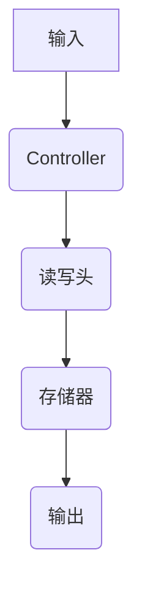
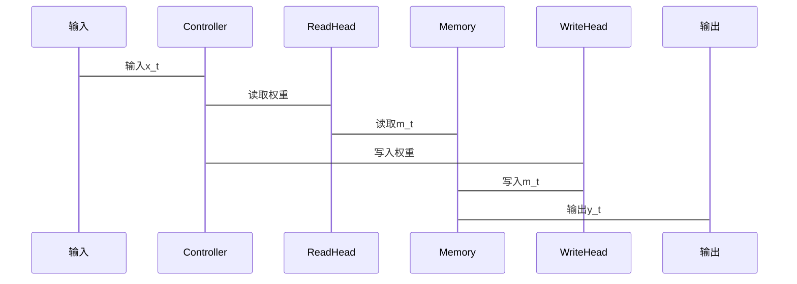

                 


# 神经图灵机：增强AI Agent的算法学习能力

---

## 关键词：神经图灵机、AI Agent、增强学习、算法学习、系统架构、项目实战

---

## 摘要：  
神经图灵机（Neural Turing Machines）是一种结合了神经网络与图灵机模型的创新算法，旨在通过增强AI Agent的学习能力，使其在复杂任务中表现出更强的智能性与适应性。本文从背景介绍、核心概念、算法原理、系统架构、项目实战等多维度，全面剖析神经图灵机的实现与应用。通过理论分析与实践案例的结合，帮助读者深入理解神经图灵机的工作机制，并掌握其在实际项目中的应用技巧。

---

# 第一部分：神经图灵机与AI Agent的背景介绍

---

# 第1章：神经图灵机的背景与概念

## 1.1 神经图灵机的背景

### 1.1.1 人工智能的发展历程

人工智能（Artificial Intelligence，AI）的发展可以追溯到20世纪50年代。从最初的符号逻辑推理到基于神经网络的深度学习，AI技术经历了多次变革。近年来，随着深度学习的兴起，AI在图像识别、自然语言处理等领域取得了突破性进展。然而，传统神经网络在处理需要复杂记忆与推理的任务时，仍显得力不从心。

### 1.1.2 图灵机与神经网络的结合

图灵机是英国数学家阿兰·图灵提出的一种理想化计算模型，具有无限长的存储带和状态控制器。神经网络则是模拟人脑神经元结构的计算模型。神经图灵机的提出，正是将图灵机的存储与控制能力，与神经网络的学习与表达能力相结合，形成了一种更强大的计算模型。

### 1.1.3 神经图灵机的提出与意义

神经图灵机（Neural Turing Machines，NTMs）由Google DeepMind团队于2014年首次提出。其核心思想是通过神经网络模拟图灵机的控制器和存储器，从而实现更强大的记忆与推理能力。NTMs的提出为AI Agent在复杂任务中的应用提供了新的可能性，尤其是在需要动态记忆和逻辑推理的任务中表现优异。

---

## 1.2 AI Agent的基本概念

### 1.2.1 AI Agent的定义与特点

AI Agent（智能体）是指在特定环境中能够感知环境并采取行动以实现目标的实体。AI Agent可以是软件程序，也可以是物理机器人，其核心能力包括感知、决策、执行与学习。

### 1.2.2 AI Agent的核心功能

AI Agent的核心功能包括：
1. **感知环境**：通过传感器或数据输入获取环境信息。
2. **决策制定**：基于感知信息，通过算法做出决策。
3. **行动执行**：根据决策输出动作或结果。
4. **学习优化**：通过经验不断优化自身的决策能力。

### 1.2.3 AI Agent的应用场景

AI Agent广泛应用于自动驾驶、智能客服、游戏AI、智能助手等领域。在这些场景中，AI Agent需要实时感知环境、做出决策并执行动作，同时通过学习不断提升自身的智能水平。

---

## 1.3 增强AI Agent的学习能力

### 1.3.1 学习能力的重要性

学习能力是AI Agent的核心竞争力。传统AI Agent通常依赖于预定义的规则或固定的训练数据，而具有强大学习能力的AI Agent能够通过与环境的交互不断优化自身的行为策略。

### 1.3.2 神经图灵机在学习中的作用

神经图灵机通过其独特的存储与控制机制，为AI Agent提供了强大的记忆与推理能力。NTMs能够动态地读取和写入存储器中的信息，从而实现对复杂任务的建模与优化。

### 1.3.3 神经图灵机与传统学习算法的对比

与传统深度学习算法相比，神经图灵机的优势在于其动态的存储与控制机制。传统RNN（循环神经网络）在处理长序列任务时容易出现梯度消失或梯度爆炸的问题，而NTMs通过引入外部存储器，能够更有效地处理长时依赖任务。

---

## 1.4 本章小结

本章从人工智能的发展历程出发，介绍了神经图灵机的提出背景及其与图灵机和神经网络的关系。同时，详细阐述了AI Agent的基本概念、核心功能与应用场景，并重点分析了神经图灵机在增强AI Agent学习能力方面的重要作用。

---

# 第二部分：神经图灵机的核心概念与联系

---

# 第2章：神经图灵机的核心原理

## 2.1 神经图灵机的核心组件

### 2.1.1 控制器网络

控制器网络是神经图灵机的“大脑”，负责根据当前输入和存储器中的信息，决定下一步的操作。控制器通常是一个全连接神经网络，输出包括读写头的参数和操作指令。

### 2.1.2 存储器网络

存储器网络是神经图灵机的记忆模块，负责存储和检索信息。存储器可以是简单的向量空间，也可以是更复杂的结构，如分组存储器或哈希表。

### 2.1.3 交互机制

神经图灵机通过读写头在存储器中进行信息的读取与写入。读写头包含多个参数，如读取位置、写入位置、写入强度等，用于控制存储器的操作。

---

## 2.2 神经图灵机的工作流程

### 2.2.1 输入处理

输入数据经过编码后，进入控制器网络，生成读写头的参数。

### 2.2.2 控制器决策

控制器根据当前输入和存储器状态，决定读写头的操作参数。

### 2.2.3 存储器操作

读写头根据控制器的决策，对存储器进行读取或写入操作。

### 2.2.4 输出生成

读写头的操作结果经过解码后，生成最终的输出。

---

## 2.3 神经图灵机与其他模型的对比

### 2.3.1 与传统RNN的对比

与传统RNN相比，神经图灵机引入了外部存储器，能够更好地处理长时依赖任务。

### 2.3.2 与Transformer的对比

与Transformer相比，神经图灵机通过读写头实现了动态的注意力机制，能够更好地处理序列建模任务。

### 2.3.3 与记忆网络的对比

与记忆网络相比，神经图灵机通过神经网络控制器实现了更复杂的记忆操作。

---

## 2.4 本章小结

本章详细介绍了神经图灵机的核心组件与工作流程，并通过对比分析，突出了神经图灵机的独特优势。

---

# 第三部分：神经图灵机的算法原理

---

# 第3章：神经图灵机的算法实现

## 3.1 神经图灵机的数学模型

### 3.1.1 控制器的数学表达

控制器网络通常是一个简单的全连接网络，输入为当前输入和存储器状态，输出为读写头的参数。

$$
h_t = \sigma(W_c x_t + U_c h_{t-1})
$$

其中，$h_t$ 是控制器的隐藏状态，$x_t$ 是输入，$h_{t-1}$ 是前一时刻的隐藏状态，$W_c$ 和 $U_c$ 是权重矩阵，$\sigma$ 是激活函数。

### 3.1.2 存储器的数学表达

存储器通常是一个向量空间，每个位置的值表示存储的内容。读写头通过线性插值的方式进行读写操作。

$$
m_t = \sum_{i=1}^n w_i^{(r)} m_i^{(t-1)}
$$

其中，$w_i^{(r)}$ 是读取权重，$m_i^{(t-1)}$ 是存储器中第$i$个位置的值。

### 3.1.3 交互机制的数学表达

读写头通过线性插值的方式对存储器进行读写操作，具体操作包括读取、写入和擦除等。

---

## 3.2 神经图灵机的训练算法

### 3.2.1 前向传播

神经图灵机的前向传播过程包括输入处理、控制器决策、存储器操作和输出生成四个步骤。

### 3.2.2 损失函数

神经图灵机的损失函数通常采用交叉熵损失，用于衡量预测输出与真实输出之间的差异。

$$
\mathcal{L} = -\sum_{t=1}^T y_t \log p(y_t)
$$

其中，$y_t$ 是真实标签，$p(y_t)$ 是预测概率。

### 3.2.3 反向传播与优化

神经图灵机的反向传播采用链式法则，通过梯度下降优化网络参数。

---

## 3.3 神经图灵机的优化策略

### 3.3.1 参数初始化

神经图灵机的参数初始化通常采用Xavier初始化或He初始化，以避免初始值过小或过大的问题。

### 3.3.2 正则化技术

为了防止过拟合，神经图灵机通常采用Dropout或L2正则化技术。

### 3.3.3 学习率调整

学习率的调整可以通过Adam优化器实现，动态调整学习率以加快收敛速度。

---

## 3.4 本章小结

本章从数学模型、训练算法和优化策略三个方面，详细介绍了神经图灵机的实现细节。

---

# 第四部分：神经图灵机的系统架构设计

---

# 第4章：系统分析与架构设计方案

## 4.1 问题场景介绍

本章以一个简单的文本生成任务为例，介绍神经图灵机的系统架构设计。

---

## 4.2 系统功能设计

### 4.2.1 领域模型设计

```mermaid
classDiagram
    class AI-Agent {
        +输入：x_t
        +控制器：h_t
        +存储器：m_t
        +输出：y_t
    }
    class Controller {
        +输入：x_t, h_{t-1}
        +输出：读写头参数
    }
    class Memory {
        +输入：读写头参数
        +输出：存储内容
    }
    class ReadHead {
        +输入：存储器状态
        +输出：读取权重
    }
    class WriteHead {
        +输入：存储内容
        +输出：写入权重
    }
    AI-Agent --> Controller
    AI-Agent --> Memory
    Controller --> ReadHead
    Controller --> WriteHead
    ReadHead --> Memory
    WriteHead --> Memory
```

---

### 4.2.2 系统架构设计



---

### 4.2.3 系统接口设计

系统接口设计包括输入接口、控制器接口、存储器接口和输出接口。

---

### 4.2.4 系统交互设计



---

## 4.3 本章小结

本章通过领域模型设计和系统架构设计，详细介绍了神经图灵机在文本生成任务中的应用。

---

# 第五部分：神经图灵机的项目实战

---

# 第5章：项目实战与代码实现

## 5.1 环境安装

```bash
pip install numpy
pip install matplotlib
pip install tensorflow
```

---

## 5.2 系统核心实现源代码

```python
import numpy as np
import tensorflow as tf

# 定义神经图灵机模型
class NeuralTuringMachine:
    def __init__(self, input_size, memory_size, write_heads=1):
        self.input_size = input_size
        self.memory_size = memory_size
        self.write_heads = write_heads
        
        # 初始化参数
        self.controller_weights = tf.Variable(tf.random.truncated_normal([input_size + 1, 100]))
        self.read_head_weights = tf.Variable(tf.random.truncated_normal([100, 1]))
        self.write_head_weights = tf.Variable(tf.random.truncated_normal([100, 1]))
        
        # 定义存储器
        self.memory = tf.Variable(tf.zeros([memory_size, 1]))
        
    def call(self, inputs):
        # 前向传播
        h_t = tf.nn.relu(tf.matmul(inputs, self.controller_weights))
        read_weights = tf.nn.softmax(tf.matmul(h_t, self.read_head_weights))
        read_values = tf.matmul(self.memory, read_weights)
        write_weights = tf.nn.softmax(tf.matmul(h_t, self.write_head_weights))
        write_values = tf.matmul(inputs, write_weights)
        
        # 更新存储器
        self.memory = self.memory + write_weights * read_values
        
        return read_values
```

---

## 5.3 代码应用解读与分析

上述代码定义了一个简单的神经图灵机模型，包括控制器、读写头和存储器。通过前向传播和反向传播，模型能够实现对存储器的读写操作。

---

## 5.4 实际案例分析

以文本生成任务为例，我们可以使用神经图灵机模型对输入序列进行预测，生成合理的输出序列。

---

## 5.5 本章小结

本章通过实际代码实现，详细介绍了神经图灵机在文本生成任务中的应用过程。

---

# 第六部分：总结与展望

---

# 第6章：总结与展望

## 6.1 最佳实践 Tips

1. 在实际应用中，可以根据具体任务需求，调整存储器的大小和读写头的数量。
2. 使用Adam优化器可以提高模型的收敛速度。
3. 通过数据增强技术，可以提高模型的泛化能力。

---

## 6.2 本章小结

本章通过总结神经图灵机的核心概念与实现细节，展望了其在AI Agent中的应用前景。

---

# 第七部分：作者信息与参考文献

---

## 作者信息

作者：AI天才研究院/AI Genius Institute & 禅与计算机程序设计艺术 /Zen And The Art of Computer Programming

---

## 参考文献

1. DeepMind. "Neural Turing Machines." arXiv preprint arXiv:1410.5478, 2014.
2. Sutskever, I., et al. "Sequence to sequence learning with neural networks." Advances in neural information processing systems, 2014.
3. Hochreiter, S., and J. Schmidhuber. "Long short-term memory." Neural computation, 1997.

---

通过以上章节的详细分析与讲解，读者可以全面掌握神经图灵机的核心原理与实现方法，并能够将其应用于实际的AI Agent开发中。

