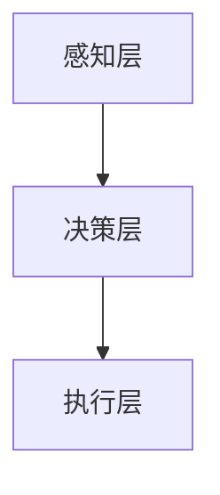
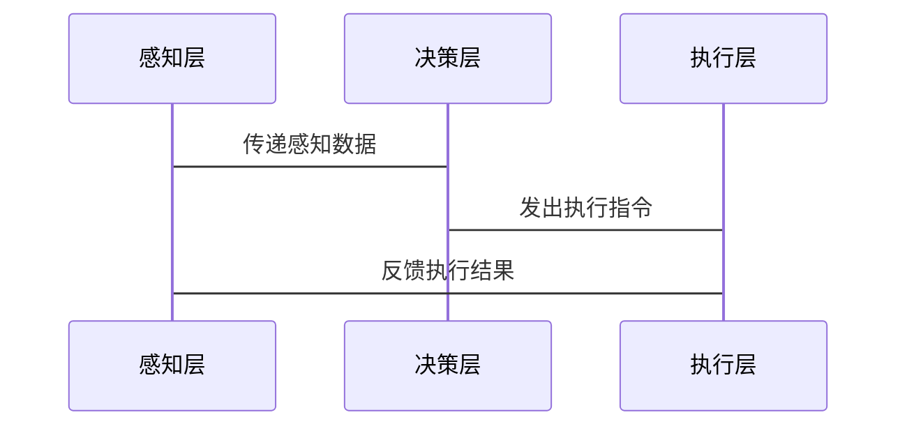

                 


# 神经科学启发的AI Agent认知模型

> 关键词：神经科学，AI Agent，认知模型，神经网络，深度学习，强化学习

> 摘要：本文将探讨神经科学启发的AI Agent认知模型的构建与应用。通过结合神经科学的基本原理和人工智能代理的核心概念，提出一种基于神经网络的AI Agent认知模型。该模型通过模拟人脑的神经活动和认知过程，实现AI Agent的感知、决策和学习能力。本文从神经科学基础、AI Agent基本概念、认知模型设计、算法实现、系统架构、项目实战等方面展开详细论述，并通过具体案例分析，展示神经科学启发的AI Agent认知模型的实际应用与优势。

---

# 第一部分: 神经科学启发的AI Agent认知模型背景与基础

## 第1章: 引言

### 1.1 神经科学与AI Agent的结合

#### 1.1.1 神经科学的基本概念

神经科学是研究神经系统结构和功能的科学，其核心在于理解大脑如何处理信息、产生认知和行为。神经科学的研究对象包括神经元（神经细胞）、突触（神经元之间的连接）以及它们之间的电化学信号传递过程。神经科学的主要研究方法包括实验神经生理学、脑成像技术（如fMRI、EEG）和计算神经科学等。

神经科学的核心概念包括：

- **神经元**：神经系统的功能单位，负责接收、处理和传递信息。
- **突触**：神经元之间的连接结构，负责信息的传递和处理。
- **神经网络**：由大量神经元通过突触连接形成的复杂网络，是大脑信息处理的基础。

#### 1.1.2 AI Agent的基本概念

AI Agent（人工智能代理）是指能够感知环境、做出决策并执行动作的智能实体。AI Agent的核心特征包括自主性、反应性、目标导向性和学习能力。AI Agent可以分为简单反射型代理、基于模型的反射型代理、目标导向型代理和实用推理型代理等。

#### 1.1.3 神经科学启发的AI Agent的意义

神经科学启发的AI Agent认知模型旨在通过模拟人脑的神经活动和认知过程，设计出更加高效、智能的AI Agent。这种模型能够结合神经科学的生物基础和人工智能的技术优势，为AI Agent的感知、决策和学习能力提供新的理论和技术支持。

### 1.2 本书的目的与结构

#### 1.2.1 本书的目标

本书旨在通过结合神经科学的基本原理和人工智能代理的核心概念，提出一种基于神经网络的AI Agent认知模型。通过详细讲解神经科学启发的AI Agent认知模型的设计方法、实现技术和应用场景，为读者提供一个全面的理论和技术框架。

#### 1.2.2 本书的章节安排

- 第1章：引言，介绍神经科学与AI Agent的结合、本书的目的与结构。
- 第2章：神经科学基础，讲解神经元、神经网络和突触可塑性等核心概念。
- 第3章：AI Agent基础，介绍AI Agent的定义、分类和设计原则。
- 第4章：神经科学启发的AI Agent认知模型，详细阐述认知模型的设计与实现。
- 第5章：基于神经科学的AI Agent算法，讲解深度学习和强化学习在AI Agent中的应用。
- 第6章：系统架构与设计，展示基于神经科学启发的AI Agent认知模型的系统架构。
- 第7章：项目实战，通过具体案例展示如何构建基于神经科学的AI Agent。
- 第8章：总结与展望，回顾本书内容并展望未来发展方向。

#### 1.2.3 如何阅读本书

建议读者从第1章开始，逐步阅读各章内容，特别是需要重点关注第2章和第3章的基础知识，以及第4章和第5章的核心理论。对于希望深入理解AI Agent算法和系统架构的读者，可以重点关注第6章和第7章的内容。

### 1.3 本章小结

本章通过介绍神经科学与AI Agent的结合，明确了神经科学启发的AI Agent认知模型的研究意义和应用价值。本书的章节安排和阅读方法为后续内容的学习奠定了基础。

---

## 第2章: 神经科学基础

### 2.1 神经元与神经网络

#### 2.1.1 神经元的结构与功能

神经元是神经系统的基本单位，由树突（接收信号）、胞体（处理信号）和轴突（传递信号）组成。神经元通过电信号和化学信号的传递，完成信息的接收、处理和输出。

#### 2.1.2 神经网络的基本原理

神经网络是由大量神经元通过突触连接形成的复杂网络。神经网络的基本原理包括：

1. **输入层**：接收外部输入信号。
2. **隐藏层**：对输入信号进行处理和特征提取。
3. **输出层**：产生最终的输出结果。

神经网络的计算过程可以通过数学公式表示，例如：

$$ y = \sum_{i=1}^{n} w_i x_i + b $$

其中，$w_i$ 是权重，$x_i$ 是输入，$b$ 是偏置项。

#### 2.1.3 突触可塑性与学习机制

突触可塑性是指突触强度的可调节性，是神经网络学习的基础。突触可塑性的数学模型可以通过以下公式表示：

$$ \Delta w = \eta (y - y_{\text{target}}) x $$

其中，$\eta$ 是学习率，$y$ 是输出，$y_{\text{target}}$ 是目标输出，$x$ 是输入。

### 2.2 认知科学与脑科学

#### 2.2.1 认知科学的基本概念

认知科学是研究人类认知过程的科学，包括记忆、学习、推理、决策等核心概念。

#### 2.2.2 脑科学的研究方法

脑科学的研究方法包括：

- **fMRI**：功能性磁共振成像，用于观察大脑活动。
- **EEG**：脑电图，用于记录大脑电活动。
- **TMS**：经颅磁刺激，用于研究大脑功能。

#### 2.2.3 神经科学与认知科学的交叉

神经科学与认知科学的交叉研究为AI Agent的认知模型提供了重要的理论基础，例如：

- **记忆模型**：基于突触可塑性的记忆机制。
- **注意力机制**：基于神经网络的注意力模型。

### 2.3 神经网络模型

#### 2.3.1 前馈神经网络

前馈神经网络是一种简单的神经网络结构，信息单向传递，常用于分类和回归任务。

#### 2.3.2 反馈神经网络

反馈神经网络是一种具有反馈连接的神经网络，常用于序列建模和时间序列预测。

#### 2.3.3 卷积神经网络

卷积神经网络（CNN）是一种专门用于处理图像数据的神经网络，其核心是卷积层和池化层。

---

## 第3章: AI Agent基础

### 3.1 AI Agent的定义与分类

#### 3.1.1 AI Agent的定义

AI Agent是一种能够感知环境、做出决策并执行动作的智能实体。

#### 3.1.2 AI Agent的分类

AI Agent可以分为：

- **简单反射型代理**：基于简单的条件反射做出决策。
- **基于模型的反射型代理**：基于环境模型做出决策。
- **目标导向型代理**：基于目标导向的决策机制。
- **实用推理型代理**：基于实用推理的决策机制。

#### 3.1.3 AI Agent的核心特征

AI Agent的核心特征包括：

- **自主性**：能够自主决策。
- **反应性**：能够实时感知环境并做出反应。
- **目标导向性**：基于目标做出决策。
- **学习能力**：能够通过经验改进性能。

### 3.2 AI Agent的结构与功能

#### 3.2.1 AI Agent的感知层

感知层负责接收外部环境的信息，例如传感器数据和用户输入。

#### 3.2.2 AI Agent的决策层

决策层负责根据感知信息做出决策，例如基于神经网络的决策模型。

#### 3.2.3 AI Agent的执行层

执行层负责根据决策结果执行动作，例如驱动机器人或输出结果。

### 3.3 AI Agent的设计原则

#### 3.3.1 可扩展性

AI Agent的设计应具有良好的可扩展性，能够适应不同的应用场景。

#### 3.3.2 可解释性

AI Agent的决策过程应具有可解释性，方便调试和优化。

#### 3.3.3 稳定性

AI Agent应具有良好的稳定性，能够在复杂环境中正常运行。

### 3.4 本章小结

本章通过介绍AI Agent的定义、分类和设计原则，为后续内容的学习奠定了基础。

---

## 第4章: 神经科学启发的AI Agent认知模型

### 4.1 认知模型的基本概念

#### 4.1.1 认知模型的定义

认知模型是描述人类认知过程的数学模型，常用于模拟人类的感知、记忆和决策过程。

#### 4.1.2 认知模型的特征

认知模型的特征包括：

- **可解释性**：模型能够被人类理解和解释。
- **可扩展性**：模型能够适应不同的认知任务。
- **动态性**：模型能够模拟动态的认知过程。

#### 4.1.3 认知模型的分类

认知模型可以分为：

- **基于规则的模型**：基于预定义的规则进行推理。
- **基于神经网络的模型**：基于神经网络的非线性映射能力进行推理。
- **混合模型**：结合规则和神经网络的混合模型。

### 4.2 神经科学启发的AI Agent模型

#### 4.2.1 神经元模型的构建

神经元模型的构建需要考虑神经元的电生理特性，例如动作电位的产生和传递。

#### 4.2.2 神经网络模型的设计

神经网络模型的设计需要考虑网络的拓扑结构和参数设置，例如深度和宽度。

#### 4.2.3 神经科学启发的代理行为模型

神经科学启发的代理行为模型结合了神经网络的非线性映射能力和认知科学的理论基础。

### 4.3 神经科学与AI Agent的结合

#### 4.3.1 神经科学启发的代理决策机制

神经科学启发的代理决策机制基于神经网络的决策模型，能够模拟人类的决策过程。

#### 4.3.2 神经科学启发的代理学习机制

神经科学启发的代理学习机制基于突触可塑性的学习规则，能够实现自适应学习。

---

## 第5章: 神经科学启发的AI Agent算法

### 5.1 深度学习算法

#### 5.1.1 深度学习的基本原理

深度学习是一种基于神经网络的机器学习技术，通过多层非线性变换实现复杂模式的识别。

#### 5.1.2 深度学习的数学模型

深度学习的数学模型可以通过以下公式表示：

$$ y = \sigma(w x + b) $$

其中，$\sigma$ 是激活函数，$w$ 是权重，$x$ 是输入，$b$ 是偏置项。

#### 5.1.3 深度学习的应用

深度学习在AI Agent中的应用包括图像识别、语音识别和自然语言处理。

### 5.2 强化学习算法

#### 5.2.1 强化学习的基本原理

强化学习是一种基于奖励机制的机器学习技术，通过试错学习实现目标。

#### 5.2.2 强化学习的数学模型

强化学习的数学模型可以通过以下公式表示：

$$ Q(s, a) = Q(s, a) + \alpha (r + \gamma \max Q(s', a') - Q(s, a)) $$

其中，$Q$ 是价值函数，$s$ 是状态，$a$ 是动作，$\alpha$ 是学习率，$r$ 是奖励，$\gamma$ 是折扣因子，$s'$ 是下一个状态。

#### 5.2.3 强化学习的应用

强化学习在AI Agent中的应用包括游戏AI和机器人控制。

---

## 第6章: 系统架构与设计

### 6.1 问题场景介绍

AI Agent的认知模型需要在复杂环境中实现感知、决策和学习功能。

### 6.2 系统功能设计

系统功能设计包括：

- **感知层**：负责接收环境信息。
- **决策层**：负责根据感知信息做出决策。
- **执行层**：负责根据决策结果执行动作。

### 6.3 系统架构设计

系统架构设计可以通过Mermaid图展示：



### 6.4 系统接口设计

系统接口设计包括：

- **输入接口**：接收感知数据。
- **输出接口**：输出决策结果。
- **通信接口**：与其他系统进行通信。

### 6.5 系统交互设计

系统交互设计可以通过Mermaid序列图展示：



---

## 第7章: 项目实战

### 7.1 环境安装

需要安装以下工具和库：

- Python
- TensorFlow
- Keras
- Matplotlib

### 7.2 核心代码实现

以下是基于神经科学启发的AI Agent认知模型的核心代码实现：

```python
import numpy as np
import tensorflow as tf
from tensorflow import keras

# 定义神经网络模型
model = keras.Sequential([
    keras.layers.Dense(64, activation='relu', input_shape=(input_dim,)),
    keras.layers.Dense(1, activation='sigmoid')
])

# 定义损失函数和优化器
model.compile(loss='binary_crossentropy', optimizer='adam', metrics=['accuracy'])

# 训练模型
model.fit(x_train, y_train, epochs=10, batch_size=32)
```

### 7.3 案例分析

通过具体案例分析，展示神经科学启发的AI Agent认知模型的实际应用效果。

### 7.4 项目总结

总结项目实现的关键点和经验教训。

---

## 第8章: 总结与展望

### 8.1 本章小结

总结本书的主要内容和研究成果。

### 8.2 未来展望

展望神经科学启发的AI Agent认知模型的未来发展方向，包括新技术的应用和新领域的拓展。

---

作者：AI天才研究院/AI Genius Institute & 禅与计算机程序设计艺术 /Zen And The Art of Computer Programming

