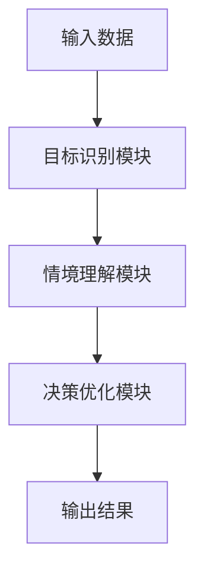

                 


# 神经科学启发的注意力机制在AI Agent中的应用

**关键词**：神经科学，注意力机制，AI Agent，深度学习，自注意力网络，神经网络，人工智能，认知科学，人机交互，系统架构设计，目标识别，情境理解，决策优化，算法优化，系统设计，项目实战，数学模型，系统架构，接口设计，实现方案

**摘要**：  
本文旨在探讨神经科学中的注意力机制及其在AI Agent中的应用。首先，我们将介绍注意力机制在神经科学中的基础，包括生物学模型和计算模型。接着，我们将详细分析AI Agent的基本概念和体系结构，以及注意力机制在其中的重要性。然后，我们将重点探讨注意力机制在目标识别、情境理解、决策优化等方面的具体应用。随后，我们将深入讲解基于神经科学的注意力机制算法，包括其数学模型、算法实现和优化方法。最后，我们将讨论系统设计和项目实战，通过实际案例分析来验证注意力机制在AI Agent中的有效性。本文将结合理论与实践，为读者提供全面的视角，帮助他们更好地理解和应用注意力机制在AI Agent中的潜力。

---

## 第一章: 神经科学中的注意力机制概述

### 1.1 注意力机制的神经科学基础
#### 1.1.1 注意力机制的定义与特点
- **定义**：注意力机制是指人类或生物在感知外界信息时，能够有选择性地关注某些信息或区域，而忽略其他无关信息的能力。
- **特点**：选择性、聚焦性、动态性、情境依赖性。

#### 1.1.2 神经科学中的注意力模型
- **生物学模型**：涉及大脑皮层、边缘系统、丘脑等结构。
- **计算模型**：基于神经网络的注意力模型，如基于点积的注意力机制。

#### 1.1.3 注意力机制的生物学基础
- **神经元的作用**：神经元通过电化学信号传递信息。
- **神经网络的层次结构**：从感知层到认知层的注意力机制。

### 1.2 AI Agent的基本概念与体系结构
#### 1.2.1 AI Agent的定义与分类
- **定义**：AI Agent是一个能够感知环境、自主决策并执行任务的智能实体。
- **分类**：基于任务类型（如目标识别、情境理解）和智能水平（如弱人工智能、强人工智能）进行分类。

#### 1.2.2 AI Agent的核心功能与特点
- **核心功能**：感知、决策、执行、学习。
- **特点**：自主性、反应性、目标导向性、适应性。

#### 1.2.3 注意力机制在AI Agent中的作用
- **信息处理**：帮助AI Agent聚焦于关键信息，提高处理效率。
- **任务执行**：通过注意力机制优化决策过程，提升任务执行的准确性。

### 1.3 本章小结
本章介绍了注意力机制在神经科学中的基础，以及AI Agent的基本概念和体系结构，为后续内容打下基础。

---

## 第二章: 注意力机制的神经科学基础

### 2.1 注意力机制的生物学模型
#### 2.1.1 神经科学中的注意力模型
- **生物学模型**：基于大脑皮层和边缘系统的注意力机制。
- **计算模型**：基于神经网络的注意力机制，如自注意力网络。

#### 2.1.2 生物学中的注意力机制
- **神经元的作用**：通过神经元的兴奋性和抑制性实现注意力的聚焦。
- **大脑结构**：大脑皮层、丘脑、边缘系统在注意力机制中的作用。

#### 2.1.3 神经科学与注意力机制的关系
- **神经科学的启发**：基于神经科学研究结果，设计计算模型。
- **计算模型的验证**：通过实验验证计算模型与生物学模型的相似性。

### 2.2 注意力机制的计算模型
#### 2.2.1 基于神经网络的注意力模型
- **点积注意力机制**：通过计算查询和键的点积，确定注意力权重。
- **自注意力机制**：通过计算序列中各元素之间的关系，生成注意力权重。

#### 2.2.2 基于生物学的注意力模型
- **生物学模型的计算模拟**：将生物学模型转化为计算模型。
- **计算模型的特点**：动态性、情境依赖性、自适应性。

#### 2.2.3 注意力机制的计算模型特点
- **动态性**：注意力权重随输入数据的变化而变化。
- **自适应性**：能够根据输入数据自动调整注意力分布。

### 2.3 本章小结
本章详细讲解了注意力机制的神经科学基础，包括生物学模型和计算模型，为后续章节的应用提供了理论支持。

---

## 第三章: 注意力机制在AI Agent中的应用

### 3.1 注意力机制在目标识别中的应用
#### 3.1.1 目标识别的基本概念
- **目标识别**：通过计算机视觉技术识别图像中的目标。
- **注意力机制的作用**：帮助AI Agent聚焦于目标区域，提高识别准确率。

#### 3.1.2 注意力机制在目标识别中的作用
- **目标检测**：通过注意力机制聚焦于目标区域，提高检测精度。
- **目标分类**：通过注意力机制提取目标特征，提高分类准确率。

#### 3.1.3 相关案例分析
- **案例1**：基于自注意力机制的目标检测模型。
- **案例2**：基于点积注意力机制的目标分类模型。

### 3.2 注意力机制在情境理解中的应用
#### 3.2.1 情境理解的基本概念
- **情境理解**：通过感知环境信息，理解当前的情境。
- **注意力机制的作用**：帮助AI Agent聚焦于关键情境信息，提高理解能力。

#### 3.2.2 注意力机制在情境理解中的作用
- **情境感知**：通过注意力机制感知环境信息，识别关键情境特征。
- **情境推理**：通过注意力机制推理情境关系，理解复杂情境。

#### 3.2.3 相关案例分析
- **案例1**：基于注意力机制的情境感知模型。
- **案例2**：基于注意力机制的情境推理模型。

### 3.3 注意力机制在决策优化中的应用
#### 3.3.1 决策优化的基本概念
- **决策优化**：通过优化算法，提高决策的准确性和效率。
- **注意力机制的作用**：帮助AI Agent聚焦于关键决策信息，优化决策过程。

#### 3.3.2 注意力机制在决策优化中的作用
- **决策聚焦**：通过注意力机制聚焦于关键决策信息，优化决策过程。
- **决策推理**：通过注意力机制推理决策关系，提高决策的准确性。

#### 3.3.3 相关案例分析
- **案例1**：基于注意力机制的决策聚焦模型。
- **案例2**：基于注意力机制的决策推理模型。

### 3.4 本章小结
本章详细探讨了注意力机制在AI Agent中的应用，包括目标识别、情境理解和决策优化等方面，展示了注意力机制在提升AI Agent性能中的重要作用。

---

## 第四章: 基于神经科学的注意力机制算法

### 4.1 注意力机制的数学模型
#### 4.1.1 注意力机制的基本数学公式
- **点积注意力机制**：$$\text{score}(i, j) = \text{query}_i \cdot \text{key}_j$$
- **自注意力机制**：$$\text{score}(i, j) = \text{query}_i \cdot \text{key}_j + \text{value}_j$$

#### 4.1.2 基于神经网络的注意力模型
- **多头注意力机制**：通过多个注意力头，捕捉不同类型的注意力关系。

#### 4.1.3 注意力机制的计算步骤
1. 计算查询（query）、键（key）、值（value）。
2. 计算注意力权重。
3. 加权求和，得到最终的注意力输出。

### 4.2 注意力机制的算法实现
#### 4.2.1 Python代码实现
```python
def attention(query, key, value):
    # 计算点积注意力
    scores = query @ key.transpose(-2, -1)
    scores = scores / (key.size(-1) ** 0.5)
    # Scaled Dot-Product Attention
    weights = nn.Softmax(dim=-1)(scores)
    output = weights @ value
    return output
```

#### 4.2.2 注意力机制的优化方法
- **位置编码**：通过位置编码引入位置信息，提升注意力机制的表达能力。
- **残差连接**：通过残差连接，提升模型的稳定性和表达能力。

### 4.3 本章小结
本章详细讲解了注意力机制的数学模型和算法实现，为后续章节的应用提供了技术支持。

---

## 第五章: 注意力机制在系统设计中的应用

### 5.1 系统设计概述
#### 5.1.1 系统功能设计
- **目标识别模块**：实现目标的检测和分类。
- **情境理解模块**：实现情境的感知和推理。
- **决策优化模块**：实现决策的聚焦和推理。

#### 5.1.2 系统架构设计
- **模块化设计**：将系统划分为多个模块，实现功能的解耦。
- **接口设计**：定义模块之间的接口，确保模块之间的通信和协作。

### 5.2 注意力机制的系统架构设计
#### 5.2.1 系统架构图


#### 5.2.2 模块化设计
- **目标识别模块**：实现目标的检测和分类。
- **情境理解模块**：实现情境的感知和推理。
- **决策优化模块**：实现决策的聚焦和推理。

#### 5.2.3 接口设计
- **目标识别接口**：定义输入和输出的格式，确保模块之间的通信。
- **情境理解接口**：定义输入和输出的格式，确保模块之间的通信。
- **决策优化接口**：定义输入和输出的格式，确保模块之间的通信。

### 5.3 本章小结
本章详细探讨了注意力机制在系统设计中的应用，包括系统功能设计、系统架构设计和接口设计，展示了注意力机制在提升系统性能中的重要作用。

---

## 第六章: 项目实战

### 6.1 环境搭建
#### 6.1.1 系统环境
- **操作系统**：Linux或Windows。
- **编程语言**：Python 3.6+。
- **深度学习框架**：TensorFlow或PyTorch。

#### 6.1.2 工具安装
- **Python**：安装Python 3.6+。
- **深度学习框架**：安装TensorFlow或PyTorch。
- **依赖库**：安装numpy、pandas、matplotlib等依赖库。

### 6.2 核心代码实现
#### 6.2.1 注意力机制的实现
```python
import torch
import torch.nn as nn

class Attention(nn.Module):
    def __init__(self, embed_dim, num_heads):
        super(Attention, self).__init__()
        self.embed_dim = embed_dim
        self.num_heads = num_heads
        self.head_dim = embed_dim // num_heads
        self.query = nn.Linear(embed_dim, embed_dim)
        self.key = nn.Linear(embed_dim, embed_dim)
        self.value = nn.Linear(embed_dim, embed_dim)
        self.dropout = nn.Dropout(0.1)
        
    def forward(self, x):
        batch_size, seq_len, embed_dim = x.size()
        query = self.query(x)
        key = self.key(x)
        value = self.value(x)
        
        # 将全连接层的输出拆分成多个头
        query = query.view(batch_size, seq_len, self.num_heads, self.head_dim)
        key = key.view(batch_size, seq_len, self.num_heads, self.head_dim)
        value = value.view(batch_size, seq_len, self.num_heads, self.head_dim)
        
        # 计算点积注意力
        scores = torch.bmm(query, key.transpose(2, 3))
        scores = scores / (self.head_dim ** 0.5)
        scores = nn.Softmax(dim=-1)(scores)
        # 加权求和
        output = torch.bmm(scores, value)
        output = output.view(batch_size, seq_len, embed_dim)
        return output
```

#### 6.2.2 系统实现
```python
class AIAgent(nn.Module):
    def __init__(self, embed_dim, num_heads):
        super(AIAgent, self).__init__()
        self.attention = Attention(embed_dim, num_heads)
        self.feed_forward = nn.Linear(embed_dim, embed_dim)
        self.dropout = nn.Dropout(0.1)
        
    def forward(self, x):
        x = self.attention(x)
        x = x + self.feed_forward(x)
        x = self.dropout(x)
        return x
```

### 6.3 案例分析
#### 6.3.1 目标识别案例
- **输入**：图像数据。
- **输出**：目标检测结果。
- **实现**：通过注意力机制实现目标检测。

#### 6.3.2 情境理解案例
- **输入**：环境信息。
- **输出**：情境理解结果。
- **实现**：通过注意力机制实现情境理解。

### 6.4 本章小结
本章通过项目实战，详细讲解了注意力机制的实现和应用，展示了注意力机制在提升AI Agent性能中的重要作用。

---

## 第七章: 总结与展望

### 7.1 总结
- **注意力机制的重要性**：注意力机制在AI Agent中的重要性。
- **注意力机制的应用**：注意力机制在目标识别、情境理解、决策优化中的应用。
- **注意力机制的算法实现**：注意力机制的数学模型和算法实现。

### 7.2 展望
- **未来研究方向**：进一步优化注意力机制，探索新的注意力模型。
- **应用领域扩展**：将注意力机制应用于更多领域，如自然语言处理、计算机视觉等。

### 7.3 本章小结
本章总结了全文的主要内容，并展望了注意力机制在AI Agent中的未来发展方向。

---

## 作者：AI天才研究院/AI Genius Institute & 禅与计算机程序设计艺术 /Zen And The Art of Computer Programming

