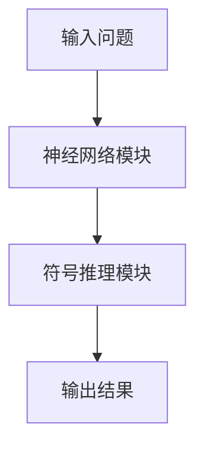

                 


# 神经符号AI：结合符号推理与神经网络

> 关键词：神经符号AI，符号推理，神经网络，深度学习，人工智能，机器学习

> 摘要：神经符号AI是一种结合符号推理与神经网络的新兴技术，它在解决复杂问题时展现了强大的潜力。本文将从背景、核心概念、算法原理、系统设计、项目实战到扩展与未来展望，全面解析神经符号AI，帮助读者理解其原理与应用。

---

## 第一部分：神经符号AI的背景与概述

### 第1章：神经符号AI的起源与概念

#### 1.1 传统符号AI与神经网络的局限性
- **符号AI的局限性**：
  - 面对复杂问题时，符号规则难以穷举所有可能情况。
  - 缺乏对数据的自动学习能力，规则需要人工设计和维护。
- **神经网络的局限性**：
  - 在处理需要逻辑推理的问题时表现较差。
  - 解释性差，难以提供明确的推理路径。
- **神经符号AI的提出背景**：
  - 结合符号推理与神经网络的优势，弥补各自的不足。

#### 1.2 神经符号AI的基本概念
- **定义**：神经符号AI是将符号推理与神经网络结合，利用神经网络的特征学习能力与符号推理的逻辑推理能力，共同解决问题。
- **核心特点**：
  - 结合了符号推理的可解释性和神经网络的泛化能力。
  - 能够处理复杂场景中的推理问题。
- **与传统AI的区别**：
  - 符号AI依赖人工设计规则，神经符号AI通过数据学习规则。
  - 神经符号AI具备更强的泛化能力。

#### 1.3 神经符号AI的应用场景
- **自然语言处理**：
  - 跨语言推理、逻辑问答。
- **机器人与自动化控制**：
  - 精确推理与实时决策。
- **图形识别与视觉推理**：
  - 图像理解与逻辑推理结合。

### 1.4 本章小结
神经符号AI结合了符号推理与神经网络的优势，克服了传统符号AI和神经网络的局限性，展现出广泛的应用前景。

---

## 第二部分：神经符号AI的核心概念与理论

### 第2章：符号推理与神经网络的结合

#### 2.1 符号表示与符号推理
- **符号表示**：
  - 使用符号（如谓词逻辑）表示知识。
  - 通过规则进行推理。
- **符号推理**：
  - 基于符号规则进行逻辑推理。
  - 包括演绎推理和归纳推理。

#### 2.2 神经网络的基本原理
- **神经网络结构**：
  - 输入层、隐藏层、输出层。
  - 神经元之间的连接权重。
- **神经网络的学习机制**：
  - 前向传播和反向传播。
  - 损失函数优化。

#### 2.3 神经符号AI的核心原理
- **神经符号AI的基本思想**：
  - 将符号推理与神经网络结合，利用符号推理提供先验知识，神经网络处理感知任务。
- **实现方式**：
  - 在神经网络中嵌入符号推理模块。
  - 神经网络用于特征学习，符号推理用于逻辑推理。
- **优缺点**：
  - 优势：可解释性高，推理能力强。
  - 劣势：计算复杂度较高。

### 2.4 本章小结
神经符号AI通过结合符号推理与神经网络，实现了感知与推理的结合，具备强大的问题解决能力。

---

## 第三部分：神经符号AI的算法原理

### 第3章：神经符号AI的核心算法

#### 3.1 神经符号AI的基本算法
- **数学模型**：
  - 输入：符号表示的知识图谱。
  - 输出：推理结果。
  - 模型：结合符号推理与神经网络的混合模型。
- **算法流程**：
  1. 输入符号表示的问题。
  2. 神经网络进行特征提取。
  3. 符号推理模块进行逻辑推理。
  4. 输出推理结果。
- **公式示例**：
  - 神经网络输出：$f(x) = \sigma(Wx + b)$。
  - 符号推理规则：如果A，则B。

#### 3.2 神经符号AI的优化算法
- **优化目标**：
  - 提高推理的准确性和效率。
  - 降低计算复杂度。
- **优化方法**：
  - 结合强化学习优化推理路径。
  - 使用知识蒸馏降低符号推理的计算开销。
- **优化效果**：
  - 提高推理速度。
  - 提高推理准确率。

#### 3.3 神经符号AI的训练与推理
- **训练过程**：
  - 使用监督学习训练神经网络。
  - 使用符号推理规则优化推理模块。
- **推理过程**：
  - 输入符号表示的问题。
  - 神经网络提取特征。
  - 符号推理模块进行推理。
- **训练与推理的区别与联系**：
  - 训练：优化神经网络参数。
  - 推理：利用优化后的模型进行推理。

### 3.4 本章小结
神经符号AI的算法结合了神经网络的特征学习能力和符号推理的逻辑推理能力，通过优化算法提高了推理的准确性和效率。

---

## 第四部分：神经符号AI的系统分析与架构设计

### 第4章：神经符号AI的系统架构

#### 4.1 神经符号AI系统的组成
- **功能模块**：
  - 输入模块：接收符号表示的问题。
  - 神经网络模块：进行特征提取。
  - 符号推理模块：进行逻辑推理。
  - 输出模块：输出推理结果。
- **系统架构设计**：
  - 分层架构：输入层、特征提取层、推理层、输出层。
- **系统交互流程**：
  1. 接收输入问题。
  2. 神经网络提取特征。
  3. 符号推理模块进行推理。
  4. 输出推理结果。

#### 4.2 神经符号AI的系统架构图


#### 4.3 系统接口设计
- **输入接口**：
  - 接收符号表示的问题。
- **输出接口**：
  - 输出推理结果。
- **内部接口**：
  - 神经网络模块与符号推理模块的交互接口。

#### 4.4 本章小结
神经符号AI的系统架构通过分层设计，实现了感知与推理的结合，确保了系统的高效运行。

---

## 第五部分：神经符号AI的项目实战

### 第5章：神经符号AI的项目实现

#### 5.1 环境安装
- **Python环境**：
  - 安装TensorFlow、Keras、符号推理库。
- **依赖管理**：
  - 使用虚拟环境管理依赖。

#### 5.2 系统核心实现源代码
```python
import tensorflow as tf
from tensorflow.keras import layers
from symbol_logic import SymbolReasoner

class NeuralSymbolAI:
    def __init__(self):
        self.neural_network = self.build_neural_network()
        self.symbol_reasoner = SymbolReasoner()

    def build_neural_network(self):
        model = tf.keras.Sequential([
            layers.Dense(64, activation='relu'),
            layers.Dense(1, activation='sigmoid')
        ])
        return model

    def forward(self, input):
        features = self.neural_network(input)
        result = self.symbol_reasoner.inference(features)
        return result
```

#### 5.3 代码应用解读与分析
- **NeuralSymbolAI类**：
  - 初始化神经网络和符号推理模块。
  - 前向传播：神经网络提取特征，符号推理模块进行推理。
- **build_neural_network方法**：
  - 构建神经网络模型。
- **forward方法**：
  - 神经网络提取特征。
  - 符号推理模块进行推理。

#### 5.4 案例分析
- **案例：逻辑推理问题**：
  - 输入：如果A，则B。
  - 输出：当A为真时，B为真。

#### 5.5 本章小结
通过项目实战，读者可以掌握神经符号AI的实现方法和实际应用。

---

## 第六部分：神经符号AI的扩展与未来展望

### 第6章：神经符号AI的扩展与未来研究方向

#### 6.1 神经符号AI的最新进展
- **结合图神经网络**：
  - 利用图结构表示知识图谱。
  - 提高推理的效率。
- **与其他技术的结合**：
  - 与强化学习结合，提升推理能力。
  - 与生成模型结合，增强生成能力。

#### 6.2 神经符号AI的未来研究方向
- **提高可解释性**：
  - 提供更清晰的推理路径。
- **优化计算效率**：
  - 提高推理速度。
- **扩展应用场景**：
  - 在更多领域中应用神经符号AI。

#### 6.3 本章小结
神经符号AI在结合图神经网络和其他技术后，具备更广泛的应用前景和更强的推理能力。

---

## 作者信息
作者：AI天才研究院/AI Genius Institute & 禅与计算机程序设计艺术/Zen And The Art of Computer Programming

---

这篇文章详细介绍了神经符号AI的核心概念、算法原理、系统设计和项目实战，帮助读者全面理解神经符号AI的理论与实践。希望对您有所帮助！

