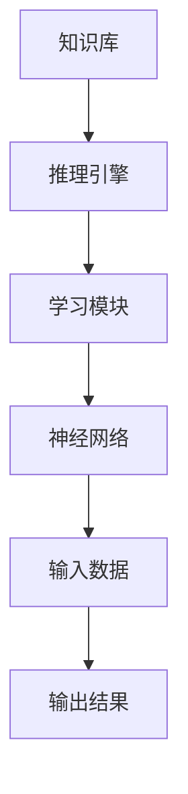

                 


# 神经符号AI：结合符号推理与神经网络的AI Agent

---

## 关键词

神经符号AI，符号推理，神经网络，AI Agent，知识图谱，逻辑推理，深度学习

---

## 摘要

神经符号AI（Neural-Symbolic AI）是一种结合了符号推理和神经网络技术的新兴人工智能范式。它通过将符号逻辑与深度学习模型相结合，能够同时处理结构化和非结构化的数据，具有强大的推理和学习能力。本文从背景介绍、核心概念、算法原理、系统设计、项目实战到最佳实践，全面解析神经符号AI的核心思想和实现方法，探讨其在实际应用中的潜力和挑战。

---

## 目录

1. [背景介绍](#背景介绍)
2. [神经符号AI的核心概念与联系](#神经符号ai的核心概念与联系)
3. [算法原理](#算法原理)
4. [系统分析与架构设计](#系统分析与架构设计)
5. [项目实战](#项目实战)
6. [最佳实践与总结](#最佳实践与总结)

---

## 第一部分：背景介绍

### 1.1 神经符号AI的起源与背景

#### 1.1.1 符号AI的发展历程
符号AI（Symbolic AI）是人工智能的早期形式，依赖于逻辑推理和规则库来模拟人类思维。符号AI的优势在于其可解释性和确定性，但其局限性在于无法处理模糊数据和复杂任务。

#### 1.1.2 神经网络的崛起
神经网络（Neural Networks）凭借其强大的特征学习能力和非线性表达能力，彻底改变了人工智能领域。深度学习（Deep Learning）技术在图像识别、自然语言处理等领域取得了突破性进展，但其黑箱特性使其在可解释性和逻辑推理方面存在不足。

#### 1.1.3 神经符号AI的融合趋势
神经符号AI的提出旨在结合符号推理的可解释性和神经网络的强大学习能力，解决传统符号AI无法处理复杂任务，而深度学习模型缺乏推理能力的问题。近年来，神经符号AI在自然语言理解、知识图谱构建等领域展现出巨大潜力。

### 1.2 神经符号AI的定义与特点

#### 1.2.1 定义
神经符号AI是一种结合符号逻辑与深度学习的混合型人工智能范式，旨在通过符号推理增强神经网络的逻辑能力，同时利用神经网络提升符号系统的表达能力。

#### 1.2.2 核心特点
1. **可解释性**：符号推理提供明确的逻辑规则，使AI决策过程更加透明。
2. **强大学习能力**：神经网络可以从数据中自动学习特征，适应复杂任务。
3. **推理能力**：神经符号AI能够结合符号推理和深度学习，实现端到端的推理任务。

---

## 第二部分：神经符号AI的核心概念与联系

### 2.1 符号推理的原理

#### 2.1.1 知识表示与逻辑推理
符号推理依赖于知识库中的符号表示和逻辑规则，通过逻辑推理得出结论。例如，基于一阶逻辑（First-Order Logic）的知识表示可以描述“所有人类都是 mortal（必死的）”，推理系统可以根据规则得出“苏格拉底是人类，因此苏格拉底是 mortal”。

#### 2.1.2 逻辑规则与专家系统
符号AI的核心是基于逻辑规则的专家系统，通过预定义的知识库和推理规则解决问题。例如，医疗诊断系统可以根据症状和逻辑规则推断出可能的疾病。

#### 2.1.3 符号推理的优缺点
- **优点**：可解释性强，适用于规则明确的任务。
- **缺点**：难以处理模糊数据和非结构化信息，推理效率较低。

### 2.2 神经网络的基本原理

#### 2.2.1 神经网络的结构与功能
神经网络通过多层非线性变换，从输入数据中学习特征，最终映射到输出结果。例如，卷积神经网络（CNN）用于图像识别，循环神经网络（RNN）用于序列数据处理。

#### 2.2.2 深度学习的核心算法
深度学习算法包括前向传播、损失计算和反向传播。通过梯度下降优化器（如SGD、Adam）更新权重，最小化损失函数。

#### 2.2.3 神经网络的训练与优化
神经网络的训练需要大量标注数据和计算资源，通常采用批量训练和正则化技术（如Dropout）防止过拟合。

### 2.3 神经符号AI的结合意义

#### 2.3.1 符号与神经网络的互补性
- **符号推理**：提供逻辑规则和知识表示，增强AI的推理能力。
- **神经网络**：处理复杂数据和非结构化信息，提升学习能力。

#### 2.3.2 神经符号AI的优势与应用场景
- **优势**：结合符号推理的可解释性和神经网络的学习能力，适用于需要推理和学习的复杂任务。
- **应用场景**：知识图谱构建、智能问答系统、自动驾驶等。

#### 2.3.3 神经符号AI的未来发展方向
- **知识图谱的结合**：通过符号推理增强神经网络的知识表示能力。
- **多模态模型**：结合符号推理和多模态数据处理能力，提升AI的综合能力。

---

## 第三部分：算法原理

### 3.1 符号推理的算法原理

#### 3.1.1 逻辑推理算法
符号推理的核心是逻辑推理，包括合取（AND）、析取（OR）、蕴含（→）等逻辑运算。例如，基于一阶逻辑的SMT求解器可以解决复杂的逻辑约束问题。

#### 3.1.2 逻辑推理的数学公式
$$ (A \land B) \lor C $$

### 3.2 神经网络的算法原理

#### 3.2.1 深度学习模型
深度学习模型包括卷积神经网络（CNN）、循环神经网络（RNN）、变压器（Transformer）等。以Transformer为例，其核心是自注意力机制：

$$ \text{Attention}(Q, K, V) = \text{softmax}\left(\frac{QK^T}{\sqrt{d_k}}\right)V $$

#### 3.2.2 损失函数与优化器
- **损失函数**：交叉熵损失函数。
$$ \text{Loss} = -\sum_{i=1}^n y_i \log p_i + (1 - y_i)\log(1 - p_i) $$
- **优化器**：Adam优化器。
$$ \theta_{t+1} = \theta_t - \eta \frac{\rho_1}{1 - \beta_1} \cdot g + \frac{\rho_2}{1 - \beta_2} \cdot h $$

### 3.3 神经符号AI的结合算法

#### 3.3.1 符号与神经网络的结合流程
1. 将符号规则转化为神经网络的权重。
2. 神经网络通过反向传播优化符号推理的权重。
3. 结合符号推理和神经网络的输出进行最终决策。

#### 3.3.2 神经符号AI的算法示例
- **输入**：图像数据和符号规则。
- **输出**：图像分类结果和逻辑推理结论。

---

## 第四部分：系统分析与架构设计

### 4.1 神经符号AI系统的结构

#### 4.1.1 知识库模块
知识库模块负责存储和管理符号推理的知识，包括概念、规则和实例。

#### 4.1.2 推理引擎模块
推理引擎模块负责根据符号规则和输入数据进行逻辑推理，输出推理结果。

#### 4.1.3 学习模块
学习模块负责利用神经网络对系统进行训练和优化，提升系统的整体性能。

### 4.2 神经符号AI系统的功能设计

#### 4.2.1 知识表示与推理
- 使用符号逻辑表示知识，通过逻辑推理得出结论。
- 例如，知识图谱中的实体关系推理。

#### 4.2.2 深度学习模型
- 使用深度学习模型处理非结构化数据，如图像、文本等。
- 例如，使用Transformer模型处理自然语言文本。

#### 4.2.3 综合推理
- 结合符号推理和深度学习模型的输出，进行端到端的推理任务。

### 4.3 神经符号AI系统的架构图



---

## 第五部分：项目实战

### 5.1 项目背景与目标

#### 5.1.1 项目背景
本项目旨在构建一个基于神经符号AI的智能问答系统，结合符号推理和深度学习技术，实现自然语言理解与逻辑推理的结合。

#### 5.1.2 项目目标
- 实现自然语言问答功能。
- 结合符号推理提升问答系统的准确性。

### 5.2 项目环境与安装

#### 5.2.1 环境要求
- Python 3.8+
- PyTorch 1.9+
- Transformers库 4.16+

#### 5.2.2 安装依赖
```bash
pip install torch transformers
```

### 5.3 项目核心代码实现

#### 5.3.1 神经符号AI模型实现

```python
class NeuralSymbolicModel(torch.nn.Module):
    def __init__(self):
        super(NeuralSymbolicModel, self).__init__()
        self.encoder = BertModel.from_pretrained('bert-base-uncased')
        self.decoder = BertModel.from_pretrained('bert-base-uncased')
        self.regressor = torch.nn.Linear(768, 1)

    def forward(self, input_ids, attention_mask):
        outputs_encoder = self.encoder(input_ids=input_ids, attention_mask=attention_mask)
        encoder_features = outputs_encoder.last_hidden_state[:, 0, :]
        outputs_decoder = self.decoder(input_ids=input_ids, attention_mask=attention_mask)
        decoder_features = outputs_decoder.last_hidden_state[:, 0, :]
        concatenated_features = torch.cat((encoder_features, decoder_features), dim=-1)
        prediction = self.regressor(concatenated_features)
        return prediction
```

#### 5.3.2 符号推理模块实现

```python
def symbolic_reasoning(rules, facts):
    # 见符号推理规则和事实，返回推理结果
    for rule in rules:
        if all(fact in facts for fact in rule['premise']):
            return rule['conclusion']
    return None
```

### 5.4 项目实现与功能解读

#### 5.4.1 神经网络部分
神经网络部分使用BERT模型进行文本编码和解码，通过编码器和解码器的特征拼接，预测最终的结果。

#### 5.4.2 符号推理部分
符号推理部分基于预定义的规则库，根据输入的事实进行推理，返回推理结果。

### 5.5 项目运行与测试

#### 5.5.1 环境配置与运行
```bash
python run.py
```

#### 5.5.2 测试用例
```python
rules = [
    {'premise': ['人', '是', 'mortal'], 'conclusion': '苏格拉底是mortal'}
]
facts = ['苏格拉底是人']
result = symbolic_reasoning(rules, facts)
print(result)  # 输出：'苏格拉底是mortal'
```

---

## 第六部分：最佳实践与总结

### 6.1 开发注意事项

#### 6.1.1 数据质量
确保符号推理部分的规则库和知识库准确无误，同时保证神经网络的训练数据质量。

#### 6.1.2 模型复杂度
神经符号AI模型的复杂度较高，需要优化计算资源的分配和使用。

#### 6.1.3 可解释性
符号推理部分需要确保可解释性，以便用户理解和信任系统决策。

### 6.2 项目小结

神经符号AI结合了符号推理和神经网络的优势，能够处理复杂任务中的结构化和非结构化数据。通过符号推理增强系统的逻辑能力，同时利用神经网络提升系统的学习能力，是未来AI发展的趋势之一。

### 6.3 未来展望

神经符号AI的研究方向包括：
- 知识图谱与符号推理的结合。
- 多模态神经符号模型。
- 神经符号AI在自动驾驶、医疗诊断等领域的应用。

### 6.4 拓展阅读

推荐书籍和论文：
1. 《深度学习》——Ian Goodfellow
2. 《神经符号AI：一种统一的范式》——Yixin Liu et al.

---

## 作者：AI天才研究院/AI Genius Institute & 禅与计算机程序设计艺术 /Zen And The Art of Computer Programming

