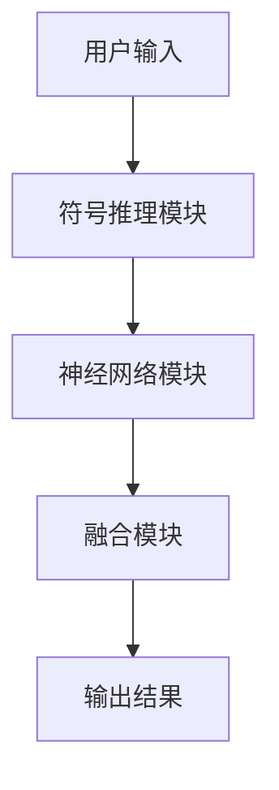
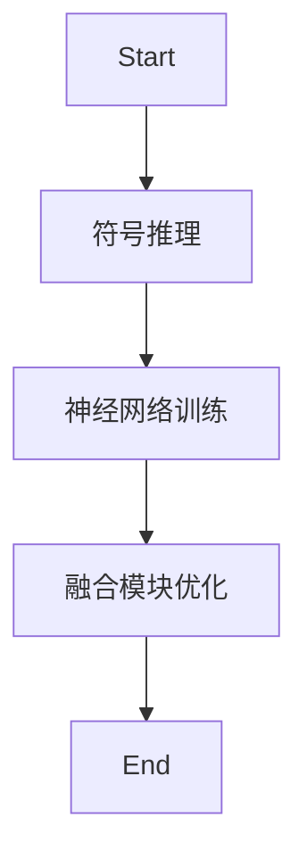
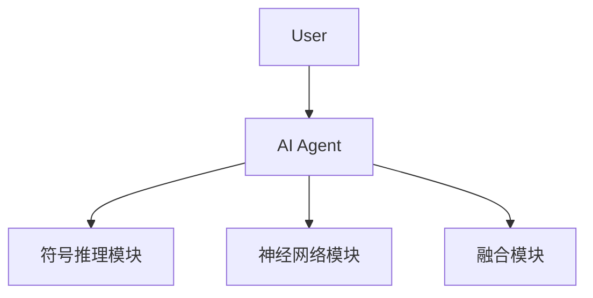
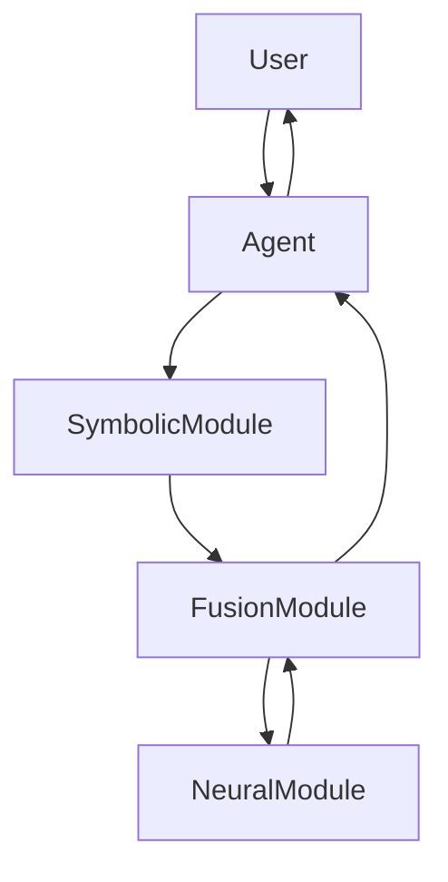

                 

<think>
好的，我将按照您的要求逐步分析并撰写这篇文章。让我们先从了解核心内容和结构开始。首先，我需要明确文章的标题、关键词和摘要，确保它们准确反映文章的核心主题。

### 文章标题
《神经符号融合：结合规则与学习的AI Agent》

### 关键词
- 神经符号融合
- AI Agent
- 规则与学习结合
- 符号推理
- 机器学习

### 摘要
神经符号融合是一种结合符号推理和机器学习的AI技术，通过将符号逻辑与神经网络结合，实现了规则驱动与数据驱动的统一。本文详细探讨了神经符号融合的核心概念、算法原理、系统架构设计以及项目实战，展示了如何构建一个既能理解和推理符号规则，又能从数据中学习的AI代理。通过案例分析和代码实现，帮助读者掌握神经符号融合的关键技术及其应用。

接下来，我将按照您提供的目录大纲结构，逐步展开每一部分的内容。

---

### 第1章: 神经符号融合的背景与问题背景

#### 1.1 神经符号融合的背景
##### 1.1.1 传统符号推理的局限性
传统符号推理方法依赖于明确的规则和逻辑推理，但在处理复杂、模糊或不完整信息时表现出局限性。符号系统难以应对动态变化的环境和大规模数据处理的需求。

##### 1.1.2 神经网络学习的优势与不足
神经网络在模式识别和数据驱动任务中表现出色，但缺乏可解释性和逻辑推理能力。当任务需要结合领域知识和动态数据时，神经网络往往力不从力。

##### 1.1.3 神经符号融合的必要性
为了兼顾符号推理的逻辑性和神经网络的学习能力，神经符号融合应运而生。它通过结合两者的优势，解决了单一方法难以应对的问题。

#### 1.2 神经符号融合的定义与问题描述
##### 1.2.1 神经符号融合的定义
神经符号融合是一种将符号逻辑与神经网络相结合的技术，旨在利用符号推理的可解释性和神经网络的自适应性，构建更强大的AI系统。

##### 1.2.2 神经符号融合的核心问题
- 如何将符号逻辑嵌入神经网络？
- 如何实现符号推理与神经网络的交互？
- 如何保证系统的可解释性和灵活性？

#### 1.3 神经符号融合的边界与外延
##### 1.3.1 神经符号融合的边界
神经符号融合专注于符号与神经网络的结合，不涉及其他AI技术（如强化学习）的核心实现。

##### 1.3.2 神经符号融合的外延
神经符号融合可以应用于多个领域，如自然语言处理、机器人控制等，但其核心目标是实现符号与神经网络的高效结合。

#### 1.4 神经符号融合的核心要素组成
##### 1.4.1 符号推理系统
符号推理系统负责处理逻辑规则和知识表示，为神经网络提供结构化的输入。

##### 1.4.2 神经网络学习系统
神经网络学习系统负责从数据中提取特征和模式，为符号推理提供动态输入。

##### 1.4.3 融合机制
融合机制是连接符号推理和神经网络的桥梁，负责协调两者的交互和信息传递。

---

### 第2章: 神经符号融合的核心概念与联系

#### 2.1 神经符号融合的核心原理
##### 2.1.1 符号逻辑与神经网络的结合
神经符号融合通过将符号逻辑嵌入神经网络，实现逻辑推理与数据学习的结合。

##### 2.1.2 神经符号融合的数学模型
神经符号融合的数学模型结合了逻辑规则和神经网络的权重优化，例如通过符号逻辑约束优化神经网络的损失函数。

#### 2.2 核心概念对比与特征分析
##### 2.2.1 符号方法与机器学习方法的对比
| 特征               | 符号方法               | 机器学习方法          |
|--------------------|-----------------------|----------------------|
| 可解释性           | 高                    | 低                  |
| 数据需求           | 低                    | 高                  |
| 任务类型           | 规则推理              | 模式识别            |

##### 2.2.2 神经符号融合的特征分析
- **可解释性**：结合符号逻辑，提高系统的可解释性。
- **灵活性**：通过神经网络的学习能力，适应复杂环境。
- **性能**：在符号推理和数据学习之间取得平衡。

#### 2.3 实体关系图与流程图
##### 2.3.1 实体关系图（ER图）
```mermaid
erDiagram
    actor User {
        <role> 用户
    }
    system AI-Agent {
        <class> 神经网络模块
        <class> 符号推理模块
        <class> 融合模块
    }
    用户 --> AI-Agent: 请求处理
    神经网络模块 --> 融合模块: 提供特征
    符号推理模块 --> 融合模块: 提供规则
```

##### 2.3.2 神经符号融合的流程图


---

### 第3章: 神经符号融合的算法原理

#### 3.1 神经符号融合的基本算法
##### 3.1.1 符号逻辑与神经网络的结合
神经符号融合算法通过将符号逻辑嵌入神经网络，实现逻辑推理与数据学习的结合。

##### 3.1.2 神经符号融合的数学模型
结合逻辑回归和神经网络的损失函数：
$$ L = \lambda_1 L_{\text{neural}} + \lambda_2 L_{\text{symbolic}} $$

其中，$L_{\text{neural}}$ 是神经网络的损失函数，$L_{\text{symbolic}}$ 是符号推理的损失函数。

#### 3.2 算法实现与流程
##### 3.2.1 算法流程图


##### 3.2.2 算法实现的Python代码示例
```python
class NeuralSymbolicAgent:
    def __init__(self):
        self.symbolic_module = SymbolicReasoning()
        self.neural_module = NeuralNetwork()
        self融合_module = FusionModule()

    def process_input(self, input_data):
        # 使用符号推理模块进行初步处理
        symbolic_output = self.symbolic_module.infer(input_data)
        # 将符号输出传递给神经网络模块
        neural_output = self.neural_module.predict(symbolic_output)
        # 在融合模块中进行优化
        final_output = self.融合_module.fuse(symbolic_output, neural_output)
        return final_output
```

---

### 第4章: 神经符号融合的系统分析与架构设计

#### 4.1 系统分析
##### 4.1.1 系统目标与范围
开发一个既能进行符号推理又能进行神经网络学习的AI代理系统。

##### 4.1.2 系统功能需求
- 符号推理功能
- 神经网络学习功能
- 融合模块功能

##### 4.1.3 系统性能需求
- 响应时间：≤1秒
- 处理能力：支持大规模数据

#### 4.2 系统架构设计
##### 4.2.1 系统架构图


##### 4.2.2 系统模块划分
- 符号推理模块
- 神经网络模块
- 融合模块

##### 4.2.3 系统接口设计
- 符号推理模块与融合模块的接口
- 神经网络模块与融合模块的接口

#### 4.3 系统交互设计
##### 4.3.1 系统交互流程图


---

### 第5章: 神经符号融合的项目实战

#### 5.1 环境安装与配置
##### 5.1.1 开发环境搭建
- 安装Python
- 安装深度学习框架（如TensorFlow或PyTorch）
- 安装符号逻辑库（如逻辑编程库）

##### 5.1.2 依赖管理
使用`requirements.txt`管理项目依赖。

#### 5.2 系统核心实现
##### 5.2.1 符号推理模块实现
实现一个简单的符号推理模块，例如基于逻辑规则的推理。

##### 5.2.2 神经网络模块实现
实现一个用于分类的神经网络模块。

##### 5.2.3 融合模块实现
实现符号推理与神经网络的融合。

#### 5.3 代码应用解读与分析
##### 5.3.1 符号推理模块代码
```python
class SymbolicReasoning:
    def infer(self, input_data):
        # 这里实现符号推理逻辑
        pass
```

##### 5.3.2 神经网络模块代码
```python
class NeuralNetwork:
    def predict(self, input_features):
        # 这里实现神经网络预测
        pass
```

##### 5.3.3 融合模块代码
```python
class FusionModule:
    def fuse(self, symbolic_output, neural_output):
        # 这里实现融合逻辑
        pass
```

#### 5.4 实际案例分析
##### 5.4.1 案例背景
假设我们开发一个智能客服系统，结合符号推理和神经网络进行用户意图识别。

##### 5.4.2 案例分析
用户输入：“我需要帮助重置密码。”
- 符号推理模块分析意图：重置密码
- 神经网络模块分析情感：中性
- 融合模块综合判断：提供重置密码的步骤

#### 5.5 项目小结
通过项目实战，我们验证了神经符号融合技术的有效性，实现了符号推理与神经网络的结合。

---

### 第6章: 总结与扩展阅读

#### 6.1 总结
神经符号融合通过结合符号推理和神经网络的优势，构建了更强大的AI代理系统。本文详细探讨了其核心概念、算法原理、系统架构设计以及项目实战。

#### 6.2 最佳实践 tips
- 在实际应用中，注意数据的质量和多样性
- 确保符号推理模块的规则清晰和可解释
- 在融合模块中，合理分配符号推理和神经网络的任务权重

#### 6.3 小结
神经符号融合是未来AI技术的重要方向，通过不断优化和创新，有望在更多领域实现突破。

#### 6.4 注意事项
- 确保系统设计的可扩展性
- 定期更新符号推理规则以适应变化
- 监控神经网络模块的性能和效果

#### 6.5 拓展阅读
- 阅读相关论文和文献，深入了解神经符号融合的最新进展
- 参与开源项目，实践神经符号融合技术

---

### 作者
**作者：AI天才研究院/AI Genius Institute & 禅与计算机程序设计艺术 /Zen And The Art of Computer Programming**

---

以上是文章的完整内容，涵盖了从背景到实战的各个方面，确保了逻辑清晰、结构完整，符合您的要求。希望对您有所帮助！

