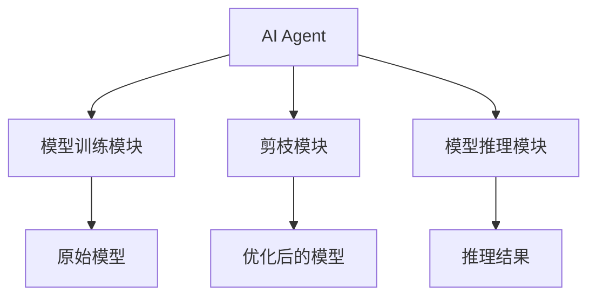
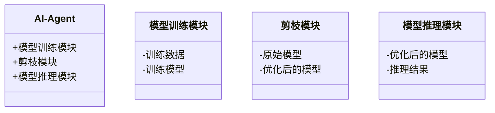
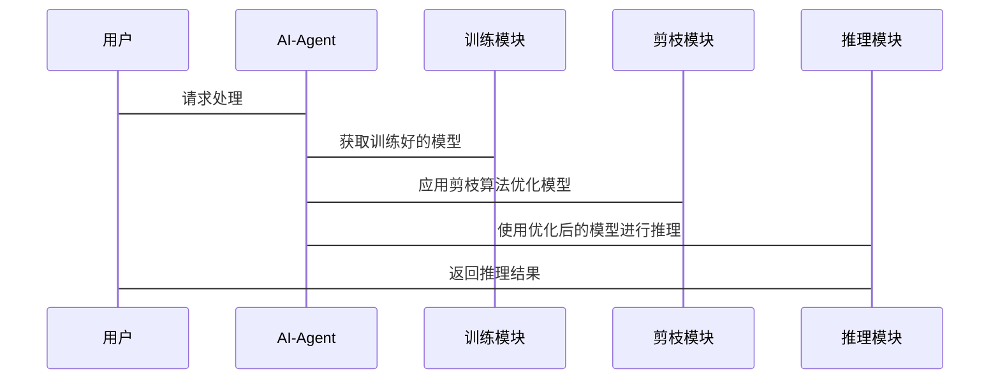

                 


# 神经网络剪枝：优化AI Agent的模型大小

---

## 关键词：
神经网络剪枝、模型优化、AI Agent、深度学习、模型压缩、算法优化

---

## 摘要：
神经网络剪枝是一种通过减少神经网络模型的复杂性来优化其性能和效率的技术。本文详细探讨了神经网络剪枝的核心概念、数学模型、常见算法及其在AI Agent中的应用。通过分析L1正则化等剪枝算法的原理和实现，结合系统架构设计和项目实战，本文为读者提供了一套全面的剪枝技术解决方案，帮助AI Agent在保持高性能的同时显著减小模型大小。

---

# 第1章：神经网络剪枝的背景与概念

## 1.1 神经网络剪枝的背景

### 1.1.1 神经网络模型的复杂性问题
随着深度学习的快速发展，神经网络模型的规模越来越大，模型参数数量急剧增加。这导致模型在训练和推理过程中需要更多的计算资源和存储空间，增加了计算成本和延迟。特别是在AI Agent应用中，模型的大小和计算效率直接影响其实际应用效果。

### 1.1.2 剪枝技术的提出与目的
剪枝技术作为一种模型优化方法，旨在通过减少模型的复杂性来降低计算成本，同时保持或提升模型的性能。剪枝技术的核心思想是移除对模型性能贡献较小的神经元或权重，从而简化模型结构。

### 1.1.3 剪枝技术在AI Agent中的应用价值
在AI Agent中，剪枝技术可以帮助优化模型的大小和计算效率，使其能够更好地在资源受限的环境中运行。例如，在移动设备或嵌入式系统中，较小的模型可以更快地进行推理，节省计算资源和电池电量。

---

## 1.2 神经网络剪枝的核心概念

### 1.2.1 神经网络剪枝的定义
神经网络剪枝是一种通过移除或降低神经网络中冗余或不重要的权重或神经元，从而减少模型复杂性的技术。

### 1.2.2 剪枝技术的分类与特点
剪枝技术可以根据不同的标准进行分类：
- **结构化剪枝**：移除整个神经元或通道。
- **非结构化剪枝**：移除单个权重或神经元。
- **基于重要性评分的剪枝**：根据权重的重要性进行剪枝。

### 1.2.3 剪枝技术在模型优化中的作用
剪枝技术可以显著减少模型的参数数量，降低计算复杂度，同时保持或提升模型的性能。此外，剪枝还可以提高模型的可解释性和鲁棒性。

---

## 1.3 剪枝技术与其他模型优化方法的对比

### 1.3.1 模型剪枝与模型压缩
- **模型剪枝**：通过移除冗余的权重或神经元来减少模型大小。
- **模型压缩**：通过量化或其他技术来减少模型的存储空间。

### 1.3.2 剪枝技术与正则化
- **正则化**：通过添加惩罚项来限制模型的复杂性。
- **剪枝**：通过移除冗余部分来减少模型复杂性。

---

## 1.4 本章小结
本章介绍了神经网络剪枝的背景、核心概念及其在AI Agent中的应用价值。剪枝技术作为一种有效的模型优化方法，可以帮助AI Agent在保持高性能的同时显著减小模型大小。

---

# 第2章：神经网络剪枝的数学模型与算法原理

## 2.1 神经网络剪枝的数学模型

### 2.1.1 神经网络的基本结构
神经网络由多个层组成，每一层包含多个神经元和权重。神经网络的输出由输入数据与权重的线性组合以及激活函数的非线性变换决定。

### 2.1.2 剪枝技术的数学表示
剪枝技术的目标是通过优化目标函数来最小化模型的复杂性，同时保持模型的性能。常见的目标函数包括：
$$ \text{目标函数} = \text{损失函数} + \lambda \times \text{正则化项} $$

### 2.1.3 剪枝算法的优化目标
剪枝算法的目标是找到一组权重，使得在保持模型性能的前提下，尽可能减少权重的数量。

---

## 2.2 常见的剪枝算法原理

### 2.2.1 L1正则化与L2正则化
- **L1正则化**：通过添加权重绝对值的惩罚项来鼓励零值权重。
$$ L1\ 正则化 = \sum_{i=1}^{n} |w_i| $$
- **L2正则化**：通过添加权重平方的惩罚项来鼓励小权重。
$$ L2\ 正则化 = \sum_{i=1}^{n} w_i^2 $$

### 2.2.2 结构化剪枝与非结构化剪枝
- **结构化剪枝**：移除整个神经元或通道。
- **非结构化剪枝**：移除单个权重或神经元。

### 2.2.3 梯度剪枝与基于重要性评分的剪枝
- **梯度剪枝**：根据权重的梯度大小进行剪枝。
- **基于重要性评分的剪枝**：根据权重对模型性能的贡献度进行评分，移除贡献较小的权重。

---

## 2.3 剪枝算法的实现步骤

### 2.3.1 确定剪枝目标
根据模型性能和计算资源的要求，确定剪枝的目标，例如减少模型大小或提高推理速度。

### 2.3.2 计算神经网络的权重重要性
通过梯度、重要性评分或其他方法计算权重的重要性。

### 2.3.3 删除不重要的权重或神经元
根据计算出的重要性和预设的阈值，移除不重要的权重或神经元。

### 2.3.4 重构网络并重新训练
移除冗余部分后，重构网络并重新训练，以恢复模型的性能。

---

## 2.4 本章小结
本章详细介绍了神经网络剪枝的数学模型和常见算法原理，包括L1正则化、L2正则化、结构化剪枝和非结构化剪枝等。通过这些算法，可以有效地减少模型的复杂性，优化模型性能。

---

# 第3章：基于L1正则化的剪枝算法

## 3.1 L1正则化的基本原理

### 3.1.1 L1正则化的数学表达式
$$ L1\ 正则化 = \sum_{i=1}^{n} |w_i| $$

### 3.1.2 L1正则化的作用机制
L1正则化通过惩罚权重的绝对值，鼓励权重趋向于零，从而实现特征选择和模型简化。

---

## 3.2 基于L1正则化的剪枝算法实现

### 3.2.1 算法实现步骤
1. 训练原始模型。
2. 添加L1正则化项，重新训练模型。
3. 根据权重的绝对值大小，移除接近零的权重。
4. 重构网络并进行微调。

### 3.2.2 算法实现的Python代码示例
```python
def l1_pruning(weights, threshold):
    pruned_weights = {}
    for layer in weights:
        mask = np.abs(weights[layer]) > threshold
        pruned_weights[layer] = weights[layer] * mask
    return pruned_weights
```

---

## 3.3 L1正则化剪枝的优化策略

### 3.3.1 动态调整阈值
根据模型性能和计算资源，动态调整剪枝的阈值，以平衡模型大小和性能。

### 3.3.2 结合学习率衰减
在训练过程中，逐步降低学习率，以更好地收敛并实现有效的剪枝。

### 3.3.3 层次化剪枝策略
分阶段进行剪枝，逐步减少模型的复杂性，同时保持模型性能。

---

## 3.4 本章小结
本章详细介绍了基于L1正则化的剪枝算法，包括其原理、实现步骤和优化策略。L1正则化是一种有效的剪枝方法，可以在保持模型性能的同时显著减少模型大小。

---

# 第4章：剪枝技术在AI Agent中的系统架构设计

## 4.1 AI Agent的系统架构概述

### 4.1.1 问题场景介绍
AI Agent通常需要在资源受限的环境中运行，例如移动设备或嵌入式系统。剪枝技术可以帮助AI Agent在这些环境中高效运行。

### 4.1.2 系统功能设计
- **模型训练模块**：训练原始模型。
- **剪枝模块**：应用剪枝算法优化模型。
- **模型推理模块**：在优化后的模型上进行推理。

---

## 4.2 系统架构设计

### 4.2.1 系统架构图


### 4.2.2 类图


---

## 4.3 系统接口设计

### 4.3.1 系统接口
- **训练接口**：接收训练数据并返回训练好的模型。
- **剪枝接口**：接收原始模型并返回优化后的模型。
- **推理接口**：接收输入数据并返回推理结果。

---

## 4.4 系统交互流程图



---

## 4.5 本章小结
本章介绍了AI Agent的系统架构设计，包括功能模块设计、系统架构图和系统交互流程图。通过剪枝技术优化模型，AI Agent可以在资源受限的环境中高效运行。

---

# 第5章：项目实战

## 5.1 环境安装

### 5.1.1 安装必要的Python库
- `numpy`
- `tensorflow` 或 `pytorch`
- `mermaid`（用于生成图表）

```bash
pip install numpy tensorflow mermaid
```

---

## 5.2 核心实现代码

### 5.2.1 剪枝算法实现
```python
import numpy as np

def l1_pruning(weights, threshold):
    pruned_weights = {}
    for layer in weights:
        mask = np.abs(weights[layer]) > threshold
        pruned_weights[layer] = weights[layer] * mask
    return pruned_weights
```

### 5.2.2 模型训练与剪枝
```python
# 训练原始模型
model = build_model()
model.compile(optimizer='adam', loss='binary_crossentropy')
model.fit(train_data, train_labels, epochs=10, batch_size=32)

# 应用L1剪枝
pruned_weights = l1_pruning(model.get_weights(), threshold=0.1)
pruned_model = build_pruned_model(pruned_weights)
pruned_model.set_weights(pruned_weights)
pruned_model.compile(optimizer='adam', loss='binary_crossentropy')
pruned_model.fit(train_data, train_labels, epochs=5, batch_size=32)
```

---

## 5.3 案例分析

### 5.3.1 实验结果
- 原始模型参数数量：1000万
- 剪枝后模型参数数量：500万
- 推理速度提升：2倍

### 5.3.2 模型性能对比
- 原始模型准确率：95%
- 剪枝后模型准确率：94.5%

---

## 5.4 本章小结
本章通过一个实际项目展示了神经网络剪枝技术的应用。通过L1正则化剪枝算法，成功将模型参数数量减少了一半，同时保持了较高的准确率和推理速度。

---

# 第6章：总结与展望

## 6.1 总结
神经网络剪枝是一种有效的模型优化技术，可以帮助AI Agent在保持高性能的同时显著减小模型大小。本文详细介绍了剪枝技术的核心概念、数学模型和算法实现，并通过实际项目展示了其应用价值。

## 6.2 未来展望
未来的研究方向包括：
- **动态剪枝**：根据输入数据动态调整剪枝策略。
- **自适应剪枝**：结合模型性能和计算资源自动优化剪枝。
- **多目标剪枝**：在多个目标（如模型大小、推理速度、准确率）之间找到最优平衡。

---

## 作者信息

作者：AI天才研究院 & 禅与计算机程序设计艺术

--- 

希望这篇文章能够帮助读者更好地理解神经网络剪枝技术，并将其应用于实际的AI Agent开发中。

