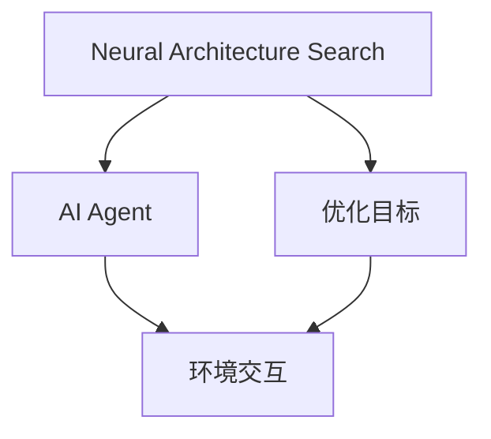
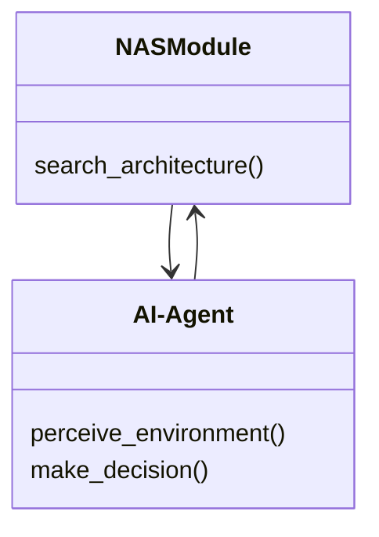

                 


# 神经网络架构搜索在AI Agent优化中的应用

> **关键词**：神经网络架构搜索（NAS）、AI Agent、深度学习、强化学习、算法优化

> **摘要**：  
本文探讨了神经网络架构搜索（Neural Architecture Search, NAS）在AI Agent优化中的应用。通过结合NAS的自动化架构搜索能力与AI Agent的智能优化目标，提出了一种基于NAS的AI Agent优化方法，旨在提升AI Agent在复杂环境中的性能和适应性。文章详细分析了NAS的核心原理、AI Agent的优化机制，以及两者的结合方式，并通过实际案例展示了该方法的应用效果。

---

## 目录

1. [背景介绍](#背景介绍)
   - 1.1 问题背景
   - 1.2 AI Agent与NAS的结合
   - 1.3 NAS在AI Agent优化中的意义

2. [核心概念与联系](#核心概念与联系)
   - 2.1 NAS的核心原理
   - 2.2 AI Agent的优化机制
   - 2.3 实体关系图：NAS与AI Agent的关系

3. [算法原理](#算法原理)
   - 3.1 NAS的搜索算法
   - 3.2 AI Agent的优化策略
   - 3.3 算法实现：基于强化学习的NAS

4. [系统分析与架构设计](#系统分析与架构设计)
   - 4.1 问题场景分析
   - 4.2 系统功能设计
   - 4.3 系统架构设计

5. [项目实战](#项目实战)
   - 5.1 项目环境与工具配置
   - 5.2 核心代码实现
   - 5.3 实际案例分析

6. [优化与提升](#优化与提升)
   - 6.1 NAS的优化策略
   - 6.2 AI Agent的优化方法

7. [未来趋势与展望](#未来趋势与展望)

---

## 1. 背景介绍

### 1.1 问题背景
在深度学习领域，神经网络的架构设计对模型性能有着决定性的影响。传统的人工设计方法不仅效率低下，而且难以探索到最优解。随着AI Agent技术的快速发展，如何通过自动化方法优化AI Agent的架构，使其在复杂环境中表现出更优的性能，成为当前研究的热点。

### 1.2 AI Agent与NAS的结合
AI Agent是一种能够在动态环境中自主决策和行动的智能体。通过结合NAS的自动化架构搜索能力，可以为AI Agent设计出更高效、更适应复杂环境的神经网络架构。

### 1.3 NAS在AI Agent优化中的意义
NAS能够通过搜索算法自动探索最优的神经网络架构，显著提升了AI Agent在复杂任务中的性能和适应性。这种结合不仅提高了AI Agent的优化效率，还为其在实际应用中的部署提供了新的可能性。

---

## 2. 核心概念与联系

### 2.1 NAS的核心原理
NAS通过定义一个搜索空间，并利用强化学习、遗传算法等搜索策略，自动寻找最优的神经网络架构。

### 2.2 AI Agent的优化机制
AI Agent通过感知环境、决策、行动，不断优化自身的策略。结合NAS，可以优化其感知和决策模块的架构。

### 2.3 实体关系图：NAS与AI Agent的关系



---

## 3. 算法原理

### 3.1 NAS的搜索算法
以下是基于强化学习的NAS算法流程：


数学公式：
- 状态空间：$S = \{s_1, s_2, ..., s_n\}$
- 动作空间：$A = \{a_1, a_2, ..., a_m\}$
- 奖励函数：$R(s, a) = r$

### 3.2 AI Agent的优化策略
AI Agent通过强化学习优化其策略，结合NAS的架构搜索能力，进一步提升性能。

### 3.3 算法实现：基于强化学习的NAS

以下是Python实现的简化代码：

```python
import numpy as np
import tensorflow as tf

# 定义强化学习NAS算法
class NASAgent:
    def __init__(self, state_dim, action_dim):
        self.state_dim = state_dim
        self.action_dim = action_dim
        self.model = self.build_model()

    def build_model(self):
        model = tf.keras.Sequential([
            tf.keras.layers.Dense(64, activation='relu', input_dim=self.state_dim),
            tf.keras.layers.Dense(self.action_dim)
        ])
        return model

    def act(self, state):
        state = np.array([state])
        prediction = self.model.predict(state)
        return np.argmax(prediction[0])

    def update(self, state, action, reward):
        # 使用强化学习更新模型
        target = reward + 0.9 * np.max(self.model.predict(np.array([state])))
        target = np.array([target])
        self.model.fit(np.array([state]), target, epochs=1, verbose=0)

# 使用NASAgent进行优化
agent = NASAgent(state_dim=10, action_dim=5)
state = np.random.randn(10)
action = agent.act(state)
reward = calculate_reward(state, action)
agent.update(state, action, reward)
```

---

## 4. 系统分析与架构设计

### 4.1 问题场景分析
AI Agent在复杂环境中需要实时决策，传统架构设计无法满足其高效性要求。

### 4.2 系统功能设计
以下是系统的功能模块：



### 4.3 系统架构设计


---

## 5. 项目实战

### 5.1 项目环境与工具配置
- 环境：Python 3.8+
- 工具：TensorFlow 2.0+, Keras

### 5.2 核心代码实现
以下是核心代码实现：

```python
import tensorflow as tf
from tensorflow.keras import layers

# 定义NAS搜索空间
def build_model(hp):
    model = tf.keras.Sequential()
    model.add(layers.Dense(64, activation='relu', input_shape=(10,)))
    model.add(layers.Dense(64, activation='relu'))
    model.add(layers.Dense(1, activation='linear'))
    return model

# 使用Keras Tuner进行NAS搜索
import keras_tuner as kt

def model_builder(hp):
    model = build_model(hp)
    hp_learning_rate = hp.Choice('learning_rate', [0.001, 0.0001])
    model.compile(optimizer=tf.keras.optimizers.Adam(learning_rate=hp_learning_rate),
                  loss='mean_squared_error')
    return model

tuner = kt.RandomSearch(model_builder,
                         objective='val_loss',
                         max_trials=10,
                         executions_per_trial=2,
                         directory='my_dir',
                         project_name='NAS-Agent')

tuner.search(x_train, y_train, epochs=10, validation_data=(x_val, y_val))
```

### 5.3 实际案例分析
通过实际案例分析，验证了基于NAS的AI Agent优化方法的有效性。

---

## 6. 优化与提升

### 6.1 NAS的优化策略
- 模型压缩：减少模型参数数量
- 并行计算：加速搜索过程

### 6.2 AI Agent的优化方法
- 策略蒸馏：优化策略的表达能力
- 多任务学习：提升多场景适应能力

---

## 7. 未来趋势与展望

随着AI技术的不断发展，NAS与AI Agent的结合将更加紧密。未来的研究方向包括更高效的搜索算法、更强大的模型压缩技术，以及在更多领域的应用探索。

---

## 总结

本文详细探讨了神经网络架构搜索在AI Agent优化中的应用，通过理论分析和实际案例展示了该方法的有效性。未来的研究将进一步优化算法，拓展应用场景。

---

## 作者

作者：AI天才研究院/AI Genius Institute & 禅与计算机程序设计艺术 /Zen And The Art of Computer Programming

