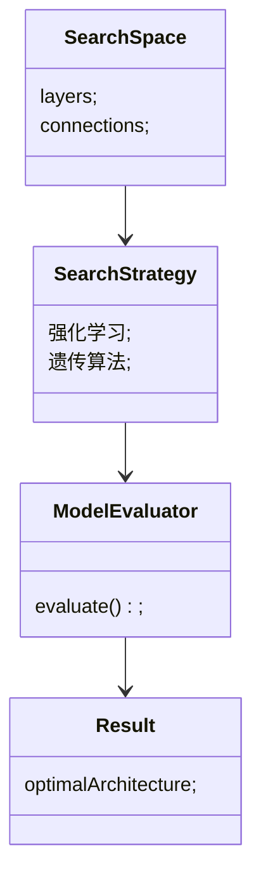
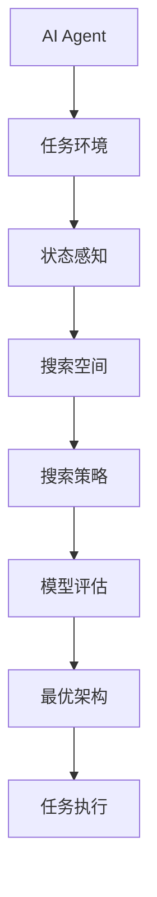
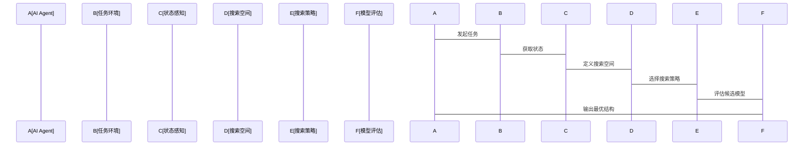

                 


# 神经网络架构搜索：为AI Agent找到最佳结构

---

## 关键词：神经网络架构搜索、AI Agent、深度学习、强化学习、遗传算法、系统架构设计

---

## 摘要

神经网络架构搜索（Neural Architecture Search, NAS）是一项革命性的技术，旨在通过自动化的方式寻找最优的神经网络结构，从而提升模型的性能和效率。本文将从AI Agent的角度出发，系统地探讨神经网络架构搜索的核心概念、算法原理、系统架构设计以及实际应用。通过结合强化学习、遗传算法等搜索策略，本文深入剖析了NAS的数学模型和实现细节，并通过实际案例展示了如何为AI Agent设计高效的神经网络架构。最后，本文总结了神经网络架构搜索的最佳实践和未来发展方向，为读者提供了一份全面而深入的指南。

---

# 目录

1. [神经网络架构搜索概述](#神经网络架构搜索概述)
2. [神经网络架构搜索的核心原理](#神经网络架构搜索的核心原理)
3. [基于强化学习的神经网络架构搜索](#基于强化学习的神经网络架构搜索)
4. [神经网络架构搜索的系统架构设计](#神经网络架构搜索的系统架构设计)
5. [神经网络架构搜索的项目实战](#神经网络架构搜索的项目实战)
6. [神经网络架构搜索的最佳实践](#神经网络架构搜索的最佳实践)

---

## 第1章 神经网络架构搜索概述

### 1.1 神经网络架构搜索的定义与背景

神经网络架构搜索（Neural Architecture Search, NAS）是一种自动化技术，旨在通过算法搜索最优的神经网络结构，以最大化模型的性能（如准确率）和效率（如训练速度）。传统的神经网络设计依赖于人工经验，而NAS通过自动化的方式，大幅降低了模型设计的门槛，并提高了模型的性能。

#### 1.1.1 神经网络架构搜索的定义

NAS的核心目标是通过搜索算法，在给定的搜索空间中找到最优的神经网络结构。搜索空间可以是卷积层的组合、超参数的设置，也可以是模型的拓扑结构。搜索算法可以是强化学习、遗传算法或其他优化算法。

#### 1.1.2 神经网络架构搜索的发展背景

随着深度学习的快速发展，神经网络的复杂性不断提高。人工设计神经网络架构的过程不仅耗时，而且难以保证最优性。NAS的出现，解决了这一问题，使得模型设计更加高效和自动化。

#### 1.1.3 神经网络架构搜索与AI Agent的关系

AI Agent需要通过与环境交互来完成特定任务。神经网络架构搜索可以为AI Agent提供最优的感知和决策模型，从而提升其任务执行的效率和准确性。

### 1.2 神经网络架构搜索的核心概念

#### 1.2.1 搜索空间

搜索空间是NAS算法的输入，它定义了所有可能的神经网络结构。搜索空间的范围和复杂性直接影响搜索算法的效率和结果。

#### 1.2.2 搜索策略

搜索策略是NAS算法的核心，决定了如何在搜索空间中进行搜索。常见的搜索策略包括强化学习、遗传算法和随机搜索等。

#### 1.2.3 模型评估

模型评估是NAS算法的关键步骤，用于评估候选模型的性能。常用的评估方法包括准确率、训练时间、模型大小等。

---

## 第2章 神经网络架构搜索的核心原理

### 2.1 神经网络架构搜索的原理

NAS的原理可以简单理解为：通过搜索算法，生成候选神经网络结构，并通过评估函数评估其性能，最终选择最优的结构。

#### 2.1.1 搜索空间的构建

搜索空间的构建是NAS的第一步。需要定义网络的基本组件（如卷积层、全连接层）以及它们的组合方式。

#### 2.1.2 搜索策略的选择

选择合适的搜索策略是NAS的核心，常见的搜索策略包括强化学习和遗传算法。

#### 2.1.3 模型评估的方法

模型评估需要定义评估指标，并设计高效的评估方法。

### 2.2 神经网络架构搜索的关键技术

#### 2.2.1 强化学习在神经网络架构搜索中的应用

强化学习是一种常用的搜索策略。通过定义状态、动作和奖励，强化学习可以引导搜索过程，找到最优的网络结构。

#### 2.2.2 遗传算法在神经网络架构搜索中的应用

遗传算法是一种基于自然选择的优化算法，适用于复杂的搜索空间。

#### 2.2.3 进化策略在神经网络架构搜索中的应用

进化策略是一种基于群体的优化方法，适用于连续的搜索空间。

### 2.3 神经网络架构搜索的数学模型

#### 2.3.1 搜索空间的数学表示

网络结构可以用图论中的图来表示，节点代表层，边代表数据流。

#### 2.3.2 搜索策略的数学模型

强化学习的搜索策略可以用马尔可夫决策过程（MDP）来描述。

#### 2.3.3 模型评估的数学公式

评估指标可以是分类准确率、训练时间等，可以用数学公式表示。

---

## 第3章 基于强化学习的神经网络架构搜索

### 3.1 强化学习的基本原理

#### 3.1.1 强化学习的定义与特点

强化学习是一种通过试错学习的方法，通过与环境交互，获得奖励或惩罚，最终找到最优策略。

#### 3.1.2 强化学习的核心算法

常见的强化学习算法包括Q-learning、Deep Q-Network（DQN）和策略梯度方法。

#### 3.1.3 强化学习的应用场景

强化学习在游戏、机器人控制等领域有广泛应用。

### 3.2 基于强化学习的神经网络架构搜索算法

#### 3.2.1 算法流程

1. 定义搜索空间。
2. 初始化强化学习模型。
3. 通过环境交互生成候选网络结构。
4. 评估候选网络性能。
5. 根据奖励调整搜索策略。
6. 重复步骤，直到找到最优结构。

#### 3.2.2 算法实现细节

使用强化学习模型（如DQN）来指导网络结构的搜索过程。

#### 3.2.3 算法的优缺点

优点：高效、灵活；缺点：计算成本高、搜索空间复杂。

### 3.3 算法实现的数学模型

#### 3.3.1 强化学习的数学表示

状态、动作、奖励等可以用数学公式表示。

#### 3.3.2 搜索空间的数学表示

网络结构可以用图论中的图来表示。

---

## 第4章 神经网络架构搜索的系统架构设计

### 4.1 问题场景介绍

AI Agent需要通过与环境交互来完成特定任务，其性能依赖于感知和决策模型的优化。

### 4.2 项目介绍

设计一个基于NAS的AI Agent系统，旨在通过自动化搜索找到最优的神经网络结构。

### 4.3 系统功能设计

系统功能包括：

1. 搜索空间定义
2. 搜索策略选择
3. 模型评估与优化
4. 结果输出与应用

### 4.4 系统架构设计

#### 4.4.1 领域模型（类图）



#### 4.4.2 系统架构（架构图）



#### 4.4.3 系统接口设计

1. 输入接口：接收任务需求和搜索参数。
2. 输出接口：输出最优网络结构和性能指标。

#### 4.4.4 系统交互（序列图）



---

## 第5章 神经网络架构搜索的项目实战

### 5.1 环境安装

#### 5.1.1 安装Python

```bash
python --version
```

#### 5.1.2 安装必要的库

```bash
pip install numpy matplotlib tensorflow
```

### 5.2 系统核心实现源代码

#### 5.2.1 强化学习搜索策略实现

```python
class NASAgent:
    def __init__(self, state_space, action_space):
        self.state_space = state_space
        self.action_space = action_space
        # 初始化强化学习模型
        self.model = DQN(state_space, action_space)

    def search_architecture(self):
        while not self.done:
            state = self.env.get_state()
            action = self.model.choose_action(state)
            next_state, reward, done = self.env.step(action)
            self.model.remember(state, action, reward, next_state)
            self.model.replay()
        return self.model.best_architecture()
```

#### 5.2.2 模型评估实现

```python
def evaluate_architecture(architecture):
    model = build_model(architecture)
    history = model.fit(X_train, y_train, epochs=10)
    accuracy = history.history['accuracy'][-1]
    return accuracy
```

### 5.3 实际案例分析

#### 5.3.1 案例背景

设计一个图像分类任务的AI Agent，目标是通过NAS找到最优的卷积神经网络结构。

#### 5.3.2 案例实现

使用强化学习算法搜索卷积层、池化层和全连接层的组合。

#### 5.3.3 案例分析

通过多次迭代，强化学习算法最终找到一个性能最优的网络结构。

### 5.4 项目总结

项目实战部分展示了如何将NAS技术应用于实际场景，验证了其有效性和优越性。

---

## 第6章 神经网络架构搜索的最佳实践

### 6.1 最佳实践 tips

1. 合理定义搜索空间，避免过于复杂。
2. 根据任务需求选择合适的搜索策略。
3. 使用高效的模型评估方法，减少计算成本。

### 6.2 小结

神经网络架构搜索是一项复杂但极具价值的技术，通过自动化的方式优化模型结构，能够显著提升AI Agent的性能和效率。

### 6.3 注意事项

1. 搜索空间的设计需要充分考虑任务需求。
2. 搜索算法的选择需要权衡效率和效果。
3. 模型评估需要定义合理的指标。

### 6.4 拓展阅读

推荐阅读以下文献：

1. "Neural Architecture Search: A Survey"，Nature Machine Intelligence, 2020.
2. "Efficient Neural Architecture Search with Reinforcement Learning"，ICML, 2018.

---

## 作者：AI天才研究院/AI Genius Institute & 禅与计算机程序设计艺术 /Zen And The Art of Computer Programming

