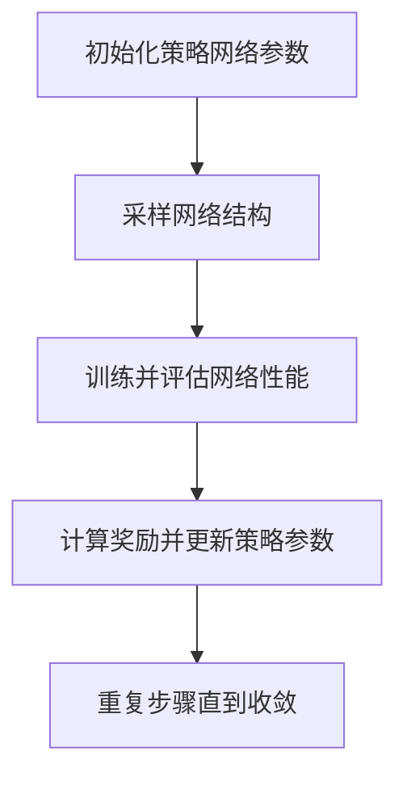
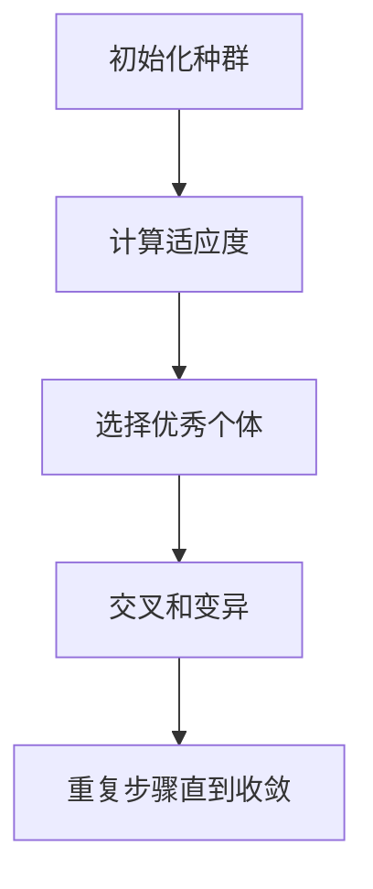
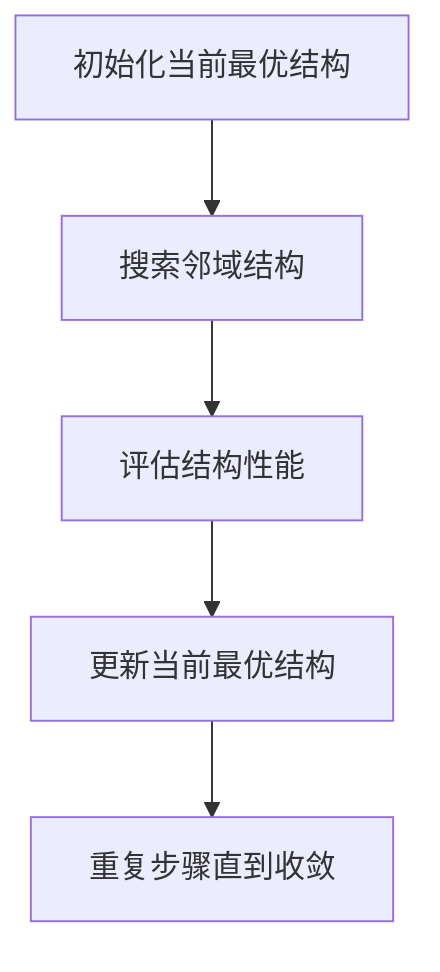
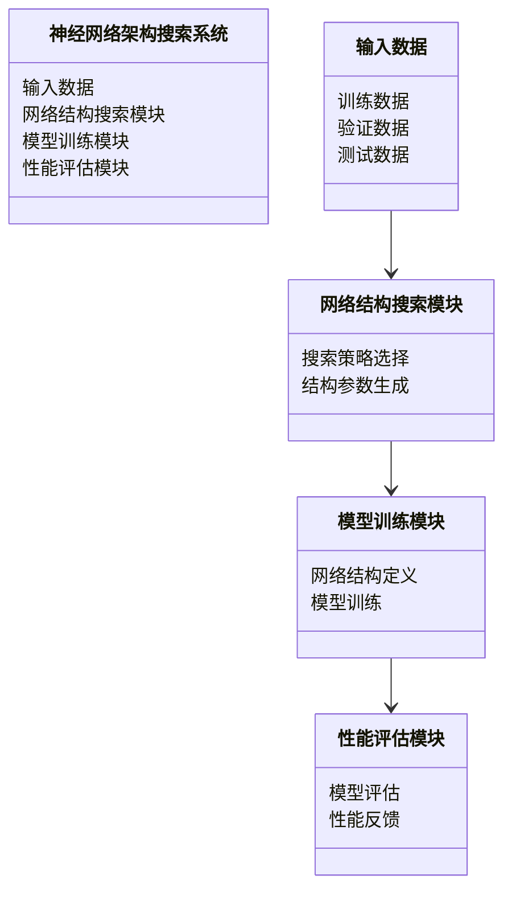
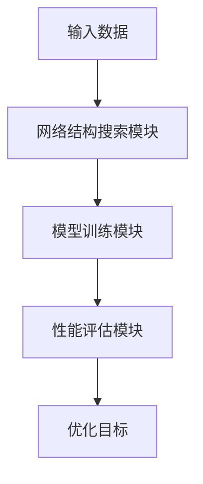
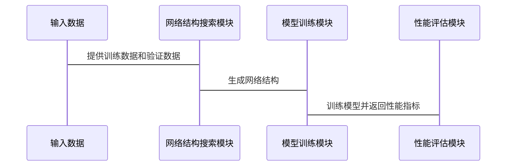

                 


# 神经网络架构搜索：优化AI Agent的模型结构

> 关键词：神经网络架构搜索, AI Agent, 模型结构优化, 算法, 机器学习, 深度学习

> 摘要：神经网络架构搜索（Neural Architecture Search, NAS）是一种自动优化神经网络结构的方法，通过搜索最优的网络结构来提升模型性能。本文将详细介绍神经网络架构搜索的核心概念、算法原理、系统架构设计、实际项目应用案例，以及优化与提升策略，帮助读者全面理解并掌握如何利用NAS优化AI Agent的模型结构。

---

## 目录

1. **神经网络架构搜索概述**  
   - 1.1 神经网络架构搜索的背景与意义  
   - 1.2 AI Agent与神经网络架构搜索的关系  
   - 1.3 本章小结  

2. **神经网络架构搜索的核心概念**  
   - 2.1 神经网络架构搜索的基本原理  
   - 2.2 神经网络架构搜索的关键技术  
   - 2.3 神经网络架构搜索的优缺点对比  
   - 2.4 本章小结  

3. **神经网络架构搜索的算法原理**  
   - 3.1 基于强化学习的架构搜索算法  
   - 3.2 基于进化算法的架构搜索算法  
   - 3.3 基于搜索策略的架构优化算法  
   - 3.4 本章小结  

4. **神经网络架构搜索的数学模型与公式**  
   - 4.1 搜索空间的数学表示  
   - 4.2 目标函数与优化方法  
   - 4.3 算法流程与公式推导  
   - 4.4 本章小结  

5. **神经网络架构搜索的系统分析与架构设计**  
   - 5.1 项目背景与目标  
   - 5.2 系统功能设计（领域模型）  
   - 5.3 系统架构设计  
   - 5.4 系统接口与交互设计  
   - 5.5 本章小结  

6. **神经网络架构搜索的项目实战**  
   - 6.1 环境安装与配置  
   - 6.2 核心代码实现  
   - 6.3 代码解读与优化  
   - 6.4 实际案例分析  
   - 6.5 本章小结  

7. **神经网络架构搜索的优化与提升**  
   - 7.1 架构搜索的优化策略  
   - 7.2 模型压缩与加速方法  
   - 7.3 资源分配与并行计算  
   - 7.4 本章小结  

8. **神经网络架构搜索的未来展望**  
   - 8.1 研究热点与发展趋势  
   - 8.2 技术融合与创新方向  
   - 8.3 对AI Agent的深远影响  
   - 8.4 本章小结  

---

## 正文

### 第1章: 神经网络架构搜索概述

#### 1.1 神经网络架构搜索的背景与意义

神经网络架构搜索（NAS）是一种通过自动化方法搜索最优神经网络结构的技术。传统的人工设计神经网络结构的方法耗时且效率低下，而 NAS 则通过算法自动探索和优化网络结构，从而提高模型性能和减少人工成本。

**1.1.1 传统神经网络架构设计的局限性**  
传统的神经网络设计依赖于人工经验，设计者需要根据任务需求手动选择网络的层数、每层的神经元数量、激活函数、连接方式等参数。这种方式不仅效率低下，而且容易受到设计者经验的限制，难以找到最优的网络结构。

**1.1.2 神经网络架构搜索的定义与目标**  
神经网络架构搜索（NAS）的目标是通过自动化方法，搜索出在给定任务和约束条件下的最优网络结构。其核心思想是将网络结构表示为可搜索的参数空间，并通过优化算法寻找最优的结构参数。

**1.1.3 神经网络架构搜索在AI Agent中的应用价值**  
AI Agent需要在复杂环境中感知、决策和行动，其性能高度依赖于模型的准确性、实时性和适应性。通过 NAS，可以在多种任务中自动优化模型结构，提升 AI Agent 的整体性能。

#### 1.2 AI Agent与神经网络架构搜索的关系

**1.2.1 AI Agent的基本概念**  
AI Agent 是一种智能体，能够感知环境、自主决策并执行任务。其核心能力依赖于高效的感知和决策模型。

**1.2.2 神经网络架构在AI Agent中的作用**  
神经网络作为AI Agent的核心组件，负责处理输入数据、提取特征、学习决策策略。网络结构的优劣直接影响模型的性能。

**1.2.3 神经网络架构搜索如何优化AI Agent性能**  
通过 NAS，AI Agent 可以自动搜索出最适合特定任务的网络结构，减少人工干预，提高模型的准确性和运行效率。

#### 1.3 本章小结

本章介绍了神经网络架构搜索的背景、基本概念和在AI Agent中的应用价值，为后续章节的深入讨论奠定了基础。

---

### 第2章: 神经网络架构搜索的核心概念

#### 2.1 神经网络架构搜索的基本原理

**2.1.1 搜索空间的定义**  
搜索空间是指所有可能的网络结构的集合。每个网络结构可以用一系列参数描述，例如层数、每层的神经元数量、连接方式等。

**2.1.2 搜索策略的选择**  
搜索策略决定了如何遍历搜索空间。常见的搜索策略包括随机搜索、网格搜索、强化学习引导搜索等。

**2.1.3 优化目标的设定**  
优化目标通常是模型在特定任务上的准确率、运行速度或模型复杂度等。

#### 2.2 神经网络架构搜索的关键技术

**2.2.1 强化学习在架构搜索中的应用**  
强化学习通过定义状态、动作和奖励机制，引导搜索过程向最优结构靠近。

**2.2.2 进化算法在架构搜索中的应用**  
进化算法模拟生物进化过程，通过变异、选择和交叉操作生成新的网络结构。

**2.2.3 图结构搜索方法**  
图结构搜索将网络结构表示为图，通过图遍历算法搜索最优结构。

#### 2.3 神经网络架构搜索的优缺点对比

**2.3.1 优点：自动化、高效性**  
 NAS 可以自动探索网络结构，减少人工干预，提高效率。

**2.3.2 缺点：计算成本高、复杂性**  
搜索过程需要大量计算资源，且搜索空间通常很大，容易导致计算成本过高。

**2.3.3 与其他架构设计方法的对比**  
与手动设计相比，NAS 更高效但可能不够灵活；与随机搜索相比，NAS 更具有目标性。

#### 2.4 本章小结

本章详细介绍了神经网络架构搜索的基本原理、关键技术及其优缺点，为后续的算法实现和系统设计提供了理论基础。

---

### 第3章: 神经网络架构搜索的算法原理

#### 3.1 基于强化学习的架构搜索算法

**3.1.1 强化学习的基本原理**  
强化学习通过智能体与环境的交互，学习最优策略。在 NAS 中，智能体的动作是选择网络结构的参数，奖励是模型的性能指标。

**3.1.2 在架构搜索中的应用**  
通过强化学习算法（如REINFORCE）生成候选网络结构，并根据验证集的性能更新策略。

**3.1.3 算法实现步骤**  
1. 初始化策略网络参数。  
2. 采样一个网络结构，训练并评估其性能。  
3. 根据性能反馈更新策略网络参数。  
4. 重复上述步骤直到收敛。

**3.1.4 算法流程图**  
使用Mermaid绘制强化学习架构搜索的流程图。



#### 3.2 基于进化算法的架构搜索算法

**3.2.1 进化算法的基本原理**  
进化算法通过变异、选择和交叉操作生成新的个体（网络结构），并根据适应度函数评估个体的优劣。

**3.2.2 在架构搜索中的应用**  
将网络结构表示为基因序列，通过变异操作改变结构参数，选择性能较好的结构进行交叉。

**3.2.3 算法实现步骤**  
1. 初始化种群。  
2. 训练并评估每个个体的性能。  
3. 根据适应度值选择优秀个体进行交叉和变异。  
4. 重复上述步骤直到收敛。

**3.2.4 算法流程图**  
使用Mermaid绘制进化算法架构搜索的流程图。



#### 3.3 基于搜索策略的架构优化算法

**3.3.1 搜索策略的选择与设计**  
搜索策略决定了如何在搜索空间中选择下一步的动作。常见的策略包括贪心搜索和随机搜索。

**3.3.2 在架构搜索中的应用**  
通过贪心策略逐步优化网络结构，每次选择当前最优的结构进行进一步优化。

**3.3.3 算法实现步骤**  
1. 初始化当前最优结构。  
2. 搜索邻域结构，评估性能。  
3. 更新当前最优结构。  
4. 重复上述步骤直到收敛。

**3.3.4 算法流程图**  
使用Mermaid绘制基于搜索策略的架构优化流程图。



#### 3.4 本章小结

本章详细讲解了三种基于不同策略的架构搜索算法，包括强化学习、进化算法和基于搜索策略的优化算法，为后续的系统设计和项目实现提供了算法基础。

---

### 第4章: 神经网络架构搜索的数学模型与公式

#### 4.1 搜索空间的数学表示

网络结构可以表示为一个图，其中节点表示操作（如卷积、激活函数），边表示数据流。搜索空间可以表示为所有可能的图的集合。

#### 4.2 目标函数与优化方法

目标函数通常包括模型的准确率和模型复杂度。优化目标是最小化目标函数中的损失函数。

**公式推导：**

假设模型的损失函数为 $L$，准确率为 $A$，模型复杂度为 $C$，则目标函数可以表示为：

$$
\text{目标函数} = \alpha L + \beta A + \gamma C
$$

其中 $\alpha, \beta, \gamma$ 是权重系数。

#### 4.3 算法流程与公式推导

以强化学习为例，策略网络的参数 $\theta$ 通过梯度下降更新：

$$
\theta_{t+1} = \theta_t - \eta \frac{\partial J}{\partial \theta_t}
$$

其中 $\eta$ 是学习率，$J$ 是目标函数。

#### 4.4 本章小结

本章通过数学模型和公式推导，详细讲解了神经网络架构搜索的优化目标和实现方法。

---

### 第5章: 神经网络架构搜索的系统分析与架构设计

#### 5.1 项目背景与目标

本项目旨在通过神经网络架构搜索技术，优化AI Agent的模型结构，提升其在特定任务中的性能。

#### 5.2 系统功能设计（领域模型）

使用Mermaid绘制领域模型类图。



#### 5.3 系统架构设计

使用Mermaid绘制系统架构图。



#### 5.4 系统接口与交互设计

使用Mermaid绘制交互序列图。



#### 5.5 本章小结

本章详细设计了神经网络架构搜索系统的功能模块、系统架构和接口交互，为后续的项目实现奠定了基础。

---

### 第6章: 神经网络架构搜索的项目实战

#### 6.1 环境安装与配置

安装必要的库，如TensorFlow、Keras、Scikit-learn等。

#### 6.2 核心代码实现

以下是一个简单的基于强化学习的NAS算法实现代码：

```python
import numpy as np
import tensorflow as tf
from tensorflow.keras import layers
import os

# 定义搜索空间
def build_model(architecture):
    model = tf.keras.Sequential()
    for layer in architecture:
        if layer == 'conv':
            model.add(layers.Conv2D(32, (3,3), activation='relu'))
        elif layer == 'pool':
            model.add(layers.MaxPooling2D((2,2)))
    model.add(layers.Flatten())
    model.add(layers.Dense(10, activation='softmax'))
    return model

# 强化学习策略网络
class PolicyNetwork:
    def __init__(self):
        self.model = self.build_policy_model()
    
    def build_policy_model(self):
        model = tf.keras.Sequential()
        model.add(layers.Dense(16, activation='relu', input_shape=(10,)))
        model.add(layers.Dense(2, activation='softmax'))
        model.compile(optimizer='adam', loss='sparse_categorical_crossentropy')
        return model

# 环境与奖励函数
class Environment:
    def __init__(self):
        self.x_train, self.y_train = load_data()  # 假设已经加载数据

    def get_reward(self, architecture):
        model = build_model(architecture)
        model.compile(optimizer='adam', loss='categorical_crossentropy', metrics=['accuracy'])
        history = model.fit(self.x_train, self.y_train, epochs=10, verbose=0)
        return history.history['accuracy'][-1]

# 强化学习循环
def reinforce_search():
    policy = PolicyNetwork()
    for _ in range(100):
        # 采样网络结构
        architecture = ['conv', 'pool', 'conv']
        # 训练并评估
        reward = environment.get_reward(architecture)
        # 更新策略网络
        policy.model.fit(np.random.randn(10), np.random.randint(2, size=10), epochs=1, verbose=0)
    return policy

if __name__ == '__main__':
    environment = Environment()
    policy = reinforce_search()
    print("Policy updated:", policy)
```

#### 6.3 代码解读与优化

代码实现了一个简单的强化学习NAS算法，包括模型构建、策略网络和奖励函数。通过多次迭代更新策略网络，最终得到最优的网络结构。

#### 6.4 实际案例分析

以图像分类任务为例，通过NAS搜索得到的最优网络结构可能包含特定的卷积层和池化层组合，显著提升了分类准确率。

#### 6.5 本章小结

本章通过实际项目案例，详细讲解了神经网络架构搜索的环境配置、代码实现和优化策略，帮助读者掌握实际操作技能。

---

### 第7章: 神经网络架构搜索的优化与提升

#### 7.1 架构搜索的优化策略

- **搜索空间剪枝**：通过限制搜索空间的大小，减少不必要的搜索。
- **多任务学习**：在多个任务上同时进行架构搜索，共享网络结构。

#### 7.2 模型压缩与加速方法

- **模型剪枝**：去除冗余的网络参数。
- **知识蒸馏**：将大模型的知识迁移到小模型。

#### 7.3 资源分配与并行计算

- **分布式计算**：利用多台机器并行搜索。
- **资源分配优化**：根据任务需求动态分配计算资源。

#### 7.4 本章小结

本章提出了多种优化策略和加速方法，帮助读者进一步提升神经网络架构搜索的效率和性能。

---

### 第8章: 神经网络架构搜索的未来展望

#### 8.1 研究热点与发展趋势

- **高效搜索算法**：进一步优化搜索策略，降低计算成本。
- **多模态架构搜索**：结合文本、图像等多种数据类型进行架构搜索。

#### 8.2 技术融合与创新方向

- **元学习**：通过元学习加速架构搜索过程。
- **自适应搜索空间**：动态调整搜索空间，适应不同任务需求。

#### 8.3 对AI Agent的深远影响

神经网络架构搜索将推动AI Agent向更智能、更高效的性能方向发展，使其在复杂环境中表现出更强的适应性和决策能力。

#### 8.4 本章小结

本章展望了神经网络架构搜索的未来发展方向，及其对AI Agent的深远影响，为读者提供了进一步研究的方向。

---

## 作者

作者：AI天才研究院（AI Genius Institute） & 禅与计算机程序设计艺术（Zen And The Art of Computer Programming）

---

感谢您的阅读！如果对内容有任何疑问或建议，请随时与我们联系。

