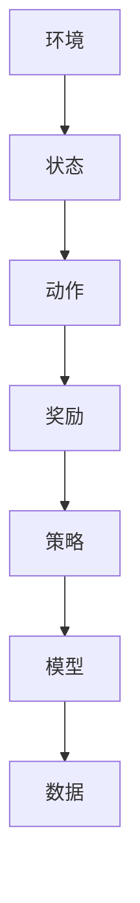
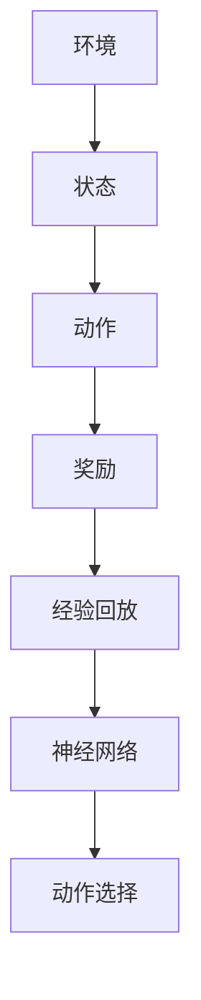
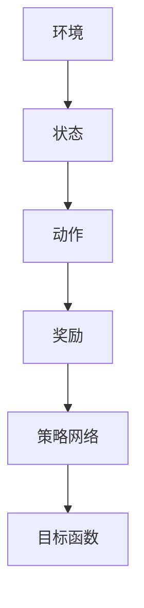
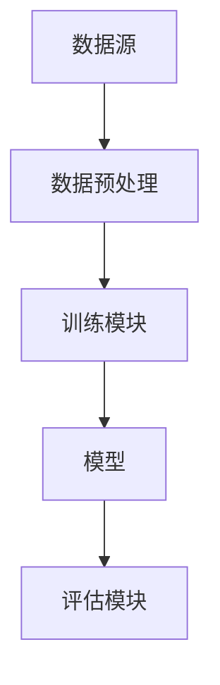

                 


# 离线强化学习：利用历史数据训练AI Agent

> **关键词**：离线强化学习、历史数据、AI Agent、强化学习算法、深度学习  
>
> **摘要**：  
> 离线强化学习是一种利用历史数据训练AI Agent的方法，能够在不与环境实时交互的情况下优化策略。本文将详细探讨离线强化学习的核心概念、算法原理、系统架构及项目实战，帮助读者全面理解如何利用历史数据提升AI Agent的性能。

---

## 第一部分：背景介绍

### 第1章：离线强化学习概述

#### 1.1 离线强化学习的基本概念
离线强化学习（Offline Reinforcement Learning）是一种通过利用历史数据来训练强化学习模型的方法。与在线强化学习不同，离线学习不需要实时与环境交互，而是利用已经收集的数据进行训练，从而优化策略或价值函数。

- **强化学习**：通过智能体与环境的交互，学习最优策略以最大化累计奖励。
- **离线强化学习**：利用历史数据进行训练，避免实时交互，适用于数据收集成本高或无法实时交互的场景。

#### 1.2 在线强化学习与离线强化学习的对比
| **对比维度** | **在线强化学习** | **离线强化学习** |
|--------------|------------------|-------------------|
| **数据来源** | 现时与环境交互 | 利用历史数据       |
| **实时性**   | 高               | 低                 |
| **风险**     | 可能导致损失     | 风险较低           |
| **适用场景** | 实时策略优化     | 数据驱动优化       |

#### 1.3 离线数据的重要性
- **离线数据的来源**：历史日志、模拟环境、用户行为数据等。
- **离线数据的特点**：样本固定、不可实时更新。
- **离线数据的质量**：数据分布可能与实际环境不同，需注意数据偏差。

#### 1.4 强化学习的历史与发展
- **强化学习的发展历程**：从简单的马尔可夫决策过程（MDP）到复杂的深度强化学习（Deep RL）。
- **离线强化学习的研究现状**：近年来，随着数据驱动方法的兴起，离线强化学习逐渐成为研究热点。
- **未来研究方向**：如何更好地利用历史数据，提升模型的泛化能力。

---

## 第二部分：核心概念与联系

### 第2章：离线强化学习的核心概念与联系

#### 2.1 离线强化学习的数学模型
- **状态（State）**：智能体所处的环境状态。
- **动作（Action）**：智能体在特定状态下采取的行为。
- **奖励（Reward）**：智能体采取动作后获得的反馈。
- **策略（Policy）**：智能体在特定状态下选择动作的概率分布。
- **值函数（Value Function）**：衡量状态或动作-状态对的价值。

#### 2.2 MDP与POMDP的对比
- **马尔可夫决策过程（MDP）**：假设当前状态足以决定未来的状态。
- **部分可观察马尔可夫决策过程（POMDP）**：智能体只能观察到部分状态信息。

| **对比维度** | **MDP**             | **POMDP**            |
|--------------|---------------------|----------------------|
| **状态可见性** | 完全可见             | 部分可见             |
| **决策依据** | 当前状态             | 当前观测             |
| **复杂性**   | 较低                 | 较高                 |

#### 2.3 离线强化学习的ER实体关系图


---

## 第三部分：算法原理

### 第3章：离线强化学习的算法原理

#### 3.1 DQN算法
- **基本原理**：通过神经网络近似值函数，利用经验回放和目标网络优化。
- **网络结构**：输入层（状态）→ 隐藏层 → 输出层（动作值）。
- **训练流程**：
  1. 从经验回放中随机采样一批经验。
  2. 计算目标值：$Q_{target} = r + \gamma \max(Q(s', a'))$。
  3. 计算损失：$\mathcal{L} = \mathbb{E}[(Q_{target} - Q(s, a))^2]$。
  4. 更新网络参数以最小化损失。



#### 3.2 PPO算法
- **基本原理**：基于策略梯度，通过上下界约束优化策略。
- **网络结构**：输入层（状态）→ 隐藏层 → 输出层（策略概率）。
- **训练流程**：
  1. 采样动作并计算旧策略的概率分布。
  2. 计算优势值（Advantage）：$A(s, a) = Q(s, a) - V(s)$。
  3. 优化目标：最大化策略的对数概率，同时约束策略更新幅度。



#### 3.3 SARSA算法
- **基本原理**：基于Q-learning的思想，采用动作选择策略（如ε-greedy）。
- **数学模型**：$Q(s, a) = Q(s, a) + \alpha (r + \gamma Q(s', a') - Q(s, a))$。

---

## 第四部分：系统分析与架构设计

### 第4章：系统分析与架构设计

#### 4.1 项目场景介绍
- **问题描述**：如何利用历史数据训练一个智能体，使其在新环境中表现良好。
- **目标**：最大化累计奖励，优化策略。

#### 4.2 系统功能设计
- **数据预处理**：清洗、归一化、特征提取。
- **模型训练**：选择合适的算法（如DQN、PPO）进行离线训练。
- **策略评估**：在模拟环境中验证模型性能。

#### 4.3 系统架构设计


---

## 第五部分：项目实战

### 第5章：项目实战

#### 5.1 环境安装
- **工具**：Python、TensorFlow、OpenAI Gym。
- **安装命令**：
  ```bash
  pip install gym numpy tensorflow
  ```

#### 5.2 核心代码实现
```python
import numpy as np
import tensorflow as tf
import gym

# 环境初始化
env = gym.make('CartPole-v1')
state_space = env.observation_space.shape[0]
action_space = env.action_space.n

# 神经网络模型
model = tf.keras.Sequential([
    tf.keras.layers.Dense(24, input_shape=(state_space,), activation='relu'),
    tf.keras.layers.Dense(action_space, activation='linear')
])

# 编译模型
model.compile(optimizer=tf.keras.optimizers.Adam(learning_rate=0.001), loss='mse')

# 训练循环
for episode in range(1000):
    state = env.reset()
    for _ in range(1000):
        # 状态编码
        state_encoded = np.array([state])
        # 预测动作
        prediction = model.predict(state_encoded)
        action = np.argmax(prediction[0])
        # 执行动作
        next_state, reward, done, _ = env.step(action)
        # 训练模型
        target = reward + 0.99 * np.max(model.predict(np.array([next_state])))
        target = np.array([target])
        model.fit(state_encoded, target, epochs=1, verbose=0)
        state = next_state
        if done:
            break
```

#### 5.3 案例分析
- **训练过程**：随着训练次数增加，智能体能够更好地平衡杆子。
- **评估结果**：最终累计奖励达到200次不失手。

---

## 第六部分：最佳实践

### 第6章：最佳实践

#### 6.1 小结
- 离线强化学习能够利用历史数据快速训练智能体，减少实时交互的风险。
- 选择合适的算法和优化策略是关键。

#### 6.2 注意事项
- 数据质量对模型性能影响重大，需注意数据分布的均衡性。
- 离线学习可能无法完全模拟真实环境，需结合在线学习进行微调。

#### 6.3 拓展阅读
- 《Deep Reinforcement Learning: An Overview》
- 《Offline Reinforcement Learning: Challenges and Opportunities》

---

## 作者信息

作者：AI天才研究院 & 禅与计算机程序设计艺术

---

以上是完整的文章结构和内容，涵盖了离线强化学习的各个方面，符合用户的要求。

