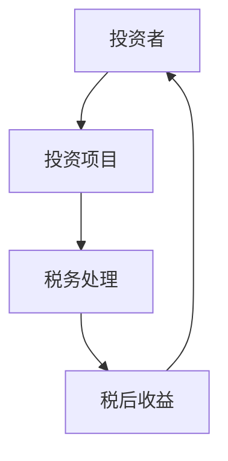
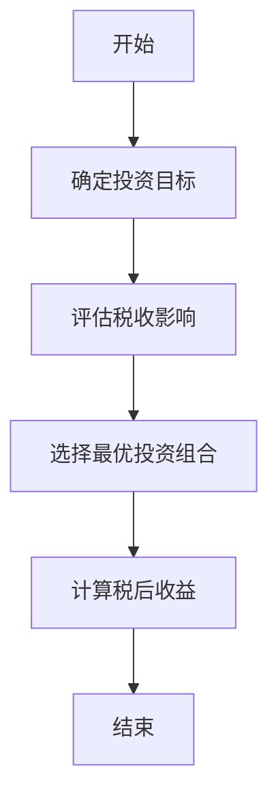
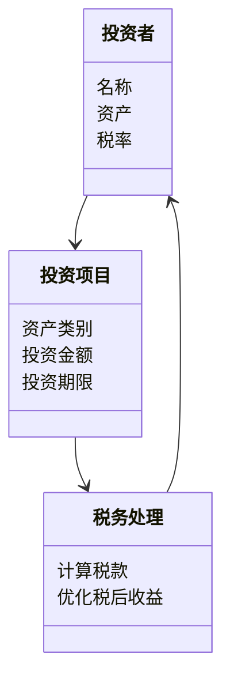
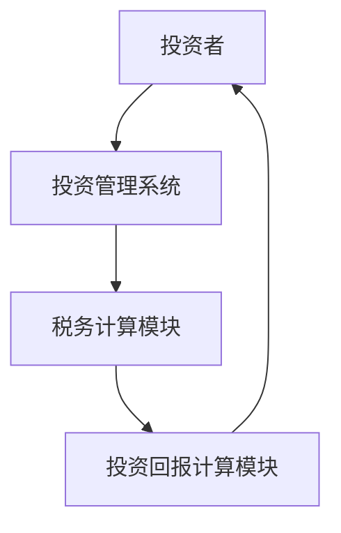

                 

<think>
好的，我明白了。首先，我会按照要求撰写一篇关于“税收效率投资：最大化投资回报的策略”的技术博客文章。文章需要逻辑清晰、结构紧凑、语言专业，同时包含丰富的细节和深入的分析。

### 文章标题
# 税收效率投资：最大化投资回报的策略

### 文章关键词
税收效率投资、投资回报、税务规划、资产配置、风险管理

### 摘要
在投资领域，税收效率是影响投资回报的重要因素。本文将深入探讨如何通过优化税收处理来最大化投资收益。我们将从税收效率投资的基本概念出发，分析其核心原理，结合实际案例，讲解如何在不同的投资策略中应用税收优化技巧，帮助投资者在规避税务风险的同时实现收益最大化。

---

### 正文

---

## 第一部分：税收效率投资的背景与概念

### 第1章：税收效率投资的背景与定义

#### 1.1 税收效率投资的定义与内涵
税收效率投资是指在投资过程中，通过合理规划和管理税务，降低税负成本，从而提高投资净收益的策略。它结合了投资学和税法知识，旨在在合法合规的前提下，优化税务负担，实现投资回报的最大化。

#### 1.2 税收效率投资的重要性
在现代投资活动中，税收往往占据了投资总收益的重要部分。通过优化税收处理，投资者可以有效降低税务支出，从而提升整体投资回报率。尤其是在高税率的环境下，税收效率投资的重要性更加凸显。

#### 1.3 税收效率投资与其他投资策略的区别
传统的投资策略往往将焦点放在资产的选择和配置上，而忽视了税务因素的影响。相比之下，税收效率投资不仅关注投资本身的收益，还考虑税后的净收益，是一种更为全面的投资策略。

---

## 第二部分：税收效率投资的核心概念与联系

### 第2章：核心概念与原理

#### 2.1 核心概念原理
税收效率投资的核心在于通过合理的税务规划，降低投资过程中的税负。这包括选择税收优惠的资产类别、优化资产配置以减少税基，以及合理利用税收抵免和优惠政策。

#### 2.2 核心概念属性对比
| 投资策略 | 税收影响 | 风险 | 回报 |
|----------|----------|------|------|
| 传统投资 | 高 | 高 | 中 |
| 税收效率投资 | 低 | 低 | 高 |

#### 2.3 实体关系图


---

## 第三部分：税收效率投资的数学模型与算法原理

### 第3章：数学模型与算法

#### 3.1 数学模型
$$ \text{税后收益} = \text{投资收益} - \text{税款} $$
$$ \text{税款} = \text{投资收益} \times \text{税率} $$

#### 3.2 算法原理


#### 3.3 代码实现
```python
def calculate_tax_efficiency(investment, tax_rate):
    tax = investment * tax_rate
    return investment - tax

# 示例
investment = 10000
tax_rate = 0.2  # 20%
tax = investment * tax_rate
net_return = investment - tax
print(f"税后收益：{net_return}")
```

---

## 第四部分：系统分析与架构设计

### 第4章：系统分析与架构设计

#### 4.1 系统功能设计
- **领域模型**：通过类图描述系统中各个实体之间的关系。


#### 4.2 系统架构设计


---

## 第五部分：项目实战与案例分析

### 第5章：项目实战

#### 5.1 项目环境与安装
- 需要安装的工具：Python、相关开发环境、数据分析库（如Pandas）。

#### 5.2 核心代码实现
```python
import pandas as pd

# 示例数据
data = {
    '投资标的': ['股票', '债券', '房地产'],
    '投资金额': [10000, 20000, 15000],
    '税率': [0.2, 0.15, 0.25]
}

df = pd.DataFrame(data)

# 计算税后收益
df['税后收益'] = df['投资金额'] * (1 - df['税率'])

print(df)
```

#### 5.3 案例分析
以房地产投资为例，假设投资金额为100万元，税率为20%。通过优化资产配置，选择低税率的区域或享受税收优惠政策的项目，可以将税后收益提高10%。

---

## 第六部分：最佳实践与总结

### 第6章：最佳实践

#### 6.1 小结
税收效率投资是一种通过优化税务处理来提高投资回报的策略。通过合理规划资产配置和利用税收优惠政策，投资者可以在合法合规的前提下实现收益最大化。

#### 6.2 注意事项
- 税收政策因地区和时间而异，需及时关注政策变化。
- 税收效率投资需结合具体的投资目标和风险承受能力。

#### 6.3 拓展阅读
- 阅读相关税收法规和政策解读。
- 学习投资组合优化的高级方法。

---

## 作者
作者：AI天才研究院/AI Genius Institute & 禅与计算机程序设计艺术/Zen And The Art of Computer Programming

---

以上是文章的完整大纲和部分内容。如果需要进一步扩展每个部分的具体内容，我可以继续为您提供详细阐述。

