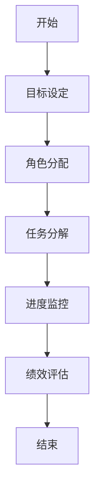
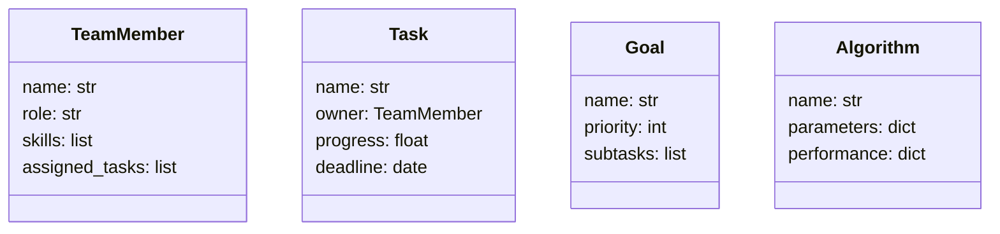
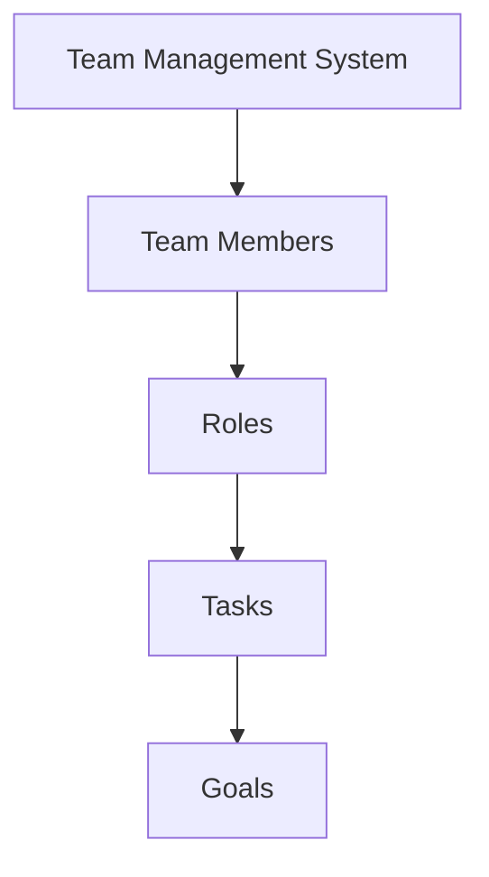
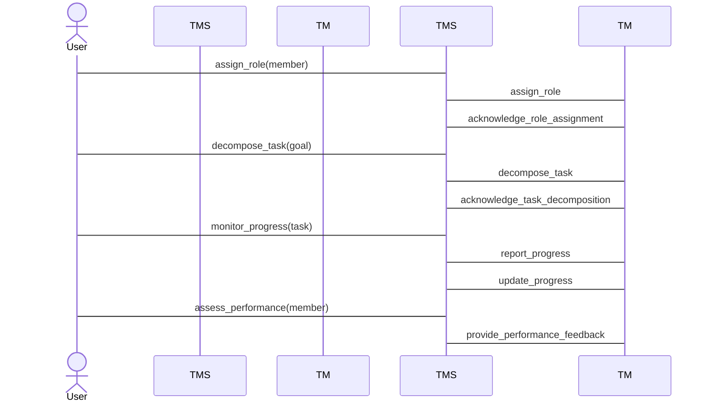

                 


# 组建高效AI开发团队的技巧

## 关键词：AI开发团队，高效协作，技术管理，团队管理，人工智能开发

## 摘要：本文将详细探讨如何高效地组建和管理AI开发团队，涵盖团队协作、技术能力、目标管理、创新激励等方面，结合实际案例和数学模型，为读者提供系统的解决方案。

---

## 第一部分：背景介绍

### 第1章：高效AI开发团队的背景与挑战

#### 1.1 AI开发团队的核心概念

##### 1.1.1 问题背景与问题描述
在人工智能（AI）快速发展的今天，AI开发团队的组建与管理变得尤为重要。一个高效的AI开发团队能够快速响应市场需求，持续创新，并在竞争激烈的环境中保持技术领先。然而，许多企业在组建AI团队时，常常面临以下挑战：
- **目标不明确**：团队成员对目标理解不一致，导致资源浪费。
- **协作效率低下**：缺乏明确的角色分配和任务分解，导致工作重复或遗漏。
- **技术能力互补性不足**：团队成员的技术栈过于单一，难以应对复杂的AI开发任务。
- **创新激励不足**：团队成员缺乏创新动力，导致技术停滞。

##### 1.1.2 高效团队的目标与意义
高效的AI开发团队的目标是通过合理分工、高效协作和持续创新，快速交付高质量的AI产品。其意义在于：
- 提高开发效率，缩短产品迭代周期。
- 降低开发成本，优化资源配置。
- 提升团队凝聚力，增强企业的核心竞争力。

##### 1.1.3 AI开发团队的边界与外延
AI开发团队的边界是指团队的核心职责范围，通常包括算法设计、数据处理、模型训练、系统集成等。其外延则包括与产品团队、运维团队的协作，以及与外部合作伙伴的沟通。

##### 1.1.4 核心要素与组成结构
高效AI开发团队的核心要素包括：
- **目标清晰性**：明确的团队目标和任务分解。
- **角色互补性**：团队成员的技术能力和职责分工互补。
- **协作效率**：高效的沟通机制和协作流程。
- **创新激励**：激励团队成员提出创新想法。

#### 1.2 高效AI开发团队的关键特征

##### 1.2.1 团队协作的高效性
高效的协作机制是团队高效运转的基础。通过明确的角色分配和任务分解，团队成员可以专注于自己的领域，避免重复劳动和资源浪费。

##### 1.2.2 技术能力的互补性
团队成员的技术能力应相互补充，例如：
- 数据工程师负责数据处理和特征工程。
- 算法工程师负责模型设计和优化。
- 前端工程师负责产品原型设计和用户体验优化。
- 后端工程师负责系统集成和部署。

##### 1.2.3 目标管理的清晰性
团队目标应明确且可量化，例如：
- 在规定时间内完成特定模型的训练和优化。
- 提升模型的准确率或运行效率。
- 按时交付特定功能模块。

##### 1.2.4 创新驱动的持续性
高效的团队应鼓励创新，例如：
- 定期组织技术分享会，促进知识共享。
- 鼓励团队成员提出改进建议，并给予实际反馈。
- 建立创新激励机制，如奖金、晋升等。

---

## 第二部分：算法原理讲解

### 第2章：高效团队管理算法

#### 2.1 算法流程图


#### 2.2 算法实现代码
```python
def team_management_algorithm(team_members, goals):
    # 角色分配
    role_assignment = assign_roles(team_members)
    # 任务分解
    task_distribution = decompose_tasks(goals)
    # 进度监控
    progress_monitoring = monitor_progress(task_distribution)
    # 绩效评估
    performance_assessment = assess_performance(team_members, progress_monitoring)
    return performance_assessment

def assign_roles(members):
    # 根据成员技能分配角色
    roles = []
    for member in members:
        if member['skills'] == 'data_engineering':
            roles.append({'name': member['name'], 'role': 'data_engineer'})
        elif member['skills'] == 'algorithm_design':
            roles.append({'name': member['name'], 'role': 'algorithm_engineer'})
        # 其他角色分配逻辑...
    return roles

def decompose_tasks(goals):
    # 将目标分解为具体任务
    tasks = []
    for goal in goals:
        tasks.append({'name': goal['name'], 'subtasks': decompose_subtasks(goal)})
    return tasks

def decompose_subtasks(goal):
    # 示例分解函数
    subtasks = []
    for task in goal['tasks']:
        subtasks.append({'name': task, 'responsibility': assign_subtask_responsibility(task)})
    return subtasks

def assign_subtask_responsibility(task):
    # 示例分配函数
    responsibility = ''
    if 'data' in task:
        responsibility = 'data_engineer'
    elif 'algorithm' in task:
        responsibility = 'algorithm_engineer'
    return responsibility
```

#### 2.3 算法原理的数学模型
在高效团队管理中，我们可以将团队协作视为一个优化问题。假设每个团队成员有不同的技能和时间分配，我们需要找到一种任务分配方式，使得团队的整体效率最大化。

数学模型如下：
$$
\text{最大化 } \sum_{i=1}^{n} w_i x_i \\
\text{约束：} \sum_{i=1}^{n} x_i \leq T_i \quad \forall i \\
$$
其中，\(w_i\) 是任务 \(i\) 的权重，\(x_i\) 是任务 \(i\) 的分配比例，\(T_i\) 是团队成员的时间限制。

---

## 第三部分：系统分析与架构设计方案

### 第3章：高效AI开发团队的系统架构设计

#### 3.1 问题场景介绍
在AI开发过程中，团队协作涉及到数据处理、模型训练、系统集成等多个环节。为了确保高效协作，我们需要设计一个高效的系统架构。

#### 3.2 系统功能设计（领域模型）



#### 3.3 系统架构设计



#### 3.4 系统接口设计
- `assign_role(member)`：根据成员技能分配角色。
- `decompose_task(goal)`：将目标分解为具体任务。
- `monitor_progress(task)`：监控任务进度。
- `assess_performance(member)`：评估成员绩效。

#### 3.5 系统交互设计



---

## 第四部分：项目实战

### 第4章：高效AI开发团队的实战案例

#### 4.1 环境安装
假设我们需要组建一个AI开发团队，目标是开发一个图像分类系统。首先，我们需要安装以下工具：
- **代码管理工具**：Git、GitHub。
- **开发环境**：Python、Jupyter Notebook。
- **版本管理工具**：Docker、Kubernetes。
- **协作工具**：Slack、Trello。

#### 4.2 核心实现源代码
```python
# 团队角色分配
def assign_roles(members):
    roles = {}
    for member in members:
        if 'data' in member['skills']:
            roles['data_engineer'] = member['name']
        elif 'algorithm' in member['skills']:
            roles['algorithm_engineer'] = member['name']
        elif 'frontend' in member['skills']:
            roles['frontend_developer'] = member['name']
    return roles

# 任务分解
def decompose_task(goal):
    tasks = []
    for step in goal['steps']:
        task = {
            'name': step['name'],
            'owner': assign_task_owner(step, roles),
            'deadline': step['deadline']
        }
        tasks.append(task)
    return tasks

# 进度监控
def monitor_progress(tasks):
    progress = {}
    for task in tasks:
        progress[task['name']] = {
            'owner': task['owner'],
            'status': 'in progress'
        }
    return progress
```

#### 4.3 代码应用解读与分析
通过上述代码，我们可以看到团队协作的核心在于角色分配和任务分解。每个任务都有明确的负责人和截止日期，确保团队协作高效有序。

#### 4.4 实际案例分析
假设我们的团队目标是开发一个图像分类系统，任务分解如下：
1. 数据工程师负责收集和预处理数据。
2. 算法工程师负责模型设计和训练。
3. 前端开发负责界面设计和用户交互。
4. 后端开发负责系统集成和部署。

---

## 第五部分：最佳实践与小结

### 第5章：高效AI开发团队的最佳实践

#### 5.1 关键技巧总结
- **明确目标**：确保团队目标清晰且可量化。
- **角色互补**：合理分配角色，确保技术能力互补。
- **高效协作**：建立高效的沟通机制和协作流程。
- **持续创新**：鼓励团队成员提出创新想法。

#### 5.2 注意事项
- 避免角色重叠，确保每个任务都有明确的负责人。
- 定期评估团队绩效，及时调整任务分配。
- 鼓励知识共享，提升团队整体能力。

#### 5.3 小结
高效AI开发团队的组建和管理需要综合考虑目标设定、角色分配、任务分解、进度监控和绩效评估等多个方面。通过合理分工和高效协作，团队可以快速交付高质量的AI产品。

---

## 作者：AI天才研究院 & 禅与计算机程序设计艺术

---

通过本文的详细讲解，您可以掌握高效AI开发团队的组建技巧，并在实际工作中灵活运用这些方法，提升团队效率和创新能力。

