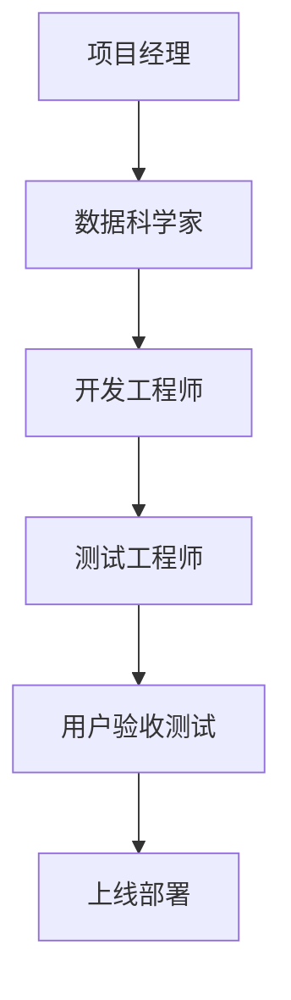
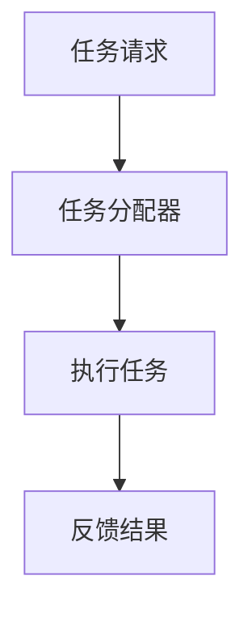
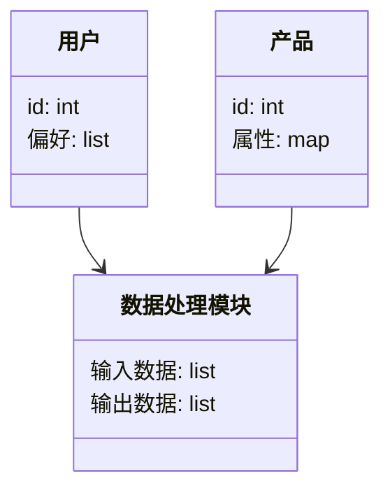
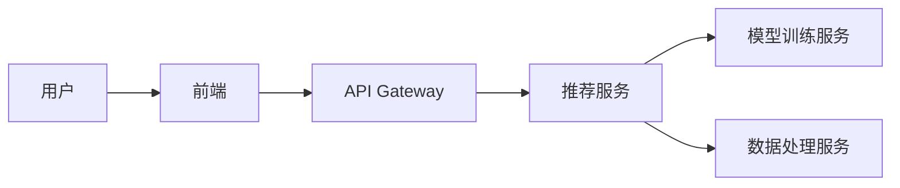
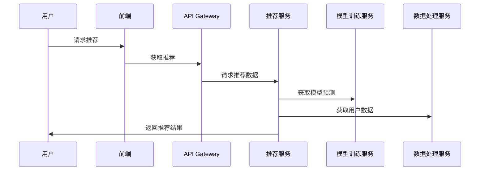

                 


# 组建高效AI开发团队的要点

> 关键词：AI开发团队，高效协作，团队管理，技术栈，系统架构，算法原理

> 摘要：本文详细探讨了组建高效AI开发团队的关键要点，从背景分析到系统架构设计，结合实际案例和最佳实践，为读者提供全面的指导。

---

# 第一部分：背景与核心概念

## 第1章：AI开发团队的现状与挑战

### 1.1 当前AI技术的发展趋势

AI技术近年来发展迅猛，特别是在机器学习、深度学习等领域取得了显著突破。企业对AI开发团队的需求日益增长，但如何高效地组建和管理AI团队成为一大挑战。

### 1.2 高效AI开发团队的重要性

高效团队能够显著提升开发效率和产品质量，特别是在复杂的AI项目中，团队协作至关重要。高效团队能够更好地应对技术难题和项目压力。

### 1.3 常见挑战

- **技术复杂性**：AI项目涉及大量算法实现和数据处理，技术难度较高。
- **团队协作**：角色分工不明确，可能导致效率低下。
- **资源管理**：合理分配资源是高效开发的关键。

---

## 第2章：高效AI团队的核心概念与联系

### 2.1 高效AI团队的核心要素

- **团队角色分工**：明确项目经理、数据科学家、开发工程师、测试工程师等角色的职责。
- **开发流程与规范**：制定统一的开发流程和代码规范，确保团队协作顺畅。
- **工具与技术栈**：选择适合的工具和技术，如Python、TensorFlow、PyTorch等。

### 2.2 团队协作机制

- **协作模式对比分析**：
  - 瀦式开发：适合小型项目，但效率可能不高。
  - 并行开发：适合大型项目，但需要良好的协调机制。
- **团队角色职责对比表**：
| 角色       | 职责描述                                                                 |
|------------|--------------------------------------------------------------------------|
| 项目经理    | 负责项目整体规划与进度管理                                                 |
| 数据科学家  | 负责数据处理与模型训练                                                     |
| 开发工程师  | 负责系统实现与代码编写                                                     |
| 测试工程师  | 负责测试用例设计与质量保障                                                 |
- **团队协作流程图**：


---

## 第3章：高效AI团队的算法原理与数学模型

### 3.1 任务分配算法

任务分配是团队协作中的关键问题，需要合理分配任务以最大化效率。常用的任务分配算法包括贪心算法和动态规划算法。

#### 3.1.1 任务分配算法实现

- **贪心算法**：按优先级分配任务，优先处理紧急且重要的任务。
- **动态规划算法**：通过动态规划优化任务分配，确保资源利用最大化。

#### 3.1.2 算法流程图



#### 3.1.3 算法实现代码

```python
def task_allocator(tasks, team_roles):
    allocated_tasks = {}
    for role in team_roles:
        for task in tasks:
            if task not in allocated_tasks and role_can_do_task(role, task):
                allocated_tasks[task] = role
                break
    return allocated_tasks
```

#### 3.1.4 数学模型与公式

任务分配的优先级计算公式：
$$
\text{优先级} = \frac{\text{紧急度} + \text{重要度}}{2}
$$

---

## 第4章：高效AI团队的系统架构设计

### 4.1 项目场景介绍

假设我们正在开发一个AI推荐系统，需要高效团队协作完成数据处理、模型训练、系统实现和测试上线。

### 4.2 系统功能设计

- **数据处理模块**：负责数据清洗和特征提取。
- **模型训练模块**：负责模型训练和调优。
- **系统实现模块**：负责API开发和前端实现。
- **测试模块**：负责单元测试和集成测试。

#### 4.2.1 领域模型类图



#### 4.2.2 系统架构图



#### 4.2.3 系统接口设计

- **API接口**：
  - GET /recommend?user_id=1
  - POST /train_model

#### 4.2.4 系统交互流程图



---

## 第5章：高效AI团队的项目实战

### 5.1 环境安装

安装必要的工具和库：
- Python 3.8+
- TensorFlow/PyTorch
- Jupyter Notebook
- Git

### 5.2 核心代码实现

#### 5.2.1 数据处理代码

```python
import pandas as pd

def load_data(file_path):
    data = pd.read_csv(file_path)
    return data

def preprocess_data(data):
    # 数据清洗和特征提取
    return processed_data
```

#### 5.2.2 模型训练代码

```python
import tensorflow as tf

def build_model(input_shape):
    model = tf.keras.Sequential()
    model.add(tf.keras.layers.Dense(64, activation='relu', input_shape=input_shape))
    model.add(tf.keras.layers.Dense(1, activation='sigmoid'))
    model.compile(optimizer='adam', loss='binary_crossentropy', metrics=['accuracy'])
    return model

model = build_model((input_dim,))
model.fit(X_train, y_train, epochs=10, batch_size=32)
```

#### 5.2.3 系统实现代码

```python
from flask import Flask, request, jsonify

app = Flask(__name__)

@app.route('/recommend', methods=['GET'])
def recommend():
    user_id = request.args.get('user_id')
    # 获取推荐结果
    return jsonify({'recommendations': [1, 2, 3]})

if __name__ == '__main__':
    app.run(debug=True)
```

### 5.3 代码应用解读

- **数据处理**：加载数据并进行预处理，确保数据适合模型训练。
- **模型训练**：构建神经网络模型并进行训练，优化模型性能。
- **系统实现**：开发API接口，提供推荐服务。

### 5.4 实际案例分析

以推荐系统为例，详细分析从需求分析到部署上线的整个过程，包括数据处理、模型训练、系统实现和测试优化。

---

## 第6章：高效AI团队的最佳实践

### 6.1 小结

- 明确团队角色分工。
- 制定高效的协作流程。
- 使用合适的工具和技术栈。

### 6.2 注意事项

- 避免过度复杂的流程设计。
- 定期进行代码审查和测试。
- 及时沟通和解决问题。

### 6.3 拓展阅读

- 《Effective Python》
- 《设计模式：可复用面向对象软件的基础》
- 《机器学习实战》

---

# 结语

组建高效AI开发团队需要综合考虑技术、协作和管理等多个方面。通过明确角色分工、优化协作流程和选择合适的工具，可以显著提升团队效率和项目质量。

---

# 作者

作者：AI天才研究院 & 禅与计算机程序设计艺术

