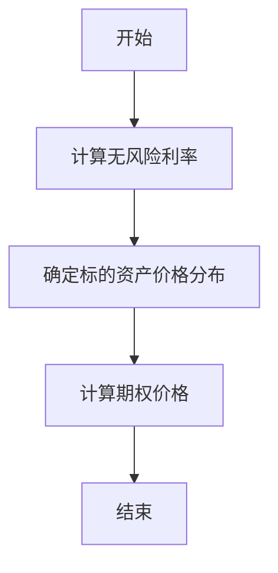
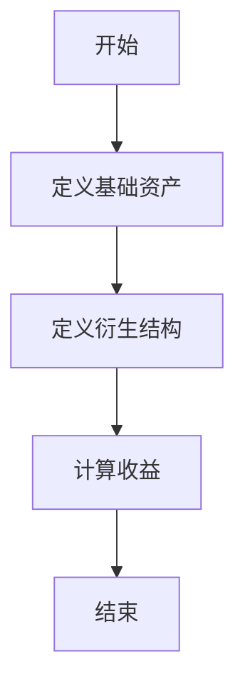

                 


# 结构性产品：定制化投资解决方案

> 关键词：结构性产品，定制化投资，金融衍生品，风险评估，收益优化

> 摘要：本文深入探讨结构性产品的定义、核心概念、数学模型、系统架构及实际应用。通过逐步分析，帮助读者理解结构性产品在投资中的作用，并提供实际案例和代码示例，以实现定制化投资解决方案。

---

## 第一部分: 结构性产品的基本概念与背景

### 第1章: 结构性产品的定义与背景

#### 1.1 结构性产品的定义与特点

结构性产品是一种结合了金融衍生品和固定收益工具的复杂投资工具。它通过将标的资产的价格波动与衍生品的收益结构相结合，为投资者提供多样化的收益可能性。结构性产品的核心特点包括：

- **收益依赖性**：收益直接依赖于挂钩资产的表现。
- **期限性**：通常具有固定的期限，到期后按约定条件结算。
- **风险可控性**：通过结构化设计，可以将风险限制在可接受范围内。

#### 1.2 结构性产品的分类

结构性产品可以根据多种标准进行分类：

- **按收益结构分类**：固定收益、浮动收益、零息收益等。
- **按挂钩资产分类**：股票、债券、指数、商品等。
- **按发行市场分类**：场内交易和场外交易。

#### 1.3 结构性产品的优势与劣势

- **优势**：
  - **风险可控**：通过结构化设计，投资者可以在承担有限风险的情况下获得潜在收益。
  - **收益多样化**：适合不同风险偏好和收益目标的投资者。
- **劣势**：
  - **复杂性高**：结构性产品涉及复杂的金融工具和风险因素。
  - **流动性差**：通常缺乏二级市场流动性，变现能力有限。

#### 1.4 结构性产品的应用场景

- **风险管理**：通过结构性产品对冲市场风险或信用风险。
- **投资收益优化**：在特定市场条件下获得超额收益。
- **资产配置**：作为资产组合的一部分，平衡风险和收益。

---

### 第2章: 结构性产品的核心概念与原理

#### 2.1 结构性产品的基本组成要素

- **标的资产**：结构性产品价值的决定因素，如股票、债券、指数等。
- **衍生品结构**：通过期权、互换等衍生工具设计收益结构。
- **期限与收益结构**：产品的期限决定了收益的计算方式和结算时间。

#### 2.2 结构性产品的定价模型

- **Black-Scholes模型**：用于期权定价的基础模型，公式如下：
  $$C = S_0 N(d_1) - K e^{-rT} N(d_2)$$
  其中，$S_0$是标的资产价格，$K$是行权价，$r$是无风险利率，$T$是期限，$N(d)$是标准正态分布的累积分布函数。

- **风险中性定价原理**：在风险中性假设下，资产的预期收益等于无风险利率。这种定价方法适用于结构性产品的定价。

- **信用风险定价**：考虑发行方的信用风险，通过信用违约模型进行定价。

#### 2.3 结构性产品的风险评估

- **市场风险**：由于标的资产价格波动带来的收益不确定性。
- **信用风险**：发行人或交易对手的信用违约风险。
- **操作风险**：交易、结算和系统操作中的潜在风险。

---

### 第3章: 结构性产品的数学模型与算法原理

#### 3.1 期权定价的数学模型

- **Black-Scholes公式**：用于定价欧式期权，公式如上所述。
- **蒙特卡洛模拟**：用于模拟标的资产价格的可能路径，计算期权的期望值。

#### 3.2 风险中性定价的算法流程



#### 3.3 结构性产品收益结构的模拟算法



---

### 第4章: 结构性产品的系统分析与架构设计

#### 4.1 系统功能设计

- **用户需求分析**：投资者需要根据自身风险承受能力和收益目标选择合适的结构性产品。
- **系统功能模块划分**：
  - 用户界面：输入参数、查看产品信息、下单交易。
  - 后台计算：实时计算产品价值，处理订单。
  - 风险评估：评估产品风险，生成风险报告。
- **领域模型设计**：
  ```mermaid
  classDiagram
      class 结构性产品 {
          标的资产
          衍生结构
          期限
          收益
      }
      class 投资者 {
          风险承受能力
          收益目标
      }
      结构性产品 --> 投资者
  ```

#### 4.2 系统架构设计

- **系统架构图**：
  ```mermaid
  graph TD
      A[投资者] --> B[前端]
      B --> C[后端]
      C --> D[数据库]
  ```

- **系统交互流程**：
  ```mermaid
  sequenceDiagram
      participant 投资者
      participant 系统
      投资者 -> 系统: 提交订单
      系统 -> 数据库: 查询产品信息
      系统 -> 投资者: 返回确认信息
  ```

---

## 第二部分: 结构性产品的系统实现与应用

### 第5章: 系统实现与项目实战

#### 5.1 环境安装

- **Python环境**：安装Python 3.8及以上版本。
- **开发工具**：建议使用Jupyter Notebook或PyCharm。
- **依赖库安装**：
  ```bash
  pip install numpy pandas matplotlib scipy
  ```

#### 5.2 核心实现代码

- **Black-Scholes模型实现**：
  ```python
  import numpy as np
  from scipy.stats import norm

  def black_scholes(S, K, r, T, sigma):
      d1 = (np.log(S/K) + r*T + 0.5*sigma**2*T) / (sigma*np.sqrt(T))
      d2 = d1 - sigma*np.sqrt(T)
      call_price = S * norm.cdf(d1) - K * np.exp(-r*T) * norm.cdf(d2)
      return call_price

  # 示例
  S = 100
  K = 105
  r = 0.05
  T = 1
  sigma = 0.2
  print(black_scholes(S, K, r, T, sigma))
  ```

#### 5.3 案例分析与代码解读

- **案例分析**：假设一位投资者希望对冲持有的股票组合的下行风险，选择购买一个看跌期权嵌入的结构性产品。
- **代码解读**：上述代码计算了欧式看跌期权的价值，帮助投资者评估潜在收益。

#### 5.4 项目小结

通过实际案例分析，读者可以理解结构性产品的实际应用和系统实现过程。代码示例展示了如何使用Black-Scholes模型进行期权定价，帮助投资者做出明智的投资决策。

---

## 第三部分: 结构性产品的最佳实践

### 第6章: 最佳实践与总结

#### 6.1 小结

结构性产品为投资者提供了多样化的投资选择，但其复杂性和风险需要投资者具备一定的金融知识和风险意识。

#### 6.2 注意事项

- **充分了解产品结构**：确保理解产品的挂钩资产、收益结构和潜在风险。
- **选择可靠发行方**：优先选择信誉良好的金融机构发行的结构性产品。
- **定期评估投资组合**：根据市场变化和个人财务状况，定期评估和调整投资组合。

#### 6.3 拓展阅读

- 建议阅读《金融工程导论》和《期权、期货和其他衍生品》等书籍，以深入了解结构性产品的理论基础和实际应用。

---

## 作者

作者：AI天才研究院/AI Genius Institute & 禅与计算机程序设计艺术 /Zen And The Art of Computer Programming

---

通过以上结构和内容，文章详细介绍了结构性产品的核心概念、数学模型、系统架构及实际应用，帮助读者全面理解并掌握结构性产品的定制化投资解决方案。

