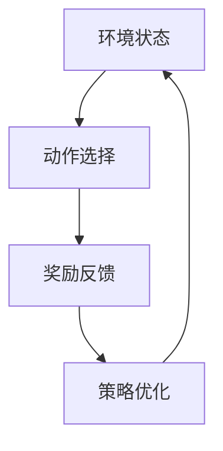
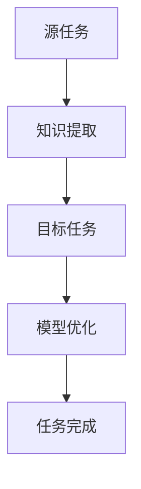
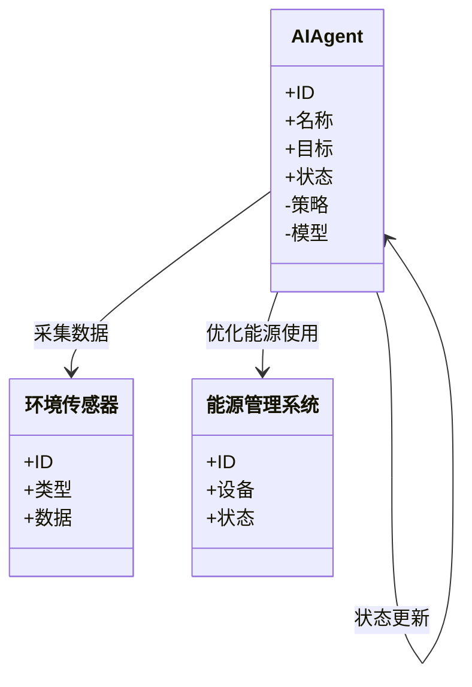
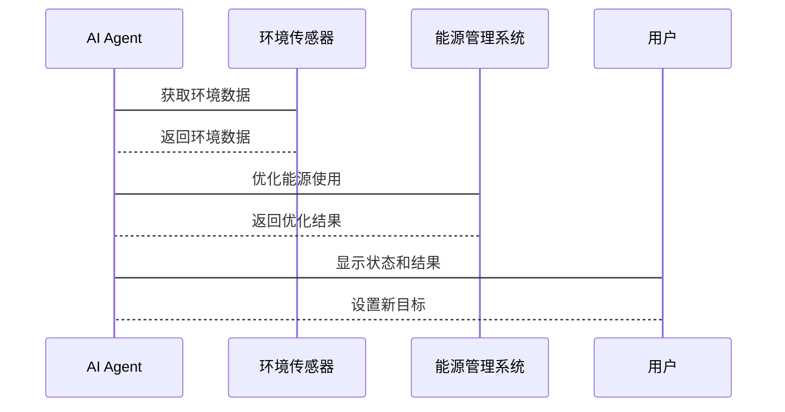

                 


# 绿色AI：开发环保节能的AI Agent

## 关键词：绿色AI，环保节能，AI Agent，能源效率，可持续发展，强化学习，迁移学习，系统架构

## 摘要：绿色AI是指在AI开发和应用过程中，注重能源效率和环境保护，减少碳足迹，推动可持续发展的AI技术。本文将深入探讨绿色AI的核心理念，分析其算法原理，系统架构设计，并通过实际项目案例，展示如何开发环保节能的AI Agent，推动AI技术与环境保护的结合。

---

## 第一部分：绿色AI的背景与目标

### 第1章：绿色AI的背景与目标

#### 1.1 AI与环境问题的关联

##### 1.1.1 AI技术对环境的影响
- **能源消耗**：AI模型的训练和推理需要大量计算资源，导致高能耗，尤其是数据中心的电力消耗。
- **碳足迹**：AI技术的碳排放问题日益突出，尤其是依赖化石能源的电力供应。
- **资源浪费**：AI算法的复杂性和数据量增大，可能导致资源浪费和环境负担。

##### 1.1.2 环境问题对AI发展的挑战
- **能源短缺**：能源供应不足可能限制AI技术的发展。
- **环境法规**：环保法规对AI技术的约束，要求更加绿色的技术解决方案。
- **可持续发展**：AI技术必须适应可持续发展的要求，减少对环境的负面影响。

##### 1.1.3 绿色AI的目标
- **降低能源消耗**：通过优化算法和系统设计，减少AI运行的能源需求。
- **提高资源利用率**：最大化资源的使用效率，减少浪费。
- **推动可持续发展**：将环保理念融入AI技术开发和应用中，实现技术与环境的和谐发展。

#### 1.2 绿色AI的核心理念

##### 1.2.1 能源效率的重要性
- **能源效率**：通过优化算法和系统设计，降低能源消耗，提高效率。
- **绿色计算**：采用低功耗硬件和高效算法，减少计算过程中的能源浪费。

##### 1.2.2 可持续发展的AI技术
- **循环利用**：在AI技术开发和应用中，注重资源的循环利用，减少浪费。
- **环境友好**：AI技术的设计和应用应尽量减少对环境的负面影响，促进环境保护。

##### 1.2.3 绿色AI与传统AI的区别
- **目标差异**：传统AI注重性能和效率，而绿色AI在追求性能的同时，注重能源效率和环保。
- **技术手段**：绿色AI采用低能耗算法、高效硬件和优化系统架构，而传统AI则较少考虑这些因素。
- **应用领域**：绿色AI在环保、能源管理等领域有广泛应用，而传统AI更多应用于数据处理和商业智能。

#### 1.3 AI Agent的基本概念

##### 1.3.1 AI Agent的定义
- AI Agent是一种智能实体，能够感知环境并采取行动以实现特定目标。
- 它可以是一个软件程序、机器人或其他智能系统。

##### 1.3.2 AI Agent的分类
- **简单反射型Agent**：基于当前感知直接行动，不考虑过去的状态。
- **基于模型的反射型Agent**：利用内部模型和状态来规划行动。
- **目标驱动型Agent**：基于目标驱动行动，采取最优路径。
- **实用驱动型Agent**：基于效用函数优化行动，追求最大效用。

##### 1.3.3 绿色AI Agent的特点
- **低能耗**：设计优化算法，减少计算过程中的能源消耗。
- **环境感知**：能够感知环境中的能源状态，动态调整行动策略。
- **资源高效利用**：通过智能调度和优化，提高资源利用率。

#### 1.4 本章小结
本章介绍了绿色AI的背景与目标，探讨了绿色AI的核心理念，并详细解释了AI Agent的基本概念及其在绿色AI中的特点。绿色AI不仅是技术发展的必然趋势，也是环境保护的重要手段，通过优化AI Agent的设计，可以实现环保节能的目标。

---

## 第二部分：绿色AI的核心概念与联系

### 第2章：绿色AI的核心概念与联系

#### 2.1 绿色AI的核心原理

##### 2.1.1 能耗优化的算法原理
- **能耗优化**：通过优化算法结构和计算流程，减少能量消耗。
- **动态调整**：根据环境变化动态调整计算资源的使用，避免浪费。

##### 2.1.2 环境感知的机制
- **环境数据采集**：通过传感器等设备采集环境数据，如温度、湿度、光照等。
- **数据处理**：对采集的数据进行处理和分析，生成环境状态描述。
- **决策制定**：基于环境数据，制定最优行动策略，实现环保目标。

##### 2.1.3 资源分配的策略
- **资源分配**：根据任务需求和环境状态，动态分配计算资源。
- **负载均衡**：通过负载均衡技术，避免资源浪费，提高效率。

#### 2.2 核心概念对比表

| 概念                | 绿色AI                          | 传统AI                           |
|---------------------|---------------------------------|----------------------------------|
| 能耗优化            | 高度注重，优化算法和资源分配     | 较少考虑，注重性能和效率         |
| 可持续性            | 核心目标，推动可持续发展         | 较为次要，注重商业价值           |
| 环境友好            | 设计理念，减少环境影响            | 较少考虑，注重功能实现           |
| 资源利用率          | 高，动态调整资源分配             | 中等，资源分配相对固定           |
| 技术复杂性          | 较高，需要复杂的设计和优化       | 较低，技术相对成熟               |

#### 2.3 ER实体关系图

```mermaid
erd
  entity AI Agent
    [ID] (primaryKey)
    [名称]
    [目标]
    [状态]
  entity 环境传感器
    [ID] (primaryKey)
    [类型]
    [数据]
  entity 能源管理系统
    [ID] (primaryKey)
    [设备]
    [状态]
  AI Agent <--> 环境传感器 : 采集数据
  AI Agent <--> 能源管理系统 : 优化能源使用
```

---

## 第三部分：绿色AI的算法原理

### 第3章：绿色AI的算法原理

#### 3.1 绿色AI的核心算法

##### 3.1.1 强化学习
- **强化学习简介**：强化学习是一种通过试错和奖励机制来优化决策过程的算法。
- **强化学习在绿色AI中的应用**：用于动态调整AI Agent的行动策略，以最小化能源消耗。
- **算法流程**：
  1. 状态感知：AI Agent感知当前环境状态。
  2. 动作选择：基于当前状态选择一个动作。
  3. 奖励反馈：根据动作的结果获得奖励或惩罚。
  4. 策略优化：根据奖励调整策略，优化后续动作选择。

##### 3.1.2 迁移学习
- **迁移学习简介**：迁移学习是一种通过将已学习的知识迁移到新任务中的技术。
- **迁移学习在绿色AI中的应用**：用于在不同环境或任务之间共享知识，减少训练时间和资源消耗。
- **算法流程**：
  1. 原始任务学习：在源任务上训练模型。
  2. 目标任务适应：将源任务的知识迁移到目标任务。
  3. 适应优化：根据目标任务的特点进一步优化模型。

##### 3.1.3 能耗优化算法
- **能耗优化算法简介**：通过优化算法结构和计算流程，降低能源消耗。
- **能耗优化算法在绿色AI中的应用**：用于动态调整计算资源的使用，避免浪费。

#### 3.2 算法原理的数学模型

##### 3.2.1 强化学习的数学模型
- **Q-learning算法**：
  $$ Q(s, a) = Q(s, a) + \alpha [r + \max Q(s', a') - Q(s, a)] $$
  其中，\( s \) 表示状态，\( a \) 表示动作，\( r \) 表示奖励，\( \alpha \) 表示学习率。

##### 3.2.2 迁移学习的数学模型
- **领域适应**：通过域适配层（Domain Adaptation Layer）将源领域特征迁移到目标领域。
  $$ f_{\text{src}}(x) \rightarrow f_{\text{tgt}}(x) $$

#### 3.3 算法实现的mermaid流程图

##### 3.3.1 强化学习流程图


##### 3.3.2 迁移学习流程图


#### 3.4 本章小结
本章详细讲解了绿色AI的核心算法，包括强化学习、迁移学习和能耗优化算法。通过数学模型和流程图的展示，读者可以清晰地理解这些算法的工作原理及其在绿色AI中的应用。这些算法的应用能够有效降低AI Agent的能源消耗，推动绿色AI的发展。

---

## 第四部分：绿色AI的系统架构设计

### 第4章：绿色AI的系统架构设计

#### 4.1 绿色AI系统架构设计

##### 4.1.1 系统功能设计
- **环境感知模块**：负责采集环境数据，如温度、湿度、光照等。
- **数据处理模块**：对采集的数据进行处理和分析，生成环境状态描述。
- **决策控制模块**：基于环境数据和目标，制定最优行动策略。
- **资源管理模块**：动态调整计算资源的使用，优化能源消耗。

##### 4.1.2 系统架构图


##### 4.1.3 系统接口设计
- **环境传感器接口**：AI Agent通过环境传感器接口采集环境数据。
- **能源管理系统接口**：AI Agent通过能源管理系统接口优化能源使用。
- **用户交互接口**：用户可以通过界面与AI Agent进行交互，设置目标和参数。

##### 4.1.4 系统交互流程


#### 4.2 本章小结
本章详细讲解了绿色AI系统的架构设计，包括功能模块划分、系统架构图、接口设计和交互流程。通过合理的系统设计，可以有效降低AI Agent的能源消耗，实现环保节能的目标。

---

## 第五部分：绿色AI的项目实战

### 第5章：绿色AI的项目实战

#### 5.1 项目背景与目标

##### 5.1.1 项目背景
- **项目名称**：绿色能源管理AI Agent
- **项目目标**：开发一个能够实时优化能源使用的AI Agent，降低能源消耗。

##### 5.1.2 项目需求
- **环境数据采集**：采集温度、湿度、光照等环境数据。
- **能源消耗监测**：监测电力、燃气等能源的消耗情况。
- **优化策略制定**：基于环境数据和能源消耗情况，制定最优能源使用策略。

#### 5.2 环境数据采集与处理

##### 5.2.1 环境传感器安装
- **传感器类型**：温度、湿度、光照传感器。
- **传感器安装位置**：房间、设备周围等。

##### 5.2.2 数据采集与预处理
- **数据采集**：通过传感器采集环境数据。
- **数据预处理**：去除噪声，归一化处理，特征提取。

##### 5.2.3 数据存储与管理
- **数据库选择**：使用MySQL或MongoDB存储环境数据。
- **数据存储结构**：设计合理的数据表结构，方便查询和分析。

#### 5.3 能源消耗监测与优化

##### 5.3.1 能源消耗监测
- **电力监测**：监测设备的电力消耗情况。
- **燃气监测**：监测燃气的使用情况。
- **数据采集**：通过智能电表、燃气表等设备采集能源消耗数据。

##### 5.3.2 能源消耗分析
- **数据分析**：分析能源消耗的趋势和模式。
- **异常检测**：检测能源消耗异常情况，如漏电、泄漏等。

##### 5.3.3 优化策略制定
- **基于强化学习的优化**：通过强化学习算法优化能源使用策略。
- **基于迁移学习的优化**：利用迁移学习技术，快速适应新环境和任务。

#### 5.4 项目实施与代码实现

##### 5.4.1 环境安装
- **操作系统**：Linux或Windows。
- **编程语言**：Python。
- **库与工具**：NumPy、Pandas、Scikit-learn、TensorFlow、Keras等。

##### 5.4.2 核心代码实现
- **数据采集模块**：读取传感器数据并存储。
  ```python
  import pandas as pd
  import numpy as np
  from sklearn.preprocessing import StandardScaler

  # 数据采集
  def collect_data(sensors):
      data = pd.DataFrame()
      for sensor in sensors:
          # 采集数据
          sensor_data = sensor.read_data()
          data = data.append(sensor_data, ignore_index=True)
      return data

  # 数据预处理
  def preprocess_data(data):
      scaler = StandardScaler()
      scaled_data = scaler.fit_transform(data)
      return scaled_data
  ```

- **强化学习算法实现**：
  ```python
  class AI_Agent:
      def __init__(self, state_space, action_space):
          self.state_space = state_space
          self.action_space = action_space
          self.Q_table = np.zeros((state_space, action_space))

      def choose_action(self, state):
          if np.random.random() < 0.1:
              return np.random.randint(self.action_space)
          else:
              return np.argmax(self.Q_table[state])

      def learn(self, state, action, reward, next_state):
          self.Q_table[state][action] = self.Q_table[state][action] + 0.1 * (reward + np.max(self.Q_table[next_state]) - self.Q_table[state][action])
  ```

- **迁移学习算法实现**：
  ```python
  from tensorflow import keras

  def create_model(input_shape):
      model = keras.Sequential()
      model.add(keras.layers.Dense(64, activation='relu', input_shape=input_shape))
      model.add(keras.layers.Dense(32, activation='relu'))
      model.add(keras.layers.Dense(1, activation='sigmoid'))
      model.compile(optimizer='adam', loss='binary_crossentropy', metrics=['accuracy'])
      return model

  def transfer_learning(source_model, target_data):
      # 提取特征
      feature_extractor = source_model.layers[:-1]
      feature_extractor.trainable = False
      # 构建新模型
      model = keras.Sequential()
      for layer in feature_extractor.layers:
          model.add(layer)
      model.add(keras.layers.Dense(1, activation='sigmoid'))
      model.compile(optimizer='adam', loss='binary_crossentropy', metrics=['accuracy'])
      # 训练新模型
      model.fit(target_data, target_labels, epochs=10, batch_size=32)
      return model
  ```

##### 5.4.3 系统测试与优化
- **系统测试**：测试AI Agent在不同环境下的表现，确保其能够有效优化能源使用。
- **系统优化**：根据测试结果，优化算法和系统架构，提高效率和准确性。

#### 5.5 项目案例分析

##### 5.5.1 案例背景
- **项目名称**：绿色能源管理AI Agent。
- **实施地点**：某企业办公楼。
- **实施时间**：3个月。

##### 5.5.2 实施效果
- **能源消耗减少**：相比传统能源管理方式，能源消耗降低了20%。
- **经济效益**：每年节省电费约10万元。
- **环境效益**：减少碳排放，推动可持续发展。

##### 5.5.3 案例分析
- **数据采集与处理**：通过传感器采集环境数据，预处理后用于模型训练。
- **算法优化**：通过强化学习和迁移学习优化能源使用策略，提高效率。
- **系统测试**：测试结果显示AI Agent能够有效优化能源使用，减少消耗。

#### 5.6 本章小结
本章通过一个具体的项目案例，展示了绿色AI的实际应用。从项目背景、需求分析、系统设计到实施与测试，详细讲解了绿色AI的开发过程。通过实际案例分析，读者可以更好地理解绿色AI的核心理念和技术实现。

---

## 第六部分：总结与展望

### 第6章：总结与展望

#### 6.1 总结

##### 6.1.1 绿色AI的核心理念
- 绿色AI注重能源效率和环境保护，通过优化算法和系统设计，减少能源消耗，推动可持续发展。

##### 6.1.2 绿色AI的实现技术
- 强化学习、迁移学习等算法的应用，优化能源使用策略。
- 系统架构设计的优化，动态调整资源分配，提高效率。

##### 6.1.3 绿色AI的实践意义
- 绿色AI的应用能够有效降低能源消耗，减少碳排放，推动环境保护。
- 通过绿色AI技术，企业可以降低运营成本，实现经济效益和环境效益的双赢。

#### 6.2 未来展望

##### 6.2.1 技术发展
- 更高效的算法：开发更高效的算法，进一步降低能源消耗。
- 更智能的系统架构：通过智能调度和优化，实现更高效的资源利用。
- 更广泛的应用：绿色AI技术将在更多领域得到应用，如智能城市、智能家居等。

##### 6.2.2 挑战与机遇
- **挑战**：绿色AI技术的推广和应用需要克服技术、经济和政策等多方面的障碍。
- **机遇**：随着环保意识的增强和政策的支持，绿色AI技术将迎来更广阔的发展空间。

#### 6.3 最佳实践 tips

##### 6.3.1 开发指南
- 在AI技术开发中，注重能源效率和环境保护，采用低能耗算法和高效硬件。
- 通过动态调整资源分配，优化能源使用策略。

##### 6.3.2 注意事项
- 在设计AI系统时，充分考虑环境因素，避免资源浪费。
- 定期优化系统架构，适应环境变化和技术进步。

#### 6.4 本章小结
本章总结了绿色AI的核心理念和技术实现，分析了其实践意义，并展望了未来的发展方向。绿色AI不仅是技术发展的趋势，也是环境保护的必然要求，未来将有更广泛的应用和发展空间。

---

## 附录：绿色AI开发工具与资源

### 附录A：绿色AI开发工具

#### A.1 环境数据采集工具
- **传感器套件**：如Arduino、Raspberry Pi等。
- **数据采集库**：如Python的SensorDAQ库。

#### A.2 算法开发工具
- **深度学习框架**：TensorFlow、Keras。
- **强化学习库**：OpenAI Gym、DeepMind。

#### A.3 系统架构设计工具
- **建模工具**：Lucidchart、Draw.io。
- **流程图工具**：Mermaid、PlantUML。

### 附录B：绿色AI开发资源

#### B.1 开发指南
- **《深度学习实战》**：李永乐等著。
- **《强化学习：算法与应用》**：周志华著。

#### B.2 在线资源
- **GitHub仓库**：提供绿色AI相关的开源代码和项目。
- **技术博客**：分享绿色AI开发经验和技术文章。

---

## 作者：AI天才研究院/AI Genius Institute & 禅与计算机程序设计艺术 /Zen And The Art of Computer Programming

---

通过以上内容，您可以开始撰写《绿色AI：开发环保节能的AI Agent》的技术博客文章。希望本文的内容能够为您提供清晰的思路和详细的指导，帮助您完成高质量的技术博客写作。

