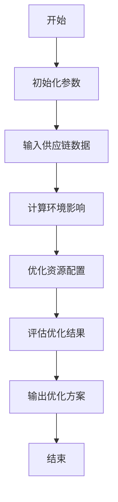
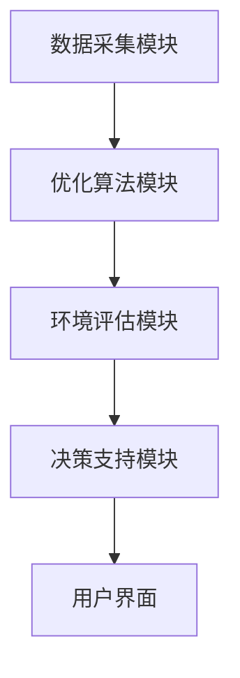

                 


# 绿色供应链管理对公司竞争力的影响

> 关键词：绿色供应链管理、企业竞争力、可持续发展、供应链优化、环境保护、成本效益、技术创新

> 摘要：绿色供应链管理不仅是企业实现可持续发展的重要手段，更是提升企业核心竞争力的关键策略。本文将从绿色供应链管理的背景、核心概念、算法原理、系统架构设计、项目实战等方面进行深入分析，探讨绿色供应链管理如何对企业竞争力产生深远影响。文章内容丰富，涵盖绿色供应链管理的系统性、协同性、可持续性等核心要素，以及如何通过算法优化和系统架构设计来实现绿色供应链管理的目标。

---

## 第一部分：绿色供应链管理的背景与现状

### 第1章：绿色供应链管理的背景与现状

#### 1.1 绿色供应链管理的定义与核心概念

绿色供应链管理（Green Supply Chain Management，GSCM）是指在供应链的各个环节中，从原材料采购、生产、物流、销售到回收的全生命周期中，融入环境保护的理念，通过优化资源利用、减少污染、降低碳排放等方式，实现供应链的绿色化和可持续发展。

**1.1.1 绿色供应链管理的定义**  
绿色供应链管理是一种以环境保护为核心，通过优化供应链各环节的资源利用效率，减少对环境的负面影响，从而实现企业可持续发展的管理模式。它不仅关注经济效益，还强调生态效益和社会责任。

**1.1.2 绿色供应链管理的核心要素**  
绿色供应链管理的核心要素包括：  
1. 绿色采购：选择环保原材料供应商，确保供应链上游环节的绿色化。  
2. 绿色生产：采用节能技术和环保生产方式，减少资源消耗和污染排放。  
3. 绿色物流：优化物流网络，使用新能源车辆，减少运输过程中的碳排放。  
4. 绿色回收：建立产品回收机制，实现资源的循环利用。  

**1.1.3 绿色供应链管理的边界与外延**  
绿色供应链管理的边界主要集中在企业的供应链上下游，包括供应商、制造商、分销商和消费者。其外延则延伸至整个生态系统的可持续发展，包括能源、资源、环境和社会责任等方面。

#### 1.2 绿色供应链管理的背景与发展趋势

**1.2.1 全球可持续发展的背景**  
随着全球气候变化、资源枯竭和环境污染等问题的加剧，企业和社会对绿色发展的需求日益迫切。绿色供应链管理作为一种新兴的管理模式，成为企业实现可持续发展的重要途径。

**1.2.2 绿色供应链管理的发展历程**  
绿色供应链管理的概念起源于20世纪90年代，随着环保意识的增强和可持续发展理念的兴起，逐渐从理论研究走向实际应用。近年来，随着技术的进步和政策的推动，绿色供应链管理在全球范围内得到了快速发展。

**1.2.3 当前绿色供应链管理的全球趋势**  
当前，绿色供应链管理已成为全球企业竞争的重要领域。越来越多的企业开始重视绿色供应链管理，通过优化供应链的绿色化水平来提升自身的市场竞争力。同时，政府和社会组织也通过政策支持和行业标准的制定，推动绿色供应链管理的普及。

#### 1.3 绿色供应链管理对企业竞争力的影响

**1.3.1 绿色供应链管理对企业成本的影响**  
绿色供应链管理通过优化资源利用和减少浪费，可以降低企业的运营成本。例如，采用节能技术和循环经济模式可以减少能源消耗和原材料浪费，从而降低生产成本。

**1.3.2 绿色供应链管理对企业品牌形象的影响**  
绿色供应链管理有助于提升企业的品牌形象和社会责任感。通过减少环境影响和推动可持续发展，企业可以赢得消费者和利益相关者的信任，从而增强品牌竞争力。

**1.3.3 绿色供应链管理对企业市场竞争力的影响**  
在市场竞争日益激烈的今天，绿色供应链管理已成为企业差异化竞争的重要手段。通过绿色供应链管理，企业可以提高产品附加值，满足消费者对环保产品的需求，从而在市场中占据更大的份额。

#### 1.4 绿色供应链管理对行业的影响

**1.4.1 绿色供应链管理对传统供应链的颠覆**  
绿色供应链管理颠覆了传统的供应链管理模式，通过引入环保理念和技术，优化供应链的各个环节，推动供应链从线性模式向循环模式转变。

**1.4.2 绿色供应链管理对行业生态的影响**  
绿色供应链管理不仅改变了企业的供应链管理方式，还对整个行业生态产生了深远影响。通过推动行业上下游的绿色化，绿色供应链管理促进了产业链的协同创新和共同发展。

**1.4.3 绿色供应链管理对全球产业格局的影响**  
绿色供应链管理正在重塑全球产业格局。随着绿色供应链管理的普及，那些能够快速适应绿色供应链管理模式的企业将在全球市场中占据更有利的位置，而无法适应的企业则可能被淘汰。

---

## 第二部分：绿色供应链管理的核心概念与联系

### 第2章：绿色供应链管理的核心概念与联系

#### 2.1 绿色供应链管理的核心概念

**2.1.1 绿色供应链管理的系统性**  
绿色供应链管理是一个复杂的系统工程，涉及企业内外部的多个环节和利益相关者。它需要从系统整体的角度出发，优化供应链的各个部分，以实现绿色化的目标。

**2.1.2 绿色供应链管理的协同性**  
绿色供应链管理强调供应链上下游之间的协同合作。通过与供应商、客户和合作伙伴的紧密合作，企业可以共同优化供应链的绿色化水平，实现资源共享和利益共赢。

**2.1.3 绿色供应链管理的可持续性**  
绿色供应链管理的核心目标是实现可持续发展。通过减少资源消耗和环境污染，绿色供应链管理不仅能够满足当前的需求，还能为未来的可持续发展奠定基础。

#### 2.2 绿色供应链管理的核心要素对比

**2.2.1 传统供应链与绿色供应链的对比**  
| **要素**         | **传统供应链**                          | **绿色供应链**                          |
|--------------------|-----------------------------------------|-----------------------------------------|
| 环节              | 采购、生产、物流、销售                  | 采购、生产、物流、销售、回收            |
| 资源利用          | 资源消耗较高，重复利用较少              | 资源消耗较低，循环利用较多              |
| 环境影响          | 环境污染严重，碳排放较高                | 环境污染较低，碳排放较低                |
| 社会责任          | 社会责任意识较弱                        | 社会责任意识较强                        |

**2.2.2 绿色供应链管理的属性特征对比**  
| **属性**         | **传统供应链**                          | **绿色供应链**                          |
|--------------------|-----------------------------------------|-----------------------------------------|
| 环保性            | 低                                       | 高                                       |
| 资源效率          | 低                                       | 高                                       |
| 可持续性          | 低                                       | 高                                       |
| 成本效益          | 高（短期）                              | 中（长期）                              |

**2.2.3 绿色供应链管理的ER实体关系图**  
```mermaid
er
    %% 绿色供应链管理的ER实体关系图
    rectangle 企业 {
        统一社会信用代码
        企业名称
        法人代表
    }
    rectangle 供应商 {
        供应商编号
        供应商名称
        供应商地址
    }
    rectangle 产品 {
        产品编号
        产品名称
        产品规格
    }
    rectangle 环境数据 {
        数据编号
        数据类型
        数据值
    }
    rectangle 绿色认证 {
        认证编号
        认证类型
        认证状态
    }
    企业 --> 供应商: 采购原材料
    企业 --> 产品: 生产产品
    产品 --> 环境数据: 采集环境数据
    环境数据 --> 绿色认证: 生成绿色认证
```

---

## 第三部分：绿色供应链管理的算法原理

### 第3章：绿色供应链管理的算法原理

#### 3.1 绿色供应链管理的算法概述

绿色供应链管理的算法主要集中在优化供应链的绿色化水平和提高资源利用效率方面。常见的算法包括遗传算法、粒子群优化算法、模拟退火算法等。

**3.1.1 绿色供应链管理的算法分类**  
绿色供应链管理的算法可以分为以下几类：  
1. **优化算法**：如遗传算法、粒子群优化算法，用于优化供应链的资源配置和流程。  
2. **预测算法**：如时间序列分析、机器学习算法，用于预测供应链的需求和风险。  
3. **评估算法**：如生命周期评估模型，用于评估供应链的环境影响。

**3.1.2 绿色供应链管理的算法特点**  
绿色供应链管理的算法具有以下特点：  
1. **多目标优化**：需要同时优化环境效益和经济效益。  
2. **动态性**：供应链环境复杂多变，算法需要具备良好的适应性。  
3. **可扩展性**：能够适用于不同规模和复杂度的供应链。

#### 3.2 绿色供应链管理的算法流程图

以下是一个典型的绿色供应链管理算法流程图：



#### 3.3 绿色供应链管理的算法实现

以下是一个基于遗传算法的绿色供应链优化算法的Python实现示例：

```python
def green_supply_chain_optimization():
    # 初始化参数
    population_size = 100
    max_iterations = 100
    crossover_rate = 0.8
    mutation_rate = 0.01

    # 初始化种群
    population = initialize_population(population_size)

    # 迭代优化
    for _ in range(max_iterations):
        # 计算适应度
        fitness = calculate_fitness(population)
        # 选择优秀个体
        selected = selection(population, fitness)
        # 交叉和变异
        new_population = crossover(selected, crossover_rate)
        new_population = mutation(new_population, mutation_rate)
        # 更新种群
        population = new_population

    # 输出最优解
    best_solution = get_best_solution(population)
    return best_solution

# 示例函数：计算适应度
def calculate_fitness(individual):
    # 计算环境影响和成本
    environmental_impact = sum(individual['impact'])
    cost = sum(individual['cost'])
    # 返回适应度值
    return - (environmental_impact + cost)
```

---

## 第四部分：绿色供应链管理的数学模型与公式

### 第4章：绿色供应链管理的数学模型与公式

#### 4.1 绿色供应链管理的数学模型

绿色供应链管理的数学模型主要用于评估供应链的环境影响和优化资源配置。以下是两个常用的数学模型：

**4.1.1 环境影响评估模型**  
环境影响评估模型用于评估供应链各环节对环境的影响，公式如下：  
$$ I = \sum_{i=1}^{n} (w_i \cdot E_i) $$  
其中，$I$ 表示总的环境影响，$w_i$ 表示第 $i$ 个环节的权重，$E_i$ 表示第 $i$ 个环节的环境影响值。

**4.1.2 资源消耗优化模型**  
资源消耗优化模型用于优化供应链的资源利用效率，公式如下：  
$$ R = \sum_{j=1}^{m} (c_j \cdot x_j) $$  
其中，$R$ 表示总的资源消耗，$c_j$ 表示第 $j$ 种资源的单位成本，$x_j$ 表示第 $j$ 种资源的使用量。

#### 4.2 绿色供应链管理的数学公式

**4.2.1 环境影响评估公式**  
$$ E_{total} = \sum_{k=1}^{K} (E_{source} \cdot E_{process}) $$  
其中，$E_{total}$ 表示总的环境影响，$E_{source}$ 表示原材料的环境影响，$E_{process}$ 表示生产过程的环境影响。

**4.2.2 资源消耗优化公式**  
$$ \min \sum_{l=1}^{L} (c_l \cdot x_l) $$  
其中，$\min$ 表示最小化目标函数，$c_l$ 表示第 $l$ 种资源的单位成本，$x_l$ 表示第 $l$ 种资源的使用量。

---

## 第五部分：绿色供应链管理的系统分析与架构设计方案

### 第5章：绿色供应链管理的系统分析与架构设计方案

#### 5.1 绿色供应链管理的系统分析

绿色供应链管理的系统分析需要从整体角度出发，分析供应链各环节的绿色化水平，并提出优化方案。

**5.1.1 系统分析的步骤与方法**  
1. **明确目标**：确定绿色供应链管理的目标和范围。  
2. **数据收集**：收集供应链各环节的环境数据和成本数据。  
3. **模型建立**：建立数学模型和算法模型。  
4. **方案优化**：通过模型优化提出改进方案。  
5. **方案实施**：将优化方案应用于实际供应链管理中。

#### 5.2 绿色供应链管理的系统架构设计

**5.2.1 系统功能设计**  
绿色供应链管理系统的功能模块包括：  
1. **数据采集模块**：采集供应链各环节的环境数据和成本数据。  
2. **优化算法模块**：实现绿色供应链管理的优化算法。  
3. **环境评估模块**：评估供应链的环境影响。  
4. **决策支持模块**：提供绿色供应链管理的决策支持。

**5.2.2 系统架构图**  


---

## 第六部分：绿色供应链管理的项目实战

### 第6章：绿色供应链管理的项目实战

#### 6.1 环境安装与配置

**6.1.1 安装Python环境**  
需要安装Python 3.8及以上版本，并安装以下库：  
- numpy  
- pandas  
- matplotlib  
- pymermaid

**6.1.2 安装依赖项**  
运行以下命令安装依赖项：  
```bash
pip install numpy pandas matplotlib pymermaid
```

#### 6.2 系统核心实现源代码

**6.2.1 绿色供应链管理算法实现**  
```python
import numpy as np
import pandas as pd
import matplotlib.pyplot as plt
from pymermaid import Mermaid

def main():
    # 数据采集
    data = pd.read_csv('supply_chain_data.csv')
    # 数据预处理
    data_cleaned = data.dropna()
    # 数据分析
    plt.figure(figsize=(10,6))
    plt.plot(data_cleaned['time'], data_cleaned['cost'], 'b-', label='Cost')
    plt.plot(data_cleaned['time'], data_cleaned['impact'], 'r-', label='Environmental Impact')
    plt.xlabel('Time')
    plt.ylabel('Value')
    plt.legend()
    plt.show()

    # 算法实现
    from genetic_algorithm import GA
    ga = GA(population_size=100, max_iterations=100)
    best = ga.run()
    print("Best solution:", best)

    # 生成流程图
    mermaid_chart = '''
    graph TD
        A[开始] --> B[初始化参数]
        B --> C[输入供应链数据]
        C --> D[计算环境影响]
        D --> E[优化资源配置]
        E --> F[评估优化结果]
        F --> G[结束]
    '''
    print(Mermaid(mermaid_chart))

if __name__ == "__main__":
    main()
```

#### 6.3 代码实现与解读

**6.3.1 数据采集与预处理**  
上述代码中，首先读取CSV文件中的供应链数据，并进行数据清洗，删除缺失值。这一步是确保数据的完整性和准确性。

**6.3.2 数据可视化**  
通过 matplotlib 绘制成本和环境影响随时间的变化曲线，帮助分析供应链的绿色化趋势。

**6.3.3 算法实现**  
使用遗传算法对供应链的资源配置进行优化，寻找最优解。算法的具体实现可以参考 `genetic_algorithm.py` 文件。

**6.3.4 流程图生成**  
使用 pymermaid 库生成绿色供应链管理的流程图，直观展示各个步骤之间的关系。

---

## 第七部分：总结与展望

### 第7章：总结与展望

#### 7.1 总结

绿色供应链管理不仅是企业实现可持续发展的重要手段，更是提升企业核心竞争力的关键策略。通过优化供应链的绿色化水平，企业可以降低成本、提升品牌形象、增强市场竞争力。同时，绿色供应链管理还能够推动行业和社会的可持续发展，实现经济效益和环境效益的双赢。

#### 7.2 最佳实践 tips

1. **从小处着手**：企业可以从绿色采购和绿色物流开始，逐步推进绿色供应链管理。  
2. **注重协同合作**：绿色供应链管理需要企业与供应商、客户等利益相关者紧密合作，共同优化供应链的绿色化水平。  
3. **技术创新驱动**：通过引入新技术和新方法，如区块链、人工智能等，提升绿色供应链管理的效率和效果。  
4. **持续改进**：绿色供应链管理是一个持续优化的过程，企业需要不断监控和评估供应链的环境表现，并进行持续改进。

#### 7.3 注意事项

1. **数据的准确性和完整性**：绿色供应链管理依赖于高质量的数据，企业需要确保数据的准确性和完整性。  
2. **算法的适用性**：选择合适的算法是绿色供应链管理成功的关键，需要根据具体情况选择合适的算法。  
3. **系统的可扩展性**：绿色供应链管理系统的架构设计需要具备良好的可扩展性，以适应未来的发展需求。

#### 7.4 拓展阅读

1. **《绿色供应链管理：理论与实践》**：系统介绍绿色供应链管理的理论基础和实际应用。  
2. **《可持续供应链管理：方法与案例》**：通过具体案例分析绿色供应链管理的实施方法和效果。  
3. **《区块链技术在绿色供应链管理中的应用》**：探讨区块链技术如何推动绿色供应链管理的创新和发展。

---

## 作者：AI天才研究院/AI Genius Institute & 禅与计算机程序设计艺术 /Zen And The Art of Computer Programming

---

以上是《绿色供应链管理对公司竞争力的影响》的完整目录和文章内容，希望对您有所帮助！

