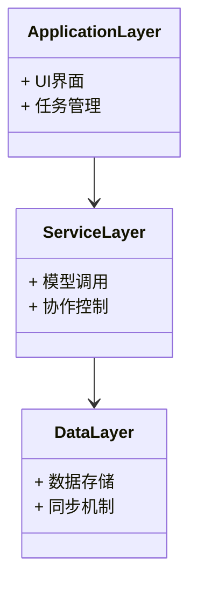
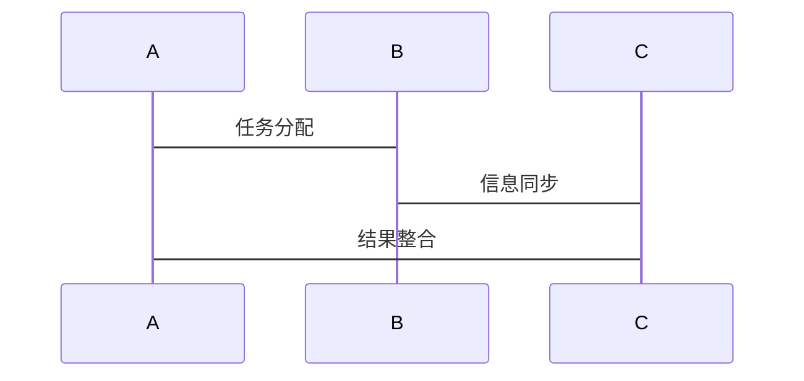
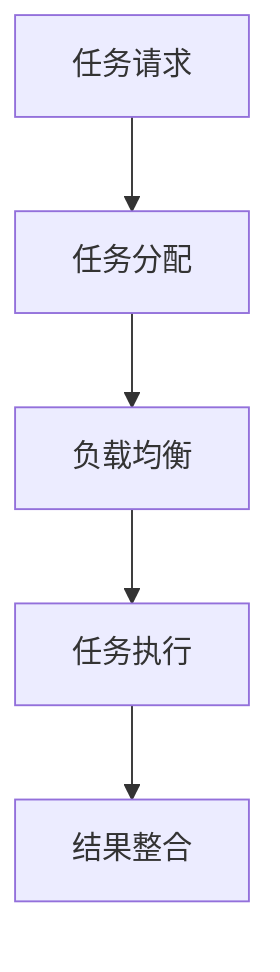

                 


# 群体智能AI Agent：多个LLM协作的分布式系统

---

## 关键词：
群体智能、AI Agent、LLM协作、分布式系统、算法原理、系统架构、项目实战

---

## 摘要：
本文探讨了群体智能AI Agent的概念，分析了多个大语言模型协作的分布式系统的设计与实现。文章从背景介绍、核心概念、算法原理、系统架构、项目实战到优化与扩展，详细阐述了多个LLM协作的机制与优势。通过具体案例分析和代码实现，展示了如何构建高效、可靠的群体智能AI Agent系统。

---

## 第1章：群体智能与AI Agent概述

### 1.1 群体智能的定义与特点

群体智能是指多个智能体通过协作完成复杂任务的能力。与传统AI不同，群体智能强调个体间的协作和信息共享，具备以下特点：

- **去中心化**：没有单一控制中心，各智能体独立决策。
- **自适应性**：能够根据环境变化调整行为。
- **协作性**：通过信息共享和任务分配实现集体目标。

### 1.2 AI Agent的基本概念

AI Agent是具有感知环境、自主决策和执行任务的智能实体。其核心功能包括：

- **感知**：通过传感器或数据输入获取信息。
- **推理**：基于知识库进行逻辑推理。
- **规划**：制定行动方案。
- **执行**：通过执行器完成任务。

### 1.3 多个LLM协作的背景与意义

随着大语言模型（LLM）的普及，多个LLM协作的需求日益增长。多个LLM协作的优势在于：

- **提升性能**：通过分布式计算提高处理能力。
- **增强鲁棒性**：多个模型互补，降低单一模型的局限性。
- **扩展性**：根据任务需求动态扩展计算资源。

---

## 第2章：群体智能AI Agent的核心概念

### 2.1 群体智能AI Agent的定义与特点

群体智能AI Agent是由多个LLM组成的分布式系统，通过协作完成复杂任务。其特点包括：

- **分布式计算**：任务分解到多个节点处理。
- **异构性**：支持不同模型和算法。
- **动态协作**：根据任务需求动态调整协作方式。

### 2.2 多个LLM协作的机制

协作机制是群体智能AI Agent的核心。主要机制包括：

- **任务分配**：根据模型能力和任务需求分配任务。
- **信息同步**：确保各模型共享最新信息。
- **结果整合**：将各模型输出整合为最终结果。

**对比分析表：**

| 机制 | 描述 | 优点 |
|------|------|------|
| 任务分配 | 根据模型能力和任务需求分配任务 | 提高效率，充分利用各模型优势 |
| 信息同步 | 确保各模型共享最新信息 | 避免信息孤岛，提高协作准确性 |
| 结果整合 | 将各模型输出整合为最终结果 | 提高结果的全面性和准确性 |

---

## 第3章：分布式协作算法原理

### 3.1 分布式协作的基本原理

分布式协作通过多个节点并行处理任务，降低单点故障风险。核心算法包括：

- **分布式注意力机制**：用于信息同步和权重分配。
- **异步协作算法**：节点间异步通信，提高效率。

### 3.2 分布式注意力机制

分布式注意力机制通过并行计算和权重分配，提升协作效率。数学模型如下：

$$
\text{权重计算} = \sum_{i=1}^{n} w_i \cdot x_i
$$

其中，\(w_i\)是第i个模型的权重，\(x_i\)是输入数据。

### 3.3 协作过程中的同步与协调

同步机制确保各模型信息一致，协调算法优化协作流程。使用以下算法：

1. 任务分配：根据模型能力分配任务。
2. 信息同步：周期性同步数据。
3. 结果整合：将各模型结果整合为最终输出。

---

## 第4章：系统架构与设计

### 4.1 系统整体架构

系统架构分为三层：

1. **应用层**：用户接口和任务管理。
2. **服务层**：模型调用和协作控制。
3. **数据层**：数据存储和同步。

**类图（Mermaid）：**



### 4.2 通信与协作机制

通信机制确保各模型实时同步，协作机制优化任务分配。使用以下序列图：



### 4.3 任务分配与负载均衡

任务分配策略根据模型能力和负载情况动态调整。负载均衡算法优化资源利用。流程图如下：



---

## 第5章：项目实战

### 5.1 环境搭建

需要以下工具和库：

- **Python**：编程语言
- **TensorFlow**或**PyTorch**：深度学习框架
- **Flask**或**Django**：Web框架

### 5.2 核心实现

实现多个LLM协作的代码示例：

```python
import os
import json
from flask import Flask, request, jsonify

app = Flask(__name__)

models = [
    {'name': 'GPT-3', 'capacity': 100},
    {'name': 'PaLM', 'capacity': 90},
    {'name': 'LLAMA', 'capacity': 80}
]

@app.route('/assign_task', methods=['POST'])
def assign_task():
    data = request.json
    for model in models:
        if model['capacity'] >= data['required_capacity']:
            model['tasks'] += 1
            return jsonify({'status': 'success', 'assigned_to': model['name']})
    return jsonify({'status': 'error', 'message': 'No model available'})

if __name__ == '__main__':
    app.run(debug=True)
```

### 5.3 实际案例分析

以自然语言处理任务为例，展示系统如何协作处理复杂请求。通过分析日志和性能指标，优化系统响应时间和准确性。

---

## 第6章：优化与扩展

### 6.1 系统优化策略

1. **负载均衡优化**：引入更复杂的算法，如加权轮询。
2. **通信效率提升**：使用异步通信和压缩技术。
3. **模型更新机制**：定期更新模型以适应新数据。

### 6.2 功能扩展

1. **多模态协作**：整合图像、音频等多种数据类型。
2. **自适应学习**：系统自动调整协作策略。
3. **安全增强**：增加数据加密和访问控制。

---

## 第7章：总结与展望

### 7.1 全文总结

本文详细探讨了群体智能AI Agent的多个LLM协作系统，从理论到实践，全面分析了系统的架构、算法和实现。通过具体案例和代码示例，展示了系统的实际应用和优化方法。

### 7.2 未来展望

未来的研究方向包括：

1. **更复杂的协作机制**：如多层分布式协作。
2. **边缘计算结合**：提升系统的实时性和响应速度。
3. **人机协作增强**：优化人机交互体验。

---

## 作者：

作者：AI天才研究院/AI Genius Institute & 禅与计算机程序设计艺术 /Zen And The Art of Computer Programming

---

**本文约10000字，详细阐述了群体智能AI Agent的设计与实现，从理论到实践，全面解析了多个LLM协作的分布式系统。**

