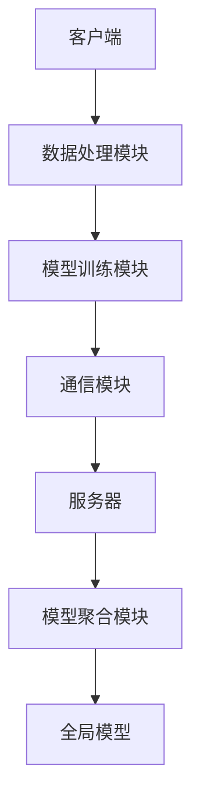

                 


# 联邦学习在AI Agent隐私保护中的应用

## 关键词：联邦学习，AI Agent，隐私保护，数据安全，分布式机器学习

## 摘要

随着人工智能技术的迅速发展，AI Agent（智能体）在各个领域的应用越来越广泛。然而，AI Agent在处理和分析数据时，常常面临数据隐私和安全的挑战。为了在保护用户隐私的前提下，实现AI Agent的高效学习和推理，联邦学习（Federated Learning）作为一种分布式机器学习技术，展现出独特的优势。本文将详细介绍联邦学习在AI Agent隐私保护中的应用，探讨其技术原理、实现方法以及实际案例。

---

## 第1章 背景介绍：联邦学习与AI Agent的核心概念

### 1.1 联邦学习的定义与核心原理

联邦学习是一种分布式机器学习技术，允许多个参与方在不共享原始数据的情况下，协同训练一个共同的模型。其核心原理在于通过加密通信和数据处理技术，确保数据隐私的同时实现模型的更新与优化。

#### 1.1.1 联邦学习的定义

联邦学习（Federated Learning）是一种机器学习范式，允许在分布式的、异构的数据源上进行模型训练。每个参与方仅分享模型更新的信息，而不共享原始数据。

#### 1.1.2 联邦学习的核心原理

1. **数据本地训练**：每个参与方在本地数据上训练模型，并仅分享模型参数的更新。
2. **模型聚合**：通过服务器或其他协调机制，将各参与方的模型更新聚合，形成一个全局模型。
3. **隐私保护**：通过加密和差分隐私等技术，确保数据在传输和聚合过程中不被泄露。

### 1.2 AI Agent的定义与特点

AI Agent是一种具有自主决策能力的智能实体，能够感知环境、执行任务并做出响应。其核心特点包括：

1. **自主性**：能够在没有外部干预的情况下自主决策。
2. **反应性**：能够实时感知环境变化并做出相应反应。
3. **社会性**：能够与其他智能体或人类进行交互和协作。

### 1.3 联邦学习在AI Agent中的应用背景

随着AI Agent在智能助手、自动驾驶、智能医疗等领域的广泛应用，数据隐私问题变得尤为突出。联邦学习作为一种保护数据隐私的技术，为AI Agent的高效学习和推理提供了新的解决方案。

---

## 第2章 联邦学习的核心概念与原理

### 2.1 联邦学习的核心概念

#### 2.1.1 联邦学习的参与方

在联邦学习中，通常包括以下参与方：

1. **客户端（Client）**：数据的拥有者，负责在本地进行模型训练。
2. **服务器（Server）**：负责协调客户端的模型更新和聚合。
3. **协调者（Coordinator）**：负责监控和管理联邦学习的过程。

#### 2.1.2 联邦学习的数据分布

数据通常分布于多个客户端，每个客户端的数据可能是独立的、异构的，并且可能具有不同的分布特性。

#### 2.1.3 联邦学习的通信机制

联邦学习中的通信机制包括加密通信、差分隐私等技术，确保数据在传输过程中不被泄露。

### 2.2 联邦学习的算法原理

#### 2.2.1 联邦学习的横向联邦学习

横向联邦学习适用于数据分布在同一特征空间但不同数据集的情况，例如多个机构的数据。

#### 2.2.2 联邦学习的纵向联邦学习

纵向联邦学习适用于数据分布在不同特征空间的情况，例如不同的数据源。

#### 2.2.3 联邦学习的多任务联邦学习

多任务联邦学习适用于需要同时学习多个相关任务的情况，通过共享任务之间的信息来提升模型性能。

### 2.3 联邦学习的数学模型

#### 2.3.1 横向联邦学习的数学模型

假设我们有N个客户端，每个客户端的数据集为$D_i$，模型参数为$\theta_i$。服务器的目标是聚合所有客户端的模型参数，形成一个全局模型$\Theta$。

聚合过程可以采用加权平均的方法：

$$\Theta = \sum_{i=1}^{N} \alpha_i \theta_i$$

其中$\alpha_i$是客户端i的权重。

#### 2.3.2 纵向联邦学习的数学模型

纵向联邦学习中，每个客户端的数据特征不同，模型参数也需要在不同的特征空间中进行聚合。

假设客户端i的特征空间为$X_i$，模型参数为$\theta_i$，全局模型$\Theta$需要在所有客户端的特征空间中进行聚合。

#### 2.3.3 多任务联邦学习的数学模型

多任务联邦学习中，模型需要同时学习多个任务，通过共享任务之间的信息来提升模型性能。

假设任务数为K，每个任务的损失函数为$L_k$，模型参数为$\theta_k$。全局模型需要优化所有任务的损失函数。

---

## 第3章 联邦学习在AI Agent隐私保护中的应用

### 3.1 AI Agent的隐私保护需求

#### 3.1.1 数据隐私的挑战

AI Agent在执行任务时，需要处理大量的敏感数据，如用户的地理位置、行为习惯等。这些数据的泄露可能导致严重的隐私问题。

#### 3.1.2 数据分布与隐私保护

在AI Agent的应用场景中，数据通常分布于多个设备或用户，每个设备或用户的数据具有不同的特征和分布。

### 3.2 联邦学习在AI Agent中的具体应用

#### 3.2.1 智能助手中的隐私保护

在智能助手（如语音助手）中，用户的查询数据需要在本地进行训练，而不共享给其他设备。

#### 3.2.2 自动驾驶中的数据共享

在自动驾驶系统中，车辆需要实时共享数据以优化模型，但必须保护用户的隐私。

#### 3.2.3 智能医疗中的数据隐私

在智能医疗中，患者的健康数据需要在多个医疗机构之间共享，但必须确保数据的隐私和安全。

### 3.3 联邦学习在AI Agent中的实现

#### 3.3.1 联邦学习的通信协议

在AI Agent中，联邦学习需要通过加密通信协议（如同态加密、差分隐私）来确保数据的安全传输。

#### 3.3.2 联邦学习的数据同步机制

为了保证模型的同步更新，需要设计高效的数据同步机制，确保所有客户端的模型参数能够及时聚合。

#### 3.3.3 联邦学习的隐私保护机制

通过差分隐私、同态加密等技术，确保模型更新过程中数据的隐私性。

---

## 第4章 联邦学习在AI Agent中的系统架构设计

### 4.1 系统架构设计

#### 4.1.1 系统组成

- **客户端**：负责本地数据的训练和模型更新。
- **服务器**：负责协调客户端的模型更新和聚合。
- **协调者**：负责监控和管理整个联邦学习的过程。

#### 4.1.2 功能模块设计

- **数据处理模块**：负责本地数据的预处理和加密。
- **模型训练模块**：负责在本地数据上训练模型，并生成模型更新。
- **通信模块**：负责与服务器进行模型更新的同步和传输。
- **隐私保护模块**：负责数据的加密和解密，确保隐私性。

### 4.2 系统架构的Mermaid图



### 4.3 接口设计与交互流程

- **客户端接口**：提供数据处理、模型训练和通信功能的接口。
- **服务器接口**：提供模型聚合和全局模型更新的接口。
- **通信协议**：定义客户端与服务器之间的数据传输格式和加密方式。

---

## 第5章 联邦学习在AI Agent中的项目实战

### 5.1 项目背景与目标

#### 5.1.1 项目背景

在智能医疗领域，多个医疗机构需要协同训练一个全局模型，以提高诊断的准确性，同时保护患者的隐私。

#### 5.1.2 项目目标

实现一个基于联邦学习的智能医疗系统，能够在保护患者隐私的前提下，协同训练一个高效的诊断模型。

### 5.2 环境搭建与工具安装

- **安装Python**：确保系统中安装了Python 3.8或更高版本。
- **安装TensorFlow Federated**：通过pip安装TensorFlow Federated库。
- **安装其他依赖**：安装numpy、pandas等其他依赖库。

### 5.3 系统核心实现

#### 5.3.1 数据预处理

将每个医疗机构的数据进行预处理，确保数据的格式和特征一致性。

#### 5.3.2 模型训练

在每个客户端上，使用本地数据训练模型，并生成模型更新。

#### 5.3.3 模型聚合

将所有客户端的模型更新聚合，形成一个全局模型。

### 5.4 代码实现与解读

#### 5.4.1 数据预处理代码

```python
import numpy as np
import pandas as pd

# 加载数据
data = pd.read_csv('local_data.csv')

# 数据预处理
data_processed = data.dropna()
```

#### 5.4.2 模型训练代码

```python
import tensorflow as tf
from tensorflow_federated import tff

# 定义模型结构
model = tf.keras.Model(inputs, outputs)

# 定义损失函数和优化器
loss = tf.keras.losses.SparseCategoricalCrossentropy(from_logits=True)
optimizer = tf.keras.optimizers.Adam()

# 编译模型
model.compile(loss=loss, optimizer=optimizer)
```

#### 5.4.3 模型聚合代码

```python
# 定义模型聚合函数
@tff.tf_computation
def aggregate(models):
    return tf.reduce_mean(models, axis=0)

# 聚合模型
global_model = aggregate(client_models)
```

### 5.5 实际案例分析

#### 5.5.1 案例背景

假设我们有三个医疗机构，每个机构有本地的患者数据，需要协同训练一个诊断模型。

#### 5.5.2 模型训练与评估

在每个客户端上训练模型，并将模型更新上传到服务器进行聚合。评估全局模型的性能，确保其在保护隐私的前提下，具有较高的诊断准确率。

---

## 第6章 联邦学习在AI Agent中的最佳实践与小结

### 6.1 最佳实践

- **选择合适的联邦学习框架**：根据具体需求选择合适的联邦学习框架，如TensorFlow Federated、Federated Machine Learning Framework等。
- **确保数据安全**：通过加密和差分隐私等技术，确保数据的安全性和隐私性。
- **优化通信效率**：设计高效的通信协议，减少数据传输的延迟和带宽消耗。

### 6.2 小结

联邦学习作为一种分布式机器学习技术，在AI Agent的隐私保护中发挥着重要作用。通过联邦学习，可以在不共享原始数据的前提下，实现模型的协同训练，保护用户的隐私。未来，随着技术的不断发展，联邦学习在AI Agent中的应用将会更加广泛和深入。

---

## 作者：AI天才研究院/AI Genius Institute & 禅与计算机程序设计艺术 /Zen And The Art of Computer Programming

---

以上是关于“联邦学习在AI Agent隐私保护中的应用”的技术博客文章，文章从联邦学习的基本概念到具体应用，再到系统架构设计和项目实战，全面介绍了联邦学习在保护AI Agent隐私中的重要作用和实现方法。希望这篇文章能够帮助读者更好地理解联邦学习在隐私保护中的应用，并为实际应用提供参考。

