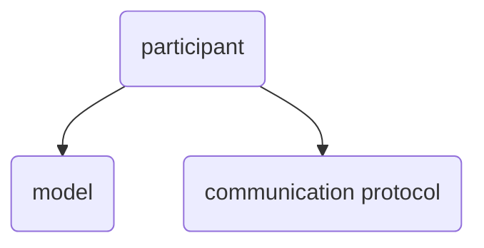
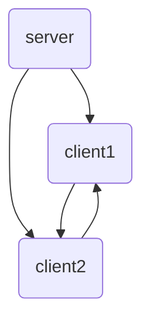
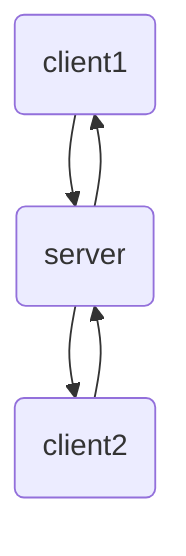
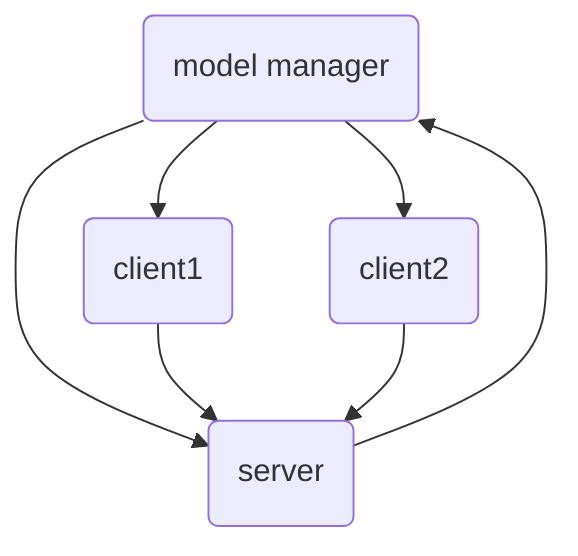
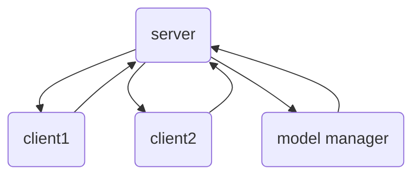

                 


# 联邦学习：保护隐私的分布式AI Agent训练

> 关键词：联邦学习，数据隐私，分布式AI，AI代理训练，隐私保护，分布式计算，机器学习

> 摘要：本文详细探讨了联邦学习的概念、核心原理、系统架构设计以及实际应用场景。通过分析联邦学习如何在保护数据隐私的前提下实现分布式AI代理训练，本文为读者提供了从理论到实践的全面解读。文章还通过具体案例展示了联邦学习的实现过程，并提出了实际应用中的关键问题和解决方案。

---

## # 第一部分: 联邦学习概述

### ## 第1章: 联邦学习概述

#### ### 1.1 联邦学习的背景与概念
##### 1.1.1 数据隐私与分布式学习的背景
在人工智能快速发展的今天，数据是训练AI模型的核心资源。然而，数据往往涉及个人隐私或商业机密，直接收集和集中处理数据变得越来越困难。传统的分布式学习方法虽然能够部分解决数据分布的问题，但缺乏对数据隐私的有效保护。因此，如何在不共享原始数据的前提下完成AI模型的联合训练，成为了一个亟待解决的问题。

##### 1.1.2 联邦学习的定义与核心思想
联邦学习（Federated Learning，简称FL）是一种新兴的分布式机器学习技术，旨在在多个参与方之间联合训练模型，同时保护各方的数据隐私。其核心思想是：数据留在本地不进行共享，仅在本地进行模型更新，并通过某种通信协议将更新后的模型参数传递给其他参与方，最终形成一个全局模型。

##### 1.1.3 联邦学习的适用场景与边界
联邦学习适用于多个数据拥有者希望通过合作训练模型，但又无法直接共享数据的场景。例如：
- 医疗领域：多个医院希望通过联合训练模型来提高诊断准确率，但又无法共享患者数据。
- 移动设备端：用户的本地数据无法上传到云端，但可以通过联邦学习在设备端进行模型训练。
- 跨机构合作：多个机构希望通过合作训练模型，但又无法共享敏感数据。

需要注意的是，联邦学习并不适用于所有场景。例如，当数据分布严重不均衡，或者数据之间存在强依赖关系时，联邦学习的效果可能不如集中式学习。

#### ### 1.2 联邦学习的核心概念与联系
##### 1.2.1 数据隐私与模型训练的关系
联邦学习通过在本地设备上进行模型更新，避免了原始数据的共享，从而保护了数据隐私。然而，如何确保模型更新的过程不被恶意攻击者利用，仍然是一个重要的挑战。

##### 1.2.2 联邦学习与传统分布式学习的对比
传统的分布式学习通常假设数据可以被集中到一个中心节点进行处理，而联邦学习则是在不共享数据的前提下完成模型训练。两者的区别主要体现在数据隐私保护和通信方式上。

##### 1.2.3 联邦学习的实体关系图（ER图）
在联邦学习中，通常涉及以下实体：
- **参与方（Parties）**：数据的拥有者，负责在本地进行模型更新。
- **模型（Model）**：全局模型，由所有参与方的本地模型更新共同训练而成。
- **通信协议（Communication Protocol）**：用于参与方之间交换模型参数的协议。

以下是一个简单的ER图，展示了联邦学习的核心实体关系：



---

## # 第二部分: 联邦学习的核心原理

### ## 第2章: 联邦学习的核心原理

#### ### 2.1 数据隐私保护机制
##### 2.1.1 数据加密与隐私保护方法
联邦学习通过加密技术保护数据隐私，常见的加密方法包括：
- **同态加密（Homomorphic Encryption）**：允许在加密数据上进行计算，结果解密后与直接计算的结果相同。
- **差分隐私（Differential Privacy）**：通过在数据中添加噪声，使得数据的发布不会泄露个体信息。

##### 2.1.2 差分隐私与同态加密原理
**差分隐私**通过在数据中添加随机噪声，使得单个数据点的更改不会对整体统计结果产生显著影响。例如，在计算某个统计量时，可以在结果中加入随机噪声，从而保护个体隐私。

**同态加密**则允许在不解密的情况下对加密数据进行计算。例如，可以对加密的数据进行加法或乘法运算，而不需要知道数据的具体内容。

##### 2.1.3 数据匿名化与隐私保护的对比
数据匿名化是另一种保护隐私的方法，通常通过去除或脱敏敏感信息来实现。与联邦学习不同，数据匿名化并不涉及模型训练的过程，因此在某些场景下可能无法满足需求。

---

#### ### 2.2 联邦学习的通信协议
##### 2.2.1 联邦学习的通信模型
联邦学习的通信通常采用**服务器-客户端**模式，或者**去中心化**的对等网络模式。以下是常见的通信模型：



##### 2.2.2 安全通信协议的设计与实现
为了确保通信过程的安全性，联邦学习通常采用加密协议来保护模型参数的传输。例如，可以使用**TLS/SSL**协议来加密通信，或者使用**签名机制**来验证数据的完整性。

##### 2.2.3 联邦学习中的数据同步机制
在联邦学习中，模型参数的同步是通过定期将参与方的本地模型参数上传到服务器，或者通过点对点的方式进行同步。以下是常见的数据同步流程：



---

#### ### 2.3 联邦学习的算法原理
##### 2.3.1 联邦学习的数学模型
联邦学习的目标是通过多个参与方的本地数据集，联合训练一个全局模型。假设我们有 $K$ 个参与方，每个参与方的数据集为 $D_i = \{(x_i^j, y_i^j)\}_{j=1}^{n_i}$，其中 $n_i$ 是第 $i$ 个参与方的数据量。全局模型的目标函数可以表示为：

$$
\min_{\theta} \sum_{i=1}^{K} \frac{1}{K} \sum_{j=1}^{n_i} \mathcal{L}(\theta, x_i^j, y_i^j))
$$

其中，$\mathcal{L}$ 是损失函数，$\theta$ 是模型参数。

##### 2.3.2 联邦学习的优化算法
联邦学习通常采用**联邦平均（FedAvg）**算法，即每个参与方在本地进行模型训练后，将参数更新上传到服务器，服务器对所有参与方的参数更新进行平均，得到新的全局模型参数。

##### 2.3.3 联邦学习的收敛性分析
联邦学习的收敛性取决于数据分布、通信频率以及参与方的数目等因素。通常情况下，联邦学习的收敛速度可能较慢，但可以通过优化算法和通信协议来改善性能。

---

### ## 第3章: 联邦学习的系统架构设计

#### ### 3.1 联邦学习的系统组成
##### 3.1.1 联邦学习的参与方角色
- **参与方（Client）**：数据的拥有者，负责在本地进行模型训练。
- **服务器（Server）**：负责协调参与方的模型更新，汇总参数并分发全局模型。
- **管理节点（Manager）**：负责监控系统的运行状态，管理参与方的加入与退出。

##### 3.1.2 联邦学习的系统功能模块
- **模型管理模块**：负责模型的初始化、训练和更新。
- **通信模块**：负责参与方与服务器之间的数据传输。
- **隐私保护模块**：负责数据加密和隐私保护。

##### 3.1.3 联邦学习的系统架构图
以下是一个典型的联邦学习系统架构图：



#### ### 3.2 联邦学习的通信与接口设计
##### 3.2.1 联邦学习的通信协议设计
联邦学习的通信协议需要确保数据的安全性和高效性。通常采用**HTTP/HTTPS**协议进行数据传输，或者采用**gRPC**等高性能通信协议。

##### 3.2.2 联邦学习的接口规范与API设计
联邦学习的API设计需要考虑以下几个方面：
- **模型初始化接口**：用于创建模型并分发给参与方。
- **模型更新接口**：用于接收参与方的模型参数更新。
- **模型分发接口**：用于将全局模型分发给参与方。

##### 3.2.3 联邦学习的交互流程图
以下是一个典型的联邦学习交互流程图：



---

### ## 第4章: 联邦学习的项目实战

#### ### 4.1 联邦学习环境的搭建
##### 4.1.1 环境搭建与工具安装
- 安装Python和必要的Python包（如TensorFlow、Flask）。
- 安装联邦学习框架（如TensorFlow Federated）。

##### 4.1.2 数据集的准备与预处理
- 数据集需要分布在不同的客户端中，且无法共享原始数据。
- 数据预处理包括数据清洗、特征工程等。

##### 4.1.3 联邦学习框架的选择与配置
- 常见的联邦学习框架包括TensorFlow Federated、Federated AI等。

#### ### 4.2 联邦学习的核心代码实现
##### 4.2.1 联邦学习模型的训练代码
以下是一个简单的联邦学习训练代码示例：

```python
import tensorflow as tf
from tensorflow_federated import distribute

# 定义模型
model = tf.keras.Model(inputs=[layer1, layer2], outputs=output)

# 初始化模型参数
model_weights = model.get_weights()

# 模型分发给客户端
clients = [Client1, Client2, ...]
clients.send_weights(model_weights)

# 客户端进行模型训练
clients.train()

# 客户端返回模型更新
updated_weights = clients.receive_weights()

# 服务器汇总模型参数
global_weights = distribute.federated_avg(updated_weights)
```

##### 4.2.2 联邦学习通信协议的实现
以下是一个简单的通信协议实现示例：

```python
import requests

# 发送模型参数到服务器
def send_weights(weights, server_url):
    response = requests.post(server_url + '/update', json={'weights': weights})
    return response.json()

# 接收全局模型参数
def receive_weights(server_url):
    response = requests.get(server_url + '/get_weights')
    return response.json()
```

##### 4.2.3 联邦学习的系统实现
以下是一个简单的联邦学习系统实现示例：

```python
class Server:
    def __init__(self, clients):
        self.clients = clients
        self.model_weights = initial_weights

    def aggregate_weights(self, updated_weights):
        # 使用FedAvg算法汇总模型参数
        return distribute.federated_avg(updated_weights)

    def distribute_weights(self, global_weights):
        # 将全局模型参数分发给客户端
        for client in self.clients:
            client.send_weights(global_weights)

class Client:
    def __init__(self, data):
        self.data = data
        self.model_weights = initial_weights

    def train(self):
        # 在本地数据上训练模型
        self.model_weights = self.train_model(self.model_weights, self.data)

    def send_weights(self, global_weights):
        # 接收全局模型参数
        self.model_weights = global_weights

    def receive_weights(self):
        # 返回本地模型参数更新
        return self.model_weights - initial_weights
```

#### ### 4.3 联邦学习的实验与分析
##### 4.3.1 实验环境与数据集
- 实验环境：本地服务器加多个客户端。
- 数据集：模拟分布式数据集，每个客户端的数据量相同。

##### 4.3.2 实验结果与分析
- 模型收敛速度：随着参与方数量的增加，模型收敛速度可能变慢。
- 模型精度：在数据分布均匀的情况下，联邦学习可以达到较高的模型精度。
- 通信开销：通信开销是影响联邦学习性能的重要因素。

---

## # 第五部分: 联邦学习的总结与展望

### ## 第5章: 联邦学习的总结与展望

#### ### 5.1 联邦学习的核心总结
- 联邦学习是一种分布式机器学习技术，能够在不共享数据的前提下完成模型训练。
- 联邦学习通过加密技术和通信协议保护数据隐私，适用于多个场景。

#### ### 5.2 联邦学习的未来发展方向
- **模型压缩与优化**：如何在保证模型精度的前提下，减少通信数据量。
- **数据异构性处理**：如何处理数据分布不均匀的问题。
- **边缘计算与5G结合**：利用边缘计算和5G技术，进一步提升联邦学习的性能。

#### ### 5.3 联邦学习的实际应用建议
- **数据安全**：在实际应用中，必须确保数据的安全性和隐私性。
- **模型管理**：需要建立完善的模型管理机制，确保模型的可解释性和可追溯性。
- **性能优化**：需要根据具体场景，优化算法和通信协议，提升模型训练效率。

---

## 作者：AI天才研究院/AI Genius Institute & 禅与计算机程序设计艺术 /Zen And The Art of Computer Programming

