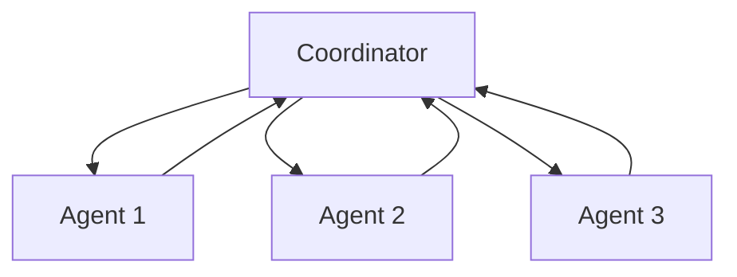
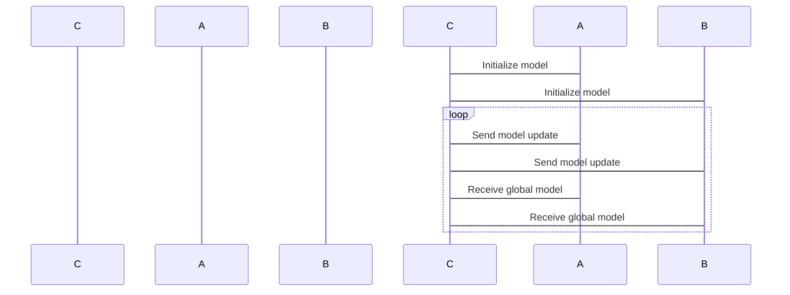

                 


# 联邦强化学习在分布式AI Agent控制中的应用

> 关键词：联邦强化学习，分布式AI Agent，多智能体协作，分布式计算，人工智能

> 摘要：联邦强化学习（Federated Reinforcement Learning，FRL）是一种新兴的机器学习范式，旨在在分布式环境下，通过多个智能体的协作学习来实现全局优化。本文将详细探讨联邦强化学习的核心概念、算法原理、系统架构设计以及在分布式AI Agent控制中的应用。文章首先介绍联邦强化学习的背景与应用场景，然后分析其核心概念与数学模型，接着讨论系统的架构设计与实现细节，最后通过项目实战展示其应用，并总结最佳实践。

---

# 第一部分: 联邦强化学习与分布式AI Agent概述

## 第1章: 联邦强化学习与分布式AI Agent概述

### 1.1 联邦强化学习的背景与概念

#### 1.1.1 强化学习的基本概念
强化学习（Reinforcement Learning, RL）是一种通过智能体与环境交互以最大化累积奖励的机器学习方法。智能体通过感知环境状态，选择动作，从而获得奖励或惩罚，最终学习到最优策略。

#### 1.1.2 联邦强化学习的定义
联邦强化学习（Federated Reinforcement Learning, FRL）是一种分布式强化学习范式，允许多个智能体在不同的环境中协作学习，共享知识，同时保持数据和模型的局部性。它结合了联邦学习（Federated Learning）和强化学习的特点，旨在在分布式系统中实现全局最优。

#### 1.1.3 分布式AI Agent的基本概念
分布式AI Agent是指在分布式环境中运行的多个智能体，每个智能体负责特定的任务或区域，通过通信和协作完成复杂的整体目标。分布式AI Agent的应用场景包括机器人协作、多智能体游戏、分布式控制等。

#### 1.1.4 联邦强化学习与分布式AI Agent的关系
联邦强化学习为分布式AI Agent提供了一种协作学习的机制，使多个智能体能够在不共享原始数据的情况下，通过模型更新和策略协作，实现全局最优。

### 1.2 联邦强化学习的应用场景

#### 1.2.1 分布式系统中的协作问题
在分布式系统中，多个智能体需要协作完成复杂任务，例如多机器人协作、分布式控制系统的优化等。

#### 1.2.2 多智能体强化学习的挑战
传统的多智能体强化学习（Multi-Agent Reinforcement Learning, MARL）在分布式环境中面临通信开销大、数据隐私问题、计算资源受限等挑战。

#### 1.2.3 联邦学习在AI Agent控制中的优势
联邦强化学习通过局部更新和模型聚合，降低了通信开销，同时保护了数据隐私，适用于分布式环境下的AI Agent控制。

---

# 第二部分: 联邦强化学习的核心概念与原理

## 第2章: 联邦强化学习的核心概念

### 2.1 联邦强化学习的组成部分

#### 2.1.1 多智能体系统
多智能体系统由多个智能体组成，每个智能体负责特定任务或区域，通过协作完成全局目标。

#### 2.1.2 联邦学习框架
联邦学习是一种分布式学习范式，允许多个参与方在不共享数据的情况下，通过模型更新实现协作学习。

#### 2.1.3 强化学习的基本原理
强化学习通过智能体与环境的交互，学习最优策略。智能体通过感知状态、选择动作、获得奖励，逐步优化策略。

### 2.2 联邦强化学习的关键特性

#### 2.2.1 分布式训练
联邦强化学习通过分布式计算框架（如分布式计算集群）进行模型训练，每个智能体在本地数据上进行更新。

#### 2.2.2 联邦通信
智能体之间通过通信机制共享模型更新，实现知识的协作与共享。

#### 2.2.3 联合优化
通过联邦优化算法（如联邦平均法）对各智能体的模型进行联合优化，最终得到全局最优模型。

### 2.3 联邦强化学习与传统强化学习的对比

#### 2.3.1 算法特点对比
| 特性             | 联邦强化学习                     | 传统强化学习                     |
|------------------|----------------------------------|----------------------------------|
| 数据分布         | 分散在多个智能体中               | 集中在一个智能体或环境中           |
| 通信开销         | 较低，通过模型更新进行协作         | 较高，频繁与环境交互               |
| 数据隐私         | 高，数据不共享                   | 低，数据可能集中                   |
| 应用场景         | 分布式AI Agent协作、多智能体协作     | 单智能体任务、集中式控制           |

#### 2.3.2 优缺点分析
- **优点**：保护数据隐私，降低通信开销，适用于分布式环境。
- **缺点**：模型更新复杂，需要高效的通信机制，可能收敛速度较慢。

#### 2.3.3 适用场景对比
- 联邦强化学习适用于分布式AI Agent协作、多智能体协作等场景。
- 传统强化学习适用于集中式控制、单智能体任务等场景。

---

## 第3章: 联邦强化学习的数学模型与算法原理

### 3.1 联邦强化学习的数学模型

#### 3.1.1 强化学习的基本模型
强化学习的基本模型包括状态（State）、动作（Action）、奖励（Reward）、策略（Policy）和值函数（Value Function）。

#### 3.1.2 联邦学习的目标函数
在联邦强化学习中，目标函数通常由多个智能体的局部目标函数组成，并通过联邦优化算法进行联合优化。

$$ J = \sum_{i=1}^{n} J_i(\theta_i) $$
其中，$J_i$ 表示第i个智能体的目标函数，$\theta_i$ 表示其模型参数。

#### 3.1.3 分布式优化的数学表达
联邦强化学习的优化过程可以表示为：
$$ \theta^{new} = \frac{1}{n} \sum_{i=1}^{n} \theta_i $$
其中，$\theta_i$ 表示第i个智能体的模型参数，$\theta^{new}$ 表示更新后的全局模型参数。

### 3.2 联邦强化学习的算法流程

#### 3.2.1 分布式训练流程
1. 初始化：所有智能体初始化模型参数。
2. 本地训练：每个智能体在本地数据上进行强化学习训练，更新模型参数。
3. 模型聚合：通过通信机制将各智能体的模型参数聚合，得到全局模型。
4. 模型分发：将全局模型分发给各智能体，进行下一轮训练。

#### 3.2.2 联邦通信机制
智能体之间的通信机制可以通过以下步骤实现：
1. 智能体向协调器发送本地模型参数。
2. 协调器聚合所有智能体的模型参数，生成全局模型。
3. 智能体从协调器下载全局模型，作为下一轮训练的基础。

#### 3.2.3 联合优化算法
一种常见的联邦优化算法是联邦平均法（Federated Averaging）：
1. 每个智能体在本地数据上进行梯度下降优化。
2. 协调器将所有智能体的更新参数进行平均，得到全局模型。

### 3.3 联邦强化学习的实现细节

#### 3.3.1 分布式计算框架的选择
常用的分布式计算框架包括：
- **Distributed TensorFlow**：支持分布式训练的TensorFlow框架。
- **Ray**：一种用于构建分布式强化学习系统的Python框架。
- **Horovod**：支持分布式训练的开源库。

#### 3.3.2 联邦通信的协议设计
- **通信协议**：使用gRPC或HTTP进行智能体间的通信。
- **数据格式**：使用Protocol Buffers或JSON进行数据序列化。

#### 3.3.3 联合优化的数学推导
以联邦平均法为例，假设各智能体的优化目标为：
$$ \theta_i^{new} = \theta_i + \eta \nabla J_i(\theta_i) $$
其中，$\eta$ 是学习率，$\nabla J_i(\theta_i)$ 是目标函数的梯度。

全局模型更新为：
$$ \theta^{new} = \frac{1}{n} \sum_{i=1}^{n} \theta_i^{new} $$

---

# 第三部分: 分布式AI Agent的系统架构与设计

## 第4章: 分布式AI Agent的系统架构

### 4.1 系统架构概述

#### 4.1.1 分布式系统的组成
- **智能体（Agent）**：负责执行具体任务。
- **协调器（Coordinator）**：负责模型聚合和任务分配。
- **通信模块（Communication Module）**：负责智能体间的通信。

#### 4.1.2 多智能体协作的架构
- **主从架构（Master-Worker）**：协调器作为主节点，智能体作为从节点，进行任务分配和结果汇总。
- **对等架构（Peer-to-Peer）**：智能体之间直接通信，无中心节点。

### 4.2 系统功能设计

#### 4.2.1 通信模块
- **功能**：实现智能体间的通信，支持模型参数的上传和下载。
- **实现**：使用gRPC或HTTP协议，定义接口规范。

#### 4.2.2 决策模块
- **功能**：基于当前状态，生成动作。
- **实现**：使用强化学习算法，如DQN、PPO等。

#### 4.2.3 学习模块
- **功能**：在本地数据上进行强化学习训练，更新模型参数。
- **实现**：基于TensorFlow或PyTorch框架，实现强化学习算法。

### 4.3 系统架构的Mermaid图


---

## 第5章: 系统接口与交互设计

### 5.1 系统接口设计

#### 5.1.1 智能体间的通信接口
- **接口规范**：
  ```python
  class Communication:
      def send_model(self, model_params):
          pass
      def receive_model(self):
          pass
  ```

#### 5.1.2 联邦学习的接口规范
- **接口规范**：
  ```python
  class FederatedLearning:
      def train(self, model_params):
          pass
      def aggregate(self, model_params_list):
          pass
  ```

#### 5.1.3 外部系统的接口设计
- **接口规范**：
  ```python
  class Environment:
      def get_state(self):
          pass
      def take_action(self, action):
          pass
  ```

### 5.2 系统交互流程

#### 5.2.1 初始化阶段
1. 协调器初始化模型参数。
2. 各智能体从协调器下载初始模型。

#### 5.2.2 训练阶段
1. 智能体在本地环境中进行强化学习训练，更新模型参数。
2. 智能体将更新后的模型参数发送到协调器。
3. 协调器聚合所有智能体的模型参数，生成全局模型。
4. 智能体从协调器下载全局模型，作为下一轮训练的基础。

#### 5.2.3 优化阶段
1. 通过多次迭代训练，逐步优化模型，提高智能体的协作能力。

### 5.3 系统交互的Mermaid图


---

# 第四部分: 项目实战

## 第6章: 项目实战

### 6.1 环境安装

#### 6.1.1 安装依赖
```bash
pip install tensorflow federated ray
```

#### 6.1.2 环境配置
```bash
export TF_KERAS=1
```

### 6.2 系统核心实现源代码

#### 6.2.1 智能体类
```python
class Agent:
    def __init__(self, id, model):
        self.id = id
        self.model = model
        self.communication = Communication()
    
    def train(self, env):
        # 在本地环境中训练模型
        for _ in range(100):
            state = env.get_state()
            action = self.model.predict(state)
            next_state, reward = env.take_action(action)
            self.model.update(state, action, reward)
        self.communication.send_model(self.model.get_weights())
    
    def receive_model(self):
        return self.communication.receive_model()
```

#### 6.2.2 协调器类
```python
class Coordinator:
    def __init__(self, num_agents):
        self.agents = [Agent(i, Model()) for i in range(num_agents)]
    
    def aggregate_models(self):
        # 聚合所有智能体的模型参数
        avg_weights = []
        for layer in range(len(self.agents[0].model.get_weights())):
            total = 0
            for agent in self.agents:
                total += agent.model.get_weights()[layer]
            avg_weights.append(total / len(self.agents))
        return avg_weights
    
    def train_agents(self):
        for agent in self.agents:
            agent.train(env)
        self.agents[0].model.set_weights(self.aggregate_models())
```

#### 6.2.3 通信类
```python
class Communication:
    def __init__(self):
        self.weights = None
    
    def send_model(self, weights):
        self.weights = weights
    
    def receive_model(self):
        return self.weights
```

### 6.3 代码应用解读与分析

#### 6.3.1 智能体的训练过程
智能体通过与环境交互，更新本地模型，并通过通信模块将模型参数发送给协调器。

#### 6.3.2 协调器的模型聚合
协调器将所有智能体的模型参数进行平均，得到全局模型，并将全局模型分发给各智能体。

### 6.4 实际案例分析

#### 6.4.1 案例背景
假设我们有一个分布式多智能体系统，每个智能体负责控制一个机器人，目标是通过协作学习，使所有机器人能够在协同工作下完成任务。

#### 6.4.2 案例实现
```python
# 初始化协调器和智能体
coord = Coordinator(3)
coord.train_agents()

# 循环训练
for _ in range(10):
    coord.train_agents()
```

### 6.5 项目小结

#### 6.5.1 项目总结
通过联邦强化学习，实现了多个智能体在分布式环境下的协作学习，提高了系统的整体性能和协作能力。

#### 6.5.2 经验与教训
- **经验**：选择合适的通信机制和分布式计算框架是关键。
- **教训**：模型聚合的频率和方式会影响收敛速度和性能。

---

# 第五部分: 总结与展望

## 第7章: 总结与展望

### 7.1 本章小结
联邦强化学习为分布式AI Agent的协作学习提供了一种新的范式，通过局部更新和模型聚合，解决了数据隐私和通信开销的问题，适用于分布式环境下的AI Agent控制。

### 7.2 最佳实践 tips
- **数据隐私保护**：采用联邦学习机制，避免数据集中化。
- **通信优化**：选择高效的通信协议和数据序列化方式。
- **模型优化**：通过合理的模型聚合策略，提高收敛速度和性能。

### 7.3 注意事项
- 确保各智能体的模型更新同步，避免数据不一致。
- 定期监控系统性能，及时调整参数和算法。

### 7.4 拓展阅读
- **相关论文**：阅读关于联邦强化学习的最新研究成果。
- **工具框架**：学习分布式计算框架（如Ray、Horovod）的使用。

---

# 作者：AI天才研究院/AI Genius Institute & 禅与计算机程序设计艺术 /Zen And The Art of Computer Programming

---

以上是《联邦强化学习在分布式AI Agent控制中的应用》的技术博客文章，涵盖了从背景介绍到系统实现的各个方面，结合理论与实践，为读者提供了全面的指导。

