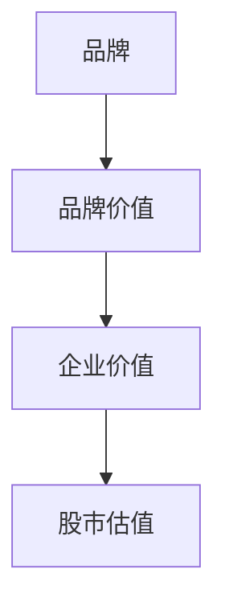
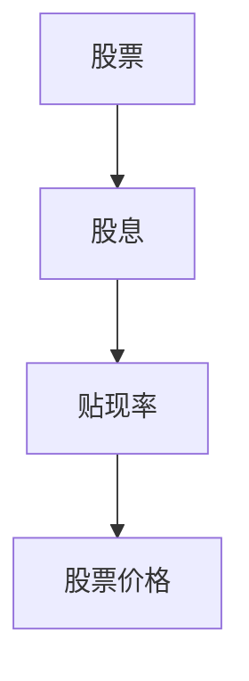
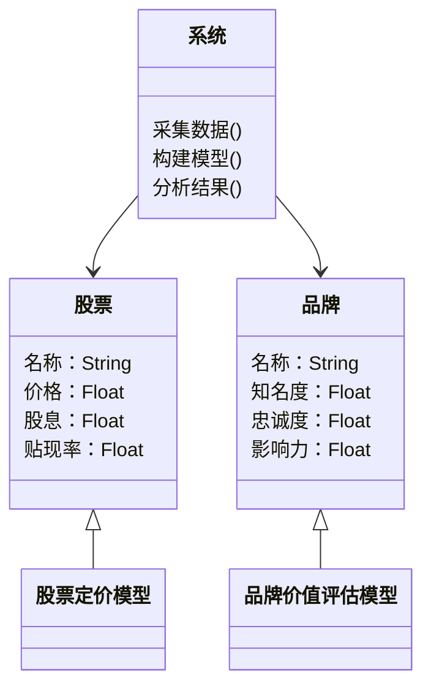
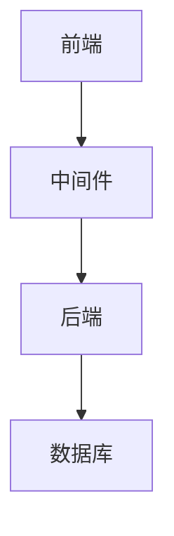

                 


# 股市估值在国际品牌价值链分析中的应用

## 关键词：股市估值、国际品牌价值链、品牌价值、股票定价、企业竞争力

## 摘要：  
本文探讨了股市估值与国际品牌价值链分析的结合应用，从背景、核心概念、算法原理、系统架构到项目实战，详细阐述了如何通过股市估值分析国际品牌价值链的价值构成与优化策略。通过数学模型、算法流程图和实际案例分析，本文为读者提供了全面的理解和实用的指导。

---

# 第1章: 股市估值与国际品牌价值链分析的背景

## 1.1 股市估值的基本概念

### 1.1.1 股市估值的定义与作用

股市估值是指通过对企业的财务数据、市场环境和行业趋势进行分析，确定其股票的合理价格范围。它是投资者进行投资决策的重要依据，同时也是企业价值评估的重要工具。

### 1.1.2 股市估值的核心要素

- **财务数据**：包括收入、利润、资产和负债等。
- **市场环境**：如宏观经济状况、行业竞争格局等。
- **市场情绪**：投资者的心理预期对股价的影响。

### 1.1.3 股市估值与企业价值的关系

股市估值是企业价值的外在表现，企业价值决定了股价的高低。通过合理的企业价值评估，可以指导股市估值的调整。

## 1.2 国际品牌价值链的基本概念

### 1.2.1 品牌价值链的定义与构成

品牌价值链是指从品牌创建、推广、销售到客户价值实现的完整链条。它包括品牌知名度、品牌忠诚度、品牌影响力等多个方面。

### 1.2.2 国际品牌价值链的特点

- **全球化**：品牌在全球范围内的推广和运营。
- **复杂性**：涉及多个环节和参与者。
- **动态性**：受市场环境和消费者需求的影响。

### 1.2.3 品牌价值链与企业竞争力的关系

品牌价值链是企业竞争力的重要组成部分，强大的品牌价值链能够提升企业的市场地位和盈利能力。

## 1.3 股市估值与国际品牌价值链的联系

### 1.3.1 股市估值对品牌价值的影响

股市估值通过反映企业价值，间接影响品牌价值的评估。高估值企业通常具有较高的品牌价值。

### 1.3.2 品牌价值链对股市估值的支撑作用

强大的品牌价值链能够提升企业的盈利能力和市场地位，从而提高股市估值。

### 1.3.3 两者结合的现实意义

通过结合股市估值和品牌价值链分析，可以更全面地评估企业的价值，为投资者和管理层提供决策支持。

## 1.4 本章小结

本章介绍了股市估值和国际品牌价值链的基本概念，分析了两者之间的联系，并强调了结合分析的现实意义。

---

# 第2章: 股市估值与国际品牌价值链的核心概念

## 2.1 股市估值的核心原理

### 2.1.1 股票定价模型

股票定价模型是股市估值的核心工具。常用的模型包括股息贴现模型（DDM）和市盈率模型。

- **股息贴现模型**：  
  $$ P = \frac{D}{k} $$  
  其中，$P$ 表示股票价格，$D$ 表示股息，$k$ 表示贴现率。

- **市盈率模型**：  
  $$ 市盈率 = \frac{股价}{每股收益} $$

### 2.1.2 股市估值的关键指标

- **市盈率（P/E）**
- **市净率（P/B）**
- **股息率（Dividend Yield）**

### 2.1.3 股市估值的市场影响因素

- **宏观经济**：GDP增长率、利率水平等。
- **行业环境**：行业竞争格局、政策法规。
- **企业基本面**：收入、利润、资产状况。

## 2.2 国际品牌价值链的核心要素

### 2.2.1 品牌价值的构成

品牌价值由品牌知名度、品牌忠诚度和品牌影响力三部分构成。

### 2.2.2 品牌价值的评估标准

- **品牌知名度**：品牌在市场上的认知度。
- **品牌忠诚度**：客户对品牌的忠诚程度。
- **品牌影响力**：品牌在全球市场上的影响力。

### 2.2.3 品牌价值链的优化策略

- **提升品牌知名度**：通过广告宣传、营销活动等。
- **增强品牌忠诚度**：提供优质的客户服务和产品体验。
- **扩大品牌影响力**：通过全球化战略和并购重组。

## 2.3 股市估值与品牌价值链的关联性分析

### 2.3.1 品牌价值对股市估值的驱动作用

强大的品牌价值链能够提升企业的市场地位和盈利能力，从而提高股市估值。

### 2.3.2 股市估值对品牌价值链的反馈机制

股市估值的变化能够反映出品牌价值的变动，为品牌管理提供反馈。

### 2.3.3 两者结合的系统性分析

通过结合股市估值和品牌价值链分析，可以更全面地评估企业的价值，为投资者和管理层提供决策支持。

## 2.4 核心概念对比分析

### 2.4.1 股市估值与品牌价值的对比表格

| 指标 | 股市估值 | 品牌价值 |
|------|----------|----------|
| 核心 | 股票价格 | 品牌价值 |
| 影响 | 宏观经济、行业环境 | 品牌知名度、忠诚度 |

### 2.4.2 品牌价值链与企业价值的ER实体关系图



---

# 第3章: 股市估值与国际品牌价值链的算法原理

## 3.1 股市估值的核心算法

### 3.1.1 股票定价模型的数学公式

$$ P = \frac{D}{k} $$

其中，$P$ 表示股票价格，$D$ 表示股息，$k$ 表示贴现率。

### 3.1.2 市盈率与市净率的计算方法

- **市盈率**：  
  $$ 市盈率 = \frac{股价}{每股收益} $$

- **市净率**：  
  $$ 市净率 = \frac{股价}{每股净资产} $$

### 3.1.3 股市估值的算法流程图



## 3.2 国际品牌价值链的评估算法

### 3.2.1 品牌价值的评估公式

$$ 品牌价值 = 品牌知名度 \times 品牌忠诚度 \times 品牌影响力 $$

### 3.2.2 品牌价值链的优化算法

通过分析品牌价值链的各个环节，优化品牌知名度、忠诚度和影响力，从而提升品牌价值。

---

# 第4章: 股市估值与国际品牌价值链的系统分析

## 4.1 系统功能设计

### 4.1.1 数据采集模块

采集企业的财务数据和市场数据。

### 4.1.2 模型构建模块

构建股票定价模型和品牌价值评估模型。

### 4.1.3 结果分析模块

分析股市估值与品牌价值链的关系。

## 4.2 系统架构设计

### 4.2.1 领域模型类图



### 4.2.2 系统架构图



---

# 第5章: 股市估值与国际品牌价值链的项目实战

## 5.1 环境安装

安装必要的开发工具和数据库。

## 5.2 核心代码实现

### 5.2.1 股票定价模型的实现

```python
def stock_price(dividend, discount_rate):
    return dividend / discount_rate
```

### 5.2.2 品牌价值评估模型的实现

```python
def brand_value(popularity, loyalty, influence):
    return popularity * loyalty * influence
```

## 5.3 实际案例分析

以苹果公司为例，分析其品牌价值如何影响股市估值。

---

# 第6章: 股市估值与国际品牌价值链的最佳实践

## 6.1 小结

结合股市估值和品牌价值链分析，能够更全面地评估企业的价值。

## 6.2 注意事项

- 数据的准确性和完整性。
- 模型的适用性和可扩展性。

## 6.3 拓展阅读

推荐相关书籍和论文，供读者进一步学习。

---

# 作者

作者：AI天才研究院/AI Genius Institute & 禅与计算机程序设计艺术 /Zen And The Art of Computer Programming

