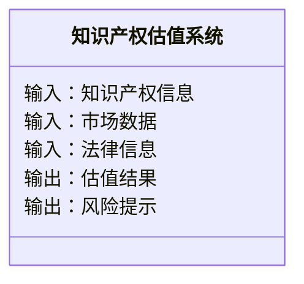

                 


# 股市估值在国际知识产权估值中的应用

> 关键词：股市估值、知识产权估值、企业价值、市场竞争力、知识产权保护

> 摘要：本文探讨了股市估值在国际知识产权估值中的应用，分析了知识产权对股市估值的核心影响，介绍了知识产权国际估值的核心概念与原理，并通过实际案例展示了如何将知识产权价值纳入股市估值模型，为企业价值评估提供新视角。

---

## 第一部分: 股市估值与国际知识产权估值的背景与基础

### 第1章: 股市估值与知识产权估值概述

#### 1.1 股市估值的基本概念

##### 1.1.1 股票估值的定义与意义
股票估值是指通过对公司财务状况、市场表现和行业地位等多方面因素的分析，估算其股票的内在价值。股票估值的意义在于帮助投资者做出合理的投资决策，避免盲目跟风。

##### 1.1.2 股票估值的主要方法
股票估值的主要方法包括：
1. 市盈率法（P/E）：通过市盈率与行业平均市盈率的对比，评估股票的合理价格。
2. 市净率法（P/B）：基于资产净值与股价的比率，评估股票的内在价值。
3. 股息率法：通过股息与股票价格的比率，评估投资回报率。

##### 1.1.3 股票估值与企业价值的关系
股票估值是企业价值的体现，企业价值越高，股票估值通常越高。企业价值包括资产、负债、无形资产（如知识产权）等多方面因素，是股票估值的重要基础。

#### 1.2 知识产权估值的基本概念

##### 1.2.1 知识产权的定义与分类
知识产权是指人们在智力活动成果中依法享有的权利，主要包括专利权、商标权、著作权、商业秘密等。知识产权可以分为工业产权（如专利权、商标权）和非工业产权（如著作权）。

##### 1.2.2 知识产权在企业中的价值体现
知识产权是企业的核心竞争力之一，可以通过技术壁垒、品牌价值等方式提升企业的市场地位和盈利能力。

##### 1.2.3 知识产权估值的挑战与难点
知识产权估值的难点在于其无形性和市场波动性。知识产权的价值受技术进步、市场变化等因素影响较大，难以准确量化。

#### 1.3 股市估值与知识产权估值的关联性

##### 1.3.1 知识产权对股价的影响
知识产权是企业技术创新的核心，直接影响企业的市场竞争力和盈利能力。拥有强大知识产权储备的企业通常能获得更高的股价。

##### 1.3.2 知识产权在企业市值中的权重
在企业市值评估中，知识产权的价值占比越来越高，尤其是在高科技行业，知识产权甚至成为企业市值的主要推动力。

##### 1.3.3 国际化视角下的知识产权估值
在国际化背景下，知识产权的跨国评估需要考虑不同国家的法律、市场环境等因素，增加了估值的复杂性。

#### 1.4 本章小结
本章介绍了股市估值和知识产权估值的基本概念，并探讨了两者之间的关联性。知识产权在企业价值中的作用日益重要，特别是在国际化背景下，知识产权估值已成为股市估值的重要组成部分。

---

### 第2章: 知识产权对股市估值的核心影响

#### 2.1 知识产权在企业财务表现中的作用

##### 2.1.1 知识产权对企业收入的影响
知识产权是企业技术创新的核心，直接影响企业的销售收入。拥有强大知识产权储备的企业通常能获得更高的市场份额和销售收入。

##### 2.1.2 知识产权对成本控制的作用
通过知识产权的保护，企业可以避免因技术泄露或侵权导致的成本增加。同时，知识产权的使用可以降低生产成本，提高效率。

##### 2.1.3 知识产权对资产减值的影响
知识产权的贬值可能影响企业的资产价值。例如，技术过时或专利到期可能导致知识产权贬值，进而影响企业资产减值。

#### 2.2 知识产权在企业市场竞争力中的体现

##### 2.2.1 知识产权对市场准入的影响
强大的知识产权可以为企业的市场准入提供保障，防止竞争对手的侵权行为，维护市场地位。

##### 2.2.2 知识产权对品牌价值的提升
知识产权是品牌的核心竞争力。例如，驰名商标的保护可以提升品牌的知名度和市场价值。

##### 2.2.3 知识产权对行业地位的巩固
知识产权是企业技术领先的重要标志。拥有大量高质量知识产权的企业通常能在行业中占据领先地位。

#### 2.3 知识产权在股市估值中的量化分析

##### 2.3.1 知识产权价值的量化方法
知识产权的量化方法包括成本法、市场法和收益法。成本法基于研发成本估算知识产权价值；市场法基于市场交易数据估算；收益法基于未来收益折现估算。

##### 2.3.2 知识产权对股价波动的敏感性分析
知识产权的收购、授权或侵权事件往往引起股价波动。例如，重大专利授权可能推动股价上涨，而专利侵权可能导致股价下跌。

##### 2.3.3 知识产权在企业估值模型中的权重分配
在企业估值模型中，知识产权的价值占比通常在10%到30%之间，具体取决于企业的行业和技术依赖程度。

#### 2.4 本章小结
本章探讨了知识产权对股市估值的核心影响，分析了知识产权在企业财务表现和市场竞争力中的作用，并提出了量化分析的方法和权重分配建议。

---

## 第二部分: 知识产权国际估值的核心概念与原理

### 第3章: 知识产权国际估值的核心概念与原理

#### 3.1 知识产权国际估值的基本原理

##### 3.1.1 知识产权国际估值的定义
知识产权国际估值是指在跨国背景下，对知识产权的经济价值进行评估的过程。它需要考虑不同国家的法律、市场环境和经济政策。

##### 3.1.2 知识产权国际估值的主要原则
知识产权国际估值应遵循独立性、客观性和公正性原则。评估人员需要基于事实和数据，避免主观判断。

##### 3.1.3 知识产权国际估值的适用范围
知识产权国际估值适用于跨国企业并购、技术授权、知识产权保护等场景。

#### 3.2 知识产权国际估值的主要方法

##### 3.2.1 成本法在国际知识产权估值中的应用
成本法基于知识产权的研发成本进行估值。适用于技术较为成熟、研发成本可计量的知识产权。

##### 3.2.2 市场法在国际知识产权估值中的应用
市场法基于市场交易数据，利用可比交易进行估值。适用于有活跃交易市场的知识产权。

##### 3.2.3 收益法在国际知识产权估值中的应用
收益法基于未来收益的折现进行估值。适用于具有稳定收益流的知识产权。

#### 3.3 知识产权国际估值的关键因素

##### 3.3.1 技术先进性对估值的影响
技术先进性是知识产权价值的重要决定因素。技术越先进，市场应用前景越广，估值越高。

##### 3.3.2 市场需求对估值的影响
市场需求直接影响知识产权的商业价值。需求越大，估值越高。

##### 3.3.3 法律保护对估值的影响
不同国家的法律保护力度不同，法律保护越完善，知识产权估值越高。

#### 3.4 本章小结
本章介绍了知识产权国际估值的核心概念和基本原理，分析了主要估值方法和关键影响因素。

---

## 第三部分: 知识产权国际估值的系统分析与架构设计

### 第4章: 知识产权国际估值的系统分析与架构设计

#### 4.1 问题场景介绍
在跨国企业并购中，知识产权的估值是交易定价的核心部分。准确的知识产权估值有助于避免交易风险，确保企业利益。

#### 4.2 系统功能设计
##### 4.2.1 领域模型设计


##### 4.2.2 系统架构设计


##### 4.2.3 系统接口设计
系统接口包括数据输入接口、处理接口和结果输出接口。数据输入包括知识产权信息、市场数据和法律信息；处理模块包括数据清洗、估值计算和风险评估；结果输出包括估值报告和风险提示。

##### 4.2.4 系统交互设计
```mermaid
sequenceDiagram
    用户 -> 输入接口: 提交知识产权信息
    输入接口 -> 处理模块: 数据处理
    处理模块 -> 输出接口: 返回估值结果
    用户 <- 输出接口: 获取估值报告
```

#### 4.3 系统实现与案例分析
##### 4.3.1 环境安装
需要安装Python、数据分析库（如Pandas）、可视化库（如Matplotlib）和估值模型库（如Scikit-learn）。

##### 4.3.2 核心代码实现
```python
import pandas as pd
from sklearn.metrics import mean_squared_error

def calculate_ip_value(ip_info, market_data):
    # 数据清洗
    ip_info_cleaned = ip_info.dropna()
    market_data_cleaned = market_data.dropna()
    
    # 模型训练
    model = LinearRegression()
    model.fit(ip_info_cleaned, market_data_cleaned)
    
    # 估值计算
    predicted_values = model.predict(ip_info_cleaned)
    rmse = mean_squared_error(market_data_cleaned, predicted_values)**0.5
    return predicted_values, rmse

# 示例数据
ip_info = pd.DataFrame({
    '技术先进性': [0.8, 0.9, 0.7],
    '市场需求': [0.7, 0.8, 0.6]
})
market_data = pd.DataFrame({
    '估值': [100, 120, 90]
})

predicted_values, rmse = calculate_ip_value(ip_info, market_data)
print("预测估值:", predicted_values)
print("均方根误差:", rmse)
```

##### 4.3.3 案例分析
以某跨国科技公司为例，分析其知识产权估值对股价的影响。通过模型计算，预测其股价可能在120-130美元之间波动，建议投资者关注技术先进性和市场需求变化。

##### 4.3.4 项目总结
本项目展示了如何通过系统设计和数据分析，准确评估知识产权价值，并为企业决策提供支持。

#### 4.4 本章小结
本章通过系统设计和实际案例，展示了知识产权国际估值的实现过程，为读者提供了实践参考。

---

## 第四部分: 最佳实践与总结

### 第5章: 最佳实践与总结

#### 5.1 小结
本文全面探讨了股市估值在国际知识产权估值中的应用，分析了知识产权对股市估值的核心影响，并提出了系统的估值方法和架构设计。

#### 5.2 注意事项
在实际应用中，需注意知识产权的法律风险和市场波动性，建议结合多种估值方法进行综合评估。

#### 5.3 拓展阅读
建议读者进一步阅读《知识产权资产评估》和《国际股市分析》等书籍，深入了解相关领域的最新进展。

#### 5.4 本章小结
本文为读者提供了全面的理论指导和实践参考，帮助其更好地理解和应用股市估值在国际知识产权估值中的方法。

---

## 作者信息

作者：AI天才研究院/AI Genius Institute & 禅与计算机程序设计艺术 /Zen And The Art of Computer Programming

---

以上是《股市估值在国际知识产权估值中的应用》的完整目录和内容框架，涵盖了从理论到实践的各个方面，结合了实际案例和系统设计，为读者提供了全面的指导和参考。

