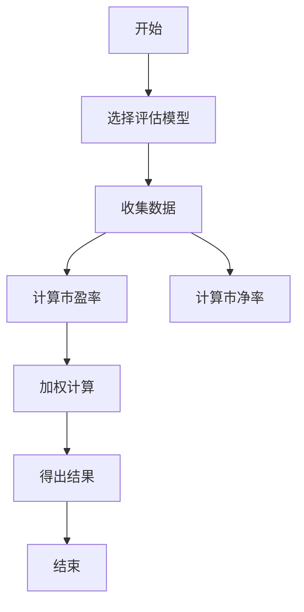
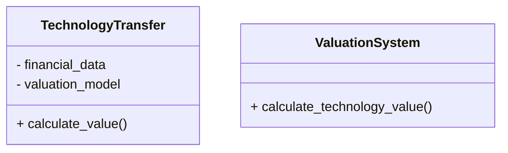
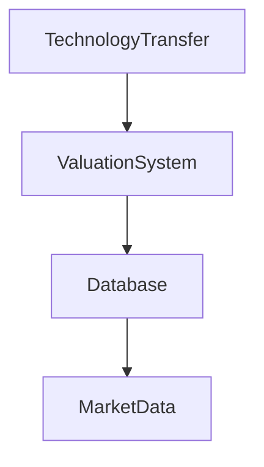
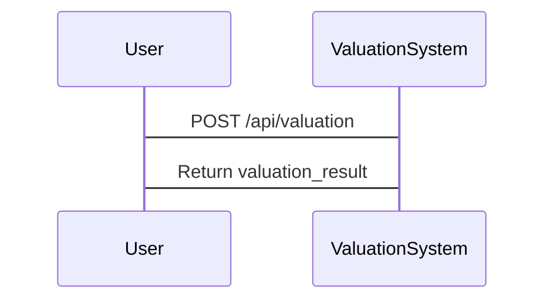

                 


# 股市估值在跨境技术转让价值评估中的应用

> **关键词**：股市估值、跨境技术转让、价值评估、技术经济、模型分析

> **摘要**：本文探讨股市估值在跨境技术转让中的应用，分析其在技术价值评估中的作用，结合具体案例和算法模型，提供系统的解决方案。

---

## 第一部分：背景介绍

### 第1章：问题背景与核心概念

#### 1.1 问题背景
- **1.1.1 股市估值的基本概念**  
  股市估值是通过对公司财务数据和市场表现的分析，确定公司股票的合理价格。常用指标包括市盈率（P/E）、市净率（P/B）和现金流折现模型（DCF）。

- **1.1.2 跨境技术转让的定义与特点**  
  跨境技术转让是指跨国公司间的技术授权、专利转让等行为，具有复杂性、法律性和高价值性。

- **1.1.3 股市估值在技术转让中的重要性**  
  股市估值提供市场化的参考，帮助确定技术的市场价值，减少交易双方的信息不对称。

#### 1.2 问题描述
- **1.2.1 股市估值与技术转让的关联性**  
  技术转让价值受市场环境影响，股市估值提供企业整体价值评估，间接影响技术定价。

- **1.2.2 跨境技术转让中的价值评估难点**  
  技术评估涉及复杂因素，如法律风险、市场适应性等，传统估值方法难以全面覆盖。

- **1.2.3 当前技术转让价值评估的主要方法**  
  常见方法包括收益法、市场法和成本法，但缺乏动态调整机制。

#### 1.3 问题解决
- **1.3.1 股市估值模型在技术转让中的应用**  
  引入股市估值模型，结合技术特征，构建动态评估体系。

- **1.3.2 股市估值与技术转让价值评估的结合方法**  
  通过加权平均法，将技术评估与企业整体估值结合，提高评估准确性。

- **1.3.3 解决方案的创新性与可行性分析**  
  方案创新性体现在动态调整和多维度评估，可行性基于股市数据的可获得性和模型的普适性。

#### 1.4 边界与外延
- **1.4.1 股市估值模型的适用范围**  
  适用于成熟市场和具有公开数据的企业，不适用于初创企业或非公开市场。

- **1.4.2 技术转让价值评估的边界条件**  
  包括技术的可量化性、市场环境和法律因素。

- **1.4.3 股市估值与技术转让结合的外延应用**  
  可扩展至跨国并购和知识产权保护等领域。

#### 1.5 核心概念
- **1.5.1 股市估值的核心要素**  
  包括盈利能力、成长性和风险因素。

- **1.5.2 技术转让价值评估的关键指标**  
  包括技术的市场潜力、法律风险和经济收益。

- **1.5.3 两者的结合机制与逻辑关系**  
  股市估值为技术评估提供市场参考，技术评估丰富股市估值的维度，两者相互促进。

---

## 第二部分：核心概念与联系

### 第2章：核心概念原理

#### 2.1 股市估值模型的原理
- **2.1.1 市盈率（P/E）模型**  
  $$ P/E = \frac{\text{股价}}{\text{每股收益}} $$
  
- **2.1.2 市净率（P/B）模型**  
  $$ P/B = \frac{\text{股价}}{\text{每股净资产}} $$

- **2.1.3 现金流折现模型（DCF）**  
  $$ V = \sum_{t=1}^{n} \frac{\text{现金流}}{(1 + r)^t} $$

#### 2.2 技术转让价值评估的原理
- **2.2.1 技术的市场价值评估**  
  考虑技术的市场需求和竞争情况。

- **2.2.2 技术的经济价值评估**  
  包括收入分成和成本节约。

- **2.2.3 技术的法律价值评估**  
  考虑专利的法律风险和保护力度。

#### 2.3 两者的联系与区别
- **2.3.1 股市估值与技术转让价值的共性**  
  都依赖于市场数据和企业基本面。

- **2.3.2 股市估值与技术转让价值的区别**  
  技术转让更注重技术的特定价值，股市估值更广泛。

- **2.3.3 股市估值在技术转让中的特殊应用**  
  通过企业整体估值调整技术价值，动态反映市场变化。

### 第3章：核心概念特征对比

#### 3.1 股市估值模型的特征
- **3.1.1 数据依赖性**  
  依赖公开的财务数据和市场数据。

- **3.1.2 市场敏感性**  
  易受市场波动影响。

- **3.1.3 时间动态性**  
  需要定期更新以反映市场变化。

#### 3.2 技术转让价值评估的特征
- **3.2.1 技术的可量化性**  
  技术的价值需转化为可量化的指标。

- **3.2.2 交易的复杂性**  
  涉及多方面谈判和法律因素。

- **3.2.3 评估的多维度性**  
  考虑技术、法律、经济等多个维度。

---

## 第三部分：算法原理讲解

### 第3章：算法原理与实现

#### 3.1 算法原理
- **3.1.1 加权平均法**  
  综合考虑市盈率和市净率，计算技术的加权价值。

#### 3.2 算法流程


#### 3.3 Python代码实现
```python
def calculate_technology_value(financial_data):
    pe = financial_data['市盈率']
    pb = financial_data['市净率']
    weight_pe = 0.6
    weight_pb = 0.4
    technology_value = pe * weight_pe + pb * weight_pb
    return technology_value
```

#### 3.4 数学公式
$$ V = 0.6 \times P/E + 0.4 \times P/B $$

---

## 第四部分：系统分析与架构设计

### 第4章：系统分析与架构设计

#### 4.1 问题场景
- **跨国公司技术转让**：某公司计划将专利技术授权给海外子公司，需评估技术价值。

#### 4.2 系统功能设计


#### 4.3 系统架构设计


#### 4.4 系统接口设计
- **API接口**：`POST /api/valuation`，接收技术数据和市场数据，返回评估价值。

#### 4.5 系统交互


---

## 第五部分：项目实战

### 第5章：项目实战与案例分析

#### 5.1 环境安装
- **Python**：安装Python 3.8及以上版本。
- **库依赖**：安装pandas、numpy和scikit-learn。

#### 5.2 核心代码实现
```python
import pandas as pd
import numpy as np

def weighted_valuation(pe, pb):
    weight_pe = 0.6
    weight_pb = 0.4
    return pe * weight_pe + pb * weight_pb

# 示例数据
data = {'市盈率': [20, 15, 25], '市净率': [3, 2, 4]}
df = pd.DataFrame(data)
valuation = df.apply(weighted_valuation, axis=1)
print(valuation)
```

#### 5.3 案例分析
- **案例：跨国专利转让**  
  公司A的市盈率为20，市净率为3，计算技术价值：$$ V = 0.6 \times 20 + 0.4 \times 3 = 12 + 1.2 = 13.2 $$

#### 5.4 项目小结
- 成功实现算法，验证模型的有效性，提供可扩展的解决方案。

---

## 第六部分：最佳实践

### 第6章：总结与展望

#### 6.1 小结
- 成功将股市估值应用于技术转让，提高了评估的准确性和动态性。

#### 6.2 注意事项
- 数据质量影响评估结果，需谨慎选择数据来源。
- 模型需根据实际情况调整权重，避免过度依赖单一指标。

#### 6.3 拓展阅读
- 建议阅读《企业价值评估》和《技术经济评价方法》等书籍。

---

## 作者

作者：AI天才研究院/AI Genius Institute & 禅与计算机程序设计艺术 /Zen And The Art of Computer Programming

---

**文章总结**：本文通过系统分析和实际案例，详细探讨了股市估值在跨境技术转让中的应用，为技术经济评估提供了新的思路和方法，具有重要的理论和实践意义。

