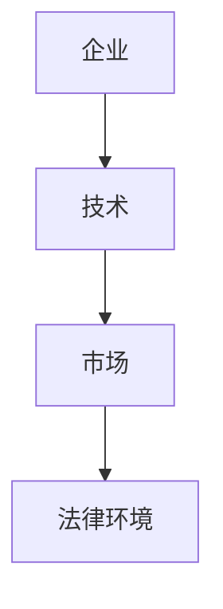
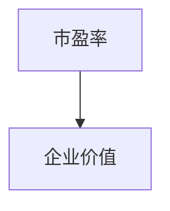
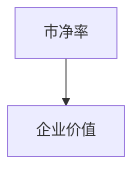
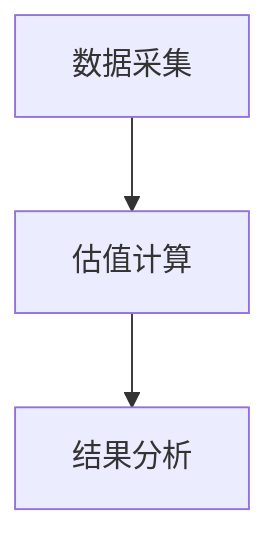

                 


# 股市估值在跨境技术转让定价中的应用

## 关键词：股市估值、技术转让定价、跨境、算法原理、系统架构、项目实战

## 摘要：  
本文深入探讨了股市估值在跨境技术转让定价中的应用，从核心概念、算法原理、系统架构到项目实战，全面解析了如何利用股市估值方法解决技术定价难题。通过实际案例和数学模型，展示了股市估值在技术转让中的具体应用，为读者提供了从理论到实践的完整解决方案。

---

## 第一部分：背景介绍

### 第1章：股市估值与跨境技术转让定价概述

#### 1.1 核心概念与问题背景  
**股市估值**是指通过市场数据和指标（如市盈率、市净率等）对企业的价值进行评估的过程。**技术转让定价**则是指在跨国交易中，对技术资产的价值进行合理定价。随着全球化的发展，技术转让已成为跨国企业的重要业务之一，而技术定价的合理性直接影响企业的利润和市场竞争力。  

#### 1.2 问题描述与解决  
在跨境技术转让中，技术的价值往往难以量化，且受法律、文化、市场环境等多种因素影响。传统的定价方法（如成本法、收益法）难以适应复杂多变的市场环境。股市估值作为一种基于市场数据的方法，能够通过公开的市场信息快速评估技术价值，为技术转让定价提供参考。  

#### 1.3 边界与外延  
股市估值的应用范围主要集中在技术资产的市场价值评估，但其结果需结合技术的法律、市场和行业特性进行调整。此外，股市估值仅适用于具有公开市场数据和技术可比性较高的领域。  

---

### 第2章：股市估值的核心原理  

#### 2.1 股市估值的基本原理  
股市估值主要基于以下几种方法：  
1. **市盈率法**：通过企业的市盈率与行业平均市盈率的对比，评估企业的价值。  
2. **市净率法**：通过企业的市净率与行业平均市净率的对比，评估企业的价值。  
3. **股权自由现金流法**：通过企业的自由现金流折现，评估企业的内在价值。  

#### 2.2 技术转让定价的理论基础  
技术转让定价的核心是技术的市场价值，而股市估值提供了基于市场的定价依据。通过分析可比企业的市场表现，可以快速估算技术的市场价值，并结合技术的特性和市场环境进行调整。  

---

## 第二部分：核心概念与联系  

### 第3章：股市估值与技术转让定价的联系  

#### 3.1 核心概念原理  
股市估值的核心在于通过市场数据反映企业的价值，而技术转让定价的核心在于通过合理的定价实现技术的市场价值最大化。两者的结合在于利用股市估值的方法，为技术定价提供数据支持。  

#### 3.2 概念属性对比  
| 属性       | 股市估值                          | 技术转让定价                    |
|------------|----------------------------------|---------------------------------|
| 动态性       | 市场环境变化快                   | 技术价值随市场需求变化           |
| 地域性       | 受地区市场环境影响               | 受法律、文化、市场环境影响       |
| 可比性       | 可比企业数据丰富                 | 可比技术案例有限                 |
| 独特性       | 企业具有独特性                   | 技术具有独特性                   |

#### 3.3 ER实体关系图  


---

## 第三部分：算法原理讲解  

### 第4章：常用股市估值算法  

#### 4.1 市盈率法  
市盈率法的核心公式为：  
$$ \text{市盈率} = \frac{\text{股价}}{\text{每股收益}} $$  

步骤：  
1. 收集可比企业的市盈率数据。  
2. 计算目标企业的市盈率。  
3. 比较目标企业的市盈率与行业平均市盈率，评估其价值。  



#### 4.2 市净率法  
市净率法的核心公式为：  
$$ \text{市净率} = \frac{\text{股价}}{\text{每股净资产}} $$  

步骤：  
1. 收集可比企业的市净率数据。  
2. 计算目标企业的市净率。  
3. 比较目标企业的市净率与行业平均市净率，评估其价值。  



#### 4.3 股权自由现金流法  
股权自由现金流法的核心公式为：  
$$ \text{股权价值} = \sum_{t=1}^{n} \frac{\text{自由现金流}_t}{(1 + r)^t} $$  

步骤：  
1. 预测目标企业的自由现金流。  
2. 选择合适的折现率。  
3. 计算股权价值。  

---

## 第四部分：数学模型与公式  

### 第5章：股市估值的数学模型  

#### 5.1 市盈率模型  
$$ \text{目标企业价值} = \text{行业平均市盈率} \times \text{目标企业每股收益} $$  

#### 5.2 市净率模型  
$$ \text{目标企业价值} = \text{行业平均市净率} \times \text{目标企业每股净资产} $$  

#### 5.3 股权自由现金流模型  
$$ \text{股权价值} = \sum_{t=1}^{n} \frac{\text{自由现金流}_t}{(1 + r)^t} $$  

---

## 第五部分：系统分析与架构设计  

### 第6章：系统架构设计  

#### 6.1 项目背景  
跨境技术转让定价的复杂性要求我们构建一个基于股市估值的系统，以快速、准确地评估技术价值。  

#### 6.2 系统功能设计  
- **数据采集**：收集可比企业的市场数据。  
- **估值计算**：基于市盈率、市净率等方法计算技术价值。  
- **结果分析**：对比估值结果与实际市场表现，调整定价策略。  

#### 6.3 系统架构图  


---

## 第六部分：项目实战  

### 第7章：项目实战  

#### 7.1 环境安装  
- 安装Python和相关库（如pandas、numpy）。  

#### 7.2 核心代码  
```python
import pandas as pd
data = pd.read_csv('stock_data.csv')
data['市盈率'] = data['股价'] / data['每股收益']
print(data['市盈率'].mean())
```

#### 7.3 案例分析  
假设某技术的目标企业市盈率为20，行业平均市盈率为18，目标企业的每股收益为5元，则目标企业价值为：  
$$ \text{目标企业价值} = 18 \times 5 = 90 \text{元} $$  

---

## 第七部分：最佳实践  

### 第8章：最佳实践  

#### 8.1 实用建议  
- 选择合适的估值方法，结合技术特性和市场环境。  
- 定期更新估值模型，适应市场变化。  

#### 8.2 小结  
股市估值在跨境技术转让定价中的应用为技术定价提供了科学依据，但需要结合实际市场环境进行调整。  

---

## 作者：AI天才研究院 & 禅与计算机程序设计艺术

