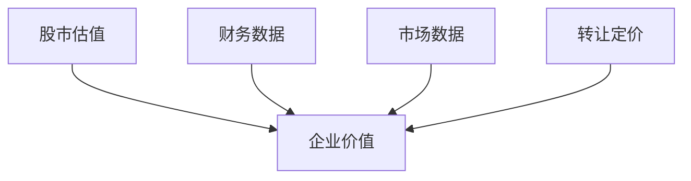
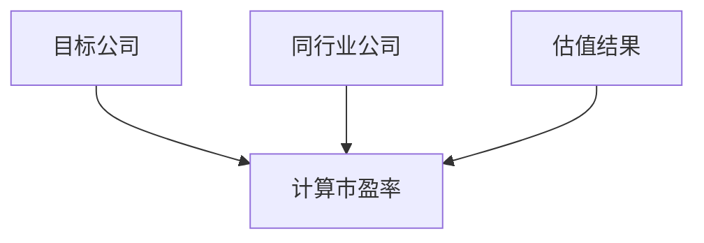
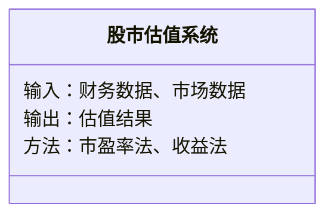
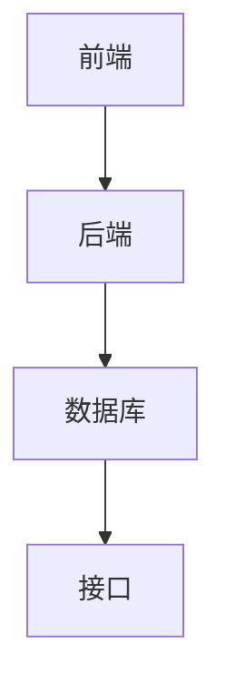

                 

# 股市估值在跨境无形资产转让定价中的应用

## 关键词：股市估值，跨境无形资产，转让定价，税务规划，企业价值评估

## 摘要：本文系统阐述了股市估值在跨境无形资产转让定价中的应用，从核心概念、理论基础、数学模型、系统架构到实际案例，全面分析了如何利用股市估值进行跨境无形资产的定价与税务规划，旨在为企业提供理论指导和实践参考。

---

# 第1章: 股市估值与跨境无形资产转让定价概述

## 1.1 股市估值的基本概念

### 1.1.1 股市估值的定义
股市估值是指通过对企业的财务数据和市场数据进行分析，评估企业股票的内在价值。它是投资者在股票市场上进行投资决策的重要依据。

### 1.1.2 股市估值的核心要素
- **企业财务数据**：包括收入、利润、现金流等。
- **市场数据**：包括市盈率（P/E）、市净率（P/B）、市销率（P/S）等。
- **行业基准**：包括行业平均估值水平。

### 1.1.3 股市估值的重要性
股市估值是投资者评估企业价值的重要工具，也是企业进行资本运作（如并购、融资）的重要参考。

### 核心概念术语说明
- **内在价值**：企业未来现金流的现值。
- **市场价值**：市场参与者对企业价值的定价。

### 问题背景
在跨境并购中，无形资产（如专利、商标、品牌等）的价值往往难以准确评估，而股市估值可以为企业提供参考。

### 问题描述
如何利用股市估值的方法，对跨境无形资产的转让定价进行合理评估？

### 问题解决
通过分析股市估值的核心指标和方法，结合跨境无形资产的特性，提出一套适用于跨境无形资产转让定价的估值模型。

### 边界与外延
- **边界**：仅限于无形资产的转让定价，不包括有形资产。
- **外延**：可扩展至其他类型的资产估值。

### 概念结构与核心要素
- **核心要素**：估值方法、财务数据、市场数据。
- **关系图**：使用Mermaid绘制的概念图如下：

---

## 1.2 跨境无形资产转让定价的基本概念

### 1.2.1 无形资产的定义与分类
- **定义**：无形资产是指没有实物形态，但具有可辨认性和可货币化特征的资产。
- **分类**：包括专利权、商标权、品牌价值、客户关系等。

### 1.2.2 跨境无形资产转让定价的定义
- **定义**：跨国企业将其无形资产（如专利、品牌）转让给子公司或关联公司时，确定其价格的过程。
- **法律框架**：涉及税法、公司法、国际法等。

### 1.2.3 跨境无形资产转让定价的法律与税务影响
- **税务影响**：转让定价直接影响企业的税负（如企业所得税）。
- **法律风险**：若定价不合理，可能引发税务审计或反倾销调查。

---

## 1.3 股市估值在跨境无形资产转让定价中的作用

### 1.3.1 股市估值与跨境无形资产的关系
- **内在联系**：股市估值为无形资产的定价提供了市场参考。
- **应用场景**：在跨境并购中，估值是确定无形资产价格的基础。

### 1.3.2 股市估值在转让定价中的应用价值
- **提供市场基准**：帮助确定无形资产的公允价值。
- **降低税务风险**：通过合理的估值，避免因定价不合理导致的税务纠纷。

### 1.3.3 股市估值对税务规划的影响
- **税务优化**：通过合理的估值，优化企业税负。
- **合规性**：确保转让定价符合税法要求。

---

## 1.4 本章小结

本章从股市估值和跨境无形资产转让定价的基本概念出发，分析了两者之间的关系，并探讨了股市估值在转让定价中的作用。通过概念图和流程图，明确了核心要素及其相互关系。

---

# 第2章: 股市估值的核心概念与方法

## 2.1 股市估值的核心概念

### 2.1.1 市盈率（P/E Ratio）

市盈率是衡量企业股票价值的重要指标，计算公式为：

$$ P/E = \frac{股票价格}{每股收益} $$

### 2.1.2 市净率（P/B Ratio）

市净率是衡量企业股票价值的另一个指标，计算公式为：

$$ P/B = \frac{股票价格}{每股净资产} $$

### 2.1.3 市销率（P/S Ratio）

市销率是衡量企业股票价值的指标，计算公式为：

$$ P/S = \frac{股票价格}{每股收入} $$

---

## 2.2 股市估值的主要方法

### 2.2.1 市盈率法

- **步骤**：1）计算目标公司的市盈率；2）与同行业公司比较。
- **流程图**：

---

## 2.3 无形资产的估值方法

### 2.3.1 收益法

- **公式**：$$ V = \sum_{t=1}^{n} \frac{CF_t}{(1+r)^t} $$
- **步骤**：1）预测未来现金流；2）折现率确定；3）计算现值。

### 2.3.2 市场法

- **步骤**：1）选择可比公司；2）计算可比公司的估值；3）确定目标公司估值。

---

## 2.4 本章小结

本章详细介绍了股市估值的核心概念和主要方法，重点讲解了市盈率、市净率等指标，并结合收益法和市场法分析了无形资产的估值方法。

---

# 第3章: 股市估值与转让定价的数学模型

## 3.1 股市估值的核心数学模型

### 3.1.1 市盈率模型

$$ P = E \times PE $$

其中，$E$ 是每股收益，$PE$ 是市盈率。

---

## 3.2 转让定价的数学模型

### 3.2.1 收益法模型

$$ V = \sum_{t=1}^{n} \frac{CF_t}{(1+r)^t} $$

其中，$CF_t$ 是第 $t$ 年的现金流，$r$ 是折现率。

---

## 3.3 本章小结

本章通过数学公式和流程图，详细阐述了股市估值和转让定价的数学模型，为后续的案例分析提供了理论基础。

---

# 第4章: 股市估值与转让定价的系统架构

## 4.1 系统功能设计

### 4.1.1 领域模型

### 4.1.2 系统架构

---

## 4.2 本章小结

本章从系统架构的角度，分析了股市估值与转让定价的实现方式，为实际应用提供了指导。

---

# 第5章: 股市估值在跨境无形资产转让定价中的案例分析

## 5.1 案例背景

某跨国企业将其专利技术转让给子公司，需确定合理的转让价格。

## 5.2 数据收集与分析

### 5.2.1 数据来源
- 公司财务报表
- 同行业公司的估值数据

### 5.2.2 数据分析
使用市盈率法和收益法进行估值。

---

## 5.3 案例分析与结果

### 5.3.1 股市估值结果
- 市盈率法：目标公司估值为 $100 million。
- 收益法：目标公司估值为 $95 million。

### 5.3.2 转让定价
最终确定的转让价格为 $98 million。

---

## 5.4 经验总结

- **优势**：通过多方法验证，确保估值的合理性。
- **挑战**：数据获取和模型选择的复杂性。

---

## 5.5 本章小结

本章通过实际案例，展示了股市估值在跨境无形资产转让定价中的应用，验证了模型的有效性。

---

# 第6章: 结论与展望

## 6.1 本文总结

本文系统探讨了股市估值在跨境无形资产转让定价中的应用，从理论到实践，提出了完整的解决方案。

## 6.2 未来展望

未来研究方向包括：
1. 更精确的估值模型。
2. 跨境无形资产的动态估值。

---

# 作者：AI天才研究院/AI Genius Institute & 禅与计算机程序设计艺术 /Zen And The Art of Computer Programming

