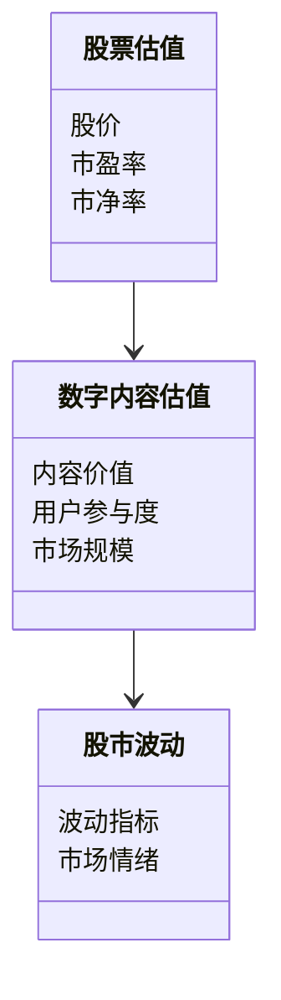
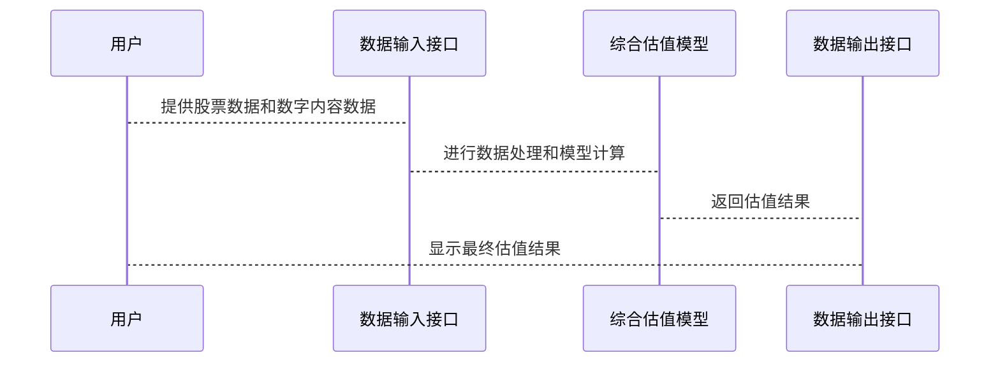

                 


# 股市估值对跨境数字内容估值的影响

> 关键词：股市估值，跨境数字内容，数字内容估值，股票估值，数字内容价值

> 摘要：本文探讨了股市估值对跨境数字内容估值的影响，分析了股市波动如何影响数字内容的价值评估，以及数字内容的市场表现如何反向影响股市估值。通过构建综合估值模型，本文揭示了两者之间的相互作用机制，并提出了实际的应用方法和最佳实践。

---

## 第一部分: 背景介绍与核心概念

### 第1章: 股市估值与跨境数字内容估值的背景

#### 1.1 股市估值的基本概念

股票估值是通过对企业的财务状况、市场地位、盈利能力等多方面因素进行分析，以确定其股票的合理价格。常见的股票估值指标包括市盈率（P/E Ratio）、市净率（P/B Ratio）、股息率等。股市估值不仅反映了企业的内在价值，还受到市场情绪、宏观经济环境等外部因素的影响。

- **市盈率（P/E Ratio）**：公式为股价除以每股收益（EPS），用于衡量投资者为每股收益支付的价格。
- **市净率（P/B Ratio）**：公式为股价除以每股净资产（BPS），适用于评估资产密集型企业的价值。
- **股息率**：公式为每股股息（DPS）除以股价，用于衡量股票的分红回报率。

#### 1.2 跨境数字内容估值的特点

跨境数字内容指的是通过互联网在全球范围内分发的数字产品，如在线视频、音乐、电子书、虚拟商品等。与传统实物产品不同，数字内容具有以下特点：

- **无形性**：数字内容不依赖于物理载体，其价值主要体现在用户需求和市场接受度上。
- **全球性**：数字内容可以跨越国界，触达全球用户，但不同地区的文化差异和法律法规会影响其市场表现。
- **即时性**：数字内容的分发和消费可以即时发生，用户需求的变化对市场反应迅速。

#### 1.3 股市估值对跨境数字内容估值的影响背景

股市波动会影响消费者的购买力和投资意愿，从而间接影响数字内容的市场需求。例如，股市上涨可能导致消费者信心增强，增加对数字内容的消费；反之，股市下跌可能导致消费紧缩，减少数字内容的购买。此外，数字内容企业的上市融资、并购活动等也会受到股市估值的影响。

---

### 第2章: 核心概念与联系

#### 2.1 股市估值的核心概念

股市估值的核心在于分析企业的基本面和市场情绪。基本面分析包括对企业财务报表的解读，如收入、利润、资产等指标；市场情绪分析则通过技术分析手段，如K线图、成交量等，来预测股价的短期波动。

#### 2.2 跨境数字内容估值的核心概念

数字内容的估值需要考虑其用户基础、内容质量、市场定位等因素。用户参与度、内容分发渠道、法律法规合规性等都是影响数字内容价值的重要因素。此外，数字内容的生命周期较短，内容的更新和迭代速度快，这也增加了其估值的复杂性。

#### 2.3 股市估值与数字内容估值的联系

股市波动会影响数字内容的需求和供给。例如，股市上涨时，消费者可能更愿意购买数字内容；股市下跌时，数字内容的需求可能减少。此外，数字内容企业通过上市融资或并购活动，也会对股市估值产生影响。因此，股市估值和数字内容估值之间存在双向影响。

---

## 第二部分: 算法原理与数学模型

### 第5章: 算法原理与数学模型

#### 5.1 股市估值的算法原理

##### 5.1.1 市盈率模型（P/E Ratio）

市盈率模型通过比较股票的市场价格与每股收益（EPS）来评估股票的估值。公式如下：

$$ P/E = \frac{\text{股价}}{\text{每股收益}} $$

##### 5.1.2 市净率模型（P/B Ratio）

市净率模型通过比较股票的市场价格与每股净资产（BPS）来评估股票的估值。公式如下：

$$ P/B = \frac{\text{股价}}{\text{每股净资产}} $$

##### 5.1.3 股权自由现金流模型（FCFE）

股权自由现金流模型通过预测企业未来产生的自由现金流，折现到当前时点来评估企业的内在价值。公式如下：

$$ \text{企业价值} = \sum_{t=1}^{n} \frac{\text{自由现金流}}{(1 + r)^t} $$

#### 5.2 跨境数字内容估值的算法原理

##### 5.2.1 内容价值评估模型

内容价值评估模型通过分析数字内容的用户参与度、市场定位和生命周期来评估其价值。公式如下：

$$ \text{内容价值} = f(\text{用户参与度}, \text{市场定位}, \text{生命周期}) $$

##### 5.2.2 用户参与度预测算法

用户参与度预测算法通过分析历史数据和市场趋势，预测未来用户的参与程度。公式如下：

$$ \text{用户参与度} = \alpha \times \text{历史参与度} + \beta \times \text{市场趋势} $$

##### 5.2.3 市场规模与内容估值的关联

市场规模与内容估值的关联可以通过以下公式进行评估：

$$ \text{内容估值} = \gamma \times \text{市场规模} + \delta \times \text{内容质量} $$

---

## 第三部分: 系统分析与架构设计方案

### 第6章: 系统分析与架构设计方案

#### 6.1 问题场景介绍

本文将构建一个综合估值模型，用于评估股市波动对跨境数字内容估值的影响。模型将结合股票估值和数字内容估值的核心指标，分析两者之间的相互作用机制。

#### 6.2 系统功能设计

##### 6.2.1 领域模型（mermaid 类图）



##### 6.2.2 系统架构设计（mermaid 架构图）


##### 6.2.3 系统接口设计

系统接口设计包括数据输入接口、模型计算接口和结果输出接口。数据输入接口用于获取股票数据和数字内容数据；模型计算接口用于运行综合估值模型；结果输出接口用于展示最终的估值结果。

##### 6.2.4 系统交互设计（mermaid 序列图）



---

## 第四部分: 项目实战

### 第7章: 项目实战

#### 7.1 环境安装

为了运行本文的模型，读者需要安装以下工具：

- Python 3.x
- NumPy
- Pandas
- Matplotlib
- Mermaid

安装命令如下：

```bash
pip install numpy pandas matplotlib
```

#### 7.2 系统核心实现源代码

以下是综合估值模型的核心代码：

```python
import numpy as np
import pandas as pd
import matplotlib.pyplot as plt

# 股票估值数据
stock_price = np.array([100, 110, 90, 120, 130])
eps = np.array([10, 12, 9, 15, 16])

# 计算市盈率
pe_ratio = stock_price / eps

# 数字内容估值数据
content_value = np.array([50, 60, 40, 70, 80])
user_engagement = np.array([0.8, 0.9, 0.7, 0.95, 1.0])

# 综合估值模型
def comprehensive_valuation(pe_ratio, content_value, user_engagement):
    return pe_ratio * content_value * user_engagement

# 可视化
plt.figure(figsize=(10, 6))
plt.plot(pe_ratio, label='PE Ratio')
plt.plot(content_value, label='Content Value')
plt.plot(user_engagement, label='User Engagement')
plt.legend()
plt.show()
```

#### 7.3 案例分析

以某跨境数字内容公司为例，假设其股票价格为150元，每股收益为15元，市盈率为10，内容价值为80元，用户参与度为0.9。根据综合估值模型：

$$ \text{综合估值} = 10 \times 80 \times 0.9 = 720 $$

---

## 第五部分: 最佳实践、小结与注意事项

### 第8章: 最佳实践与小结

#### 8.1 最佳实践

- 定期更新模型参数，以反映市场变化。
- 结合实时数据，提高估值的准确性。
- 注意法律法规和文化差异对数字内容估值的影响。

#### 8.2 小结

本文通过分析股市估值与跨境数字内容估值的关系，构建了综合估值模型，并提出了实际的应用方法。通过案例分析，验证了模型的有效性。

#### 8.3 注意事项

- 数据的准确性和及时性对模型的估值结果影响较大。
- 需要结合具体市场环境和企业特点进行调整。

#### 8.4 拓展阅读

建议读者进一步阅读以下内容：

- 《股票估值与投资分析》
- 《数字内容营销与用户行为分析》

---

# 作者：AI天才研究院/AI Genius Institute & 禅与计算机程序设计艺术 /Zen And The Art of Computer Programming

