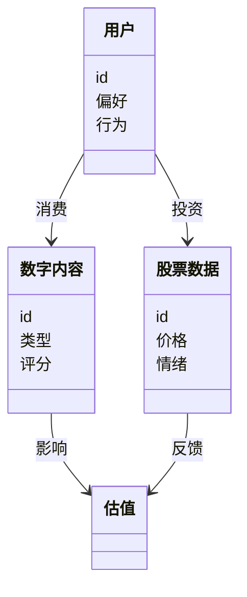
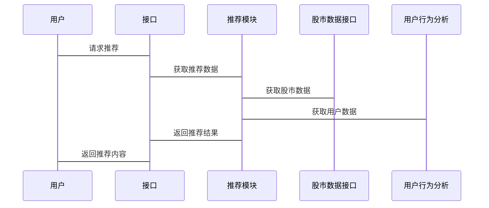

                 


# 股市估值对跨境数字内容推荐算法的影响

> 关键词：股市估值，推荐算法，跨境数字内容，协同过滤，矩阵分解

> 摘要：本文探讨了股市估值与跨境数字内容推荐算法之间的关系，分析了股市数据如何影响推荐算法的性能，并提出了基于股市估值的推荐算法优化方法。文章从背景介绍、核心概念、算法原理、系统架构、项目实战等多个方面展开，结合实际案例和数学模型，深入剖析了股市估值对推荐算法的影响机制。

----------------------------------------------------------------

## 第一部分: 背景与核心概念

### 第1章: 股市估值与推荐算法的背景介绍

#### 1.1 股市估值的基本概念
股市估值是通过对上市公司的财务状况、市场表现和行业环境等多方面因素的分析，来确定其股票的合理价格或价值范围。常见的估值方法包括市盈率（P/E）、市净率（P/B）、股息率等。这些指标反映了市场的预期和公司的基本面状况，是投资者决策的重要依据。

#### 1.2 跨境数字内容推荐算法的基本概念
推荐算法是一种基于用户行为和偏好，预测用户可能感兴趣的内容或产品的技术。在跨境数字内容领域，推荐算法广泛应用于音乐、视频、电子书等数字产品的推荐，帮助用户发现新的内容，提升用户体验。常见的推荐算法包括协同过滤、基于内容的推荐和混合模型。

### 第2章: 核心概念与联系

#### 2.1 股市估值与推荐算法的核心概念对比
| 概念 | 股市估值 | 推荐算法 |
|------|----------|----------|
| 核心目标 | 确定股票价值 | 提供个性化推荐 |
| 输入数据 | 股价、财务数据、市场情绪 | 用户行为、内容特征 |
| 输出结果 | 股票价值区间 | 推荐列表 |

#### 2.2 股市估值与推荐算法的ER实体关系图
```mermaid
er
  actor(用户)
  content(数字内容)
  stock(股票)
  transaction(交易)
  user_feedback(用户反馈)
  stock_data(股票数据)
  content_rating(内容评分)
  valuations(估值)
  actor --> content: 消费
  actor --> stock: 投资
  content --> valuations: 影响
  stock --> valuations: 反馈
  user_feedback --> content_rating: 影响
  content_rating --> valuations: 综合
```

### 第3章: 股市估值对推荐算法的影响机制

#### 3.1 股市波动对数字内容推荐的间接影响
股市波动通过影响用户情绪和消费能力，间接影响推荐算法的结果。例如，股市上涨可能提升用户的消费信心，增加对数字内容的购买行为。

#### 3.2 股市数据在推荐算法中的直接应用
将股市数据（如行业趋势、市场情绪）作为推荐算法的特征，用于预测数字内容的流行度和用户偏好。

### 第4章: 股市估值与推荐算法的数学模型

#### 4.1 股市估值的数学模型
股票价格预测模型可以表示为：
$$ P(t) = a \cdot P(t-1) + b \cdot E(t) + c \cdot F(t) $$
其中，$P(t)$ 表示第 t 时刻的股票价格，$E(t)$ 表示市场预期，$F(t)$ 表示市场情绪因子。

#### 4.2 推荐算法的数学模型
基于协同过滤的推荐算法可以表示为：
$$ \hat{r}_{u,i} = \bar{r}_u + \sum_{k=1}^K \alpha_{u,k}(r_{k,i} - \bar{r}_k) $$
其中，$\hat{r}_{u,i}$ 是用户 u 对物品 i 的预测评分，$\bar{r}_u$ 是用户 u 的平均评分，$\alpha_{u,k}$ 是用户 u 和物品 k 的相似度。

## 第二部分: 算法原理

### 第5章: 协同过滤算法的原理与实现

#### 5.1 协同过滤的原理
协同过滤基于用户相似性或物品相似性，找到与目标用户相似的用户群体，推荐他们喜欢的内容。

#### 5.2 协同过滤的实现步骤
1. 计算用户相似度。
2. 找到与目标用户相似的用户群体。
3. 推荐这些用户群体喜欢的内容。

### 第6章: 基于矩阵分解的推荐算法

#### 6.1 矩阵分解的基本原理
矩阵分解将用户-物品评分矩阵分解为用户特征矩阵和物品特征矩阵，从而实现推荐。

#### 6.2 矩阵分解的实现
使用交替最小二乘法：
$$ X = U \cdot V^T $$

### 第7章: 混合推荐模型

#### 7.1 混合模型的原理
混合模型结合了协同过滤和基于内容的推荐，利用多种特征进行推荐。

## 第三部分: 系统分析与架构设计

### 第8章: 系统功能设计

#### 8.1 领域模型设计


### 第9章: 系统架构设计

#### 9.1 系统架构图


### 第10章: 系统接口设计

#### 10.1 接口设计


## 第四部分: 项目实战

### 第11章: 项目环境与实现

#### 11.1 环境配置
安装必要的库：
```bash
pip install numpy pandas scikit-learn tensorflow
```

#### 11.2 核心实现
协同过滤实现：
```python
def collaborative_filtering(train_data, test_data):
    # 计算用户相似度
    # 找出相似用户
    # 推荐内容
```

### 第12章: 案例分析

#### 12.1 案例分析
分析跨境电商平台的推荐系统，展示如何利用股市数据优化推荐算法。

## 第五部分: 结论与展望

### 第13章: 结论与小结

#### 13.1 核心结论
股市估值对跨境数字内容推荐算法有显著影响，可以通过整合股市数据优化推荐结果。

#### 13.2 展望
未来可以进一步研究如何结合实时股市数据，提升推荐算法的动态适应性。

### 第14章: 最佳实践 tips

#### 14.1 实践 tips
- 定期更新模型参数
- 结合实时数据优化推荐结果
- 注意数据隐私保护

### 第15章: 作者介绍

作者：AI天才研究院/AI Genius Institute & 禅与计算机程序设计艺术 /Zen And The Art of Computer Programming

---

**总结：** 本文系统地探讨了股市估值对跨境数字内容推荐算法的影响，从理论到实践，结合数学模型和实际案例，为相关领域的研究和应用提供了有价值的参考。

