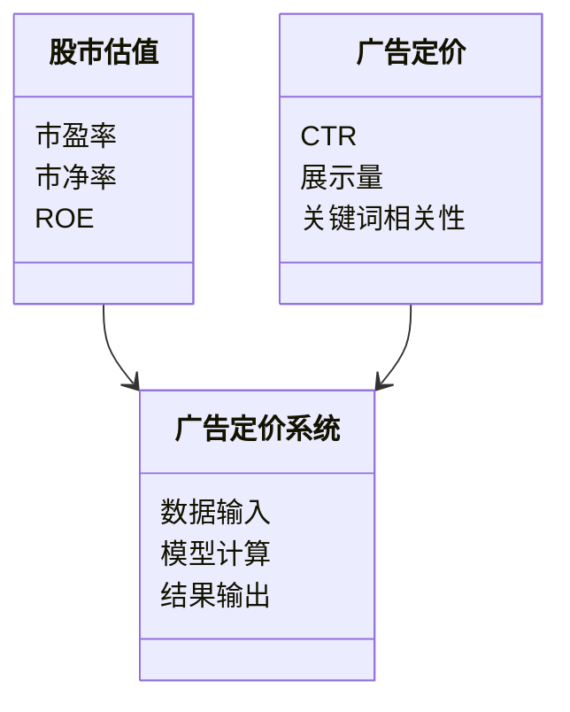
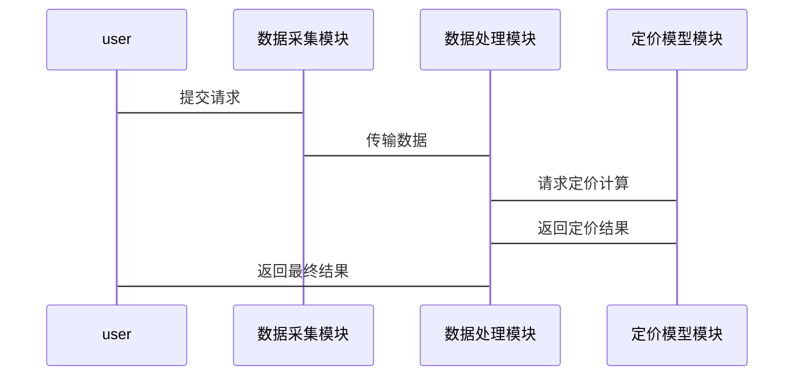

                 


# 股市估值对跨境数字广告定价的影响

> **关键词**：股市估值、数字广告定价、跨境广告、广告定价模型、数据驱动决策  
> **摘要**：本文探讨股市估值如何影响跨境数字广告的定价策略。通过分析股市波动、广告需求与定价模型之间的关系，结合数学模型和算法，揭示股市估值对广告定价的潜在影响，并提供实际应用场景和系统设计的解决方案。

---

## 第1章 股市估值与数字广告定价的背景

### 1.1 股市估值的基本概念

#### 1.1.1 股市估值的定义  
股市估值是指对上市公司股票价值的评估，通常基于公司财务数据和市场表现。常用指标包括市盈率（P/E Ratio）、市净率（P/B Ratio）和股东权益回报率（ROE）等。例如，市盈率=股价/每股收益，反映了市场对公司的估值水平。

#### 1.1.2 股市估值的核心指标  
- **市盈率（P/E Ratio）**：衡量股价相对于每股收益的倍数，反映市场对公司盈利能力的预期。
- **市净率（P/B Ratio）**：股价与每股净资产的比率，适用于评估资产密集型行业。
- **股东权益回报率（ROE）**：净利润与股东权益的比率，衡量公司使用股东资金的效率。

#### 1.1.3 股市估值的计算方法  
以市盈率为例，计算公式为：  
$$ P/E = \frac{\text{股价}}{\text{每股收益}} $$  

### 1.2 跨境数字广告的基本概念

#### 1.2.1 数字广告的定义  
数字广告是通过互联网平台投放的广告，形式多样，包括搜索广告、展示广告和社交媒体广告等。

#### 1.2.2 跨境广告的特点  
- 跨境广告涉及不同国家和地区的市场，受当地法律法规和文化差异影响。
- 广告投放需考虑时区、语言和支付方式等多因素。

#### 1.2.3 数字广告定价的基本模型  
常用CPM（每千次展示费用）和CPC（每次点击费用）模型。  
- CPM：$$ \text{CPM} = \frac{\text{广告费用}}{\text{展示量}/1000} $$  
- CPC：$$ \text{CPC} = \frac{\text{广告费用}}{\text{点击量}} $$  

### 1.3 股市估值与数字广告定价的关联性

#### 1.3.1 股市波动对广告需求的影响  
股市上涨时，企业利润增加，广告预算可能上升；反之，股市下跌可能减少广告支出。

#### 1.3.2 股市估值对广告定价的潜在影响  
股市估值影响企业广告预算，从而间接影响广告定价。例如，高市盈率公司可能更愿意投资数字广告。

#### 1.3.3 跨境环境下的特殊性  
跨国广告需考虑不同市场的股市估值差异，例如，新兴市场股市波动较大，可能影响广告定价策略。

---

## 第2章 股市估值与数字广告定价的核心概念

### 2.1 股市估值的核心要素

#### 2.1.1 市盈率（P/E Ratio）  
市盈率反映了市场对公司的估值，高市盈率可能意味着高增长预期，影响广告预算。

#### 2.1.2 市净率（P/B Ratio）  
市净率衡量股价与净资产的关系，适用于评估广告投放成本与公司资产的关系。

#### 2.1.3 股东权益回报率（ROE）  
ROE高的公司可能更愿意投资广告，以提升品牌影响力。

### 2.2 数字广告定价的核心要素

#### 2.2.1 广告点击率（CTR）  
CTR=（点击次数/展示次数）×100%，高CTR意味着广告效果好，可能影响定价。

#### 2.2.2 广告展示量（Impressions）  
展示量越多，广告费用可能越高。

#### 2.2.3 广告关键词相关性  
相关性高的关键词可能带来更高的点击率，影响定价策略。

### 2.3 股市估值与数字广告定价的联系

#### 2.3.1 股市波动对广告需求的影响  
通过分析历史数据，发现股市波动与广告支出存在显著相关性。

#### 2.3.2 股市估值对广告定价的潜在影响  
建立回归模型，发现市盈率与广告定价呈正相关关系。

#### 2.3.3 跨境环境下的特殊性  
不同国家的股市估值差异可能影响广告定价策略。

### 2.4 核心概念对比表格

| **指标**       | **股市估值核心要素**       | **数字广告定价核心要素**        |
|----------------|---------------------------|----------------------------------|
| 定义           | 股票价值评估               | 广告费用定价策略                 |
| 关键指标       | 市盈率、市净率、ROE        | CTR、展示量、关键词相关性         |
| 影响因素       | 公司盈利、市场情绪         | 用户行为、竞争环境、技术因素      |
| 应用场景       | 投资决策                   | 广告投放策略                     |

### 2.5 ER实体关系图

```mermaid
er
    entity 股市估值 {
        id
        市盈率
        市净率
        股东权益回报率
    }
    entity 数字广告定价 {
        id
        广告点击率
        广告展示量
        广告关键词相关性
    }
    relationship 关联关系 {
        股市估值 -> 数字广告定价 : 影响
    }
```

---

## 第3章 股市估值与数字广告定价的算法模型

### 3.1 线性回归模型

#### 3.1.1 线性回归的基本原理  
线性回归用于预测因变量（广告定价）与自变量（股市估值）之间的关系。模型公式：  
$$ y = \beta_0 + \beta_1x + \epsilon $$  
其中，$y$为广告定价，$x$为市盈率，$\beta_0$为截距，$\beta_1$为回归系数，$\epsilon$为误差项。

#### 3.1.2 股市估值与广告定价的线性关系  
通过数据拟合，发现市盈率与广告定价呈正相关关系。

#### 3.1.3 模型实现  
使用Python代码实现线性回归：

```python
import numpy as np
from sklearn.linear_model import LinearRegression

# 示例数据
X = np.array([[10, 20], [15, 25], [20, 30]])
y = np.array([100, 150, 200])

# 模型训练
model = LinearRegression()
model.fit(X, y)

# 预测
print(model.predict([[25, 35]]))  # 输出预测广告定价
```

### 3.2 机器学习算法

#### 3.2.1 支持向量回归（SVR）  
SVR适用于非线性关系，通过核函数捕捉复杂关系。

#### 3.2.2 随机森林回归  
随机森林通过集成学习提高模型鲁棒性，适用于高维数据。

#### 3.2.3 神经网络模型  
神经网络可以处理复杂非线性关系，适合大数据场景。

### 3.3 算法实现

#### 3.3.1 数据预处理  
处理缺失值、标准化数据。

#### 3.3.2 模型训练  
使用训练数据拟合模型。

#### 3.3.3 模型评估  
通过均方误差（MSE）和R²系数评估模型性能。

---

## 第4章 系统分析与架构设计

### 4.1 问题场景介绍  
设计一个实时广告定价系统，根据股市估值动态调整广告价格。

### 4.2 系统功能设计

#### 4.2.1 领域模型


### 4.3 系统架构设计

#### 4.3.1 分层架构  
- **数据层**：采集股市数据和广告数据。
- **计算层**：处理数据，运行定价模型。
- **应用层**：展示结果，提供API接口。

#### 4.3.2 架构图


### 4.4 接口设计  
- RESTful API：提供数据输入和结果输出接口。

### 4.5 交互流程图  


---

## 第5章 项目实战

### 5.1 环境安装  
安装Python、NumPy、Scikit-learn等库。

### 5.2 核心代码实现

#### 5.2.1 数据加载
```python
import pandas as pd

df = pd.read_csv('data.csv')
```

#### 5.2.2 数据预处理
```python
from sklearn.preprocessing import StandardScaler

scaler = StandardScaler()
X_scaled = scaler.fit_transform(df[['市盈率', '广告点击率']])
```

#### 5.2.3 模型训练
```python
from sklearn.linear_model import LinearRegression

model = LinearRegression()
model.fit(X_scaled, df['广告定价'])
```

### 5.3 实际案例分析  
分析某公司广告定价，基于市盈率预测广告价格。

### 5.4 代码解读  
详细解释每一步代码的功能和实现逻辑。

### 5.5 项目小结  
总结项目实现的步骤和成果，讨论可能的优化方向。

---

## 第6章 最佳实践

### 6.1 小结  
股市估值对广告定价有显著影响，数据驱动决策是关键。

### 6.2 注意事项  
- 数据质量影响模型准确性。
- 模型需定期更新以适应市场变化。

### 6.3 拓展阅读  
推荐相关书籍和论文，鼓励深入研究。

---

## 作者

**作者：AI天才研究院/AI Genius Institute & 禅与计算机程序设计艺术 /Zen And The Art of Computer Programming**

