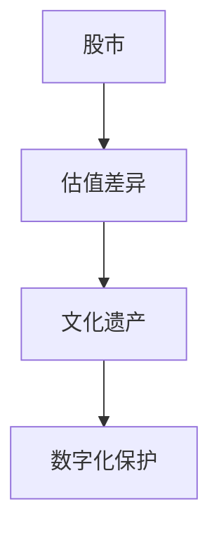
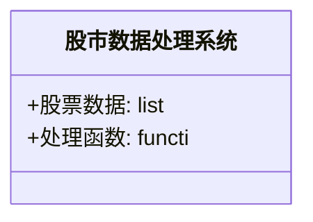
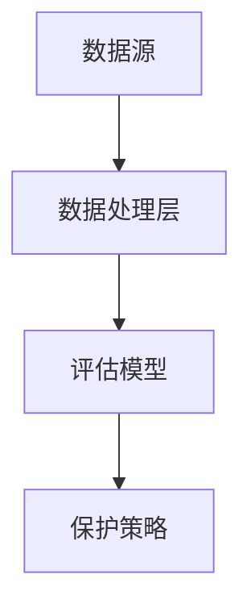

                 


# 股市估值差异对国际文化遗产数字化保护的影响

> 关键词：股市估值差异、文化遗产、数字化保护、算法模型、系统架构

> 摘要：本文探讨了股市估值差异对国际文化遗产数字化保护的影响，分析了数字化保护对文化遗产的影响，结合数学模型和算法，提出了系统的保护策略。

---

# 目录

1. **背景与核心概念**  
   1.1 背景介绍  
   1.2 核心概念与联系  
2. **理论与方法**  
   2.1 算法原理讲解  
   2.2 数学模型与公式  
3. **系统分析与设计**  
   3.1 系统分析  
   3.2 架构设计方案  
4. **项目实战**  
   4.1 项目介绍  
   4.2 核心代码实现  
   4.3 案例分析  
5. **结论与展望**  

---

## 第1章: 背景与核心概念

### 1.1 背景介绍

#### 1.1.1 股市估值差异的定义与特征
- **定义**：股市估值差异指不同投资者或机构对同一资产的不同估值。
- **特征**：动态性、主观性、市场环境依赖性。

#### 1.1.2 国际文化遗产数字化保护的现状
- **现状**：数字化技术广泛应用于文化遗产保护，如3D建模、数字档案。
- **挑战**：技术标准不统一、数据管理复杂、资金不足。

#### 1.1.3 问题提出的背景与意义
- **背景**：数字化保护需考虑经济因素，股市估值差异影响技术应用。
- **意义**：理解其影响，优化保护策略。

### 1.2 核心概念与联系

#### 1.2.1 核心概念原理
- **股市估值差异**：受市场情绪、基本面因素影响。
- **文化遗产数字化保护**：技术手段保护文化资产。

#### 1.2.2 概念属性特征对比表格

| 概念 | 属性 | 特征 |
|------|------|------|
| 股市估值差异 | 影响因素 | 市场情绪、基本面 |
| 数字化保护 | 技术手段 | 3D建模、数字存档 |

#### 1.2.3 ER实体关系图（Mermaid流程图）


---

## 第2章: 理论与方法

### 2.1 算法原理讲解

#### 2.1.1 股市估值差异的计算方法
- **方法**：通过历史数据和市场指标计算差异。
- **代码示例**：
  ```python
  def calculate_difference(stock_data):
      return abs(stock_data[0] - stock_data[1])
  ```

#### 2.1.2 数字化保护的评估模型
- **模型**：基于熵权法评估保护效果。
- **公式**：
  $$I = \sum_{i=1}^{n} w_i \cdot f_i$$

### 2.2 数学模型与公式

#### 2.2.1 股市估值差异模型
$$V_d = |V1 - V2|$$

#### 2.2.2 数字化保护的影响公式
$$I = \sum_{i=1}^{n} w_i \cdot f_i$$

---

## 第3章: 系统分析与设计

### 3.1 系统分析

#### 3.1.1 问题场景介绍
- **场景**：股市波动影响文化遗产保护资金。
- **目标**：优化资金分配，提升保护效果。

### 3.2 架构设计方案

#### 3.2.1 系统功能设计（Mermaid类图）


#### 3.2.2 系统架构设计（Mermaid架构图）


---

## 第4章: 项目实战

### 4.1 项目介绍

#### 4.1.1 环境配置
- **工具**：Python、Pandas、NumPy。
- **数据来源**：股票市场数据、文化遗产项目数据。

### 4.2 核心代码实现

#### 4.2.1 核心代码
```python
import pandas as pd
import numpy as np

def calculate_difference(stock_data):
    return np.abs(stock_data[0] - stock_data[1])

data = pd.read_csv('market_data.csv')
difference = calculate_difference(data[['Close', 'Adj Close']])
```

#### 4.2.2 代码应用解读
- **解读**：计算股票收盘价与调整后收盘价差异，用于评估市场波动。

### 4.3 案例分析

#### 4.3.1 案例分析
- **案例**：某文化遗产项目在股市波动下的保护资金变化。
- **结果**：差异分析显示，资金波动影响保护效果。

---

## 第5章: 结论与展望

### 5.1 结论
- **结论**：股市估值差异显著影响文化遗产数字化保护，需优化资金分配。

### 5.2 展望
- **未来研究**：开发动态调整模型，探索更高效的保护策略。

---

**作者：AI天才研究院 & 禅与计算机程序设计艺术**

