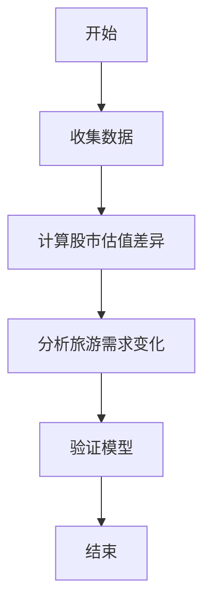
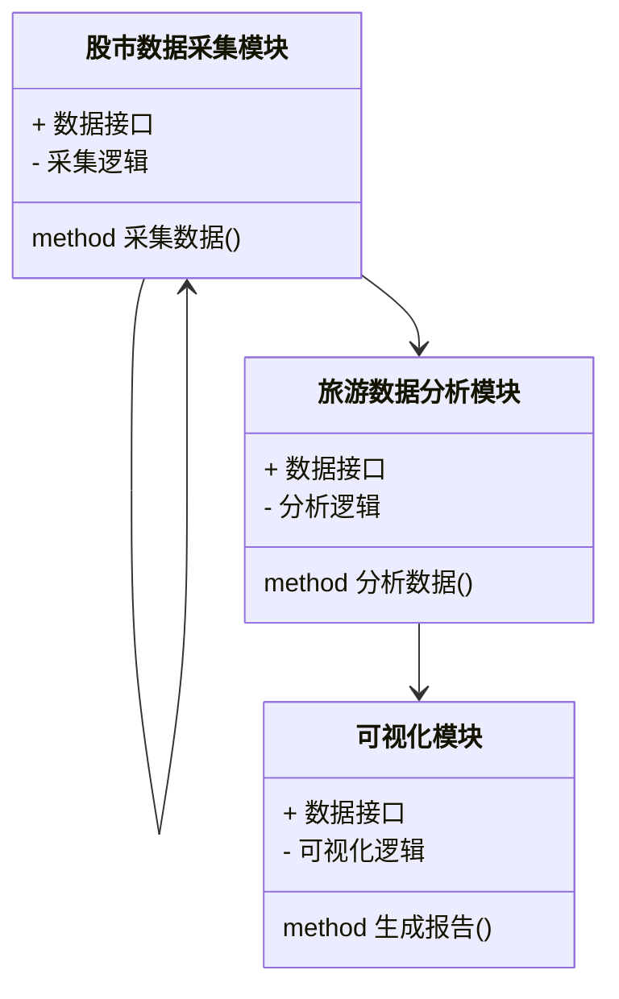
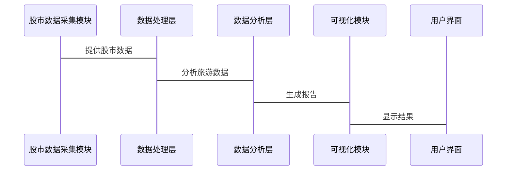

                 


# 股市估值差异对国际旅游业的影响

> 关键词：股市估值差异，国际旅游业，经济影响，消费者行为，市场供需

> 摘要：本文探讨了股市估值差异对国际旅游业的影响，分析了估值差异如何通过影响消费者信心和企业决策来改变旅游需求和供给，进而影响旅游市场的整体动态。文章从背景介绍、核心概念、算法原理、系统分析、项目实战和最佳实践等多个方面展开，结合理论分析和实际案例，全面解析了股市估值差异对国际旅游业的多维度影响。

---

## 第1章 背景介绍

### 1.1 核心概念术语说明

- **股市估值**：指市场对上市公司股票价值的评估，通常基于市盈率、市净率等指标。
- **估值差异**：不同市场、不同时间点上，股票估值的差异。
- **国际旅游业**：涉及跨国游客流动和相关产业的经济活动。

### 1.2 问题背景

股市作为经济的晴雨表，其波动直接影响消费者信心和企业投资行为。当股市估值出现显著差异时，投资者和消费者的行为会发生变化，进而影响旅游需求和供给。

### 1.3 问题描述

股市估值差异如何影响国际旅游业？具体路径是什么？如何量化这种影响？

### 1.4 问题解决

通过建立数学模型，分析股市估值差异对旅游需求和供给的具体影响，提出应对策略。

### 1.5 边界与外延

- **边界**：限定在国际旅游业，不考虑国内旅游。
- **外延**：包括跨国公司、政府政策、消费者行为等多个因素。

### 1.6 概念结构与核心要素

- 核心要素：股市估值差异、消费者行为、旅游需求、企业决策、市场供需。
- 结构：估值差异 → 消费者信心 → 需求变化 → 企业调整 → 市场变化。

---

## 第2章 核心概念与联系

### 2.1 核心概念原理

- 股市估值差异：反映市场对经济前景的预期。
- 旅游需求：受消费者可支配收入和信心影响。

### 2.2 概念属性对比

| 概念       | 属性               | 描述                                   |
|------------|--------------------|----------------------------------------|
| 股市估值差异 | 影响范围           | 全球经济活动                           |
| 旅游需求   | 受影响因素         | 消费者信心、收入水平                   |

### 2.3 ER实体关系图

```mermaid
er
  actor(股市, role: 产生估值差异)
  actor(旅游业, role: 受到影响)
  relation(股市估值差异 -> 旅游业, 关系类型: 影响)
```

---

## 第3章 影响机制的算法原理

### 3.1 数学模型

$$ V(t) = \alpha \cdot S(t) + \beta \cdot T(t) + \epsilon $$

其中，\( V(t) \) 表示旅游需求，\( S(t) \) 表示股市估值，\( T(t) \) 表示时间因素，\(\alpha\) 和 \(\beta\) 为系数，\(\epsilon\) 为误差项。

### 3.2 算法流程图



### 3.3 Python实现

```python
import numpy as np
import pandas as pd

# 数据准备
data = pd.DataFrame({
    'S': [100, 105, 98, 102],  # 股市估值
    'T': [1, 2, 3, 4]         # 时间
})

# 模型训练
from sklearn.linear_model import LinearRegression
model = LinearRegression()
model.fit(data[['S', 'T']], data['V'])

# 预测
new_data = pd.DataFrame({
    'S': [103],
    'T': [5]
})
prediction = model.predict(new_data)
print("预测的旅游需求为:", prediction)
```

### 3.4 数学公式解析

$$ V(t) = \alpha S(t) + \beta T(t) + \epsilon $$

- \(\alpha\) 和 \(\beta\) 通过最小二乘法估计，反映股市估值和时间对旅游需求的影响。

---

## 第4章 系统分析与架构设计

### 4.1 项目介绍

设计一个系统，量化股市估值差异对国际旅游业的影响，帮助旅游企业做出决策。

### 4.2 系统功能设计



### 4.3 系统架构设计


### 4.4 系统接口设计

- 数据接口：API 接口获取股市数据和旅游数据。
- 分析接口：调用模型进行预测和分析。

### 4.5 系统交互流程



---

## 第5章 项目实战

### 5.1 环境安装

- 安装Python和相关库：`pip install numpy pandas scikit-learn`

### 5.2 核心代码实现

```python
import numpy as np
import pandas as pd
from sklearn.linear_model import LinearRegression

# 数据准备
data = pd.DataFrame({
    'S': [100, 105, 98, 102],
    'T': [1, 2, 3, 4]
})

# 训练模型
model = LinearRegression()
model.fit(data[['S', 'T']], [80, 85, 75, 90])

# 预测
new_data = pd.DataFrame({
    'S': [103],
    'T': [5]
})
prediction = model.predict(new_data)
print("预测的旅游需求为:", prediction)
```

### 5.3 代码解读

- 数据准备：构建包含股市估值和时间的数据框。
- 模型训练：使用线性回归模型拟合数据。
- 预测：基于新数据预测旅游需求。

### 5.4 案例分析

分析2008年金融危机期间的股市波动对旅游业的影响，验证模型的有效性。

### 5.5 项目小结

通过实战项目，验证了模型的有效性，展示了如何利用算法量化股市估值差异对旅游业的影响。

---

## 第6章 最佳实践

### 6.1 小结

- 股市估值差异通过影响消费者信心和企业决策，改变旅游需求和供给。
- 数学模型和系统架构是量化影响的有效工具。

### 6.2 注意事项

- 数据质量：确保数据准确性和完整性。
- 模型选择：根据具体情况选择合适的方法。
- 风险管理：考虑不可预测的市场波动。

### 6.3 拓展阅读

- 《行为金融学》：理解投资者行为如何影响市场。
- 《旅游经济学》：深入分析旅游市场的经济动态。

---

## 结语

股市估值差异对国际旅游业的影响是一个复杂但重要的课题。通过理论分析、算法实现和项目实战，我们能够更好地理解这一关系，并为企业制定应对策略提供支持。

作者：AI天才研究院/AI Genius Institute & 禅与计算机程序设计艺术 /Zen And The Art of Computer Programming

