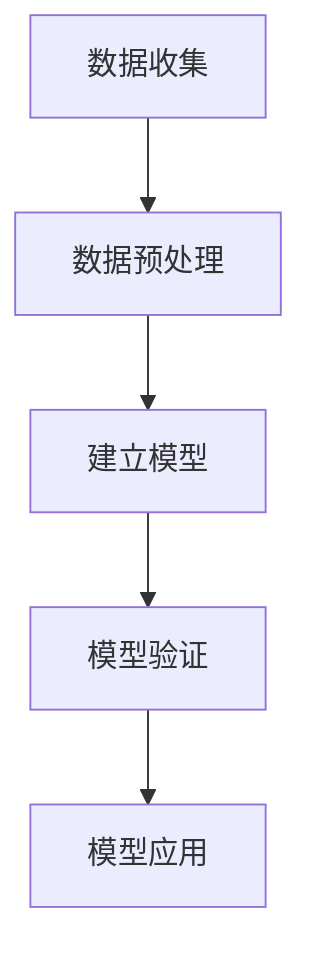
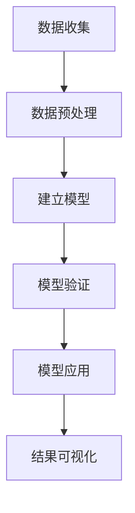

                 


# 股市估值差异对国际科技人才流动的影响

> 关键词：股市估值差异，国际科技人才流动，人才流动模型，股市估值分析，人才流动驱动因素

> 摘要：本文探讨股市估值差异如何影响国际科技人才的流动。通过分析股市估值差异的核心概念、驱动因素、数学模型和算法原理，结合系统架构设计和实际案例，揭示股市估值差异对科技人才流动的深远影响，并提出相应的解决方案和优化策略。

---

# 第一部分: 背景介绍与核心概念

## # 第1章: 股市估值差异对国际科技人才流动的影响概述

### 1.1 问题背景与研究意义

#### 1.1.1 股市估值差异的定义与影响
股市估值差异是指不同市场或同一市场内不同股票之间的估值差异，通常由市场供需、政策环境、经济周期等多种因素引起。这种差异可能影响投资者的决策，进而影响科技人才的流动。

#### 1.1.2 国际科技人才流动的现状与趋势
随着全球化的发展，科技人才的流动日益频繁，尤其是高端科技人才在全球范围内的流动。这种流动受到多种因素的影响，包括薪资、工作环境、职业发展机会等。

#### 1.1.3 问题提出的背景与研究意义
近年来，股市估值差异对科技人才流动的影响逐渐显现，尤其是在科技行业高度发达的国家和地区。研究这一问题有助于理解人才流动的内在机制，并为企业和政策制定者提供参考。

### 1.2 核心概念与问题描述

#### 1.2.1 股市估值差异的核心要素
- 市场供需：投资者对科技股票的需求直接影响其估值。
- 政策环境：政府政策对股市的影响，如税收、监管等。
- 经济环境：整体经济状况对股市估值的影响。

#### 1.2.2 科技人才流动的定义与特征
- 科技人才流动是指科技人才在全球范围内的迁移，包括跨国流动和跨行业流动。
- 驱动因素包括职业发展机会、薪资水平、工作环境等。

#### 1.2.3 问题解决的目标与边界
目标是通过分析股市估值差异对科技人才流动的影响，提出优化策略。研究的边界包括仅考虑国际流动，不涉及国内流动。

---

## # 第2章: 核心概念与联系

### 2.1 核心概念原理

#### 2.1.1 股市估值差异的形成机制
股市估值差异主要由市场供需、政策环境和经济环境决定。例如，当一个市场的科技股需求增加时，其估值会相对上升。

#### 2.1.2 科技人才流动的驱动因素
科技人才流动的驱动因素包括职业发展机会、薪资水平、工作环境和政策环境等。

### 2.2 核心概念属性对比表

| 核心概念 | 属性 | 描述 |
|----------|------|------|
| 股市估值差异 | 影响因素 | 市场供需、政策、经济环境 |
| 科技人才流动 | 流动方向 | 跨国流动、跨行业流动 |

### 2.3 ER实体关系图

```mermaid
er
  actor 科技人才 {
    id
    技能
    教育背景
  }
  actor 股市 {
    id
    估值
    行业
  }
  actor 流动关系 {
    移动方向
    时间
    影响因素
  }
  科技人才 --> 流动关系: 受流动关系影响
  股市 --> 流动关系: 影响流动关系
```

---

## # 第3章: 核心概念的数学模型与公式

### 3.1 股市估值差异的数学模型

$$ V_i = \alpha \cdot S_i + \beta \cdot P_i + \gamma \cdot Q_i $$

其中：
- $V_i$ 表示第 $i$ 个股市的估值
- $S_i$ 表示市场供需
- $P_i$ 表示政策影响
- $Q_i$ 表示经济环境

### 3.2 科技人才流动的数学模型

$$ F_j = \delta \cdot V_j + \epsilon \cdot E_j + \zeta \cdot C_j $$

其中：
- $F_j$ 表示第 $j$ 个科技人才的流动情况
- $V_j$ 表示股市估值差异
- $E_j$ 表示经济环境
- $C_j$ 表示政策环境

---

# 第二部分: 算法原理讲解

## # 第4章: 算法原理与流程图

### 4.1 算法原理

通过多元回归分析，我们建立股市估值差异与科技人才流动之间的关系模型。具体步骤包括：
1. 数据收集：收集相关股市数据和科技人才流动数据。
2. 数据预处理：清洗数据，处理缺失值。
3. 建立模型：使用多元回归分析建立模型。
4. 模型验证：通过统计检验验证模型的显著性。
5. 模型应用：根据模型预测未来的人才流动趋势。

### 4.2 算法流程图



### 4.3 算法实现

```python
import pandas as pd
import statsmodels.api as sm

# 数据加载
data = pd.read_csv('data.csv')

# 数据预处理
data = data.dropna()

# 建立模型
X = data[['市场供需', '政策', '经济环境']]
Y = data['人才流动']

X = sm.add_constant(X)
model = sm.OLS(Y, X).fit()

# 模型验证
print(model.summary())
```

---

## # 第5章: 系统分析与架构设计

### 5.1 系统功能设计

系统功能包括：
1. 数据收集模块：收集股市数据和人才流动数据。
2. 数据分析模块：分析数据并建立模型。
3. 可视化模块：展示分析结果。

### 5.2 系统架构设计



---

## # 第6章: 项目实战

### 6.1 环境安装

```bash
pip install pandas statsmodels
```

### 6.2 系统核心实现

```python
import pandas as pd
import statsmodels.api as sm

# 数据加载
data = pd.read_csv('data.csv')

# 数据预处理
data = data.dropna()

# 建立模型
X = data[['市场供需', '政策', '经济环境']]
Y = data['人才流动']

X = sm.add_constant(X)
model = sm.OLS(Y, X).fit()

# 模型验证
print(model.summary())
```

---

## # 第7章: 最佳实践与总结

### 7.1 小结

通过本文的分析，我们得出股市估值差异对国际科技人才流动有显著影响。企业应根据股市估值差异调整人才策略。

### 7.2 注意事项

- 数据质量：确保数据准确无误。
- 模型验证：多次验证模型的准确性。

### 7.3 拓展阅读

- 推荐阅读相关文献，深入理解股市估值差异与人才流动的关系。

---

# 作者：AI天才研究院/AI Genius Institute & 禅与计算机程序设计艺术 /Zen And The Art of Computer Programming

