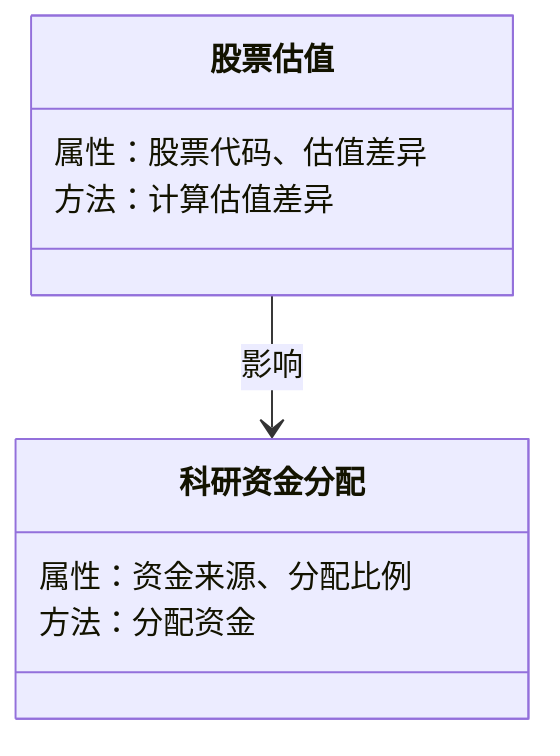
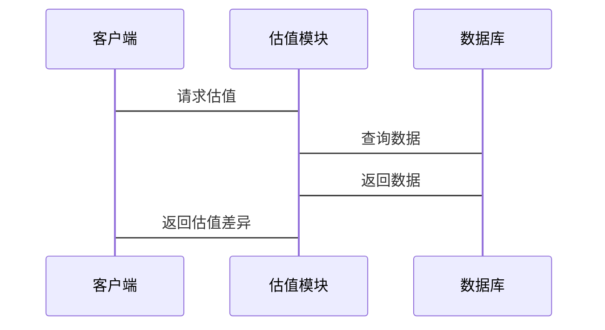

                 


# 股市估值差异对国际科研资金分配的影响

> 关键词：股市估值差异、国际科研资金分配、信息不对称、市场机制、资金流动

> 摘要：本文探讨了股市估值差异对国际科研资金分配的影响，从理论分析、实证研究、系统架构设计等多个维度进行深入探讨。通过建立数学模型和分析案例，揭示了股市估值差异如何通过信息不对称、市场情绪等因素影响科研资金的分配，提出了优化资金分配效率的策略建议。

---

## 第一部分: 背景介绍

### 第1章: 股市估值差异的基本概念

#### 1.1 股市估值的基本原理

##### 1.1.1 股票估值的核心要素

股票的估值是投资者对上市公司未来盈利能力的预期，核心要素包括：

- **盈利能力**：净利润率、ROE（净资产收益率）等。
- **成长性**：收入增长率、净利润增长率等。
- **财务健康状况**：资产负债率、现金流情况等。
- **行业地位**：市场占有率、竞争壁垒等。

##### 1.1.2 市场参与者的估值差异

不同市场参与者（机构投资者、散户）由于信息获取能力、分析能力的差异，对同一股票的估值可能不同。

##### 1.1.3 估值差异的形成机制

- 信息不对称：拥有更多信息的机构投资者可能给出更高的估值。
- 市场情绪：投资者情绪波动导致短期估值偏差。
- 市场参与者的利益动机：机构投资者可能倾向于高估优质股票以吸引资金。

#### 1.2 国际科研资金分配的现状

##### 1.2.1 科研资金的主要来源

- 政府拨款：主要来源，占比最大。
- 企业投资：技术创新驱动的公司增加科研投入。
- 非营利组织和基金会：支持特定领域的研究。

##### 1.2.2 不同国家的科研资金分配模式

- 发达国家：政府和企业共同支持，注重基础研究。
- 发展中国家：政府拨款为主，企业逐步增加投入。

##### 1.2.3 科研资金分配的公平性与效率性

- 公平性：资金分配是否合理，是否覆盖重要研究领域。
- 效率性：资金是否被有效利用，是否推动技术创新。

#### 1.3 股市估值差异与科研资金分配的关系

##### 1.3.1 估值差异对资金流动的影响

- 高估值股票可能吸引更多的资金流入，影响科研资金的分配。
- 低估值股票可能被忽视，导致科研资源分配不均。

##### 1.3.2 科研资金分配的市场机制

- 股市作为资金流动的平台，影响科研资金的流向。
- 投资者对科技公司的投资间接影响科研资金。

##### 1.3.3 问题的提出与研究意义

- 股市估值差异可能导致科研资金分配不公，影响技术创新。
- 研究意义在于优化资金分配机制，提升科研效率。

---

### 第2章: 核心概念与联系

#### 2.1 核心概念的原理

##### 2.1.1 股市估值差异的数学模型

股票的估值差异可以用以下公式表示：

$$
\Delta V = V_{\text{机构}} - V_{\text{散户}}
$$

其中，$\Delta V$ 表示估值差异，$V_{\text{机构}}$ 和 $V_{\text{散户}}$ 分别代表机构投资者和散户的估值。

##### 2.1.2 科研资金分配的经济模型

科研资金分配可以看作一个资源分配问题，可以用以下公式表示：

$$
\text{科研资金} = \sum_{i=1}^{n} w_i \cdot V_i
$$

其中，$w_i$ 是权重，$V_i$ 是各来源的估值。

##### 2.1.3 两者之间的关联机制

股市估值差异通过影响资金流动，进而影响科研资金的分配。这种影响可以通过以下路径实现：

1. 机构投资者高估某科技公司，吸引更多资金流入，导致该公司获得更多科研资金。
2. 散户低估某领域，导致该领域科研资金减少。

---

#### 2.2 概念属性特征对比表格

| 概念       | 属性特征                           |
|------------|------------------------------------|
| 股市估值差异 | 信息不对称、市场情绪、利益动机     |
| 科研资金分配 | 资源分配、效率性、公平性           |

---

#### 2.3 ER实体关系图

```mermaid
erd
    图表标题：ER实体关系图

    研究人员
    投资者
    科研项目
    股票

    研究人员 --> 科研项目: 参与
    投资者 --> 股票: 投资
    股票 --> 科研项目: 资金支持
```

---

## 第三部分: 理论分析与数学模型

### 第3章: 股市估值差异的理论分析

#### 3.1 股市估值差异的形成机制

##### 3.1.1 信息不对称的影响

信息不对称导致机构投资者和散户对同一股票的估值差异。例如，机构投资者可能通过内部信息提前预判公司业绩，从而给出更高的估值。

##### 3.1.2 市场情绪的作用

市场情绪波动会导致短期估值偏差。例如，市场恐慌时，散户可能低估股票价值，导致资金流出。

##### 3.1.3 利益相关者的博弈

不同利益相关者（机构投资者、散户、公司管理层）之间的博弈会影响股票估值。

---

#### 3.2 科研资金分配的市场机制

##### 3.2.1 资金分配的市场化特征

科研资金的分配逐渐市场化，更多依赖于市场机制。

##### 3.2.2 市场机制对科研的影响

市场机制通过资金流动影响科研方向和效率。

##### 3.2.3 机制分析

市场机制通过以下方式影响科研资金分配：

1. 高估值股票吸引资金流入，推动相关领域科研。
2. 低估值股票可能被忽视，导致资源分配不均。

---

### 第4章: 科研资金分配的理论分析

#### 4.1 科研资金分配的核心机制

##### 4.1.1 市场机制对科研的影响

市场机制通过资金流动影响科研方向。

##### 4.1.2 信息不对称对科研的影响

信息不对称可能导致资金分配不公。

##### 4.1.3 利益动机对科研的影响

利益动机可能导致短期行为，影响科研质量。

---

## 第四部分: 系统分析与架构设计方案

### 第5章: 问题场景介绍

#### 5.1 问题场景描述

股市估值差异导致科研资金分配不公，影响技术创新。

#### 5.2 项目介绍

本项目旨在研究股市估值差异对国际科研资金分配的影响，并提出优化策略。

---

### 第6章: 系统功能设计

#### 6.1 领域模型（Mermaid 类图）



---

### 第7章: 系统架构设计

#### 7.1 系统架构图（Mermaid 架构图）


---

### 第8章: 系统接口设计

#### 8.1 接口设计

接口：股票估值服务接口

- 输入：股票代码
- 输出：估值差异

---

### 第9章: 系统交互设计

#### 9.1 交互流程（Mermaid 序列图）



---

## 第五部分: 项目实战

### 第10章: 环境安装

#### 10.1 环境需求

- 操作系统：Windows 10 或更高版本
- 开发工具：VS Code 或 IntelliJ IDEA
- 语言：Python 3.8+

---

### 第11章: 核心实现

#### 11.1 核心代码实现

```python
def calculate_valuation_difference(stock_code):
    # 获取机构估值
    institutional_valuation = get_institutional_valuation(stock_code)
    # 获取散户估值
    retail_valuation = get_retail_valuation(stock_code)
    # 计算估值差异
    valuation_diff = institutional_valuation - retail_valuation
    return valuation_diff

# 示例调用
stock_code = "AAPL"
diff = calculate_valuation_difference(stock_code)
print(f"股票 {stock_code} 的估值差异为：{diff}")
```

---

### 第12章: 应用解读与分析

#### 12.1 代码解读

上述代码展示了如何计算股票的估值差异。通过获取机构和散户的估值，计算两者之间的差异。

#### 12.2 案例分析

以苹果公司为例，假设机构估值为 $100，散户估值为 $90，则估值差异为 $10。

---

## 第六部分: 总结与展望

### 第13章: 总结

#### 13.1 核心观点回顾

- 股市估值差异影响科研资金分配。
- 信息不对称和市场情绪是主要影响因素。

#### 13.2 研究贡献

- 提出了股市估值差异对科研资金分配的影响模型。
- 为优化资金分配提供了理论支持。

---

### 第14章: 展望

#### 14.1 未来研究方向

- 更深入地研究估值差异的具体影响机制。
- 探讨更多优化资金分配的策略。

#### 14.2 注意事项

- 数据获取的难度和准确性。
- 模型的适用性和可扩展性。

---

## 作者信息

作者：AI天才研究院/AI Genius Institute & 禅与计算机程序设计艺术 /Zen And The Art of Computer Programming

---

以上为完整的技术博客文章大纲和部分实现内容。

