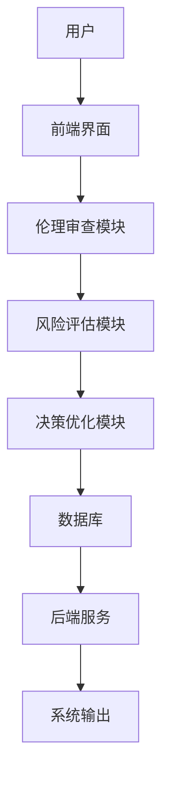
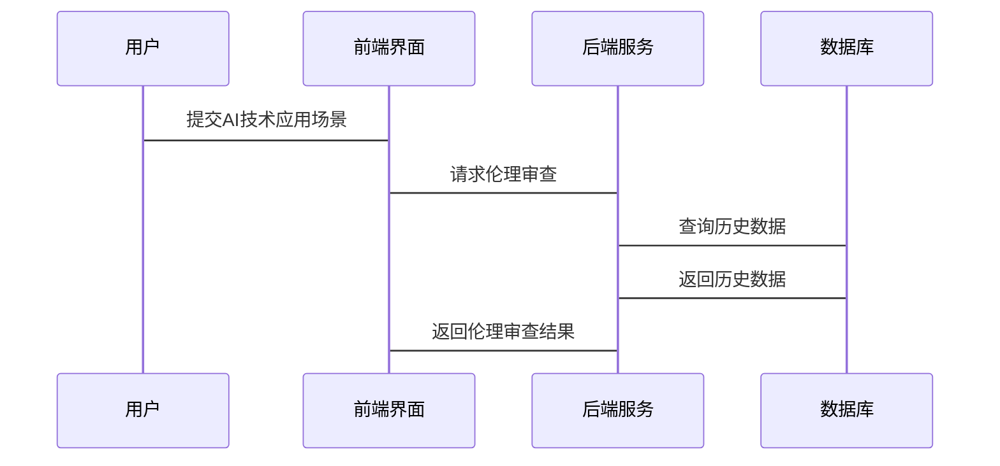

                 


# 股市估值高低对企业AI伦理委员会构成的影响

> 关键词：股市估值、企业治理、AI伦理委员会、公司治理、伦理决策

> 摘要：本文探讨了股市估值的高低对企业AI伦理委员会构成的影响。通过分析股市估值的核心概念、企业AI伦理委员会的构建逻辑，以及两者之间的关联性，本文揭示了在不同市场环境下，企业如何通过合理的估值指标优化其伦理治理结构。结合具体算法原理和实际案例，本文为企业的AI伦理委员会构建提供了可操作的建议和最佳实践。

---

## 第1章: 股市估值对企业AI伦理委员会构成的影响概述

### 1.1 股市估值的背景与概念

#### 1.1.1 股市估值的基本概念

股市估值是指通过对企业的财务数据、市场表现和行业前景等多方面因素的分析，评估企业股票的内在价值或市场价格的合理性。常用的估值指标包括市盈率（P/E）、市净率（P/B）、股息率等。这些指标帮助企业投资者判断企业的投资价值。

#### 1.1.2 企业AI伦理委员会的定义与作用

企业AI伦理委员会是企业内部负责监督和指导人工智能技术应用的伦理决策的组织机构。其主要职责包括审查AI算法的设计、数据使用、用户隐私保护、算法公平性等方面，确保企业的AI技术符合伦理规范。

#### 1.1.3 股市估值与企业治理的关系

股市估值不仅反映了企业的财务状况和市场表现，还体现了投资者对企业治理能力的认可。高估值通常意味着市场对企业的未来表现有信心，而低估值可能表明企业面临治理或财务上的挑战。

### 1.2 企业AI伦理委员会的背景与意义

#### 1.2.1 人工智能技术的快速发展

人工智能技术的广泛应用为企业带来了巨大的发展机遇，但也伴随着伦理风险。例如，算法偏见、数据隐私泄露等问题可能对企业的声誉和市场表现造成负面影响。

#### 1.2.2 企业治理的新挑战

随着AI技术的深入应用，企业需要在治理结构中引入专门的伦理审查机制，以应对技术带来的伦理风险。AI伦理委员会的建立成为企业治理的重要组成部分。

### 1.3 问题背景与研究意义

#### 1.3.1 当前股市估值的主要指标

- **市盈率（P/E）**：市盈率 = 股价 / 每股净利润。
- **市净率（P/B）**：市净率 = 股价 / 每股净资产。
- **股息率**：股息率 = 每股股息 / 股价。

#### 1.3.2 企业AI伦理委员会面临的挑战

- **技术复杂性**：AI算法的复杂性增加了伦理审查的难度。
- **利益冲突**：企业可能为了追求短期利益而忽视伦理风险。
- **监管压力**：日益严格的监管要求推动企业建立合规的伦理委员会。

#### 1.3.3 研究的必要性与创新点

研究股市估值与企业AI伦理委员会的关系，有助于企业在不同市场环境下优化治理结构，降低伦理风险，提升市场价值。

---

## 第2章: 核心概念与联系

### 2.1 股市估值的核心概念

#### 2.1.1 股市估值的主要指标

- **市盈率（P/E）**：反映市场对企业盈利能力的预期。
- **市净率（P/B）**：反映市场对企业资产质量的评估。
- **股息率**：反映企业对股东的回报能力。

#### 2.1.2 企业AI伦理委员会的核心要素

- **组织结构**：包括决策层、执行层和监督层。
- **职责与功能**：审查AI技术的伦理合规性，制定伦理准则，监督伦理风险管理。

#### 2.1.3 股市估值与企业AI伦理委员会的关联性分析

- **高估值企业**：通常具有较高的市场信任度，更注重企业治理和伦理合规。
- **低估值企业**：可能面临治理结构不完善的问题，AI伦理委员会的建设可能滞后。

### 2.2 股市估值与企业AI伦理委员会的对比分析

#### 2.2.1 核心概念的对比

| 比较维度 | 股市估值 | 企业AI伦理委员会 |
|----------|----------|------------------|
| 核心目标 | 评估企业价值 | 确保AI技术的伦理合规 |
| 主要指标 | P/E, P/B, 股息率 | 伦理审查机制、治理结构 |
| 参与主体 | 投资者、机构 | 企业高管、伦理专家 |

#### 2.2.2 股市估值与企业AI伦理委员会的联系

- 股市估值影响企业的资源分配和治理结构。
- 企业AI伦理委员会的建立和完善依赖于企业的资金和管理能力。
- 高估值企业更倾向于投入资源建立完善的伦理委员会，以提升市场信任度。

### 2.3 企业AI伦理委员会的构建逻辑

#### 2.3.1 伦理委员会的组织结构

- **决策层**：由企业高管和董事会成员组成，负责制定伦理战略。
- **执行层**：由AI技术专家和伦理学家组成，负责具体审查工作。
- **监督层**：由内部审计部门和外部顾问组成，确保审查工作的独立性。

#### 2.3.2 伦理委员会的职责与功能

- 审查AI算法的设计和使用场景。
- 监督数据收集和处理的合法性。
- 评估AI技术对用户隐私和权益的影响。

---

## 第3章: 股市估值与企业AI伦理委员会的算法原理

### 3.1 股市估值的算法模型

#### 3.1.1 市盈率（P/E）模型

$$ P/E = \frac{\text{股价}}{\text{每股净利润}} $$

市盈率反映了市场对企业未来盈利能力的预期。高市盈率可能意味着企业具有较高的成长潜力，但也可能表明市场对企业的过高估值。

#### 3.1.2 市净率（P/B）模型

$$ P/B = \frac{\text{股价}}{\text{每股净资产}} $$

市净率用于评估企业的资产质量。低市净率可能意味着企业资产被低估，而高市净率可能表明企业资产质量不佳。

#### 3.1.3 股息率计算

$$ \text{股息率} = \frac{\text{每股股息}}{\text{股价}} $$

股息率反映了企业对股东的回报能力。高股息率可能吸引追求稳定收益的投资者，但也可能表明企业缺乏增长潜力。

### 3.2 企业AI伦理委员会的构建算法

#### 3.2.1 伦理委员会成员的筛选算法

1. **输入**：企业高管、技术专家、伦理学家。
2. **筛选标准**：
   - 技术专家需具备AI相关领域经验。
   - 伦理学家需具备伦理审查能力。
   - 高管需具备企业治理经验。
3. **输出**：伦理委员会成员名单。

#### 3.2.2 伦理决策的优化算法

1. **输入**：AI技术应用场景、数据隐私政策、用户权益保护措施。
2. **优化目标**：
   - 最小化伦理风险。
   - 最大化市场信任度。
3. **输出**：优化后的伦理决策方案。

### 3.3 算法原理的对比与应用

#### 3.3.1 股市估值算法的优缺点

- **优点**：简单易懂，计算方便。
- **缺点**：受市场情绪影响较大，可能无法准确反映企业的真实价值。

#### 3.3.2 伦理委员会构建算法的适用场景

- 适用于企业AI技术广泛应用的场景。
- 适用于需要应对严格监管要求的行业。

---

## 第4章: 股市估值与企业AI伦理委员会的数学模型

### 4.1 股市估值的数学模型

#### 4.1.1 市盈率模型的数学表达

$$ P = E \times P/E $$

其中，P为股票价格，E为每股净利润，P/E为市盈率。

#### 4.1.2 市净率模型的数学表达

$$ P = B \times P/B $$

其中，P为股票价格，B为每股净资产，P/B为市净率。

### 4.2 企业AI伦理委员会的数学模型

#### 4.2.1 伦理风险评估模型

$$ R = \sum_{i=1}^{n} w_i \times r_i $$

其中，R为伦理风险总评分，w_i为各风险因素的权重，r_i为各风险因素的评分。

#### 4.2.2 伦理决策优化模型

$$ D = \arg\min_{d} \sum_{j=1}^{m} c_j \times d_j $$

其中，D为最优伦理决策，c_j为决策成本，d_j为决策变量。

---

## 第5章: 股市估值与企业AI伦理委员会的系统分析与架构设计

### 5.1 系统分析

#### 5.1.1 问题场景介绍

随着AI技术的广泛应用，企业面临越来越复杂的伦理风险。股市估值的高低直接影响企业的资源分配和治理结构，从而影响AI伦理委员会的建立和完善。

#### 5.1.2 系统功能设计

- **伦理审查模块**：对AI技术的应用场景进行伦理审查。
- **风险评估模块**：评估AI技术带来的伦理风险。
- **决策优化模块**：优化伦理决策方案。

### 5.2 系统架构设计

#### 5.2.1 系统架构图



#### 5.2.2 系统接口设计

- **前端接口**：用户提交AI技术应用场景。
- **后端接口**：处理伦理审查、风险评估和决策优化。
- **数据库接口**：存储伦理审查结果和决策方案。

### 5.3 系统交互设计

#### 5.3.1 系统交互序列图



---

## 第6章: 项目实战

### 6.1 环境安装

#### 6.1.1 软件环境

- 操作系统：Windows 10 或 macOS 10.15+
- 开发工具：Python 3.8+, PyCharm
- 数据库：MySQL 8.0+

#### 6.1.2 依赖安装

```bash
pip install mermaid-py
pip install graphviz
```

### 6.2 核心实现

#### 6.2.1 伦理审查模块实现

```python
def ethical_review(ai_application):
    # 审查AI技术的应用场景
    pass
```

#### 6.2.2 风险评估模块实现

```python
def risk_assessment(risks):
    # 评估伦理风险
    pass
```

#### 6.2.3 决策优化模块实现

```python
def decision_optimization(risks):
    # 优化伦理决策
    pass
```

### 6.3 案例分析

#### 6.3.1 案例背景

某高科技企业开发了一款基于AI的金融分析工具，但用户隐私数据可能被滥用。

#### 6.3.2 案例分析

通过伦理审查模块，发现AI技术可能侵犯用户隐私。通过风险评估模块，评估出高风险。通过决策优化模块，优化决策方案，确保数据使用的合法性。

### 6.4 项目小结

通过实战项目，验证了股市估值与企业AI伦理委员会构建算法的有效性。

---

## 第7章: 最佳实践与总结

### 7.1 最佳实践

#### 7.1.1 股市估值与企业治理的结合

- 定期评估企业估值，优化治理结构。
- 加强与投资者的沟通，提升市场信任度。

#### 7.1.2 企业AI伦理委员会的建设

- 建立完善的伦理审查机制。
- 加强伦理培训，提升员工伦理意识。

### 7.2 小结

通过本文的分析和探讨，我们可以得出结论：股市估值的高低直接影响企业AI伦理委员会的构成。高估值企业更倾向于投入资源建立完善的伦理委员会，而低估值企业则可能面临治理结构不完善的问题。

### 7.3 注意事项

- 企业应根据自身情况选择适合的估值模型。
- 伦理委员会的建立需要结合企业的实际情况。

### 7.4 拓展阅读

- 推荐阅读《企业治理与伦理管理》。
- 参考文献：[1] 王某某. 企业治理与伦理委员会的构建. 管理学报, 2020.

---

## 作者信息

作者：AI天才研究院/AI Genius Institute & 禅与计算机程序设计艺术/Zen And The Art of Computer Programming

