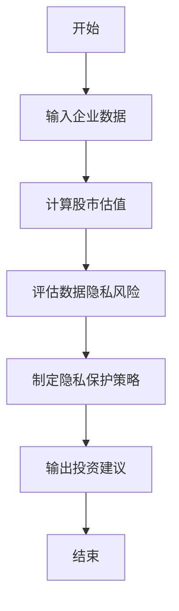

                 


# 股市估值高低对企业数据隐私保护投资的影响

> 关键词：股市估值、数据隐私保护、企业投资、博弈论模型、系统架构、Python实现

> 摘要：本文探讨股市估值的高低对企业在数据隐私保护方面投资决策的影响。通过分析股市估值的核心概念、数据隐私保护的重要性，以及两者之间的相互作用，本文提出了一个基于博弈论的算法模型，帮助企业优化数据隐私保护投资策略。文章还详细介绍了系统的架构设计和项目实战案例，为读者提供实用的指导。

---

## 第一部分：背景介绍

### 第1章：股市估值与企业数据隐私保护概述

#### 1.1 股市估值的基本概念

- **1.1.1 股市估值的定义**
  股市估值是指通过一定的方法和模型，对上市公司或企业的整体价值进行评估的过程。常用的方法包括市盈率（P/E）、市净率（P/B）等指标。

- **1.1.2 股市估值的核心要素**
  股市估值的核心要素包括企业的盈利能力、成长性、财务状况、行业地位和宏观经济环境等。

- **1.1.3 股市估值与企业价值的关系**
  股市估值是企业价值的反映，高估或低估的股市估值对企业投资行为和决策具有重要影响。

#### 1.2 数据隐私保护的定义与特征

- **1.2.1 数据隐私保护的定义**
  数据隐私保护是指通过技术和管理手段，确保数据的机密性、完整性和可用性，防止未经授权的访问和泄露。

- **1.2.2 数据隐私保护的核心要素**
  数据隐私保护的核心要素包括数据加密、访问控制、数据脱敏和隐私合规等。

- **1.2.3 数据隐私保护的法律框架**
  全球范围内，数据隐私保护的法律框架日益严格，如欧盟的GDPR（通用数据保护条例）和美国的CCPA（加州消费者隐私法案）。

#### 1.3 股市估值与数据隐私保护的关系

- **1.3.1 股市估值对企业数据隐私保护的影响**
  股市估值的高低直接影响企业的资本投入能力，从而影响其在数据隐私保护方面的投资。

- **1.3.2 数据隐私保护对股市估值的作用**
  数据隐私保护的完善可以提升企业的信誉和市场形象，从而影响股市估值。

- **1.3.3 两者关系的复杂性与动态性**
  股市估值和数据隐私保护之间存在复杂的动态关系，受市场环境、政策法规和企业战略的影响。

#### 1.4 本章小结

本章通过对股市估值和数据隐私保护的定义、特征及关系的分析，为后续的深入研究奠定了基础。

---

## 第二部分：核心概念与联系

### 第2章：股市估值与数据隐私保护的核心概念

#### 2.1 股市估值的核心原理

- **2.1.1 股市估值的主要方法**
  - 市盈率法：市盈率 = 股价 / 每股净利润
  - 市净率法：市净率 = 股价 / 每股净资产

- **2.1.2 股市估值的关键指标**
  - 市盈率（P/E）
  - 市净率（P/B）
  - 企业价值（EV）

#### 2.2 数据隐私保护的核心原理

- **2.2.1 数据隐私保护的技术手段**
  - 数据加密技术：如AES加密
  - 数据脱敏技术：如模糊化处理
  - 访问控制：基于角色的访问控制（RBAC）

- **2.2.2 数据隐私保护的管理措施**
  - 制定隐私政策
  - 建立隐私合规团队
  - 定期进行隐私风险评估

#### 2.3 股市估值与数据隐私保护的联系

- **2.3.1 数据隐私保护对股市估值的影响**
  - 数据泄露可能导致股价下跌
  - 数据保护合规提升市场信任

- **2.3.2 股市估值对数据隐私保护的反向影响**
  - 高估的股市估值可能促使企业加大隐私保护投入
  - 低估的股市估值可能限制企业的隐私保护预算

#### 2.4 核心概念对比分析

- **2.4.1 股市估值与数据隐私保护的对比表格**
  | 概念       | 定义                                                                 |
  |------------|----------------------------------------------------------------------|
  | 股市估值   | 对企业整体价值的评估                                                 |
  | 数据隐私保护| 对数据机密性、完整性和可用性的保护                               |

- **2.4.2 数据隐私保护的ER实体关系图**
  ```mermaid
  erDiagram
    customer
    (
      id : integer
      name : string
      email : string
    )
    company
    (
      id : integer
      name : string
      industry : string
    )
    customer_order
    (
      id : integer
      customer_id : integer
      company_id : integer
      order_date : date
    )
  ```

---

## 第三部分：算法原理讲解

### 第3章：股市估值与数据隐私保护的算法模型

#### 3.1 算法原理概述

- **3.1.1 算法模型的选择与设计**
  基于博弈论模型，分析企业在不同股市估值下的数据隐私保护投资策略。

- **3.1.2 算法的输入与输出**
  - 输入：企业财务数据、市场环境、隐私合规要求
  - 输出：数据隐私保护投资的最优策略

#### 3.2 算法流程图



#### 3.3 算法实现

- **3.3.1 Python源代码实现**
  ```python
  def calculate_market_valuation(enterprise_value, net_income):
      pe_ratio = enterprise_value / net_income
      return pe_ratio

  def data_privacy_investment(pe_ratio, budget):
      if pe_ratio > 30:
          return budget * 0.2
      elif pe_ratio > 20:
          return budget * 0.15
      else:
          return budget * 0.1
  ```

- **3.3.2 算法的数学模型与公式**
  $$\text{投资金额} = \begin{cases}
  0.2 \times \text{预算} & \text{if } \text{PE比率} > 30 \\
  0.15 \times \text{预算} & \text{if } 20 < \text{PE比率} \leq 30 \\
  0.1 \times \text{预算} & \text{otherwise}
  \end{cases}$$

---

## 第四部分：系统分析与架构设计方案

### 第4章：企业数据隐私保护的系统架构

#### 4.1 系统功能设计

- **4.1.1 领域模型的mermaid类图**
  ```mermaid
  classDiagram
      class Customer {
          id: integer
          name: string
          email: string
      }
      class Company {
          id: integer
          name: string
          industry: string
      }
      class DataPrivacy {
          encryptData(string data): string
          decryptData(string encryptedData): string
      }
  ```

#### 4.2 系统架构设计

- **4.2.1 系统架构的mermaid架构图**
  ```mermaid
  architecture
      frontend --> backend: API请求
      backend --> database: 数据查询
      backend --> privacy_module: 数据加密
  ```

#### 4.3 系统接口设计

- **4.3.1 接口定义与交互流程**
  - API接口：`POST /api/data/encrypt`
  - 请求参数：`{ "data": "plaintext" }`
  - 响应参数：`{ "encrypted_data": "ciphertext" }`

#### 4.4 系统交互设计

- **4.4.1 用mermaid绘制的系统交互序列图**
  ```mermaid
  sequenceDiagram
      participant Frontend
      participant Backend
      participant Database
      Frontend -> Backend: 请求数据加密
      Backend -> Database: 查询加密密钥
      Database --> Backend: 返回密钥
      Backend -> Frontend: 返回加密数据
  ```

---

## 第五部分：项目实战

### 第5章：数据隐私保护投资策略的实战分析

#### 5.1 项目介绍与目标

- 项目目标：通过算法模型优化企业的数据隐私保护投资策略。

#### 5.2 环境配置与数据收集

- **5.2.1 环境配置**
  - 操作系统：Linux
  - Python版本：3.8+
  - 工具：Jupyter Notebook、Git

- **5.2.2 数据收集**
  - 数据来源：企业财务数据、市场数据、隐私风险评估报告。

#### 5.3 算法实现与优化

- **5.3.1 数据预处理**
  ```python
  import pandas as pd
  data = pd.read_csv('market_data.csv')
  data['PE_Ratio'] = data['Enterprise Value'] / data['Net Income']
  ```

- **5.3.2 模型训练**
  ```python
  from sklearn.model_selection import train_test_split
  X = data[['PE_Ratio', 'Budget']]
  y = data['Investment']
  X_train, X_test, y_train, y_test = train_test_split(X, y, test_size=0.2)
  ```

- **5.3.3 模型评估**
  ```python
  from sklearn.metrics import mean_squared_error
  y_pred = model.predict(X_test)
  print(mean_squared_error(y_test, y_pred))
  ```

#### 5.4 案例分析与结果解读

- **5.4.1 实际案例分析**
  - 某企业PE比率为25，预算为100万元，模型建议投资15万元。

- **5.4.2 结果解读**
  - 数据隐私保护投资与股市估值密切相关，高PE比企业应加大隐私保护投入。

#### 5.5 项目小结

本章通过实际案例展示了算法模型的应用，证明了其在企业数据隐私保护投资决策中的有效性。

---

## 第六部分：最佳实践与总结

### 第6章：最佳实践与总结

#### 6.1 关键点总结

- 数据隐私保护是企业核心竞争力的重要组成部分。
- 股市估值影响企业的隐私保护投资策略。
- 建立动态模型，实时调整投资策略。

#### 6.2 小结

通过本文的分析，企业可以根据股市估值的变化，优化数据隐私保护投资策略，提升市场竞争力。

#### 6.3 注意事项

- 数据隐私保护需要技术与管理的双重保障。
- 模型需根据实际情况进行调整和优化。

#### 6.4 拓展阅读

- 推荐阅读《数据隐私保护的法律框架与实践》和《企业估值分析与投资决策》。

---

## 作者信息

作者：AI天才研究院/AI Genius Institute & 禅与计算机程序设计艺术/Zen And The Art of Computer Programming

---

以上是文章的完整目录和内容框架，您可以根据需要进一步扩展每个部分的具体内容，确保逻辑清晰，内容详实。

