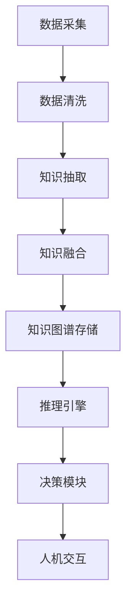

                 


# 《能源行业AI Agent解决方案》

---

## 关键词：AI Agent、能源行业、人工智能、能源优化、知识图谱、自然语言处理

---

## 摘要：  
随着能源行业的数字化转型加速，AI Agent（人工智能代理）在能源领域的应用日益广泛。本文系统地探讨了AI Agent在能源行业的核心概念、技术原理、系统架构以及实际应用。通过分析能源行业的痛点与需求，本文详细介绍了AI Agent如何通过自然语言处理、知识图谱构建、推理与决策等技术实现能源优化与智能化管理。文章还结合实际案例，展示了AI Agent在能源设备监测、预测性维护、能源消耗优化等场景中的应用价值，并提出了未来的发展方向与最佳实践建议。

---

## 第一部分：能源行业AI Agent背景与概念

### 第1章：能源行业面临的挑战与AI Agent的引入

#### 1.1 能源行业的现状与痛点  
能源行业作为全球经济发展的重要支柱，正面临着前所未有的挑战：  
1. **能源效率低下**：传统能源管理方式效率低，资源浪费严重。  
2. **设备维护成本高**：能源设备的预测性维护不足，导致维修成本高昂。  
3. **数据孤岛问题**：能源企业内部数据分散，缺乏统一的数据管理系统。  
4. **安全风险**：能源系统复杂，安全隐患难以及时发现与处理。  

#### 1.2 AI Agent的核心概念与功能  
AI Agent是一种能够感知环境、自主决策并执行任务的智能体。其核心功能包括：  
- **感知环境**：通过传感器、数据库等获取能源系统的实时数据。  
- **知识表示**：利用知识图谱对能源行业的知识进行建模。  
- **推理与决策**：基于知识图谱进行推理，制定最优决策。  
- **自主执行**：通过API或人机交互接口执行任务。  

#### 1.3 能源行业AI Agent的应用场景  
AI Agent在能源行业的应用场景广泛，主要包括：  
- **设备运行监测**：实时监控能源设备的运行状态，及时发现异常。  
- **能源消耗预测**：基于历史数据预测能源需求，优化资源配置。  
- **安全隐患预警**：通过异常检测算法，提前预警潜在风险。  
- **供应链优化**：协调能源供应链各环节，提高效率降低成本。  

---

## 第二部分：AI Agent的核心技术与原理

### 第2章：自然语言处理与知识图谱

#### 2.1 自然语言处理（NLP）在能源行业的应用  
NLP技术在能源行业的应用主要体现在：  
- **文档分析**：对能源行业的技术文档、报告进行自动分析，提取关键信息。  
- **对话系统**：构建能源行业的智能对话系统，提供用户支持。  
- **信息抽取**：从非结构化数据中提取设备参数、运行状态等信息。  

#### 2.2 知识图谱构建与能源数据管理  
知识图谱是AI Agent的核心技术之一。在能源行业，知识图谱的构建流程如下：  
1. **数据采集**：从设备日志、传感器数据、行业报告中获取数据。  
2. **数据清洗**：去除噪声数据，确保数据质量。  
3. **知识抽取**：利用NLP技术提取实体、关系与属性。  
4. **知识融合**：整合多源数据，消除冲突，构建统一的知识图谱。  

#### 2.3 知识图谱在AI Agent中的应用  
知识图谱为AI Agent提供了强大的知识表示能力，使其能够：  
- **快速推理**：基于知识图谱进行路径推理，解决复杂问题。  
- **动态更新**：实时更新知识图谱，保持信息的准确性与及时性。  

### 第3章：AI Agent的推理与决策机制

#### 3.1 基于知识图谱的推理算法  
推理算法是AI Agent的核心，主要包括：  
- **基于规则的推理**：利用预定义的规则进行逻辑推理。  
- **基于深度学习的推理**：利用图神经网络（GNN）进行复杂推理。  

#### 3.2 能源行业的决策优化模型  
AI Agent可以通过强化学习优化能源行业的决策过程。例如：  
- **设备调度优化**：通过强化学习算法，优化设备的运行顺序与时间。  
- **能源分配优化**：基于强化学习模型，优化能源资源的分配策略。  

#### 3.3 案例分析：设备故障预测与优化  
通过AI Agent的推理与决策机制，可以实现设备故障预测与优化。例如：  
- **数据采集**：采集设备的运行数据。  
- **故障预测**：基于知识图谱与强化学习模型，预测设备故障风险。  
- **优化建议**：根据预测结果，制定最优的维护策略。  

---

## 第三部分：AI Agent的系统架构与设计

### 第4章：能源行业AI Agent的系统架构设计

#### 4.1 系统整体架构  
能源行业AI Agent的系统架构包括以下模块：  
- **数据采集与处理模块**：负责采集能源设备的实时数据，并进行清洗与预处理。  
- **知识图谱构建模块**：构建与更新能源行业的知识图谱。  
- **推理与决策模块**：基于知识图谱进行推理与决策，输出优化建议。  
- **人机交互模块**：提供用户与AI Agent的交互界面。  

#### 4.2 系统功能模块设计  
系统功能模块设计如下：  
- **数据处理模块**：支持多种数据格式的导入与处理。  
- **模型训练模块**：提供多种算法模型的训练与优化功能。  
- **推理服务模块**：基于知识图谱提供实时推理服务。  
- **知识库管理模块**：支持知识图谱的可视化与管理。  

#### 4.3 系统架构图  


#### 4.4 系统接口设计  
系统接口设计包括：  
- **数据接口**：支持HTTP API调用，提供数据采集与传输功能。  
- **模型接口**：支持RESTful API调用，提供模型训练与推理功能。  
- **知识库接口**：支持GraphQL查询，提供知识图谱的查询与更新功能。  

---

## 第四部分：项目实战与未来展望

### 第5章：能源行业AI Agent的项目实战

#### 5.1 项目环境与工具安装  
项目环境与工具包括：  
- **Python 3.8+**  
- **TensorFlow 2.0+**  
- **PyTorch 1.0+**  
- **Neo4j**（知识图谱数据库）  
- **spaCy**（NLP工具）  

#### 5.2 核心代码实现  
以下是AI Agent的核心代码实现：  
```python
import spacy
from neo4j.exceptions import ServiceUnavailable

# 数据预处理
def preprocess_data(data):
    return data.dropna().astype(str)

# 知识抽取
def extract_entities(text):
    nlp = spacy.load("en_core_web_sm")
    doc = nlp(text)
    entities = [ent.text for ent in doc.ents]
    return entities

# 知识图谱构建
def build_knowledge_graph(entities):
    driver = neo4j.Driver('bolt://localhost:7687', auth=('neo4j', 'password'))
    with driver.session() as session:
        for entity in entities:
            session.write_transaction(create_entity, entity)
    driver.close()

def create_entity(tx, entity):
    tx.run("CREATE (n:{ EntityType } {{ name: '{entity}' }})", EntityType="EnergyEntity", entity=entity)
```

#### 5.3 项目案例分析  
以能源设备故障预测为例：  
1. **数据采集**：采集设备运行数据。  
2. **知识抽取**：从设备文档中提取故障代码。  
3. **知识图谱构建**：构建设备故障与运行状态的知识图谱。  
4. **推理与预测**：基于知识图谱与强化学习模型，预测设备故障风险。  

#### 5.4 项目总结与优化  
项目总结：  
- AI Agent能够显著提高能源设备的预测性维护能力。  
- 知识图谱与强化学习的结合，提升了系统的推理与决策能力。  

优化建议：  
- 引入实时数据流处理技术，提升系统的响应速度。  
- 结合边缘计算技术，实现本地化的AI Agent部署。  

---

## 作者：AI天才研究院/AI Genius Institute & 禅与计算机程序设计艺术 /Zen And The Art of Computer Programming

