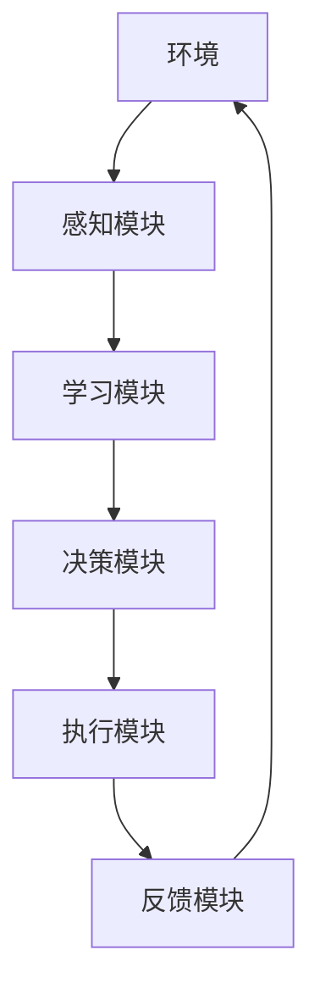
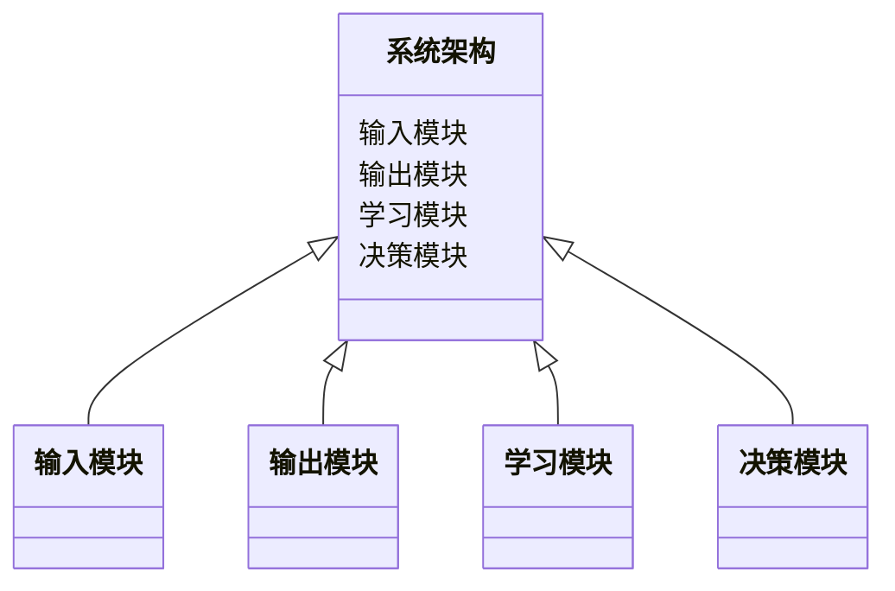

                 


# 自主学习型 AI Agent：利用 LLM 实现持续进化

> **关键词**：自主学习型 AI Agent, 大语言模型, 持续学习, 人工智能, 智能系统
>
> **摘要**：本文详细探讨了自主学习型 AI Agent 的概念、原理、算法实现及其在实际应用中的表现。通过结合大语言模型（LLM）技术，阐述了 AI Agent 如何通过持续学习实现自我进化，并提供了系统架构设计、项目实战和最佳实践等多方面的深入分析。

---

## 第一部分: 自主学习型 AI Agent 的背景与概念

### 第1章: 自主学习型 AI Agent 的定义与背景

#### 1.1 自主学习型 AI Agent 的定义
自主学习型 AI Agent 是一类能够通过与环境交互和数据学习，实现自我改进和进化的人工智能系统。与传统的基于规则的 AI 系统不同，自主学习型 AI Agent 具备自主性、适应性和进化性，能够在动态环境中自我调整和优化。

#### 1.2 自主学习型 AI Agent 的背景
近年来，随着大语言模型（LLM）技术的快速发展，AI Agent 的能力得到了显著提升。自主学习型 AI Agent 的出现，标志着人工智能系统从“被动执行任务”向“主动学习和进化”的转变。这种转变使得 AI Agent 能够在复杂环境中独立解决问题，适应新的任务需求。

#### 1.3 自主学习型 AI Agent 的问题背景
传统的 AI 系统依赖于预设的规则和数据，难以应对未知的或动态变化的环境。在实际应用中，这种依赖性限制了 AI 系统的灵活性和适应性。因此，如何让 AI 系统具备自主学习和进化的能力，成为当前研究的热点问题。

---

## 第二部分: 自主学习型 AI Agent 的核心概念与联系

### 第2章: 自主学习型 AI Agent 的核心概念

#### 2.1 自主学习型 AI Agent 的内部机制
自主学习型 AI Agent 的内部机制包括感知、决策、执行和反馈四个环节。通过感知环境获取信息，基于当前知识和经验做出决策，执行任务并根据反馈结果调整自身行为。

#### 2.2 自主学习型 AI Agent 的核心要素
- **感知模块**：负责接收外部输入信息。
- **学习模块**：基于输入数据进行模式识别和知识提取。
- **决策模块**：根据学习结果做出决策。
- **执行模块**：将决策转化为具体行动。
- **反馈模块**：根据执行结果调整后续行为。

#### 2.3 自主学习型 AI Agent 与其他技术的关系
- **与大语言模型（LLM）的关系**：LLM 提供强大的自然语言处理能力，为 AI Agent 的语言理解和生成提供支持。
- **与强化学习的关系**：强化学习为 AI Agent 提供了通过与环境交互进行学习的框架。
- **与知识图谱的关系**：知识图谱为 AI Agent 提供了结构化的知识表示。

---

## 第三部分: 自主学习型 AI Agent 的算法原理

### 第3章: 自主学习型 AI Agent 的算法原理

#### 3.1 自主学习型 AI Agent 的模型训练
- **数据预处理**：清洗、标注和归一化。
- **模型训练**：基于 LLM 进行微调，优化模型的适应性。
- **优化策略**：使用强化学习算法（如 PPO）进行模型优化。

#### 3.2 自主学习型 AI Agent 的数学模型
$$ P(\text{action} | \text{state}) = \text{Policy}(\text{state}) $$
$$ Q(\text{state}, \text{action}) = \text{Value}(\text{state}) + \text{Policy}(\text{state}) $$

#### 3.3 自主学习型 AI Agent 的算法流程


---

## 第四部分: 自主学习型 AI Agent 的系统架构设计

### 第4章: 自主学习型 AI Agent 的系统架构

#### 4.1 系统应用场景
- 智能客服：通过与用户交互，不断优化服务流程。
- 智能助手：根据用户需求，提供个性化服务。
- 智能机器人：在复杂环境中执行任务并适应变化。

#### 4.2 系统功能设计


#### 4.3 系统接口设计
- **输入接口**：接收环境输入。
- **输出接口**：输出决策结果。
- **学习接口**：与数据源交互，更新知识库。

---

## 第五部分: 自主学习型 AI Agent 的项目实战

### 第5章: 自主学习型 AI Agent 的实战应用

#### 5.1 项目环境与工具安装
- **Python 版本**：3.8+
- **框架选择**：使用 Hugging Face 的 LLM 库。
- **依赖安装**：`pip install transformers`

#### 5.2 系统核心代码实现
```python
from transformers import AutoModelWithLM, AutoTokenizer

class AutonomousAI:
    def __init__(self, model_name):
        self.model = AutoModelWithLM.from_pretrained(model_name)
        self.tokenizer = AutoTokenizer.from_pretrained(model_name)

    def perceive(self, input_str):
        # 返回模型的输入格式
        return self.tokenizer(input_str, return_tensors="pt")

    def decide(self, inputs):
        # 基于输入做出决策
        outputs = self.model.generate(**inputs)
        return outputs

    def execute(self, decision):
        # 执行具体任务
        print(f"执行命令：{decision}")
```

#### 5.3 代码解读与分析
- `perceive` 方法：将输入字符串转化为模型可接受的格式。
- `decide` 方法：基于输入生成决策结果。
- `execute` 方法：将决策转化为具体行动。

#### 5.4 项目总结
通过实战项目，我们验证了自主学习型 AI Agent 的可行性，并总结出以下几点：
1. 系统设计需注重模块化，便于后续优化。
2. 数据质量和多样性对模型性能有直接影响。
3. 反馈机制的引入能够显著提升系统的适应性。

---

## 第六部分: 自主学习型 AI Agent 的最佳实践

### 第6章: 最佳实践与小结

#### 6.1 最佳实践
1. **数据管理**：确保数据的多样性和高质量。
2. **模型优化**：定期对模型进行微调和优化。
3. **系统监控**：实时监控系统运行状态，及时发现和解决问题。

#### 6.2 小结
自主学习型 AI Agent 的实现依赖于大语言模型的强大能力，通过持续学习和进化，能够在复杂环境中展现出强大的适应性。本文从背景、概念、算法、系统架构到实战应用，全面阐述了这一技术的核心内容。

---

## 作者信息

**作者：AI天才研究院/AI Genius Institute & 禅与计算机程序设计艺术 /Zen And The Art of Computer Programming**

---

**结语**：自主学习型 AI Agent 的发展代表着人工智能技术的重要进步。通过结合大语言模型和强化学习，AI Agent 的能力将得到进一步提升，为未来的智能系统开发提供新的思路和方向。

