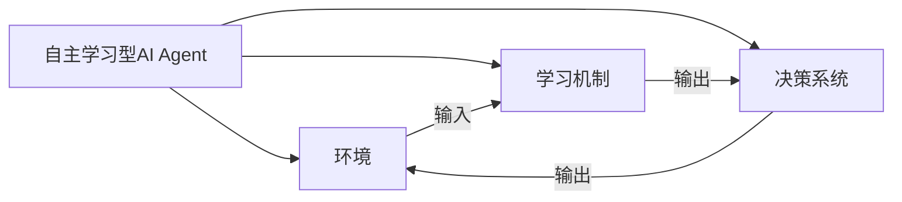
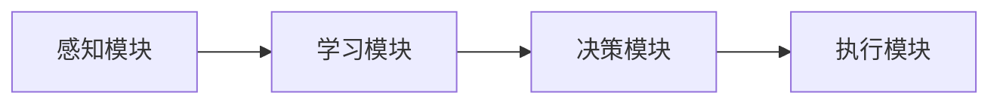
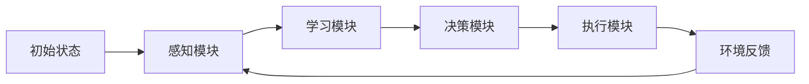

                 


# 自主学习型AI Agent：持续进化的智能体

## 关键词：自主学习型AI Agent, 智能体, 强化学习, 进化算法, 多模态感知

## 摘要：  
本文深入探讨了自主学习型AI Agent的核心概念、算法原理、系统架构以及实际应用。通过分析其自主性、学习机制和环境感知能力，结合强化学习和进化算法，揭示了自主学习型AI Agent在智能决策、知识进化和持续优化方面的独特优势。文章从理论到实践，详细阐述了其在智能机器人、自动驾驶和智能助手等领域的应用，并通过具体案例展示了其实战能力。最后，展望了未来的发展方向，提出了优化建议和研究重点。

---

# 第一部分: 自主学习型AI Agent概述

## 第1章: 自主学习型AI Agent的背景与概念

### 1.1 自主学习型AI Agent的背景

#### 1.1.1 人工智能的发展历程  
人工智能（AI）技术经历了从符号逻辑推理到机器学习的转变，近年来，随着深度学习和强化学习的突破，AI开始具备自主决策的能力。自主学习型AI Agent的出现，标志着AI从“被动执行”向“主动学习”的进化。

#### 1.1.2 自主学习的概念与特点  
自主学习是指AI Agent能够在没有外部干预的情况下，通过与环境的交互，主动获取知识、优化决策并提升性能。其核心特点包括：  
- **主动性**：无需外部指令，主动探索环境。  
- **自适应性**：能够根据环境变化调整策略。  
- **持续进化**：通过学习不断优化自身能力。  

#### 1.1.3 自主学习型AI Agent的定义  
自主学习型AI Agent是一种能够在复杂动态环境中，通过感知、推理、决策和执行，实现自主学习、优化和进化的人工智能系统。

### 1.2 自主学习型AI Agent的核心要素

#### 1.2.1 自主性与主动性  
自主性是AI Agent的核心特征，体现在其能够独立决策和行动。主动性则表现在系统能够主动探索未知领域，而不是被动等待指令。

#### 1.2.2 学习机制与进化能力  
自主学习型AI Agent通过强化学习、进化算法等机制，实现知识的积累与优化。其进化能力使其能够适应环境的变化，避免“过时”的策略。

#### 1.2.3 环境感知与决策能力  
AI Agent通过多模态感知（如视觉、听觉、触觉等）获取环境信息，并结合决策模型做出最优选择。

### 1.3 自主学习型AI Agent的应用领域

#### 1.3.1 智能机器人与自动化系统  
自主学习型AI Agent能够使机器人在复杂环境中自主导航、任务规划和问题解决。

#### 1.3.2 自动驾驶与智能交通  
通过自主学习，自动驾驶系统能够实时优化行驶策略，应对复杂交通场景。

#### 1.3.3 智能助手与人机交互  
智能助手（如语音助手）通过自主学习，能够更准确地理解用户需求，提供个性化的服务。

### 1.4 本章小结  
本章介绍了自主学习型AI Agent的背景、核心概念和应用领域，强调了其自主性、学习能力和环境感知能力的重要性。

---

# 第二部分: 自主学习型AI Agent的核心概念

## 第2章: 自主学习型AI Agent的核心原理

### 2.1 自主性与主动性

#### 2.1.1 自主性的定义与实现  
自主性是AI Agent的核心特征，体现在其能够独立决策和行动。其实现依赖于强化学习和进化算法。

#### 2.1.2 主动性的表现与机制  
主动性表现在系统能够主动探索未知领域，其机制包括环境感知、目标设定和行动规划。

### 2.2 学习机制与进化能力

#### 2.2.1 强化学习与自主决策  
强化学习通过奖励机制优化决策策略，是实现自主决策的核心算法。

#### 2.2.2 进化算法与参数优化  
进化算法（如遗传算法、模拟退火）用于优化AI Agent的参数，使其适应环境变化。

#### 2.2.3 知识表示与经验复用  
知识表示是AI Agent理解环境的关键，经验复用能够加速学习过程。

### 2.3 环境感知与决策能力

#### 2.3.1 多模态感知与数据融合  
AI Agent通过多种传感器获取信息，并通过数据融合技术提升感知精度。

#### 2.3.2 状态空间与动作空间  
状态空间描述环境的当前状态，动作空间定义AI Agent的可能动作。

#### 2.3.3 决策模型与策略优化  
决策模型基于当前状态选择最优动作，策略优化通过强化学习不断改进策略。

### 2.4 核心概念对比表

#### 表2-1: 自主学习型AI Agent与传统AI的对比

| 特性                | 传统AI                          | 自主学习型AI Agent            |
|---------------------|---------------------------------|-------------------------------|
| 决策方式            | 被动执行规则                    | 主动学习并优化策略            |
| 环境适应能力        | 有限，需人工调整                | 良好，能自适应环境变化          |
| 知识更新方式        | 静态知识库                      | 动态学习并更新知识            |
| 应用场景            | 固定任务                        | 复杂动态环境                  |

### 2.5 ER实体关系图



### 2.6 本章小结  
本章深入分析了自主学习型AI Agent的核心概念，包括自主性、学习机制和环境感知能力，并通过对比表和ER图展示了其与传统AI的区别。

---

# 第三部分: 自主学习型AI Agent的算法原理

## 第3章: 自主学习算法的数学模型

### 3.1 强化学习算法

#### 3.1.1 Q-learning算法

##### 3.1.1.1 Q-learning的基本原理  
Q-learning是一种经典的强化学习算法，通过更新Q值表来学习最优策略。

##### 3.1.1.2 Q-learning的数学公式  
$$ Q(s, a) = Q(s, a) + \alpha [r + \max Q(s', a') - Q(s, a)] $$  
其中，$Q(s, a)$表示当前状态下动作$a$的Q值，$\alpha$是学习率，$r$是奖励，$s'$是下一状态。

##### 3.1.1.3 Q-learning的流程图  
```mermaid
graph LR
A[初始状态s] --> B[选择动作a]
B --> C[执行动作a]
C --> D[获得奖励r和状态s']
D --> E[更新Q(s,a)]
E --> F[判断是否结束]
F -->|未结束| A
F -->|结束| 终止
```

#### 3.1.2 Deep Q-Networks (DQN)

##### 3.1.2.1 DQN的基本原理  
DQN通过深度神经网络近似Q值函数，解决了离散动作空间的问题。

##### 3.1.2.2 DQN的网络结构  
$$ Q(s) = \sigma(W_1 s + b_1) \cdot W_2 + b_2 $$  
其中，$\sigma$是激活函数，$W_1$和$W_2$是网络权重，$b_1$和$b_2$是偏置项。

#### 3.1.3 策略梯度方法

##### 3.1.3.1 策略梯度的基本原理  
策略梯度方法直接优化策略，通过梯度 ascent 更新参数。

##### 3.1.3.2 策略梯度的数学公式  
$$ \theta = \theta + \alpha \nabla_\theta J(\theta) $$  
其中，$J(\theta)$是目标函数，$\nabla_\theta J(\theta)$是梯度。

### 3.2 进化算法

#### 3.2.1 遗传算法

##### 3.2.1.1 遗传算法的基本步骤  
1. 初始化种群。  
2. 计算适应度。  
3. 选择优秀个体。  
4. 进行交叉和变异。  
5. 重复迭代。

##### 3.2.1.2 遗传算法的适应度函数  
$$ f(x) = \sum_{i=1}^n x_i^2 $$  
其中，$x_i$是决策变量。

#### 3.2.2 模拟退火算法

##### 3.2.2.1 模拟退火的基本原理  
模拟退火通过随机扰动和降温策略，避免陷入局部最优。

##### 3.2.2.2 模拟退火的数学模型  
$$ T = T_0 \cdot \exp(-k/N) $$  
其中，$T_0$是初始温度，$k$是步数，$N$是降温常数。

#### 3.2.3 群智能算法

##### 3.2.3.1 群智能的基本原理  
群智能模拟生物群体的行为，通过局部交互实现全局优化。

##### 3.2.3.2 群智能的数学模型  
$$ x_i^{k+1} = x_i^k + \sum_{j=1}^n w_{ij} (x_j^k - x_i^k) $$  
其中，$w_{ij}$是权重，$n$是邻居数量。

### 3.3 算法原理总结  
本文介绍了强化学习和进化算法的基本原理，并通过数学公式和流程图展示了其具体实现。

### 3.4 本章小结  
本章详细讲解了自主学习型AI Agent的核心算法，包括Q-learning、DQN和遗传算法，并通过数学公式和流程图展示了其工作原理。

---

# 第四部分: 自主学习型AI Agent的系统架构

## 第4章: 系统架构与实现

### 4.1 系统架构设计

#### 4.1.1 系统功能模块
1. **感知模块**：负责环境数据的采集与处理。  
2. **学习模块**：实现强化学习和进化算法。  
3. **决策模块**：根据学习结果做出决策。  
4. **执行模块**：将决策转化为具体行动。

#### 4.1.2 系统架构图  


### 4.2 系统实现细节

#### 4.2.1 感知模块的实现
- 使用多模态传感器（如摄像头、麦克风）获取环境信息。  
- 通过数据融合技术（如Kalman滤波）提升感知精度。

#### 4.2.2 学习模块的实现
- 实现Q-learning或DQN算法，训练神经网络。  
- 使用遗传算法优化参数。

#### 4.2.3 决策模块的实现
- 基于当前状态和学习结果，选择最优动作。  
- 支持多策略切换，适应不同环境。

#### 4.2.4 执行模块的实现
- 将决策转化为具体操作（如机器人移动、自动驾驶转向）。  
- 反馈执行结果，闭环控制。

### 4.3 系统交互流程图



### 4.4 系统优化建议

#### 4.4.1 参数调优
- 学习率$\alpha$的选择。  
- 网络层数和神经元数量的调整。

#### 4.4.2 环境建模
- 简化复杂环境，降低计算负担。  
- 提供多样化的训练场景。

#### 4.4.3 并行计算
- 使用GPU加速训练过程。  
- 分布式计算优化大规模数据处理。

### 4.5 本章小结  
本章从系统架构的角度，详细讲解了自主学习型AI Agent的实现细节，并提出了优化建议。

---

# 第五部分: 自主学习型AI Agent的实战应用

## 第5章: 项目实战

### 5.1 项目背景

#### 5.1.1 项目目标
开发一个自主学习型AI Agent，使其能够在复杂环境中完成特定任务。

#### 5.1.2 项目需求
- 实现环境感知与数据处理。  
- 设计强化学习和进化算法模块。  
- 实现决策与执行模块。

### 5.2 环境安装与配置

#### 5.2.1 系统要求
- 操作系统：Linux/Windows/MacOS。  
- 开发工具：Python、TensorFlow、Keras。  
- 硬件需求：推荐使用GPU加速。

#### 5.2.2 安装依赖
- Python 3.7以上版本。  
- 安装TensorFlow和Keras库。  
- 安装Mermaid CLI用于生成图表。

### 5.3 系统核心代码实现

#### 5.3.1 感知模块代码
```python
class Perception:
    def __init__(self):
        self.sensors = []  # 多模态传感器

    def get_data(self):
        # 返回感知数据
        return {sensor.read() for sensor in self.sensors}
```

#### 5.3.2 学习模块代码
```python
class Learner:
    def __init__(self):
        self.model = self.build_model()

    def build_model(self):
        # 构建神经网络模型
        model = Sequential()
        model.add(Dense(64, activation='relu', input_dim=10))
        model.add(Dense(32, activation='relu'))
        model.add(Dense(1, activation='linear'))
        return model

    def train(self, data, target):
        # 训练模型
        self.model.fit(data, target, epochs=100, batch_size=32)
```

#### 5.3.3 决策模块代码
```python
class Decision:
    def __init__(self, model):
        self.model = model

    def make_decision(self, state):
        # 根据状态做出决策
        return self.model.predict(state)[0]
```

#### 5.3.4 执行模块代码
```python
class Executor:
    def __init__(self):
        self.motors = []  # 执行机构

    def execute(self, action):
        # 执行动作
        for motor in self.motors:
            motor.move(action)
```

### 5.4 实际案例分析与代码解读

#### 5.4.1 案例分析
假设我们开发一个自主学习型AI Agent用于智能仓储管理，需要完成货物分拣任务。系统通过摄像头感知货物位置，通过强化学习优化分拣策略。

#### 5.4.2 代码解读
- **感知模块**：从摄像头获取货物位置信息。  
- **学习模块**：训练神经网络模型，预测最优分拣路径。  
- **决策模块**：根据模型预测结果做出分拣决策。  
- **执行模块**：驱动机械臂完成货物分拣。

### 5.5 项目小结  
本章通过一个实际案例，详细讲解了自主学习型AI Agent的开发过程，包括环境感知、学习算法、决策模块和执行机构的实现。

---

# 第六部分: 自主学习型AI Agent的未来展望

## 第6章: 未来展望与挑战

### 6.1 未来发展方向

#### 6.1.1 更强的自主性
通过更复杂的强化学习算法，提升AI Agent的自主决策能力。

#### 6.1.2 更高效的进化算法
研究新型进化算法，提升优化效率和适应性。

#### 6.1.3 更智能的多模态感知
开发更高精度的多模态感知技术，提升环境理解能力。

### 6.2 当前面临的主要挑战

#### 6.2.1 算法效率
如何在复杂环境中快速收敛，提升学习效率。

#### 6.2.2 环境适应性
如何应对动态变化的环境，避免策略过时。

#### 6.2.3 安全性问题
确保AI Agent的安全性，防止滥用和误用。

### 6.3 应用领域的拓展

#### 6.3.1 智能医疗
AI Agent辅助医生进行诊断和治疗方案优化。

#### 6.3.2 智能教育
个性化学习助手，根据学生表现动态调整教学策略。

#### 6.3.3 智能金融
AI Agent用于金融市场的实时交易和风险控制。

### 6.4 本章小结  
本文展望了自主学习型AI Agent的未来发展方向，并指出了当前面临的主要挑战。

---

# 作者：AI天才研究院/AI Genius Institute & 禅与计算机程序设计艺术 /Zen And The Art of Computer Programming

