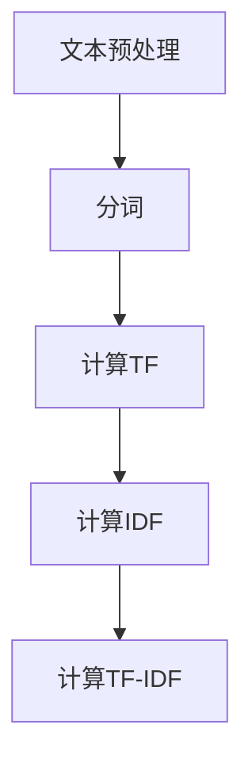
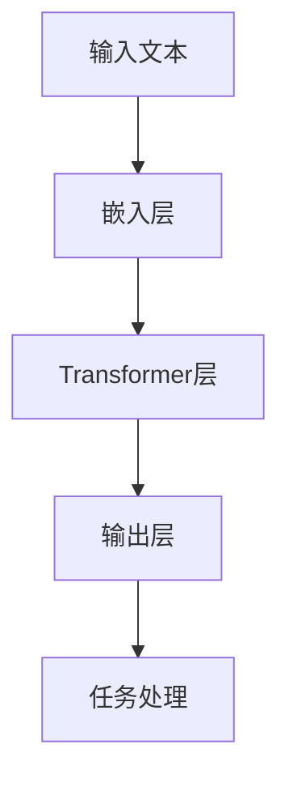
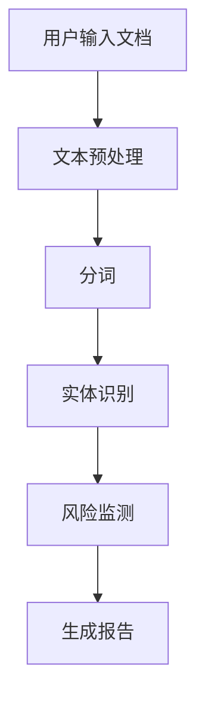
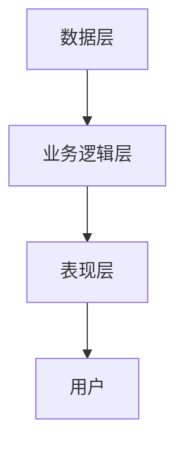
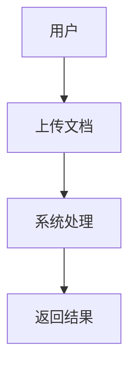

                 


# 自然语言处理在监管合规自动化中的应用

## 关键词
自然语言处理, 监管合规, 自动化, 文本分析, 模式识别, 语义理解, 合规系统

## 摘要
自然语言处理（NLP）技术在监管合规自动化中发挥着越来越重要的作用。通过利用NLP技术，企业可以自动化处理大量监管文档，识别潜在风险，确保合规性。本文将详细探讨NLP在监管合规中的应用，包括核心概念、算法原理、系统设计和实际案例，帮助读者全面理解如何利用NLP技术提升监管合规效率。

---

# 第1章 自然语言处理与监管合规自动化概述

## 1.1 自然语言处理的基本概念

### 1.1.1 自然语言处理的定义与核心任务
自然语言处理（NLP）是计算机科学、人工智能和语言学的交叉领域，旨在让计算机能够理解、处理和生成人类语言。核心任务包括：
- **文本处理**：如分词、词性标注、命名实体识别。
- **语义理解**：如意图识别、情感分析。
- **文本生成**：如机器翻译、摘要生成。

### 1.1.2 自然语言处理的主要技术与工具
- **传统技术**：如TF-IDF、词袋模型。
- **深度学习技术**：如RNN、BERT、GPT。
- **开源工具**：如spaCy、NLTK、HanLP。

### 1.1.3 自然语言处理在不同领域的应用
- **金融**：风险评估、欺诈检测。
- **法律**：合同审查、案例分析。
- **医疗**：病历分析、疾病诊断。

## 1.2 监管合规自动化的重要性和挑战

### 1.2.1 监管合规的定义与范围
监管合规是指企业或组织遵循相关法律法规和行业标准，确保业务活动的合法性和规范性。涉及的领域包括金融、法律、医疗等。

### 1.2.2 传统监管合规的痛点与局限性
- **人工处理效率低**：文档量大，处理时间长。
- **主观性高**：依赖人工经验，存在疏漏风险。
- **成本高昂**：需要大量人力资源和时间投入。

### 1.2.3 监管合规自动化的目标与意义
- **提高效率**：自动化处理文档，减少人工干预。
- **降低成本**：降低人力和时间成本。
- **确保准确性**：通过技术手段提高合规性。

## 1.3 自然语言处理在监管合规自动化中的作用

### 1.3.1 自然语言处理如何提升监管效率
- **自动化文档分析**：快速处理大量文本数据。
- **智能风险识别**：通过语义理解识别潜在风险。

### 1.3.2 自然语言处理在合规文档分析中的应用
- **合同审查**：识别合同中的关键条款和潜在风险。
- **法律法规解读**：自动解析法律条文，生成合规指南。

### 1.3.3 自然语言处理与监管合规自动化的结合
- **实时监控**：实时分析企业行为，确保合规性。
- **智能报告生成**：自动生成合规报告，提高效率。

## 1.4 本章小结

### 1.4.1 自然语言处理的核心概念
自然语言处理通过理解和处理人类语言，帮助计算机完成多种文本任务。

### 1.4.2 监管合规自动化的主要挑战
传统合规方式存在效率低、成本高、主观性强等问题。

### 1.4.3 自然语言处理在监管合规中的关键作用
NLP技术能够显著提升合规效率，降低企业成本，并提高合规准确性。

---

# 第2章 自然语言处理的核心技术

## 2.1 词法分析

### 2.1.1 分词技术
分词是将连续的文本分割成有意义的词语或短语的过程。常用算法包括：
- **基于统计的方法**：如jieba。
- **基于规则的方法**：如正则表达式。

### 2.1.2 词性标注
词性标注是对每个词语进行词性分类的过程，如名词、动词、形容词。常用工具包括：
- **Harvard-Knuth算法**。
- ** Brill's Algorithm**。

### 2.1.3 命名实体识别
命名实体识别（NER）是识别文本中的命名实体（如人名、地名、组织名）的过程。常用模型包括：
- **CRF**。
- **BERT**。

## 2.2 句法分析

### 2.2.1 依存句法分析
依存句法分析研究词语之间的语法关系，常用工具包括：
- **Stanford Parser**。
- ** spaCy**。

### 2.2.2 语法树构建
语法树是句子结构的树形表示，帮助理解句子的语法关系。

### 2.2.3 句法分析在合规文本中的应用
句法分析可用于识别合规文本中的语法结构，辅助理解文本含义。

## 2.3 文本表示与编码

### 2.3.1 词向量表示
词向量表示（如Word2Vec）将词语映射为低维向量，捕捉词语语义信息。

### 2.3.2 碟向量（BERT）模型
BERT是一种基于Transformer的预训练模型，能够捕捉上下文语义信息。

### 2.3.3 文本编码的对比分析
对比分析不同编码方法的优缺点，如TF-IDF与BERT的性能对比。

## 2.4 语义理解

### 2.4.1 意图识别
意图识别通过分析文本内容，识别用户的意图或目的。

### 2.4.2 情感分析
情感分析用于判断文本的情感倾向，如正面、负面或中性。

### 2.4.3 文本相似度计算
文本相似度计算用于衡量两段文本的相似性，常用算法包括余弦相似度和BM25。

## 2.5 本章小结

### 2.5.1 自然语言处理的核心技术
NLP的核心技术包括分词、词性标注、命名实体识别、句法分析、文本表示和语义理解。

### 2.5.2 各种技术在监管合规中的应用
词法分析用于文档分词，句法分析用于语法结构分析，语义理解用于意图识别。

### 2.5.3 技术对比与选择
根据具体场景选择合适的技术，如使用BERT进行语义理解，使用jieba进行分词。

---

# 第3章 自然语言处理在监管合规中的具体应用

## 3.1 合规文档的自动分类

### 3.1.1 文档分类技术
文档分类是将文档自动归类到特定类别，如合同、法规等。

### 3.1.2 基于NLP的分类流程
1. 文档预处理：分词、去除停用词。
2. 特征提取：提取关键词或使用词袋模型。
3. 分类器训练：使用SVM、随机森林等算法。

### 3.1.3 实际案例
以银行流水单为例，自动分类交易类型。

## 3.2 风险监测与预警

### 3.2.1 风险识别技术
通过NLP技术识别文本中的风险信号，如“违约”、“欺诈”等关键词。

### 3.2.2 风险监测系统设计
1. 数据采集：获取交易数据和相关文本信息。
2. 文本处理：分词、实体识别。
3. 风险评估：基于文本内容进行风险评分。

### 3.2.3 实际案例
以金融交易为例，识别潜在的欺诈行为。

## 3.3 合规报告自动生成

### 3.3.1 自动报告生成技术
基于NLP技术生成合规报告，减少人工编写时间。

### 3.3.2 报告生成流程
1. 文本分析：识别关键信息。
2. 内容生成：自动生成报告内容。
3. 格式化输出：生成PDF或Word格式的报告。

### 3.3.3 实际案例
以企业年报为例，自动生成合规报告。

## 3.4 本章小结

### 3.4.1 自然语言处理在合规中的具体应用
NLP技术在文档分类、风险监测和报告生成等方面发挥了重要作用。

### 3.4.2 各种技术在实际中的应用效果
通过具体案例展示了NLP技术在监管合规中的实际价值。

### 3.4.3 技术选择与优化
根据具体需求选择合适的技术，并不断优化模型性能。

---

# 第4章 自然语言处理算法原理

## 4.1 传统算法

### 4.1.1 TF-IDF
TF-IDF是一种常用的文本特征提取方法，用于衡量词语在文档中的重要性。

$$ TF-IDF = \frac{tf \times idf}{N} $$

### 4.1.2 LDA主题模型
LDA是一种主题建模算法，用于识别文档中的主题分布。

$$ P(\text{topic}|\text{word}) = \frac{P(\text{word}|\text{topic}) \times P(\text{topic})}{P(\text{word})} $$

## 4.2 深度学习算法

### 4.2.1 BERT模型
BERT是一种基于Transformer的预训练模型，通过自注意力机制捕捉文本的上下文信息。

### 4.2.2 GPT模型
GPT是一种生成式模型，用于生成与上下文相关的文本内容。

## 4.3 算法流程图

### 4.3.1 TF-IDF流程图


### 4.3.2 BERT流程图


## 4.4 本章小结

### 4.4.1 传统算法的优势
TF-IDF计算简单，适合小规模数据处理。

### 4.4.2 深度学习算法的潜力
BERT和GPT等深度学习模型在语义理解方面表现优异。

### 4.4.3 算法选择与应用
根据具体场景选择合适算法，传统算法适合简单任务，深度学习算法适合复杂任务。

---

# 第5章 系统分析与架构设计

## 5.1 系统功能设计

### 5.1.1 功能模块划分
- **文本处理模块**：负责文档的分词、实体识别。
- **分析模块**：负责风险监测、合规检查。
- **报告生成模块**：负责自动生成合规报告。

### 5.1.2 功能流程图


## 5.2 系统架构设计

### 5.2.1 分层架构
系统分为数据层、业务逻辑层和表现层，各层之间通过接口通信。

### 5.2.2 架构流程图


## 5.3 系统接口设计

### 5.3.1 API接口
- **输入接口**：接收文档数据。
- **输出接口**：返回分析结果。

### 5.3.2 接口协议
使用RESTful API，支持JSON格式数据传输。

## 5.4 系统交互设计

### 5.4.1 交互流程
用户上传文档，系统处理后返回结果。

### 5.4.2 交互流程图


## 5.5 本章小结

### 5.5.1 系统功能设计
系统功能包括文本处理、风险监测和报告生成。

### 5.5.2 系统架构设计
采用分层架构，确保系统高效可靠。

### 5.5.3 系统交互设计
通过API接口实现用户与系统之间的数据交互。

---

# 第6章 项目实战

## 6.1 环境安装

### 6.1.1 安装Python
```bash
python --version
pip install --upgrade pip
```

### 6.1.2 安装NLP库
```bash
pip install numpy
pip install scikit-learn
pip install spacy
pip install bert-for-tf
```

## 6.2 核心代码实现

### 6.2.1 文本预处理
```python
import spacy

nlp = spacy.load("en_core_web_sm")
doc = nlp("This is a sample text for preprocessing.")
for token in doc:
    print(token.text)
```

### 6.2.2 风险监测
```python
from sklearn.feature_extraction.text import TfidfVectorizer
from sklearn.svm import SVC

vectorizer = TfidfVectorizer()
X = vectorizer.fit_transform(corpus)
model = SVC()
model.fit(X, labels)
```

### 6.2.3 报告生成
```python
from transformers import BertForTokenClassification
model = BertForTokenClassification.from_pretrained("bert-base-uncased")
input_ids = tokenizer.encode("Sample text for report generation.", add_special_tokens=True)
outputs = model(input_ids)
```

## 6.3 实际案例分析

### 6.3.1 案例背景
以银行交易数据为例，自动识别高风险交易。

### 6.3.2 数据处理
对交易记录进行清洗和标注。

### 6.3.3 模型训练
使用BERT模型进行风险分类。

## 6.4 本章小结

### 6.4.1 项目环境搭建
安装必要的Python库和工具。

### 6.4.2 核心代码实现
实现文本预处理、特征提取和模型训练。

### 6.4.3 案例分析与优化
通过实际案例验证系统性能，并不断优化模型。

---

# 第7章 总结与展望

## 7.1 总结

### 7.1.1 自然语言处理在监管合规中的价值
NLP技术显著提升了合规效率，降低了企业成本。

### 7.1.2 关键技术与实现
词法分析、句法分析、语义理解等技术在合规中的具体应用。

### 7.1.3 系统设计与优化
分层架构、API接口设计等确保了系统的高效可靠。

## 7.2 展望

### 7.2.1 技术发展
未来，NLP技术将进一步深度学习化，模型性能将不断提升。

### 7.2.2 应用场景扩展
NLP在更多领域如医疗、教育中的应用将更加广泛。

### 7.2.3 挑战与机遇
随着技术进步，NLP在监管合规中的应用将面临更多挑战和机遇。

## 7.3 最佳实践 Tips

### 7.3.1 技术选择
根据具体需求选择合适的技术，传统算法适合简单任务，深度学习算法适合复杂任务。

### 7.3.2 系统设计
采用分层架构，确保系统的可扩展性和可维护性。

### 7.3.3 模型优化
通过数据增强、模型微调等方法不断提升模型性能。

## 7.4 本章小结

### 7.4.1 自然语言处理的未来发展
NLP技术将继续发展，应用场景将更加广泛。

### 7.4.2 监管合规自动化中的机遇与挑战
企业需要结合自身需求，选择合适的技术和方案。

### 7.4.3 总结与建议
通过合理设计和优化，NLP技术能够在监管合规自动化中发挥更大作用。

---

# 作者：AI天才研究院/AI Genius Institute & 禅与计算机程序设计艺术/Zen And The Art of Computer Programming

---

以上是《自然语言处理在监管合规自动化中的应用》的完整目录和内容框架。希望这篇文章能够为您提供清晰的技术分析和实践指导！

