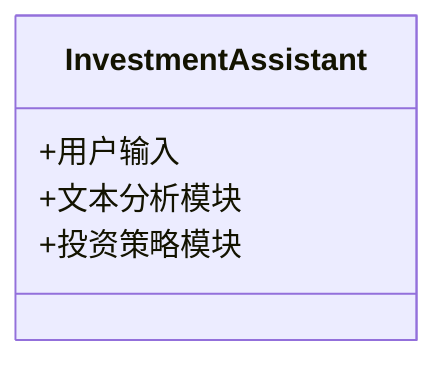
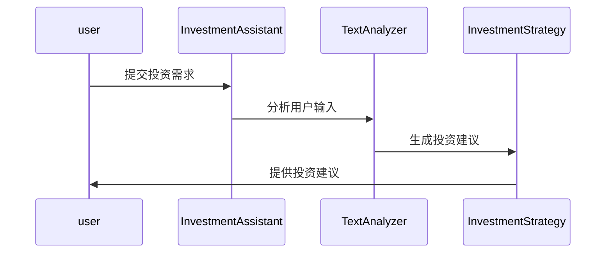

                 


# 自然语言理解在智能投资助手中的应用

## 关键词
自然语言理解, 智能投资助手, 金融文本分析, 机器学习, 文本挖掘, 量化投资

## 摘要
自然语言理解（NLU）作为人工智能的重要分支，正在逐步改变金融领域的投资方式。本文详细探讨了自然语言理解技术在智能投资助手中的应用，从背景介绍到算法实现，从系统设计到项目实战，全面解析了NLU如何帮助投资者更高效地进行投资决策。通过分析金融文本，识别实体关系，构建投资模型，智能投资助手能够为用户提供个性化的投资建议，提升投资效率和准确性。本文还结合实际案例，展示了NLU技术在投资领域的巨大潜力，并提出了未来的发展方向。

---

# 第1章 自然语言理解与智能投资助手的背景介绍

## 1.1 自然语言理解的定义与技术背景

### 1.1.1 自然语言理解的核心概念
自然语言理解（NLU）是人工智能领域的重要研究方向，旨在让计算机能够理解和解析人类的自然语言输入。NLU的核心任务包括文本分割、词性标注、句法分析、语义理解等，最终目标是让计算机能够像人类一样理解文本内容。

### 1.1.2 自然语言理解的技术背景
随着深度学习技术的发展，NLU技术取得了显著进步。基于Transformer架构的模型（如BERT、GPT）在文本理解和生成方面表现出色，为金融领域的智能投资助手提供了强大的技术支持。

### 1.1.3 自然语言理解在金融领域的应用潜力
金融领域的文本数据量庞大，包括新闻、报告、社交媒体评论等。NLU技术可以从中提取关键信息，帮助投资者快速获取市场动态，分析公司财报，评估市场情绪。

---

## 1.2 智能投资助手的定义与目标

### 1.2.1 智能投资助手的功能定位
智能投资助手是一种基于人工智能技术的投资辅助工具，能够通过自然语言处理技术，帮助投资者分析市场信息、评估投资机会、优化投资策略。

### 1.2.2 智能投资助手的核心目标
智能投资助手的核心目标是通过理解和解析金融文本，为投资者提供个性化的投资建议，包括市场趋势预测、风险评估、投资组合优化等。

### 1.2.3 智能投资助手与传统投资工具的区别
与传统投资工具相比，智能投资助手具有以下优势：
1. **智能化**：能够自动分析大量金融数据，提供实时反馈。
2. **个性化**：根据投资者的需求和风险偏好，提供定制化建议。
3. **高效性**：通过自然语言理解技术，快速提取关键信息。

---

## 1.3 自然语言理解在智能投资助手中的应用前景

### 1.3.1 自然语言理解在金融文本分析中的作用
NLU技术可以用于分析新闻、公司财报、行业报告等文本数据，提取关键信息（如公司名称、财务数据、市场情绪）。

### 1.3.2 自然语言理解在投资决策中的价值
通过NLU技术，投资者可以快速理解复杂文本内容，识别潜在的投资机会和风险，从而做出更明智的投资决策。

### 1.3.3 自然语言理解技术的未来发展趋势
随着深度学习技术的不断进步，NLU在金融领域的应用将更加广泛。未来，智能投资助手将更加智能化、个性化，能够处理更复杂的金融文本数据。

---

## 1.4 本章小结
本章主要介绍了自然语言理解技术的定义、技术背景及其在金融领域的应用潜力，重点分析了智能投资助手的功能定位和核心目标。通过本章的学习，读者可以理解NLU技术在智能投资助手中的重要性及其未来的应用前景。

---

# 第2章 自然语言理解的核心概念与技术原理

## 2.1 自然语言理解的核心概念

### 2.1.1 分词与词性标注
分词是将连续的文本分割成词语的过程，词性标注是对每个词语进行词性分类（如名词、动词、形容词等）。

### 2.1.2 句法分析与语义理解
句法分析是研究句子的结构和语法关系，语义理解是理解文本的含义和上下文关系。

### 2.1.3 实体识别与关系抽取
实体识别是识别文本中的命名实体（如人名、地名、组织名），关系抽取是识别实体之间的关系（如“苹果收购了公司”中的“收购”关系）。

---

## 2.2 自然语言理解的关键技术

### 2.2.1 基于规则的NLU技术
基于规则的NLU技术通过预定义的规则和模式匹配来理解文本。这种方法适用于特定领域的文本分析，但在复杂场景下表现有限。

### 2.2.2 统计学方法在NLU中的应用
统计学方法通过分析文本数据的统计规律，建立概率模型来理解文本。常用技术包括朴素贝叶斯、隐马尔可夫模型等。

### 2.2.3 深度学习驱动的NLU技术
深度学习技术（如RNN、Transformer）在NLU任务中表现优异，能够自动学习文本的特征和规律。

---

## 2.3 自然语言理解的数学模型与公式

### 2.3.1 语言模型的概率表示
语言模型可以通过概率分布来表示文本的规律：
$$P(w_1, w_2, \ldots, w_n) = \prod_{i=1}^n P(w_i | w_1, \ldots, w_{i-1})$$

### 2.3.2 基于词嵌入的表示方法
词嵌入技术（如Word2Vec、GloVe）将词语表示为低维向量，例如：
$$\text{embed}(w) \in \mathbb{R}^d$$

### 2.3.3 注意力机制的数学表达
注意力机制用于捕捉文本中的关键信息：
$$\text{Attention}(Q,K,V) = \text{softmax}(\frac{QK^T}{\sqrt{d_k}})V$$

---

## 2.4 自然语言理解技术的对比分析

### 2.4.1 不同NLU技术的优缺点对比
| 技术 | 优点 | 缺点 |
|------|------|------|
| 基于规则的NLU | 简单易实现 | 适用于特定场景 |
| 统计学方法 | 数据驱动 | 需要大量数据 |
| 深度学习 | 高准确性 | 训练时间长 |

### 2.4.2 基于表格的NLU技术属性特征对比
| 技术 | 分词 | 词性标注 | 句法分析 |
|------|------|----------|-----------|
| 基于规则 | √ | √ | √ |
| 统计学方法 | √ | √ | √ |
| 深度学习 | √ | √ | √ |

### 2.4.3 自然语言理解技术的实体关系图（Mermaid流程图）


---

## 2.5 本章小结
本章详细介绍了自然语言理解的核心概念与技术原理，包括分词、词性标注、句法分析等基本任务，以及基于规则、统计学和深度学习的NLU技术。通过对比分析和流程图展示，读者可以清晰理解NLU技术的工作原理和实现流程。

---

# 第3章 自然语言理解在智能投资助手中的算法实现

## 3.1 基于深度学习的自然语言理解算法

### 3.1.1 Transformer模型的原理与结构
Transformer模型通过自注意力机制和前馈网络实现高效的文本处理，其结构如下：
$$\text{Encoder} \rightarrow \text{Decoder}$$

### 3.1.2 BERT模型的原理与应用
BERT模型是一种基于Transformer的预训练模型，通过双向上下文信息捕捉文本的语义特征。

### 3.1.3 GPT模型的生成能力
GPT模型是一种生成式模型，能够根据输入生成相关的文本内容。

---

## 3.2 基于深度学习的自然语言理解算法实现

### 3.2.1 Transformer模型的实现代码
```python
import torch
import torch.nn as nn

class Transformer(nn.Module):
    def __init__(self, d_model, nhead, dropout=0.1):
        super(Transformer, self).__init__()
        self.encoder = nn.TransformerEncoder(...)
        self.decoder = nn.TransformerDecoder(...)
    def forward(self, x):
        return self.decoder(self.encoder(x))
```

### 3.2.2 BERT模型的实现代码
```python
import torch
import torch.nn as nn

class BERT(nn.Module):
    def __init__(self, vocab_size, embedding_dim):
        super(BERT, self).__init__()
        self.embedding = nn.Embedding(vocab_size, embedding_dim)
        self.transformer = nn.Transformer(...)
    def forward(self, input_ids):
        embedding = self.embedding(input_ids)
        output = self.transformer(embedding)
        return output
```

---

## 3.3 自然语言理解算法的优化与调优

### 3.3.1 模型调参技巧
通过调整学习率、批量大小、Dropout等参数，可以优化模型的性能。

### 3.3.2 数据增强方法
通过数据增强技术（如随机遮蔽、替换）可以提升模型的鲁棒性。

### 3.3.3 模型评估与优化
通过准确率、召回率、F1分数等指标评估模型性能，并根据评估结果进行优化。

---

## 3.4 本章小结
本章详细介绍了基于深度学习的自然语言理解算法，包括Transformer、BERT和GPT模型的原理与实现。通过代码示例和优化技巧，读者可以理解这些算法在智能投资助手中的应用。

---

# 第4章 自然语言理解在智能投资助手中的系统分析与架构设计

## 4.1 智能投资助手的系统分析

### 4.1.1 系统分析与设计
智能投资助手的系统设计需要考虑文本分析、用户交互、数据存储等多个方面。

### 4.1.2 领域模型的设计
领域模型通过类图展示系统的功能模块，例如：


### 4.1.3 系统架构设计
系统架构设计需要考虑模块化和扩展性，例如：


---

## 4.2 智能投资助手的系统架构设计

### 4.2.1 系统功能模块
智能投资助手的主要功能模块包括：
1. **文本分析模块**：负责解析用户输入，提取关键信息。
2. **投资策略模块**：根据分析结果生成投资建议。
3. **用户交互模块**：提供友好的用户界面和交互体验。

### 4.2.2 系统接口设计
系统接口设计需要考虑模块之间的通信方式，例如：


---

## 4.3 本章小结
本章详细分析了智能投资助手的系统架构与设计，包括领域模型、系统功能模块和接口设计。通过系统化的设计，智能投资助手能够高效地处理用户需求，提供个性化的投资建议。

---

# 第5章 自然语言理解在智能投资助手中的项目实战

## 5.1 环境安装与配置

### 5.1.1 环境安装
安装必要的Python库，例如：
```bash
pip install torch transformers
```

### 5.1.2 配置开发环境
配置IDE（如PyCharm）和版本控制工具（如Git）。

---

## 5.2 系统核心代码实现

### 5.2.1 文本分析模块的实现
```python
from transformers import BertTokenizer, BertModel

tokenizer = BertTokenizer.from_pretrained('bert-base-uncased')
model = BertModel.from_pretrained('bert-base-uncased')

def analyze_text(text):
    inputs = tokenizer(text, return_tensors='np')
    outputs = model(**inputs)
    return outputs.last_hidden_state
```

### 5.2.2 投资策略模块的实现
```python
import numpy as np

def generate_investment_strategy(embeddings):
    # 通过聚类或其他方法生成投资策略
    pass
```

---

## 5.3 项目实战案例分析

### 5.3.1 案例分析与解读
通过具体案例分析，展示如何利用NLU技术进行投资决策。

### 5.3.2 系统优化与改进
根据实际运行结果，优化系统性能和用户体验。

### 5.3.3 项目总结与反思
总结项目经验，反思不足之处，为未来项目提供参考。

---

## 5.4 本章小结
本章通过项目实战，详细展示了自然语言理解技术在智能投资助手中的具体实现。通过环境配置、代码实现和案例分析，读者可以掌握NLU技术在投资领域的实际应用。

---

# 第6章 自然语言理解在智能投资助手中的最佳实践

## 6.1 最佳实践与经验分享

### 6.1.1 模型优化技巧
通过参数调优、数据增强等方法提升模型性能。

### 6.1.2 系统设计建议
在系统设计中，注重模块化和扩展性，便于后续优化和维护。

### 6.1.3 代码实现注意事项
编写清晰易懂的代码，注重代码的可读性和可维护性。

---

## 6.2 本章小结
本章总结了自然语言理解技术在智能投资助手中的最佳实践，为读者提供了宝贵的参考和建议。

---

# 结语

自然语言理解技术正在深刻改变金融领域的投资方式，智能投资助手作为NLU技术的重要应用，为投资者提供了更高效、更智能的投资决策支持。未来，随着技术的不断进步，智能投资助手将在金融领域发挥更大的作用，为投资者创造更大的价值。

---

# 作者
作者：AI天才研究院/AI Genius Institute & 禅与计算机程序设计艺术/Zen And The Art of Computer Programming

