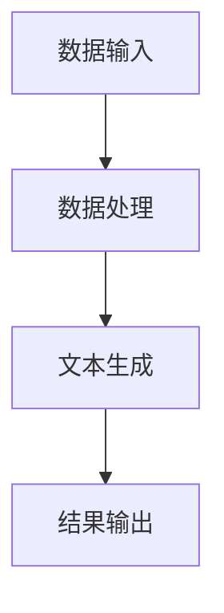

                 

# 《自然语言生成技术在财务报告中的应用》

> **关键词**: 自然语言生成技术、财务报告、NLP、生成模型、财务分析、数据可视化

> **摘要**: 本文探讨了自然语言生成技术在财务报告中的应用，详细分析了其在财务数据分析、报告生成、实时报告生成等场景中的价值。通过介绍自然语言生成技术的算法原理、系统设计、实际案例，本文为读者提供了从理论到实践的全面解读，展现了自然语言生成技术在财务领域的巨大潜力。

---

## 第一章: 引言

### 1.1 自然语言生成技术的背景与意义

自然语言生成技术（Natural Language Generation, NLG）是一种通过计算机技术自动生成人类可读文本的方法。随着人工智能技术的快速发展，NLG技术在各个领域的应用日益广泛。在财务领域，NLG技术可以通过分析财务数据，自动生成财务报告、总结财务分析结果，甚至预测未来的财务趋势。这种技术不仅提高了财务工作的效率，还能够帮助财务人员更好地理解数据，做出更明智的决策。

### 1.2 财务报告的复杂性与生成需求

财务报告通常包含大量的数据和信息，且格式复杂、内容严谨。传统的财务报告生成方式需要大量的手动操作，容易出错且效率低下。因此，如何利用自然语言生成技术来自动化生成高质量的财务报告，成为了当前财务领域的一个重要研究方向。

### 1.3 本文的研究目标与结构安排

本文的目标是探讨自然语言生成技术在财务报告中的具体应用，分析其优势和挑战，并提出可行的解决方案。文章结构如下：

- 第二章介绍自然语言生成技术的基本概念和算法原理。
- 第三章分析财务报告的结构与生成需求。
- 第四章讨论自然语言生成系统的实现方案。
- 第五章通过实际案例展示自然语言生成技术在财务报告中的应用。
- 第六章总结全文，并展望未来的研究方向。

---

## 第二章: 自然语言生成技术基础

### 2.1 自然语言生成技术的核心概念

自然语言生成技术是一种人工智能技术，旨在通过算法和模型自动生成人类可读的文本。其核心在于将结构化数据（如数据库中的数据）转换为自然语言文本。NLG技术可以应用于多种场景，包括机器翻译、文本摘要、情感分析等。

### 2.2 自然语言生成技术的分类

自然语言生成技术可以分为以下几类：

1. **基于规则的生成技术**：通过预定义的规则和模板生成文本。这种方法简单易懂，但灵活性较差。
2. **基于统计的生成技术**：利用统计模型（如n-gram模型）生成文本。这种方法可以捕捉数据中的统计规律，但生成结果的连贯性较差。
3. **基于深度学习的生成技术**：利用深度学习模型（如RNN、LSTM、Transformer）生成文本。这种方法能够捕捉数据中的复杂模式，生成高质量的文本。

### 2.3 自然语言生成技术的算法原理

#### 2.3.1 Transformer模型的原理

Transformer模型是一种基于深度学习的自然语言处理模型，由Google于2018年提出。其核心思想是利用自注意力机制（Self-Attention）来捕捉文本中的长距离依赖关系。Transformer模型包括编码器（Encoder）和解码器（Decoder）两个部分：

1. **编码器**：将输入的文本转换为一个固定长度的向量（称为“编码”）。
2. **解码器**：根据编码生成输出文本。

#### 2.3.2 解码器的工作流程

解码器通过多层的自注意力机制和前馈神经网络来生成输出文本。具体步骤如下：

1. **初始化**：解码器接收编码器生成的编码向量。
2. **自注意力机制**：计算每个位置与其他位置的相关性，生成注意力权重。
3. **前馈网络**：将注意力加权后的向量通过前馈网络进行变换，生成最终的输出向量。
4. **生成文本**：将输出向量转换为具体的文本内容。

#### 2.3.3 注意力机制的作用

注意力机制（Attention）是Transformer模型的核心组件，用于捕捉文本中的长距离依赖关系。注意力机制的计算公式如下：

$$
\text{Attention}(Q, K, V) = \text{softmax}\left(\frac{QK^T}{\sqrt{d_k}}\right)V
$$

其中，$Q$、$K$、$V$分别是查询（Query）、键（Key）、值（Value）向量，$d_k$是键向量的维度。

---

## 第三章: 财务报告的自然语言生成需求分析

### 3.1 财务报告的结构与内容

财务报告通常包括以下几个部分：

1. **资产负债表**：反映企业的资产、负债和所有者权益。
2. **利润表**：反映企业在一定会计期间的收入和利润情况。
3. **现金流量表**：反映企业在一定会计期间的现金流入和流出情况。

### 3.2 自然语言生成技术在财务报告中的具体应用

自然语言生成技术可以用于以下几种场景：

1. **财务数据分析**：通过对财务数据的分析，生成财务报告的关键指标和分析结果。
2. **财务报告生成**：根据财务数据自动生成财务报告的正文内容。
3. **财务预测与建议**：基于历史数据和机器学习模型，预测未来的财务趋势，并提出相应的建议。

### 3.3 自然语言生成技术的优势

自然语言生成技术在财务报告中的优势主要体现在以下几个方面：

1. **提高效率**：自动化生成财务报告，减少人工操作的时间和成本。
2. **提高准确性**：通过算法和模型，减少人为错误，提高报告的准确性。
3. **增强可读性**：生成的财务报告语言简洁明了，便于阅读和理解。

---

## 第四章: 自然语言生成系统的设计与实现

### 4.1 系统设计目标

自然语言生成系统的目的是将结构化的财务数据转换为自然语言文本。系统需要满足以下要求：

1. **高效性**：能够快速处理大量数据并生成文本。
2. **准确性**：生成的文本需要准确反映财务数据。
3. **可定制性**：能够根据不同的需求生成不同格式和内容的报告。

### 4.2 系统功能设计

自然语言生成系统的主要功能包括：

1. **数据输入**：接收结构化的财务数据。
2. **数据处理**：对数据进行清洗和预处理。
3. **文本生成**：利用自然语言生成算法生成财务报告。
4. **结果输出**：输出生成的财务报告。

### 4.3 系统架构设计

以下是自然语言生成系统的架构图：

---

## 第五章: 自然语言生成技术在财务报告中的应用案例

### 5.1 案例背景

某企业希望通过自然语言生成技术自动生成季度财务报告。现有的财务报告生成方式需要大量的手动操作，效率低下且容易出错。

### 5.2 系统实现

1. **数据输入**：接收企业的财务数据，包括收入、支出、利润等。
2. **数据处理**：对数据进行清洗和预处理，确保数据的准确性和完整性。
3. **文本生成**：利用自然语言生成算法生成财务报告的正文内容。
4. **结果输出**：输出生成的财务报告，并进行格式化处理。

### 5.3 案例分析

通过自然语言生成技术生成的财务报告，不仅提高了生成效率，还减少了人为错误，使报告更加准确和可读。同时，生成的报告格式统一，便于企业进行后续的分析和决策。

---

## 第六章: 结论与展望

### 6.1 本文总结

本文探讨了自然语言生成技术在财务报告中的应用，分析了其优势和挑战，并提出了一种可行的系统设计方案。通过实际案例展示了自然语言生成技术在财务报告中的巨大潜力。

### 6.2 未来研究方向

未来，随着自然语言生成技术的不断发展，其在财务报告中的应用将更加广泛和深入。研究方向包括：

1. **提高生成结果的准确性**：通过改进算法和模型，提高生成文本的准确性和可读性。
2. **增强模型的可解释性**：使生成的文本更具可解释性，便于用户理解和信任。
3. **拓展应用场景**：将自然语言生成技术应用于更多财务领域，如财务预测、风险评估等。

---

## 作者：AI天才研究院/AI Genius Institute & 禅与计算机程序设计艺术 /Zen And The Art of Computer Programming

