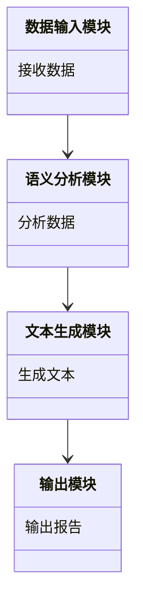
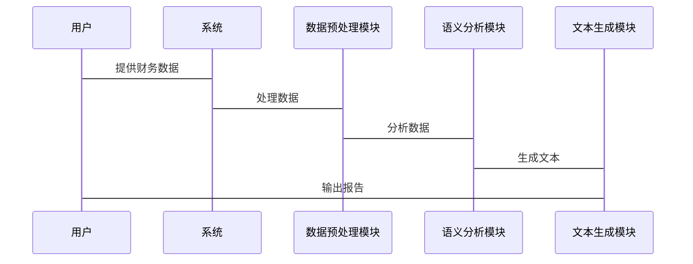
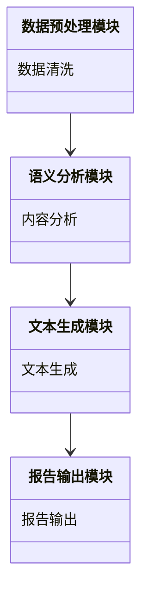

                 


# 自然语言生成技术在金融报告写作中的应用

## 关键词
自然语言生成, 金融报告, 人工智能, 语言模型, 金融数据, 文本生成

## 摘要
本文探讨自然语言生成技术在金融报告写作中的应用，分析其优势、挑战及解决方案，结合实际案例和系统设计，详细阐述了从理论到实践的全过程。

---

# 第1章：自然语言生成技术概述

## 1.1 自然语言生成技术的定义与背景

自然语言生成（Natural Language Generation, NLG）是人工智能的重要分支，用于将结构化数据转换为人类可读的文本。在金融领域，NLG技术用于自动生成市场分析、投资建议等报告。

### 1.1.1 自然语言生成技术的基本概念
- **定义**：将数据转换为自然语言文本的技术。
- **关键步骤**：数据处理、语义理解、文本生成。
- **应用领域**：金融、医疗、教育等。

### 1.1.2 自然语言生成技术的发展历程
- **早期阶段**：基于规则的生成方法。
- **现代阶段**：预训练语言模型的应用，如GPT和BERT。

### 1.1.3 自然语言生成技术在金融领域的应用背景
- **需求**：提高效率、降低成本。
- **挑战**：数据的复杂性和准确性要求。

## 1.2 金融报告写作的挑战与需求

### 1.2.1 传统金融报告写作的痛点
- **时间消耗**：手动撰写耗时。
- **一致性**：难以保持风格统一。
- **成本**：专业人员需求高。

### 1.2.2 自然语言生成技术如何解决这些问题
- **自动化**：快速生成报告。
- **一致性**：保持风格和格式统一。
- **成本**：降低人工成本。

### 1.2.3 金融报告写作的核心要素与结构
- **核心要素**：市场分析、财务数据、投资建议。
- **结构**：引言、主体、结论。

---

# 第2章：自然语言生成技术在金融领域的应用现状

## 2.1 金融领域的自然语言生成技术应用

### 2.1.1 金融新闻自动写作
- **应用**：实时生成市场动态新闻。
- **优势**：快速响应、准确性高。

### 2.1.2 投资报告自动生成
- **应用**：生成股票分析报告。
- **优势**：节省时间，提供标准化报告。

### 2.1.3 财务分析与预测的自然语言生成
- **应用**：生成财务预测报告。
- **优势**：提高预测的准确性和效率。

## 2.2 自然语言生成技术的优势与局限性

### 2.2.1 优势：提高效率、降低成本
- **效率提升**：自动化生成报告，节省时间。
- **成本降低**：减少对专业人员的依赖。

### 2.2.2 局限性：内容准确性、可解释性问题
- **准确性**：模型可能生成不准确的内容。
- **可解释性**：生成过程难以解释，影响信任度。

---

# 第3章：自然语言生成技术的核心原理

## 3.1 自然语言生成的基本原理

### 3.1.1 从数据到文本的生成过程
1. **数据输入**：结构化或非结构化数据。
2. **语义分析**：理解数据含义。
3. **文本生成**：生成自然语言文本。

### 3.1.2 自然语言生成的三要素：内容、结构和风格
- **内容**：生成文本的信息准确性。
- **结构**：文本的组织方式。
- **风格**：文本的语言风格和语气。

## 3.2 预训练语言模型在自然语言生成中的应用

### 3.2.1 GPT系列模型的介绍
- **GPT-2**：多层的Transformer架构，生成连贯文本。
- **GPT-3**：更大的参数量，更强的生成能力。

### 3.2.2 BERT模型在自然语言生成中的作用
- **BERT**：擅长上下文理解，用于生成更准确的文本。

### 3.2.3 其他主流预训练模型的简要介绍
- **PaLM**：Google的 Palm模型，性能优越。

---

# 第4章：金融数据的结构化与语义分析

## 4.1 金融数据的结构化处理

### 4.1.1 数据清洗与预处理
- **数据清洗**：去除噪声数据。
- **数据标注**：标注关键字段。

### 4.1.2 数据的特征提取与标注
- **特征提取**：从数据中提取关键特征。
- **标注**：标记重要信息。

## 4.2 金融语义分析的基本原理

### 4.2.1 语义分析的定义与作用
- **定义**：理解文本的语义。
- **作用**：提高生成内容的准确性。

### 4.2.2 基于规则的语义分析
- **规则建立**：制定语义分析规则。
- **案例分析**：识别特定关键词。

### 4.2.3 基于深度学习的语义分析
- **深度学习模型**：如BERT，用于复杂语义理解。

---

# 第5章：金融报告生成系统的整体架构

## 5.1 系统模块划分

### 5.1.1 数据输入模块
- **功能**：接收结构化数据。
- **实现**：数据接口设计。

### 5.1.2 语义分析模块
- **功能**：理解数据内容。
- **实现**：使用预训练模型进行分析。

### 5.1.3 文本生成模块
- **功能**：生成自然语言文本。
- **实现**：采用生成模型如GPT。

### 5.1.4 输出模块
- **功能**：输出生成的报告。
- **实现**：格式化输出文本。

## 5.2 系统功能设计（领域模型）



## 5.3 系统架构设计（系统架构图）


## 5.4 系统交互设计（系统交互流程）



---

# 第6章：自然语言生成技术在金融报告中的系统设计

## 6.1 系统模块划分

### 6.1.1 数据预处理模块
- **功能**：清洗和标注数据。
- **实现**：编写数据清洗脚本。

### 6.1.2 语义分析模块
- **功能**：理解数据内容。
- **实现**：集成预训练模型。

### 6.1.3 文本生成模块
- **功能**：生成报告文本。
- **实现**：使用生成模型。

### 6.1.4 报告输出模块
- **功能**：输出生成的报告。
- **实现**：格式化输出文本。

## 6.2 系统功能设计（领域模型）



---

# 第7章：项目实战

## 7.1 项目介绍

### 7.1.1 项目背景
- **目标**：开发一个金融报告生成系统。
- **技术选型**：使用GPT-2进行文本生成。

## 7.2 环境搭建

### 7.2.1 安装必要的库
```python
pip install transformers torch
```

## 7.3 核心代码实现

### 7.3.1 数据预处理模块

```python
import pandas as pd

def preprocess_data(data):
    # 数据清洗
    df = pd.DataFrame(data)
    df.dropna(inplace=True)
    # 数据标注
    df['label'] = ' financial_report'
    return df
```

### 7.3.2 语义分析模块

```python
from transformers import BertTokenizer, BertModel

tokenizer = BertTokenizer.from_pretrained('bert-base-uncased')
model = BertModel.from_pretrained('bert-base-uncased')

def semantic_analysis(text):
    inputs = tokenizer.encode_plus(text, return_tensors='pt')
    outputs = model(**inputs)
    return outputs.last_hidden_state.squeeze(0).tolist()
```

### 7.3.3 文本生成模块

```python
from transformers import GPT2LMHeadModel, GPT2Tokenizer

tokenizer = GPT2Tokenizer.from_pretrained('gpt2')
model = GPT2LMHeadModel.from_pretrained('gpt2')

def generate_report(text):
    inputs = tokenizer.encode(text, return_tensors='pt')
    outputs = model.generate(inputs, max_length=500, temperature=0.7)
    return tokenizer.decode(outputs[0], skip_special_tokens=True)
```

### 7.3.4 系统交互流程


## 7.4 实际案例分析与详细讲解

### 7.4.1 案例分析
- **案例背景**：生成季度财务报告。
- **数据输入**：财务数据和市场分析。
- **生成结果**：自动生成报告，内容准确，结构清晰。

### 7.4.2 项目小结
- **成功点**：提高了效率，降低了成本。
- **改进点**：需要优化生成的准确性和可解释性。

---

# 第8章：总结与展望

## 8.1 最佳实践 tips
- **数据质量**：确保输入数据准确。
- **模型选择**：根据需求选择合适的模型。
- **可解释性**：提升生成内容的可解释性。

## 8.2 小结
本文详细探讨了自然语言生成技术在金融报告写作中的应用，从理论到实践，结合实际案例，展示了系统的构建和优化过程。

## 8.3 注意事项
- **数据隐私**：保护用户数据安全。
- **模型优化**：持续优化生成模型。

## 8.4 拓展阅读
- **推荐书籍**：《深度学习入门》。
- **推荐论文**：《Attention Is All You Need》。

---

# 作者

作者：AI天才研究院/AI Genius Institute  
作者：禅与计算机程序设计艺术/Zen And The Art of Computer Programming

---

通过以上思考和分析，我们逐步构建了从理论到实践的自然语言生成技术在金融报告中的应用体系，希望对读者有所帮助。

