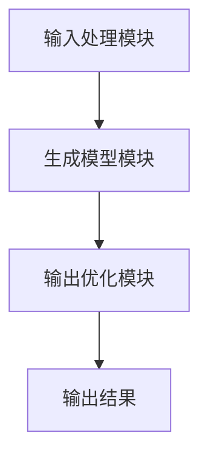

                 


# 自然语言生成（NLG）：优化AI Agent的表达能力

## 关键词：自然语言生成，AI Agent，深度学习，生成模型，优化方法

## 摘要：自然语言生成（NLG）是人工智能领域的重要技术，用于将结构化数据转化为自然语言文本。本文从基础概念、核心模型、优化方法、系统架构、项目实战到高级主题，全面探讨如何优化AI Agent的表达能力。通过详细分析生成模型的原理、优化策略和实际应用，为读者提供理论与实践相结合的深度解析。

---

# 第1章: 自然语言生成概述

## 1.1 自然语言生成的基本概念

### 1.1.1 自然语言生成的定义

自然语言生成（NLG）是将结构化数据（如数据库、知识图谱或用户输入）转换为自然语言文本的技术。其目标是让计算机能够“理解”数据并以人类可读的方式表达出来。

**关键概念：**

- **输入数据**：结构化数据，如JSON、XML或数据库查询结果。
- **输出文本**：自然语言文本，如句子、段落或对话。

### 1.1.2 自然语言生成的核心要素

| 核心要素 | 描述 |
|----------|------|
| **上下文理解** | 理解输入数据的背景和语境。 |
| **语义生成** | 将数据转化为有意义的语义表示。 |
| **语言表达** | 将语义表示转化为流畅的自然语言文本。 |

### 1.1.3 自然语言生成的应用领域

- **文本摘要**：从长文本中提取关键信息。
- **对话系统**：生成自然的对话回复。
- **机器翻译**：将一种语言翻译成另一种语言。
- **数据报告**：将数据分析结果生成报告。

## 1.2 自然语言生成的历史与发展

### 1.2.1 自然语言生成的起源

20世纪50年代，NLG技术开始出现，主要用于简单的文本生成任务。

### 1.2.2 统计模型的兴起

20世纪末，统计语言模型（如n-gram模型）成为主流，基于概率统计方法生成文本。

### 1.2.3 深度学习时代的到来

近年来，深度学习模型（如RNN、LSTM和Transformer）在NLG领域取得了突破性进展。

## 1.3 自然语言生成的关键挑战

### 1.3.1 生成内容的准确性和流畅性

- **准确性**：生成的内容需要符合事实和逻辑。
- **流畅性**：生成的文本需要自然流畅，避免语法错误。

### 1.3.2 多样性和创造性

- **多样性**：生成不同的表达方式，避免重复。
- **创造性**：在生成文本时，能够创造性地表达新的想法。

### 1.3.3 多语言和跨文化适应性

- **多语言支持**：生成多种语言的文本。
- **跨文化适应**：根据目标文化背景调整生成内容。

---

# 第2章: 自然语言生成的核心模型

## 2.1 统计模型

### 2.1.1 基于n-gram的生成模型

n-gram模型通过概率统计方法生成文本。例如，n=3时，模型会基于前两个词生成第三个词的概率。

**公式：**

$$ P(w_1, w_2, w_3) = P(w_1) \times P(w_2|w_1) \times P(w_3|w_1, w_2) $$

**代码示例：**

```python
import nltk
from nltk import bigrams, trigrams

text = "The quick brown fox jumps over the lazy dog"
trigrams_text = list(trigrams(text.split()))
print(trigrams_text)
```

### 2.1.2 语言模型的训练与优化

- **训练**：使用大量文本数据训练语言模型。
- **优化**：通过调整模型参数提升生成质量。

### 2.1.3 基于马尔可夫链的生成过程

马尔可夫链用于建模生成过程中的状态转移。

**公式：**

$$ P(w_{n+1}|w_n) = \frac{C(w_n, w_{n+1})}{C(w_n)} $$

## 2.2 基于规则的生成模型

### 2.2.1 规则驱动的生成原理

基于预定义的规则生成文本。例如，根据语法规则生成句子。

**示例规则：**

- 主语-动词-宾语结构。

### 2.2.2 规则库的构建与管理

- **规则库**：包含语法、语义和语用规则。
- **管理**：规则库需要不断更新和优化。

### 2.2.3 基于模板的生成方法

- **模板**：预定义的文本结构。
- **填充**：将数据填充到模板中生成文本。

**代码示例：**

```python
template = "The {} jumped over the {}."
data = ("fox", "lazy dog")
print(template.format(data[0], data[1]))
```

## 2.3 深度学习模型

### 2.3.1 基于RNN的生成模型

- **RNN**：循环神经网络，适合处理序列数据。
- **问题**：长序列中的梯度消失问题。

### 2.3.2 基于LSTM的改进

- **LSTM**：长短期记忆网络，解决RNN的梯度消失问题。
- **结构**：包含输入门、遗忘门和输出门。

### 2.3.3 基于Transformer的生成模型

- **Transformer**：基于自注意力机制，处理长序列效果更好。
- **结构**：编码器-解码器架构。

**公式：**

$$ \text{Attention}(Q,K,V) = \text{softmax}\left(\frac{QK^T}{\sqrt{d_k}}\right)V $$

---

# 第3章: 自然语言生成的优化方法

## 3.1 生成质量的评估指标

### 3.1.1 基于人类评价的指标

- **人类评价**：由人工评价生成文本的质量。
- **指标**：包括流畅性、准确性和相关性。

### 3.1.2 基于自动评价的指标

- **BLEU**：基于n-gram的精确匹配。
- **ROUGE**：基于召回率的评价指标。

### 3.1.3 综合评估方法

- **综合指标**：结合自动评价和人工评价。

## 3.2 提升生成质量的技术

### 3.2.1 增量式生成策略

- **增量式生成**：逐步生成文本，逐步优化。

### 3.2.2 多样性生成方法

- **多样性生成**：生成多种不同的表达方式。

### 3.2.3 上下文感知的生成优化

- **上下文感知**：根据上下文调整生成内容。

## 3.3 基于反馈的生成优化

### 3.3.1 用户反馈的收集与分析

- **用户反馈**：收集用户的评价和建议。
- **分析**：分析反馈，找出生成模型的不足。

### 3.3.2 反馈驱动的模型调优

- **模型调优**：根据反馈调整模型参数。

### 3.3.3 在线优化策略

- **在线优化**：实时调整生成策略。

---

# 第4章: 自然语言生成的系统架构

## 4.1 系统需求分析

### 4.1.1 生成任务的目标与约束

- **目标**：生成高质量的文本。
- **约束**：生成文本的长度、格式等。

### 4.1.2 输入数据的格式与结构

- **输入数据**：结构化数据，如JSON、XML。
- **格式**：数据预处理，确保输入格式统一。

### 4.1.3 输出结果的质量要求

- **质量要求**：生成文本需要准确、流畅、相关。

## 4.2 系统功能设计

### 4.2.1 输入处理模块

- **功能**：接收输入数据，进行预处理。
- **实现**：数据清洗、格式转换。

### 4.2.2 生成模型模块

- **功能**：基于预处理后的数据生成文本。
- **实现**：选择合适的生成模型，如Transformer。

### 4.2.3 输出优化模块

- **功能**：优化生成的文本，提高质量。
- **实现**：基于反馈调整生成策略。

## 4.3 系统架构设计

### 4.3.1 系统架构图



### 4.3.2 接口设计

- **输入接口**：接收输入数据。
- **输出接口**：输出生成的文本。

### 4.3.3 交互设计

- **用户交互**：用户输入需求，系统生成文本。
- **反馈交互**：用户对生成文本进行反馈，系统优化生成策略。

---

# 第5章: 项目实战

## 5.1 项目介绍

### 5.1.1 项目目标

构建一个简单的自然语言生成系统，能够根据输入数据生成流畅的文本。

## 5.2 系统核心实现

### 5.2.1 环境安装

```bash
pip install numpy
pip install transformers
pip install torch
```

### 5.2.2 核心代码实现

```python
from transformers import AutoTokenizer, AutoModelForCausalLM
import torch

model_name = "gpt2"
tokenizer = AutoTokenizer.from_pretrained(model_name)
model = AutoModelForCausalLM.from_pretrained(model_name)

input_text = "今天天气很好，"
inputs = tokenizer(input_text, return_tensors="pt")
outputs = model.generate(inputs.input_ids, max_length=50)
print(tokenizer.decode(outputs[0], skip_special_tokens=True))
```

### 5.2.3 代码应用解读与分析

- **输入处理**：对输入文本进行预处理。
- **模型生成**：使用GPT-2模型生成文本。
- **结果输出**：输出生成的文本。

## 5.3 实际案例分析

### 5.3.1 案例介绍

基于天气数据生成天气预报文本。

### 5.3.2 详细讲解剖析

- **输入数据**：天气数据，如温度、湿度等。
- **生成文本**：生成天气预报文本。

## 5.4 项目小结

通过项目实战，读者可以了解如何从数据预处理、模型选择到结果评估的整个流程。

---

# 第6章: 高级主题

## 6.1 多模态生成

### 6.1.1 多模态生成的定义

结合图像、语音等多种模态数据生成文本。

### 6.1.2 多模态生成的应用

- **图像描述生成**：根据图片生成描述文本。
- **语音识别生成**：根据语音生成文本。

## 6.2 对话系统

### 6.2.1 对话系统的定义

基于对话历史生成回复文本。

### 6.2.2 对话系统的实现

- **对话历史**：记录对话历史。
- **回复生成**：基于对话历史生成回复。

## 6.3 个性化生成

### 6.3.1 个性化生成的定义

根据用户个性化需求生成文本。

### 6.3.2 个性化生成的应用

- **定制化生成**：根据用户偏好生成文本。
- **用户画像**：基于用户画像生成个性化文本。

---

# 第7章: 总结与展望

## 7.1 本章总结

通过本文的介绍，读者可以全面了解自然语言生成（NLG）技术，并掌握如何优化AI Agent的表达能力。

## 7.2 未来展望

随着深度学习技术的不断发展，NLG技术将更加智能化和个性化，应用场景也将更加广泛。

## 7.3 最佳实践 Tips

- **选择合适的模型**：根据任务需求选择合适的生成模型。
- **注重生成质量**：优化生成质量，确保生成文本准确流畅。
- **结合反馈机制**：利用用户反馈不断优化生成策略。

## 7.4 小结

本文从基础到高级，全面探讨了自然语言生成技术，并展示了如何将其应用于实际项目中。希望本文能为读者提供有价值的参考和启示。

---

# 作者：AI天才研究院 & 禅与计算机程序设计艺术

