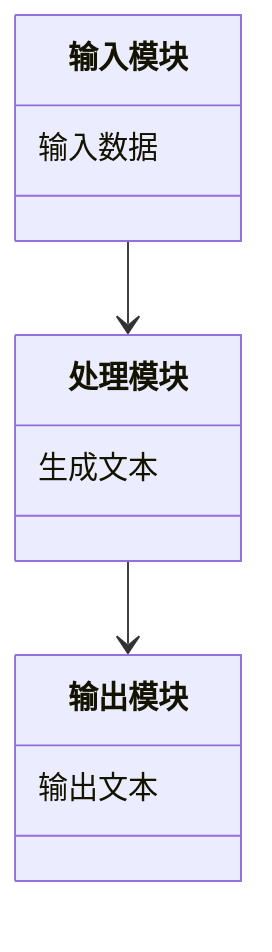

                 

# 自然语言生成：提升AI Agent的表达能力

关键词：自然语言生成，AI Agent，文本生成，深度学习，语言模型

摘要：自然语言生成是人工智能领域的重要分支，旨在让计算机能够生成自然流畅的人类语言。本文系统地介绍了自然语言生成的核心概念、算法原理、系统架构以及实际应用，通过案例分析和项目实战，深入探讨了如何提升AI Agent的表达能力。文章内容涵盖从基础理论到高级算法，再到系统设计的全链条，旨在为读者提供全面的技术指导。

---

# 第一章：自然语言生成的背景与概念

## 1.1 自然语言生成的定义与背景

### 1.1.1 自然语言生成的定义
自然语言生成（Natural Language Generation, NLG）是指将结构化数据或信息转换为自然语言文本的过程。它是自然语言处理（NLP）的重要组成部分，广泛应用于人机交互、文本摘要、机器翻译等领域。

### 1.1.2 自然语言生成的背景与重要性
随着人工智能技术的快速发展，自然语言生成技术在多个领域得到了广泛应用，尤其是在AI Agent（智能代理）中，生成自然流畅的文本是提升用户体验的关键。

### 1.1.3 自然语言生成的核心目标
- 生成准确、有意义的文本
- 提供多样化的表达方式
- 实现与人类的自然对话

## 1.2 自然语言生成的关键问题

### 1.2.1 生成内容的准确性
确保生成的文本符合语法规则，避免错误信息。

### 1.2.2 生成内容的流畅性
文本生成需要连贯，避免生硬或重复的内容。

### 1.2.3 生成内容的多样性
生成多样的表达方式，避免单一化。

## 1.3 自然语言生成的应用领域

### 1.3.1 人机对话系统
通过自然语言生成技术，实现人与机器之间的自然对话。

### 1.3.2 文本摘要与总结
将长文本浓缩为简洁的摘要或总结。

### 1.3.3 机器翻译
将一种语言翻译成另一种语言，同时保持文本的流畅性。

### 1.3.4 内容生成与创作
自动生成新闻稿、产品描述等文本内容。

## 1.4 自然语言生成的挑战与未来方向

### 1.4.1 当前技术的局限性
- 生成内容的可控制性有限
- 对上下文的理解能力不足
- 计算资源消耗较大

### 1.4.2 未来发展的趋势
- 更加注重生成内容的质量和多样性
- 结合领域知识提升生成的准确性
- 提高生成效率，降低计算成本

---

# 第二章：自然语言生成的核心概念与原理

## 2.1 自然语言生成的模型类型

### 2.1.1 基于规则的生成模型
通过预定义的语法规则生成文本，适用于简单的场景。

### 2.1.2 统计模型
基于统计语言模型，通过概率分布生成文本。

### 2.1.3 基于深度学习的生成模型
利用神经网络（如RNN、LSTM、Transformer）进行生成。

## 2.2 自然语言生成的关键技术

### 2.2.1 语言模型
语言模型通过概率分布预测下一个词，是自然语言生成的基础。

### 2.2.2 解码器
解码器用于将输入的结构化数据转换为自然语言文本。

### 2.2.3 注意力机制
通过注意力机制，模型能够关注输入中的重要部分，生成更相关的文本。

## 2.3 自然语言生成的评价指标

### 2.3.1 生成内容的质量评估
- 基于 BLEU、ROUGE 等指标评估生成文本的质量。

### 2.3.2 生成内容的多样性评估
通过多样性指标（如Distinct）评估生成文本的多样性。

### 2.3.3 生成内容的流畅性评估
通过人类评估或语言模型评估生成文本的流畅性。

## 2.4 自然语言生成的数学模型

### 2.4.1 语言模型的概率表示
$$ P(w_1, w_2, ..., w_n) = \prod_{i=1}^n P(w_i | w_1, ..., w_{i-1}) $$

### 2.4.2 解码器的数学推导
解码器通过条件概率生成下一个词：
$$ P(w_{i}) = \text{softmax}(W_{o} h_{i}) $$

### 2.4.3 注意力机制的数学公式
注意力机制通过自注意力权重矩阵生成上下文表示：
$$ \alpha_i = \text{softmax}(Q K^T) $$

---

# 第三章：自然语言生成的主流算法

## 3.1 基于RNN的生成模型

### 3.1.1 RNN的基本原理
RNN通过循环结构处理序列数据，生成词序列。

### 3.1.2 LSTM网络的改进
LSTM通过门控机制解决RNN的长序列记忆问题。

### 3.1.3 GRU网络的优化
GRU结合了LSTM的门控机制，简化了网络结构。

## 3.2 基于Transformer的生成模型

### 3.2.1 Transformer的基本结构
Transformer由编码器和解码器组成，通过自注意力机制处理序列数据。

### 3.2.2 解码器的自注意力机制
解码器通过自注意力机制生成多样化的文本。

### 3.2.3 Transformer在生成任务中的应用
Transformer在机器翻译、文本生成等任务中表现出色。

## 3.3 基于预训练语言模型的生成

### 3.3.1 BERT模型的生成能力
BERT通过预训练的双向语言模型生成高质量文本。

### 3.3.2 GPT系列模型的生成原理
GPT通过自回归的生成方式生成文本，具有强大的上下文理解能力。

### 3.3.3 大模型的微调与应用
通过对大模型进行微调，可以适应特定任务的需求。

---

# 第四章：自然语言生成的系统架构与实现

## 4.1 系统架构设计

### 4.1.1 系统模块划分
- 输入模块：接收结构化数据或文本输入
- 处理模块：生成自然语言文本
- 输出模块：输出生成的文本

### 4.1.2 数据流设计
数据从输入模块进入，经过处理模块生成文本，最终输出。

### 4.1.3 系统组件之间的交互关系
通过类图展示各组件之间的关系。

## 4.2 系统实现的关键技术

### 4.2.1

---

# 总结

自然语言生成是提升AI Agent表达能力的关键技术，通过深度学习算法和优化的系统架构，可以实现高质量的文本生成。未来，随着技术的进步，自然语言生成将在更多领域得到应用，为人类与机器的交互带来更自然的体验。

作者：AI天才研究院/AI Genius Institute & 禅与计算机程序设计艺术 /Zen And The Art of Computer Programming

