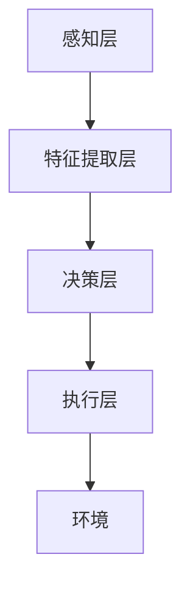

                 


# 自监督学习在AI Agent预训练中的应用

> 关键词：自监督学习，AI Agent，预训练，机器学习，深度学习

> 摘要：本文详细探讨了自监督学习在AI Agent预训练中的应用，从核心概念、算法原理到系统架构，再到实际项目案例，全面分析了自监督学习如何助力AI Agent的高效训练与优化。通过深入理解自监督学习的机制，读者将能够更好地掌握其在AI Agent中的应用，并为未来的研究和实践提供有价值的参考。

---

# 第一部分: 自监督学习与AI Agent概述

## 第1章: 自监督学习与AI Agent的背景介绍

### 1.1 自监督学习的核心概念
#### 1.1.1 自监督学习的定义
自监督学习是一种无监督学习的变体，通过利用数据本身的结构信息，以伪标签的形式为模型提供监督信号。与监督学习不同，自监督学习不需要外部标注数据，而是通过数据内部的关系进行学习。

#### 1.1.2 自监督学习的特点
- **无监督性**：依赖数据本身的结构，无需人工标注。
- **自我监督**：通过数据预处理生成伪标签，实现自我监督。
- **高效性**：可以在大规模未标注数据上进行高效训练。

#### 1.1.3 自监督学习的应用场景
- 自然语言处理
- 图像处理
- � 强化学习中的状态表示

### 1.2 AI Agent的基本概念
#### 1.2.1 AI Agent的定义
AI Agent是一种智能体，能够感知环境、自主决策并执行任务，具备学习和推理能力。

#### 1.2.2 AI Agent的核心功能
- 环境感知
- 任务推理
- 决策与执行

#### 1.2.3 AI Agent的应用领域
- 智能助手
- 自动驾驶
- 智能客服

### 1.3 自监督学习在AI Agent预训练中的重要性
#### 1.3.1 预训练的目标
- 学习通用表示
- 捕获数据中的潜在关系

#### 1.3.2 自监督学习的优势
- 节省标注成本
- 提高模型泛化能力

#### 1.3.3 自监督学习与监督学习的对比
| 特性 | 监督学习 | 自监督学习 |
|------|----------|------------|
| 数据需求 | 需要标注 | 不需要标注 |
| 适用场景 | 小数据集 | 大数据集 |
| 模型泛化能力 | 一般 | 更强 |

### 1.4 本章小结
本章介绍了自监督学习和AI Agent的基本概念，强调了自监督学习在AI Agent预训练中的重要性，为后续内容奠定了基础。

---

# 第二部分: 自监督学习的核心原理

## 第2章: 自监督学习的原理与算法

### 2.1 自监督学习的基本原理
#### 2.1.1 数据驱动的特征学习
自监督学习通过数据预处理生成伪标签，利用这些伪标签进行特征学习。

#### 2.1.2 对比学习的机制
对比学习通过最大化正样本对的相似性和最小化负样本对的相似性来学习表示。

#### 2.1.3 知识蒸馏的原理
知识蒸馏通过教师模型的软标签指导学生模型学习，实现知识转移。

### 2.2 自监督学习的关键算法
#### 2.2.1 对比学习算法
- **SimCLR**：通过数据增强生成正样本对和负样本对，计算其相似性。
- **Momentum Contrast**：引入动量机制，更新特征提取器。

#### 2.2.2 生成对抗网络
- **GAN**：生成器和判别器交替训练，生成逼真的数据样本。
- **CycleGAN**：通过循环一致性损失实现无监督学习。

#### 2.2.3 图神经网络
- **图嵌入**：通过图结构信息学习节点表示。
- **GraphSAGE**：通过聚合邻居特征生成节点表示。

### 2.3 自监督学习的数学模型
#### 2.3.1 对比学习的损失函数
$$ L = -\log \frac{p(x,y)}{p(x)p(y|x)} $$

#### 2.3.2 知识蒸馏的损失函数
$$ L_{\text{distill}} = -\log \text{softmax}(f_t(x)) $$

#### 2.3.3 图神经网络的损失函数
$$ L_{\text{GNN}} = \sum_{(i,j)} (h_i + h_j - h_{i,j})^2 $$

### 2.4 本章小结
本章详细介绍了自监督学习的原理和关键算法，包括对比学习、生成对抗网络和图神经网络，并通过数学公式和mermaid图展示了其工作原理。

---

# 第三部分: AI Agent的系统架构与设计

## 第3章: AI Agent的系统架构

### 3.1 AI Agent的系统组成
#### 3.1.1 感知层
- 负责接收和处理环境输入。
- 包括视觉、听觉、触觉等多种感知方式。

#### 3.1.2 决策层
- 负责分析感知信息，制定决策策略。
- 包括路径规划、动作选择等功能。

#### 3.1.3 执行层
- 负责执行决策层的指令。
- 包括机器人动作、语音输出等。

### 3.2 自监督学习在系统架构中的位置
#### 3.2.1 数据输入模块
- 负责获取原始数据并进行预处理。
- 例如，图像数据增强、文本清洗等。

#### 3.2.2 特征提取模块
- 负责将原始数据转换为特征表示。
- 例如，使用自监督学习算法提取深层特征。

#### 3.2.3 模型训练模块
- 负责训练AI Agent的模型。
- 例如，使用自监督学习优化模型参数。

### 3.3 系统架构的mermaid图


### 3.4 本章小结
本章介绍了AI Agent的系统架构，并展示了自监督学习在系统中的应用位置，为后续章节的深入分析奠定了基础。

---

# 第四部分: 项目实战

## 第4章: 自监督学习在AI Agent预训练中的应用案例

### 4.1 项目介绍
- **项目目标**：使用自监督学习预训练AI Agent，提升其在特定任务中的性能。
- **项目背景**：在大规模未标注数据上进行预训练，降低标注成本。

### 4.2 系统功能设计
#### 4.2.1 数据预处理
- **数据清洗**：去除无效数据，处理噪声。
- **数据增强**：通过数据增强技术生成更多样化数据。

#### 4.2.2 模型训练
- **模型选择**：选择适合自监督学习的模型架构，例如SimCLR。
- **训练策略**：设计合理的训练策略，例如对比学习。

### 4.3 系统实现
#### 4.3.1 环境安装
```bash
pip install torch
pip install numpy
pip install matplotlib
```

#### 4.3.2 核心实现代码
```python
import torch
import torch.nn as nn

class SimCLR(nn.Module):
    def __init__(self, backbone):
        super(SimCLR, self).__init__()
        self.backbone = backbone
        self.predictor = nn.Linear(backbone.out_features, 128)
        with torch.no_grad():
            self.target_encoder = nn.Linear(backbone.out_features, 128)
            self.target_encoder.weight.copy_(self.predictor.weight)
            self.target_encoder.bias.copy_(self.predictor.bias)

    def forward(self, x, x_neg):
        x_pred = self.predictor(self.backbone(x))
        x_target = self.target_encoder(self.backbone(x_neg))
        return x_pred, x_target
```

#### 4.3.3 案例分析
- **训练过程**：通过对比学习优化模型参数，提升特征表示能力。
- **效果评估**：通过分类任务验证预训练模型的有效性。

### 4.4 本章小结
本章通过实际案例展示了自监督学习在AI Agent预训练中的应用，详细介绍了项目背景、系统设计和实现过程，并给出了代码实现和案例分析。

---

# 第五部分: 最佳实践与小结

## 第5章: 最佳实践与总结

### 5.1 最佳实践
- **数据选择**：选择高质量、多样化的数据，确保模型的泛化能力。
- **模型优化**：合理设计模型架构，选择适合的自监督学习算法。
- **评估方法**：使用多种评估指标，全面评估模型性能。

### 5.2 本章小结
本章总结了自监督学习在AI Agent预训练中的应用，提出了最佳实践建议，为读者提供了宝贵的参考。

---

# 作者

作者：AI天才研究院/AI Genius Institute & 禅与计算机程序设计艺术 /Zen And The Art of Computer Programming

