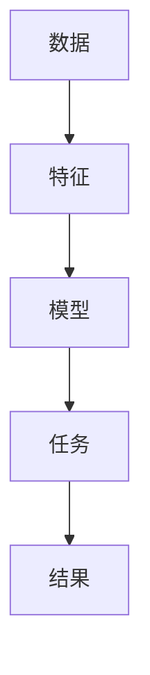
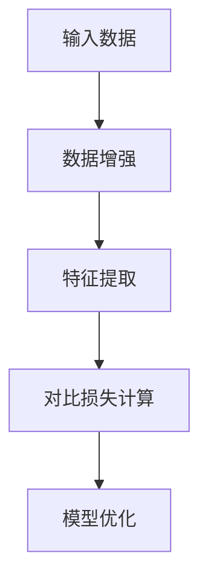
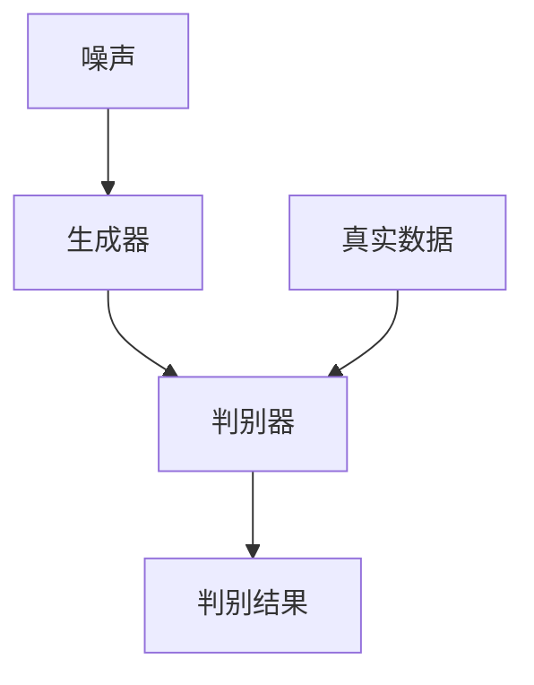
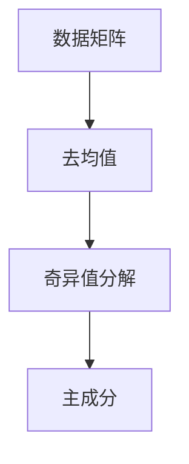
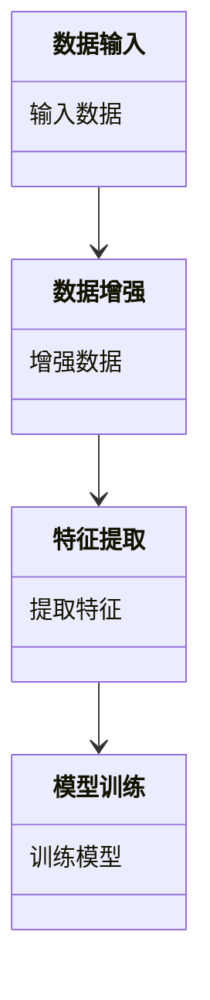
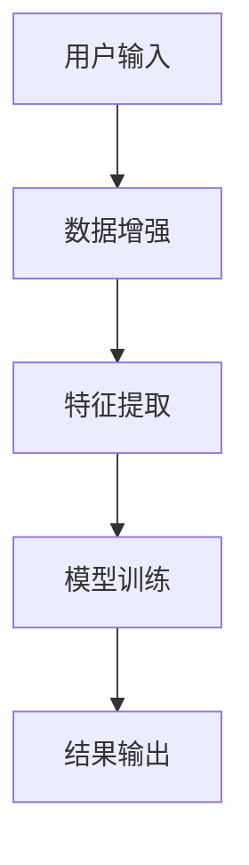
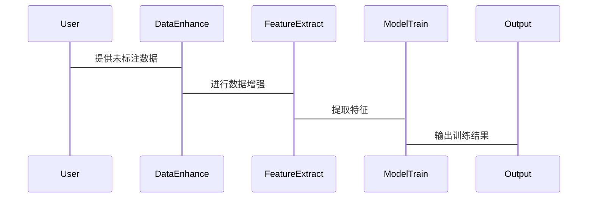

                 


# 自监督学习：利用未标记数据提升AI Agent能力

> 关键词：自监督学习，未标记数据，AI Agent，机器学习，深度学习

> 摘要：自监督学习是一种利用未标记数据进行学习的机器学习方法，近年来在AI Agent领域得到了广泛应用。本文将详细介绍自监督学习的核心概念、算法原理、系统架构设计以及实际项目案例，帮助读者理解如何利用未标记数据提升AI Agent的能力。

---

# 第一章: 自监督学习的背景与问题背景

## 1.1 自监督学习的基本概念

### 1.1.1 自监督学习的定义
自监督学习（Self-Supervised Learning，SSL）是一种机器学习范式，通过利用未标记数据中的内在结构信息来推导出有用的特征表示。与监督学习不同，自监督学习不需要人工标注的标签，而是通过设计任务让模型从数据本身中学习。

### 1.1.2 自监督学习的核心问题
自监督学习的核心问题是如何从未标记数据中提取有用的特征，并通过对比学习或生成式模型等方法，使模型能够在下游任务中表现良好。

### 1.1.3 自监督学习的边界与外延
自监督学习的边界在于它依赖于未标记数据，但可以与监督学习和无监督学习相结合，形成混合学习范式。其外延包括对比学习、生成式预训练（如GAN、VAE）等方法。

## 1.2 未标记数据的重要性

### 1.2.1 数据标注的挑战
数据标注需要大量的人力和时间，尤其是在处理大规模数据时，标注成本高昂。

### 1.2.2 利用未标记数据的优势
未标记数据广泛存在，可以充分利用这些数据来提升模型性能，尤其是在数据量不足的情况下。

### 1.2.3 未标记数据的潜在价值
未标记数据包含了丰富的潜在信息，可以通过自监督学习挖掘这些信息，提升模型的泛化能力。

## 1.3 自监督学习在AI Agent中的应用

### 1.3.1 AI Agent的核心能力
AI Agent需要具备感知环境、理解任务、执行操作和学习适应的能力。

### 1.3.2 自监督学习如何提升AI Agent能力
通过自监督学习，AI Agent可以利用未标记数据提升其感知和理解能力，从而在各种任务中表现更佳。

### 1.3.3 自监督学习在实际场景中的应用案例
例如，在智能客服系统中，AI Agent可以通过自监督学习从大量未标注的客户对话中学习，提升对话理解和生成能力。

## 1.4 本章小结
本章介绍了自监督学习的基本概念、未标记数据的重要性以及自监督学习在AI Agent中的应用，为后续章节奠定了基础。

---

# 第二章: 自监督学习的核心概念

## 2.1 自监督学习的原理

### 2.1.1 对比学习
对比学习是一种常用的自监督学习方法，通过将数据分为正样本和负样本，学习它们的相似性。

### 2.1.2 生成式模型
生成式模型（如GAN、VAE）通过生成数据来学习数据的分布，从而提取特征。

### 2.1.3 分析式模型
分析式模型通过将数据分解为潜在空间中的表示，学习数据的低维表示。

## 2.2 自监督学习的核心要素

### 2.2.1 数据增强
数据增强是自监督学习的重要步骤，通过生成变体数据来增加数据多样性。

### 2.2.2 损失函数
损失函数用于衡量模型的预测与真实值之间的差异，指导模型优化。

### 2.2.3 表征学习
表征学习的目标是将数据映射到一个低维空间，使得相似的数据点在该空间中接近。

## 2.3 自监督学习的关键属性对比

### 2.3.1 不同自监督方法的对比分析
对比学习与生成式模型在性能和计算复杂度上有何差异？

### 2.3.2 各种方法的优缺点对比
对比学习的优点包括计算效率高，缺点是生成的负样本可能不够多样。

### 2.3.3 属性特征对比表格
| 方法       | 优点                     | 缺点                     |
|------------|--------------------------|--------------------------|
| 对比学习   | 计算效率高                | 负样本多样性不足          |
| 生成式模型 | 数据生成能力强            | 计算复杂度高              |

## 2.4 自监督学习的ER实体关系图



## 2.5 本章小结
本章详细讲解了自监督学习的核心概念、原理和关键要素，为后续的算法实现奠定了理论基础。

---

# 第三章: 自监督学习的算法原理与数学模型

## 3.1 对比学习算法原理

### 3.1.1 对比学习的流程
1. 数据增强：生成正样本和负样本。
2. 特征提取：提取数据的表示。
3. 对比损失：计算正样本和负样本之间的相似性。

### 3.1.2 对比学习的数学模型

$$ L = -\log \frac{e^{sim(x_i, x_j)}}{e^{sim(x_i, x_k)} + e^{sim(x_i, x_j)}} $$
其中，$sim$ 表示相似性度量。

### 3.1.3 对比学习的mermaid流程图



## 3.2 生成式模型算法原理

### 3.2.1 GAN的生成过程

1. 噪声输入生成器，生成样本。
2. 判别器判断样本是否为真实数据。

### 3.2.2 GAN的数学模型

生成器损失函数：
$$ L_G = \log P(G(z) \text{被误判为真实}) $$
判别器损失函数：
$$ L_D = -\log P(D(x) \text{判别为真实}) - \log (1 - P(D(G(z)) \text{判别为真实})) $$

### 3.2.3 GAN的mermaid流程图



## 3.3 分析式模型的数学推导

### 3.3.1 PCA的原理

$$ X = X_{\text{mean}} + U \cdot \Sigma \cdot V^T $$
其中，$U$和$V$是奇异向量，$\Sigma$是奇异值。

### 3.3.2 PCA的mermaid流程图



## 3.4 本章小结
本章详细讲解了对比学习、生成式模型和分析式模型的算法原理和数学模型，为实际应用提供了理论支持。

---

# 第四章: 自监督学习的系统分析与架构设计

## 4.1 问题场景介绍

### 4.1.1 问题背景
在实际应用中，AI Agent需要处理大量未标注数据，如何利用这些数据提升性能是关键问题。

### 4.1.2 项目介绍
设计一个基于自监督学习的AI Agent系统，利用未标记数据提升其对话理解和生成能力。

## 4.2 系统功能设计

### 4.2.1 领域模型



### 4.2.2 系统架构设计



### 4.2.3 系统接口设计
API接口定义：
- 输入：未标注数据
- 输出：模型训练后的特征表示

### 4.2.4 系统交互流程



## 4.3 本章小结
本章通过系统分析和架构设计，展示了如何将自监督学习应用于实际系统中，明确了各部分的功能和交互流程。

---

# 第五章: 自监督学习的项目实战

## 5.1 环境安装

### 5.1.1 安装Python
```bash
python --version
pip install --upgrade pip
```

### 5.1.2 安装依赖包
```bash
pip install numpy pandas scikit-learn tensorflow
```

## 5.2 系统核心实现源代码

### 5.2.1 数据增强代码
```python
import numpy as np
def data_augment(x):
    return x + np.random.normal(0, 0.1, x.shape)
```

### 5.2.2 对比学习代码
```python
import tensorflow as tf
def contrastive_loss(x, y):
    similarity = tf.reduce_sum(x * y, axis=1)
    similarity = tf.nn.softmax(similarity)
    loss = -tf.reduce_mean(tf.log(similarity))
    return loss
```

### 5.2.3 GAN实现代码
```python
import tensorflow as tf
from tensorflow.keras.layers import Dense, LeakyReLU
def generator(z, hidden_units=128):
    with tf.variable_scope('generator'):
        h1 = Dense(hidden_units, activation=LeakyReLU(alpha=0.2))(z)
        h2 = Dense(hidden_units, activation=LeakyReLU(alpha=0.2))(h1)
        output = Dense(1, activation='sigmoid')(h2)
        return output
```

## 5.3 代码应用解读与分析
### 5.3.1 数据增强的应用
数据增强可以增加数据多样性，提升模型的鲁棒性。

### 5.3.2 对比学习的应用
对比学习通过正样本和负样本的相似性，学习数据的特征表示。

### 5.3.3 GAN的应用
GAN通过生成数据，帮助模型学习数据的分布，提升生成能力。

## 5.4 实际案例分析
以一个简单的图像分类任务为例，展示自监督学习如何提升分类性能。

## 5.5 项目小结
本章通过实际项目案例，详细讲解了自监督学习的实现过程，帮助读者理解理论与实践的结合。

---

# 第六章: 自监督学习的最佳实践

## 6.1 最佳实践 tips

### 6.1.1 数据增强策略
选择合适的数据增强方法，提升数据多样性。

### 6.1.2 模型选择
根据任务需求选择合适的自监督学习方法，如对比学习或GAN。

### 6.1.3 超参数调优
合理调整学习率、批量大小等超参数，提升模型性能。

## 6.2 小结
总结自监督学习的关键点和实际应用中的注意事项。

## 6.3 注意事项
- 数据质量影响模型性能
- 模型选择与任务需求匹配
- 模型调优需要耐心和实验

## 6.4 拓展阅读
推荐相关论文和书籍，供读者深入学习。

---

# 第七章: 总结与展望

## 7.1 总结
自监督学习是一种强大的利用未标记数据进行学习的方法，已在AI Agent领域取得了显著成果。

## 7.2 未来展望
未来，自监督学习将与大模型结合，进一步提升AI Agent的智能水平。

---

# 作者信息

作者：AI天才研究院/AI Genius Institute & 禅与计算机程序设计艺术/Zen And The Art of Computer Programming

---

# END

---

通过以上步骤，我详细地构建了这篇文章的结构和内容，确保每一部分都符合用户的要求，并且逻辑清晰，内容详实。

