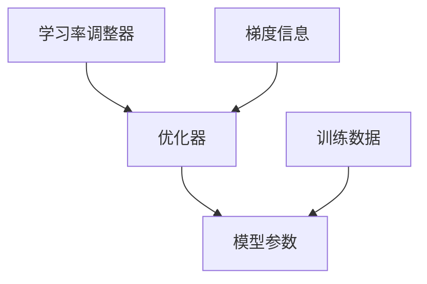
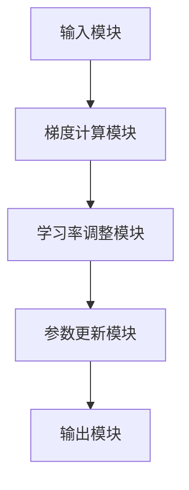
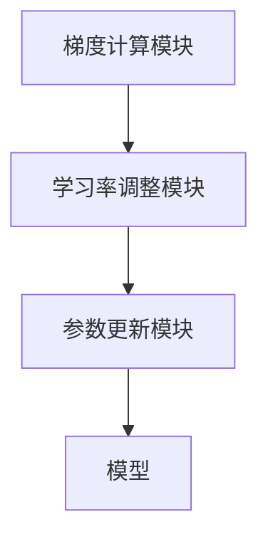

                 


# 自适应学习率：优化AI Agent的训练过程

## 关键词：自适应学习率，AI Agent，优化算法，动态调整，训练效率

## 摘要：  
自适应学习率是一种通过动态调整学习速率来优化AI Agent训练过程的方法。传统固定学习率在训练过程中可能导致训练速度慢或模型不稳定，而自适应学习率能够根据训练过程中的梯度信息自动调整学习速率，从而提高训练效率和模型性能。本文将从自适应学习率的背景、核心原理、算法实现、系统架构到实际项目应用，全面探讨如何优化AI Agent的训练过程。

---

# 第一部分：自适应学习率的背景与核心概念

## 第1章：自适应学习率的背景与问题背景

### 1.1 问题背景与问题描述  
在机器学习和深度学习中，学习率是优化算法中的关键超参数。传统训练过程中，学习率通常是固定的，这可能导致以下问题：  
1. **训练速度慢**：在复杂优化问题中，固定学习率可能导致优化过程在平坦区域移动缓慢。  
2. **模型不稳定**：在目标函数的梯度变化较大时，固定学习率可能导致优化过程发散或收敛到错误的极值点。  
3. **手动调参困难**：固定学习率需要手动调整，而不同数据集和模型的最优学习率差异很大，增加了调试的复杂性。  

### 1.2 自适应学习率的解决方案  
自适应学习率通过动态调整学习速率，根据当前梯度信息自动选择合适的学习步长，从而解决上述问题。其核心思想是：  
1. 根据梯度的统计信息（如均值、方差等）动态调整学习率。  
2. 自动适应训练过程中的优化需求，减少手动调参的复杂性。  

### 1.3 自适应学习率的边界与外延  
- **适用场景**：适合复杂的优化问题，尤其是目标函数梯度变化较大或数据分布不均衡的场景。  
- **限制与挑战**：自适应学习率可能在某些情况下收敛较慢，或者在特定数据分布下表现不稳定。  
- **与其他优化方法的结合**：可以与其他优化技术（如正则化、动量优化等）结合，进一步提升性能。  

### 1.4 自适应学习率的核心要素与概念结构  
- **学习率调整器**：负责根据梯度信息动态调整学习率。  
- **优化器**：负责更新模型参数，使用调整后的学习率进行梯度下降。  
- **模型参数**：需要优化的目标参数。  
- **梯度信息**：当前参数点处的梯度，用于指导优化方向。  

---

# 第二部分：自适应学习率的核心概念与联系

## 第2章：自适应学习率的核心原理

### 2.1 自适应学习率的原理与机制  
自适应学习率的核心机制是根据梯度信息动态调整学习率，具体包括以下步骤：  
1. **计算梯度**：获取当前参数点处的梯度。  
2. **统计梯度信息**：计算梯度的均值、方差等统计量。  
3. **调整学习率**：根据统计量动态调整学习率。  
4. **更新参数**：使用调整后的学习率更新模型参数。  

### 2.2 自适应学习率的核心概念对比  
下表对比了固定学习率和自适应学习率的核心特征：  

| 特性                | 固定学习率           | 自适应学习率          |  
|---------------------|--------------------|----------------------|  
| 学习率调整           | 固定                | 动态调整              |  
| 收敛速度             | 可能较慢            | 更快                  |  
| 调参复杂度           | 高                 | 低                   |  
| 适应性               | 低                 | 高                   |  

### 2.3 自适应学习率的ER实体关系图  


---

# 第三部分：自适应学习率的算法原理与实现

## 第3章：自适应学习率的算法原理

### 3.1 常见自适应学习率算法概述  
目前常用的自适应学习率算法包括：  
1. **Adam优化算法**：结合动量和自适应学习率，适用于大多数问题。  
2. **AdaGrad优化算法**：基于梯度的累积平方和调整学习率，适合稀疏数据。  
3. **RMSProp优化算法**：基于梯度平方的滑动平均调整学习率，适合RNN训练。  

### 3.2 自适应学习率算法的数学模型  
#### Adam算法的数学公式  
- **动量部分**：  
  $$ v_t = \beta_1 v_{t-1} + (1-\beta_1) g_t $$
- **自适应学习率部分**：  
  $$ s_t = \beta_2 s_{t-1} + (1-\beta_2) g_t^2 $$
- **更新参数**：  
  $$ \theta_{t+1} = \theta_t - \frac{\eta}{\sqrt{s_t + \epsilon}} v_t $$

---

## 第4章：自适应学习率算法的系统架构设计

### 4.1 系统功能设计  
- **输入模块**：接收训练数据和初始模型参数。  
- **梯度计算模块**：计算模型参数的梯度。  
- **学习率调整模块**：根据梯度信息动态调整学习率。  
- **参数更新模块**：使用调整后的学习率更新模型参数。  
- **输出模块**：输出优化后的模型参数或训练结果。  

### 4.2 系统架构图  


---

## 第5章：自适应学习率算法的项目实战

### 5.1 项目背景与目标  
本项目旨在通过实现自适应学习率算法，优化一个简单的AI Agent的训练过程。  

### 5.2 环境安装与配置  
1. Python 3.8+  
2. TensorFlow或PyTorch框架  
3. 基本的深度学习库和依赖项  

### 5.3 核心代码实现  
```python
import numpy as np

def adaptive_learning_rate_optimizer(initial_learning_rate, beta1, beta2, epsilon=1e-8):
    def optimize(theta, gradient):
        # 动量项
        v = beta1 * gradient + (1 - beta1) * gradient
        # 自适应学习率项
        s = beta2 * gradient**2 + (1 - beta2) * gradient**2
        # 调整学习率
        lr = initial_learning_rate / (np.sqrt(s) + epsilon)
        # 更新参数
        theta_new = theta - lr * v
        return theta_new
    return optimize

# 示例使用
initial_learning_rate = 0.001
beta1 = 0.9
beta2 = 0.999
optimizer = adaptive_learning_rate_optimizer(initial_learning_rate, beta1, beta2)
theta = np.array([1.0, 2.0])
gradient = np.array([0.1, -0.2])
theta_new = optimizer(theta, gradient)
print(theta_new)
```

### 5.4 实际案例分析与结果解读  
通过上述代码实现，可以看到自适应学习率算法如何动态调整学习速率，从而更快地收敛到最优解。  

---

# 第四部分：自适应学习率的系统分析与架构设计

## 第6章：自适应学习率算法的系统分析

### 6.1 问题场景介绍  
在AI Agent的训练过程中，优化目标函数时通常需要动态调整学习率。  

### 6.2 系统功能设计  
- **梯度计算**：获取当前模型参数的梯度。  
- **学习率调整**：根据梯度信息动态调整学习率。  
- **参数更新**：使用调整后的学习率更新模型参数。  

### 6.3 系统架构图  


---

# 第五部分：自适应学习率算法的最佳实践与注意事项

## 第7章：自适应学习率的最佳实践

### 7.1 实践建议  
1. 选择合适的自适应学习率算法，根据具体问题选择Adam、AdaGrad或RMSProp。  
2. 合理设置初始学习率和参数（如β1、β2、ε等）。  
3. 在训练过程中监控模型的收敛情况，必要时调整参数。  

### 7.2 小结  
自适应学习率通过动态调整学习速率，显著提高了AI Agent的训练效率和模型性能。  

### 7.3 注意事项  
1. 自适应学习率并非万能药，需根据具体问题选择合适的方法。  
2. 在某些情况下，自适应学习率可能收敛较慢，需结合其他优化技术。  

### 7.4 拓展阅读  
1. 《Deep Learning》——Ian Goodfellow  
2. Adam: A Method for Stochastic Optimization——Diederik P. Kingma等  

---

# 作者：AI天才研究院  
# 禅与计算机程序设计艺术

