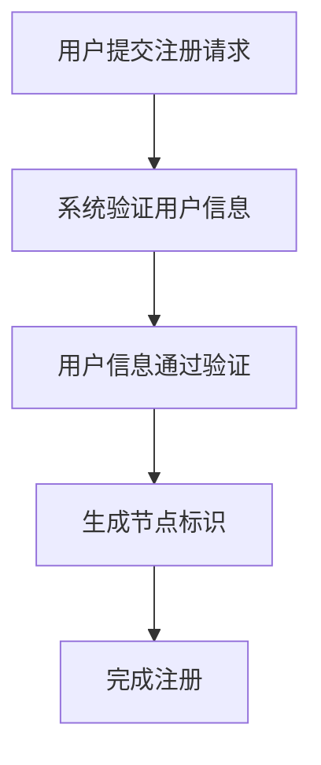
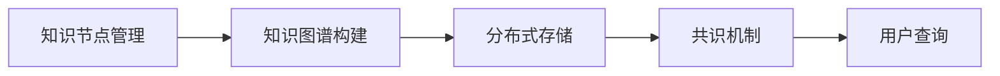
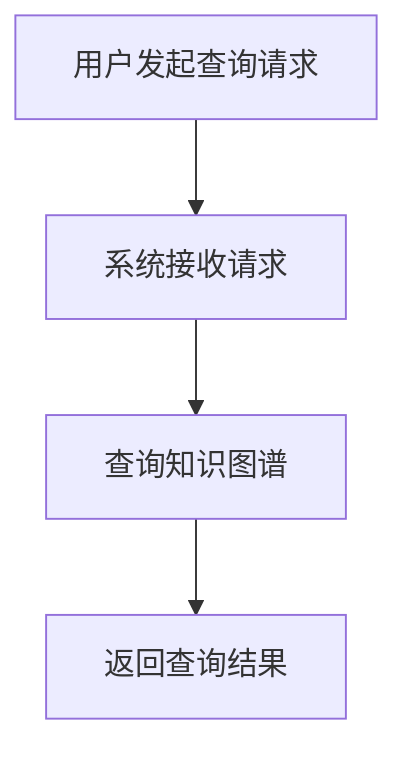

                 


# 芒格的"智者圈"理论在去中心化知识网络中的新解读

关键词：芒格，智者圈，去中心化知识网络，分布式系统，多元思维模型，知识图谱，共识机制

摘要：本文将芒格的“智者圈”理论与现代去中心化知识网络相结合，探讨如何通过分布式技术实现知识的高效组织与传播。文章从理论基础、算法实现、系统架构等多个维度展开，详细解析了芒格思想在网络中的具体应用，并通过案例分析展示了其在实际场景中的潜力。

---

## 第一部分：芒格的“智者圈”理论与去中心化知识网络概述

### 第1章：芒格的“智者圈”理论基础

#### 1.1 多元思维模型的定义
芒格的“智者圈”理论强调通过构建多元思维模型来提升认知能力。每个思维模型都是一个“圈”，将不同领域的知识节点连接起来，形成一个完整的知识网络。例如，经济学中的供需模型、物理学中的能量守恒定律等，都是构成“智者圈”的关键节点。

#### 1.2 “智者圈”理论的核心要素
- **知识节点**：代表具体的思维模型或知识点。
- **节点之间的关系**：表示不同知识之间的联系，例如因果关系、并列关系等。
- **网络结构**：通过图论的方式，将知识节点连接成一个有机的整体。

#### 1.3 芒格思想对现代知识管理的启示
在信息爆炸的时代，芒格的理论为我们提供了一种高效的知识组织方式。通过构建多元化的知识网络，个体可以更快速地理解复杂问题，并做出更明智的决策。

---

### 第2章：去中心化知识网络的概念与特点

#### 2.1 去中心化知识网络的定义
去中心化知识网络是一种基于分布式技术的知识存储和传播方式。与传统的中心化知识管理系统不同，它没有单一的控制中心，而是通过节点之间的协作完成知识的存储和传播。

#### 2.2 网络结构的去中心化特征
- **分布式存储**：知识节点分布在多个独立的服务器或设备上，避免单点故障。
- **去中心化管理**：通过共识机制确保网络中每个节点的权威性，无需依赖中心机构。
- **可扩展性**：通过增加节点数量，网络可以轻松扩展存储容量和处理能力。

#### 2.3 知识网络的基本组成单元
- **节点**：代表知识的最小单位，例如一篇文章、一段视频或一个数据集。
- **边**：表示节点之间的关系，例如“支持”、“反驳”等。

---

### 第3章：芒格“智者圈”理论与去中心化知识网络的结合

#### 3.1 理论与网络的契合点
- **知识节点的关联性**：芒格的“智者圈”理论强调知识之间的关联性，而分布式知识网络天然适合存储和表达这种关联性。
- **去中心化的知识传播**：通过分布式网络，知识可以更自由地传播，避免被单一机构控制。

#### 3.2 去中心化网络如何实现“智者圈”理论
- **知识节点的分布式存储**：每个节点都可以存储多个知识模型，并通过网络与其他节点建立联系。
- **网络中的知识传播机制**：通过分布式算法，确保知识在网络中的高效传播和更新。

#### 3.3 理论在网络中的具体实现案例
假设我们有一个基于区块链的知识网络，每个节点代表一个知识模型（例如物理学中的牛顿定律）。节点之间通过智能合约建立关系，例如“牛顿定律支持万有引力理论”。当一个新的知识节点加入网络时，通过共识机制验证其与现有节点的关系，并将其纳入整个网络中。

---

## 第二部分：去中心化知识网络的算法与数学模型

### 第4章：知识图谱构建算法

#### 4.1 知识图谱的构建流程
- **数据采集**：从多种来源收集知识数据，例如书籍、论文、视频等。
- **数据预处理**：清洗数据，提取关键词和实体。
- **实体识别与关系抽取**：通过自然语言处理技术，识别出数据中的实体及其关系。
- **知识图谱的存储与管理**：将提取的知识存储到图数据库中。

#### 4.2 基于图的算法实现
- **图的遍历算法**：用于探索知识图谱中的关系路径，例如广度优先搜索（BFS）和深度优先搜索（DFS）。
- **最短路径算法**：用于找到两个节点之间的最短路径，例如Dijkstra算法。
- **社会网络分析算法**：用于分析网络中的社区结构，例如社区检测算法。

#### 4.3 算法实现的代码示例
以下是一个简单的知识图谱构建算法的Python代码示例：

```python
import networkx as nx

# 创建一个图
G = nx.Graph()

# 添加节点
G.add_nodes_from(['牛顿', '万有引力', '物理学'])

# 添加边
G.add_edges_from([('牛顿', '万有引力'), ('万有引力', '物理学')])

# 可视化
nx.draw(G, node_color='red', edge_color='blue')
plt.show()
```

---

### 第5章：分布式存储与共识机制

#### 5.1 分布式存储的基本原理
分布式存储通过将数据分散存储在多个节点上，确保数据的安全性和可用性。常见的分布式存储系统包括分布式文件系统（如Hadoop HDFS）和分布式数据库（如MongoDB）。

#### 5.2 共识机制的核心算法
- **拜占庭容错共识**：确保在存在故障节点的情况下，系统仍然能够达成共识。
- **工作量证明机制**：通过计算资源消耗来证明节点的贡献，例如比特币中的挖矿机制。
- **权益证明机制**：通过节点持有的权益来决定其在共识中的权重。

#### 5.3 共识算法的数学模型
以下是一个简单的拜占庭容错共识算法的数学模型：

$$
\text{共识达成条件} = \left\lfloor \frac{n}{2} \right\rfloor + 1
$$

其中，\( n \) 是网络中的节点总数。

---

### 第6章：数学模型与公式解析

#### 6.1 知识网络的数学表示
- **图论基础**：知识网络可以用图 \( G = (V, E) \) 表示，其中 \( V \) 是节点集合，\( E \) 是边集合。
- **矩阵表示法**：通过邻接矩阵表示节点之间的关系，例如 \( A_{i,j} = 1 \) 表示节点 \( i \) 和节点 \( j \) 之间存在关系。

#### 6.2 分布式系统中的数学模型
- **一致性问题**：分布式系统中，节点需要通过某种机制保证数据的一致性。
- **概率模型**：用于分析分布式系统中节点的行为概率，例如节点故障的概率。

---

## 第三部分：系统架构与设计

### 第7章：系统功能设计

#### 7.1 系统功能模块划分
- **知识节点管理模块**：负责节点的注册、认证和管理。
- **知识图谱构建模块**：负责知识图谱的构建、更新和维护。
- **分布式存储模块**：负责数据的分布式存储和检索。

#### 7.2 系统功能流程图
以下是知识节点注册的流程图：



---

### 第8章：系统架构设计

#### 8.1 系统架构的分层设计
- **表现层**：负责用户交互，例如Web界面。
- **业务逻辑层**：负责处理用户的请求，例如知识查询。
- **数据访问层**：负责与分布式存储系统交互，例如读取和写入数据。

#### 8.2 系统架构的组件化设计
以下是系统架构的组件化设计图：



---

### 第9章：系统接口设计与交互流程

#### 9.1 系统接口设计
- **API接口**：提供RESTful API，供其他系统调用。
- **数据格式**：采用JSON格式，确保数据的可读性和可扩展性。

#### 9.2 系统交互流程图
以下是用户查询知识的交互流程图：



---

## 第四部分：项目实战

### 第10章：环境安装与核心代码实现

#### 10.1 环境安装
- **安装Python**：确保系统上安装了Python 3.x。
- **安装依赖库**：安装必要的库，例如networkx、numpy、pandas等。

#### 10.2 核心代码实现
以下是一个简单的知识图谱构建代码：

```python
import networkx as nx

# 创建图
G = nx.DiGraph()

# 添加节点
G.add_nodes_from(['A', 'B', 'C'])

# 添加边
G.add_edges_from([('A', 'B'), ('B', 'C'), ('A', 'C')])

# 可视化
nx.draw(G, node_color='red', edge_color='blue')
plt.show()
```

---

### 第11章：案例分析与项目总结

#### 11.1 案例分析
假设我们构建了一个基于区块链的知识网络，用于存储和传播物理学知识。通过芒格的“智者圈”理论，我们将物理学中的各个知识点连接起来，形成一个完整的知识网络。

#### 11.2 项目总结
通过本项目，我们成功将芒格的“智者圈”理论与去中心化知识网络相结合，实现了知识的高效组织与传播。未来，我们可以通过进一步优化算法和扩展网络规模，提升系统的性能和用户体验。

---

## 第五部分：最佳实践与扩展阅读

### 第12章：最佳实践 tips

#### 12.1 系统设计中的注意事项
- **安全性**：确保系统的数据安全，防止被攻击。
- **可扩展性**：设计时考虑未来的扩展需求。
- **易用性**：确保用户能够轻松使用系统。

#### 12.2 小结
芒格的“智者圈”理论为我们提供了一种高效的知识管理方式，而分布式技术则为其实现提供了技术支持。通过结合两者的优点，我们可以构建一个更加智能和高效的知识网络。

#### 12.3 注意事项
- 在设计系统时，需要充分考虑网络的去中心化特性。
- 确保系统的可扩展性和安全性。

#### 12.4 拓展阅读
- 《芒格的多元思维模型》
- 《分布式系统设计与实现》
- 《知识图谱与语义网络》

---

## 作者

作者：AI天才研究院/AI Genius Institute & 禅与计算机程序设计艺术 /Zen And The Art of Computer Programming

---

以上就是《芒格的"智者圈"理论在去中心化知识网络中的新解读》的完整目录大纲和文章内容。

