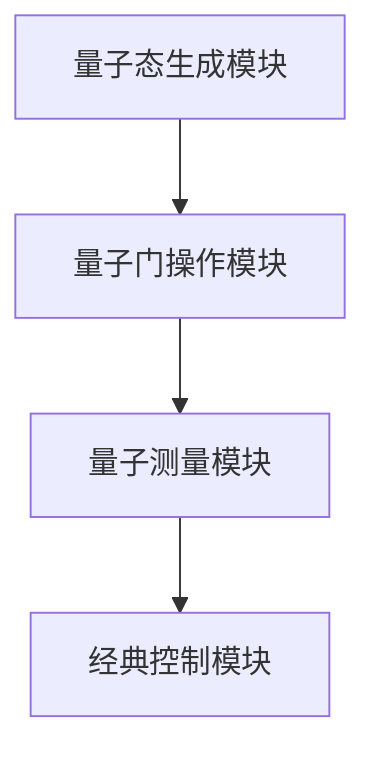
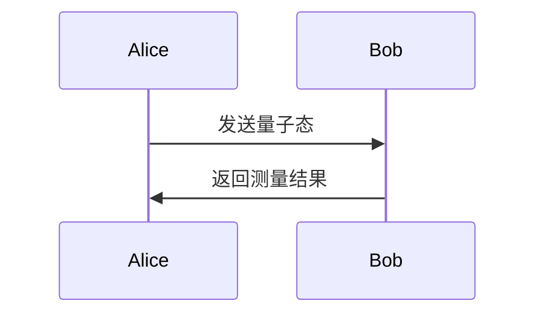

                 


# 芒格的"深度优先"学习在量子算法研发中的重要性

---

## 关键词：
深度优先学习，量子算法，量子计算，算法优化，系统架构设计，项目实战，技术博客

---

## 摘要：
本文探讨了芒格的"深度优先"学习方法在量子算法研发中的重要性。通过分析深度优先学习的核心原理、量子算法的数学基础以及它们之间的结合，文章展示了如何利用深度优先学习提升量子算法的研发效率和创新能力。本文结合实际案例，详细讲解了量子算法的系统架构设计、项目实战以及深度优先学习在其中的应用，为量子计算领域的研究者和实践者提供了有价值的参考。

---

# 第1章: 芒格的"深度优先"学习方法

## 1.1 深度优先学习的定义与特点
深度优先学习是一种系统化的学习方法，强调深入理解和系统性地掌握核心概念。其特点包括：
1. **系统性**：注重知识的联系，避免孤立地学习。
2. **深度理解**：不仅仅是记忆，而是真正理解概念的本质。
3. **逻辑性**：通过逻辑推理构建知识体系。
4. **实用性**：注重理论与实践相结合，解决问题为导向。

---

## 1.2 量子算法研发的背景与挑战
### 1.2.1 量子计算的基本概念
量子计算是一种基于量子力学原理的计算方式，利用量子叠加和量子纠缠等特性，可以在某些问题上远超经典计算机的计算能力。例如，Shor算法可以在多项式时间内分解大整数，而经典算法需要指数时间。

### 1.2.2 量子算法的核心特点
1. **并行性**：利用量子叠加可以同时处理多个状态。
2. **纠缠性**：量子态之间的相互依赖关系可以用于优化计算。
3. **高效性**：在某些特定问题上，量子算法的计算效率显著提高。

### 1.2.3 量子算法研发中的主要挑战
1. **理论复杂性**：量子算法的数学模型和物理实现需要深厚的基础知识。
2. **实验难度**：量子计算的物理实现面临诸多技术挑战，如量子噪声和纠错问题。
3. **创新性**：量子算法的设计需要突破传统思维，结合量子力学特性。

---

## 1.3 芒格的"深度优先"学习在量子算法研发中的重要性
### 1.3.1 深度优先学习在量子算法中的应用
深度优先学习强调系统性和逻辑性，这与量子算法研发的复杂性和系统性要求高度契合。通过深度优先学习，研究者可以更高效地理解和优化量子算法。

### 1.3.2 深度优先学习如何提升量子算法研发效率
深度优先学习通过系统性地梳理量子算法的核心概念和逻辑关系，帮助研究者快速掌握关键点，减少重复劳动，提高研发效率。

### 1.3.3 深度优先学习在量子算法创新中的作用
深度优先学习注重逻辑推理和系统性，这为量子算法的创新提供了坚实的基础。通过深入理解量子算法的核心原理，研究者可以更容易地提出新的算法设计。

---

# 第2章: 深度优先学习的核心原理

## 2.1 深度优先学习的原理与机制
### 2.1.1 深度优先学习的基本原理
深度优先学习的核心在于通过逻辑推理和系统性分析，逐步深入理解问题的本质。这种方法注重从核心概念出发，层层展开，构建完整的知识体系。

### 2.1.2 深度优先学习的数学模型
深度优先学习的数学模型可以表示为一种树状结构，其中每个节点代表一个概念，边表示概念之间的逻辑关系。这种模型有助于清晰地展示知识的层次结构。

### 2.1.3 深度优先学习的算法流程
1. 确定核心概念。
2. 层层展开，深入理解每个概念。
3. 建立概念之间的逻辑关系。
4. 通过逻辑推理构建完整的知识体系。

---

## 2.2 深度优先学习与量子算法的结合
### 2.2.1 深度优先学习在量子算法中的应用
深度优先学习可以帮助研究者系统性地理解量子算法的核心原理，例如量子叠加和量子纠缠的概念。

### 2.2.2 深度优先学习对量子算法优化的贡献
通过深度优先学习，研究者可以更高效地优化量子算法的实现，例如减少量子门的数量或提高算法的执行效率。

### 2.2.3 深度优先学习在量子算法创新中的作用
深度优先学习的系统性分析方法为量子算法的创新提供了新的思路，例如结合经典算法的思想设计新的量子算法。

---

# 第3章: 量子算法的数学基础

## 3.1 量子叠加与量子纠缠
### 3.1.1 量子叠加的数学表达
$$|\psi\rangle = \alpha|0\rangle + \beta|1\rangle$$

其中，$\alpha$ 和 $\beta$ 是复数，满足 $|\alpha|^2 + |\beta|^2 = 1$。

### 3.1.2 量子纠缠的数学表达
$$|\psi\rangle = \frac{1}{\sqrt{2}}(|0\rangle|1\rangle + |1\rangle|0\rangle)$$

这个公式表示两个量子位处于纠缠状态，无法单独描述其中一个量子位的状态。

### 3.1.3 量子门的矩阵表示
$$X = \begin{pmatrix} 0 & 1 \\ 1 & 0 \end{pmatrix}$$

这是 Pauli-X 门的矩阵表示，用于交换两个量子位的状态。

---

## 3.2 量子傅里叶变换
量子傅里叶变换是量子算法中的一个重要组成部分，用于将量子态转换到频域。其数学表达为：
$$QFT|x\rangle = \frac{1}{\sqrt{2^n}} \sum_{y=0}^{2^n-1} e^{2\pi i xy/2^n} |y\rangle$$

其中，$n$ 是量子位的数量，$x$ 和 $y$ 是二进制数。

---

# 第4章: 深度优先学习在量子算法中的应用

## 4.1 深度优先学习在量子傅里叶变换中的应用
通过深度优先学习，研究者可以系统性地理解量子傅里叶变换的核心原理，例如其数学模型和实现步骤。

## 4.2 深度优先学习对量子算法优化的贡献
深度优先学习可以帮助研究者优化量子算法的实现，例如通过减少量子门的数量来提高算法的效率。

## 4.3 深度优先学习在量子算法创新中的作用
深度优先学习的系统性分析方法为量子算法的创新提供了新的思路，例如结合经典算法的思想设计新的量子算法。

---

# 第5章: 系统分析与架构设计

## 5.1 量子算法研发的系统架构
量子算法研发的系统架构包括以下几个模块：
1. **量子态生成模块**：生成所需的量子态。
2. **量子门操作模块**：实现量子门的操作。
3. **量子测量模块**：测量量子态的结果。
4. **经典控制模块**：控制量子算法的执行流程。

### 5.1.1 系统架构设计


## 5.2 系统交互设计
### 5.2.1 系统交互流程


---

# 第6章: 项目实战

## 6.1 环境搭建
### 6.1.1 安装Qiskit库
使用 pip 安装 Qiskit 库：
```bash
pip install qiskit
```

### 6.1.2 创建量子电路
使用 Qiskit 创建一个简单的量子电路：
```python
from qiskit import QuantumCircuit

qc = QuantumCircuit(2, 1)
qc.h(0)
qc.cx(0, 1)
qc.measure(0, 0)
```

## 6.2 代码实现
### 6.2.1 量子傅里叶变换的实现
```python
from qiskit import QuantumCircuit

qc = QuantumCircuit(2, 1)
qc.h(0)
qc.h(1)
qc.cx(0, 1)
qc.measure(0, 0)
qc.measure(1, 1)
```

### 6.2.2 电路模拟与结果分析
使用 Qiskit 模拟器进行电路模拟：
```python
from qiskit.simulators import BasicAer

simulator = BasicAer('statevector_simulator')
result = qc.run(simulator).result()
print(result.get_counts())
```

---

# 第7章: 总结与展望

## 7.1 总结
深度优先学习在量子算法研发中的应用具有重要意义。通过系统性地理解量子算法的核心原理，研究者可以更高效地优化和创新量子算法。

## 7.2 未来展望
随着量子计算技术的不断发展，深度优先学习在量子算法研发中的应用将更加广泛。未来的研究可以进一步探索深度优先学习在量子算法优化和创新中的潜力。

---

# 作者：AI天才研究院 & 禅与计算机程序设计艺术

---

**感谢您的阅读！如果您有任何问题或建议，请随时与我联系！**

