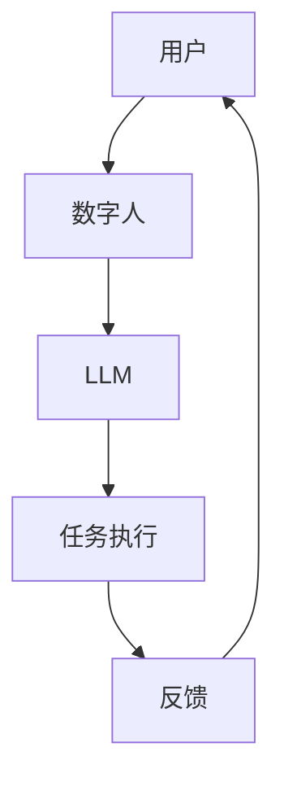
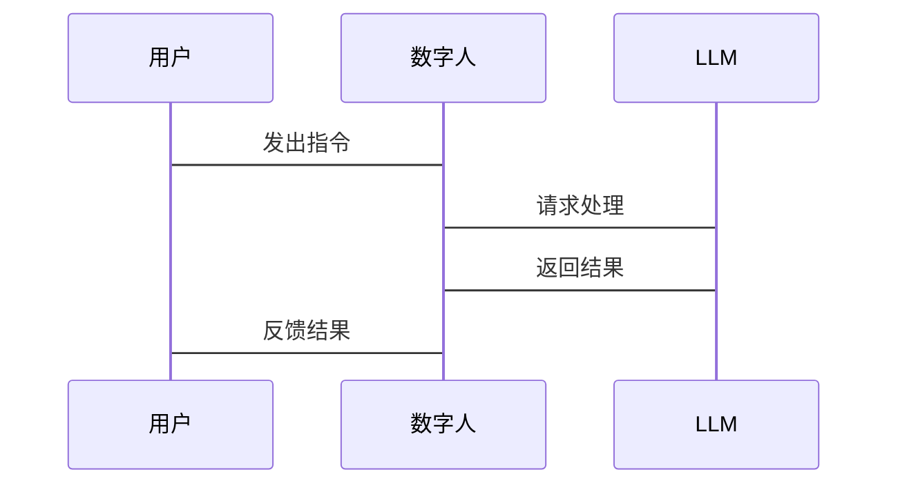

                 


# 虚拟助手 AI Agent：打造基于 LLM 的数字人

## 关键词：
虚拟助手, AI Agent, 大语言模型, 数字人, 人工智能, 自然语言处理, 人机交互

## 摘要：
本文深入探讨了如何利用大语言模型（LLM）构建虚拟助手，即数字人。文章从背景介绍、核心概念、算法原理、系统架构、项目实战到最佳实践，全面解析了基于LLM的数字人技术。通过详细的技术分析和实际案例，本文旨在为读者提供从理论到实践的全面指导，帮助他们理解并掌握这一前沿技术。

---

## 第一部分: 虚拟助手与数字人的背景介绍

### 第1章: 虚拟助手与数字人的概念

#### 1.1 虚拟助手的定义与分类

##### 1.1.1 虚拟助手的基本定义
虚拟助手（Virtual Assistant）是一种通过自然语言处理（NLP）技术实现的智能助手，能够理解用户指令并执行相关任务。常见的虚拟助手包括Siri、Alexa和Google Assistant等。

##### 1.1.2 虚拟助手的主要分类
虚拟助手可以分为以下几类：
1. **基于规则的虚拟助手**：通过预定义的规则和关键词匹配来执行任务。
2. **基于机器学习的虚拟助手**：利用机器学习模型（如深度学习）来理解和执行任务。
3. **混合型虚拟助手**：结合规则和机器学习的方法，提供更灵活的服务。

##### 1.1.3 虚拟助手的应用场景
虚拟助手广泛应用于以下几个领域：
- **智能家居控制**：通过语音指令控制家电。
- **信息查询**：帮助用户搜索信息、天气预报等。
- **日程管理**：协助用户安排和管理日程。
- **客服支持**：提供客户支持和问题解答。

#### 1.2 数字人的定义与特点

##### 1.2.1 数字人的概念
数字人（Digital Human）是一种高度智能化的虚拟实体，能够通过多模态交互（如语音、视觉）与人类进行自然对话和协作。数字人结合了人工智能、自然语言处理和计算机视觉等技术。

##### 1.2.2 数字人的核心特点
1. **多模态交互**：支持语音、视觉等多种交互方式。
2. **智能化**：能够理解上下文，进行推理和决策。
3. **个性化**：根据用户需求提供定制化服务。

#### 1.3 LLM与虚拟助手的结合

##### 1.3.1 虚拟助手的核心功能
1. **自然语言处理**：理解用户的指令。
2. **任务执行**：根据指令执行任务。
3. **内容生成**：生成文本、图像等内容。

##### 1.3.2 数字人的核心功能
1. **多模态交互**：支持多种输入方式。
2. **智能决策**：基于上下文进行决策。

---

## 第2章: 大语言模型（LLM）的背景与现状

### 2.1 大语言模型的定义与特点

#### 2.1.1 大语言模型的基本概念
大语言模型（Large Language Model，LLM）是一种基于深度学习的自然语言处理模型，通常使用大量的训练数据来优化模型参数，以生成高质量的自然语言文本。

#### 2.1.2 大语言模型的核心特点
1. **大规模训练数据**：利用海量数据进行训练。
2. **深度神经网络**：使用多层神经网络结构。
3. **上下文理解**：能够理解文本的上下文关系。

### 2.2 大语言模型的发展历程

#### 2.2.1 NLP技术的发展史
- **传统NLP**：基于规则和统计的方法。
- **深度学习NLP**：基于深度学习的模型，如RNN、LSTM。
- **大语言模型**：如GPT系列、BERT系列。

#### 2.2.2 大语言模型的崛起
大语言模型的崛起得益于计算能力的提升和数据的爆炸式增长。

#### 2.2.3 当前主流的大语言模型
- **GPT系列**：OpenAI的GPT-3、GPT-4。
- **BERT系列**：Google的BERT。
- **其他模型**：如Facebook的OPT。

### 2.3 大语言模型在虚拟助手中的应用

#### 2.3.1 大语言模型在对话系统中的应用
- **自然语言理解**：理解用户的问题。
- **对话生成**：生成自然的回复。

#### 2.3.2 大语言模型在任务处理中的应用
- **任务分解**：将复杂任务分解为简单任务。
- **任务执行**：执行具体任务，如搜索信息。

#### 2.3.3 大语言模型在内容生成中的应用
- **文本生成**：生成新闻、文章等。
- **代码生成**：生成代码片段。

---

## 第3章: 虚拟助手与数字人的结合

### 3.1 虚拟助手的核心功能

#### 3.1.1 自然语言处理
- **理解用户指令**：通过NLP技术理解用户的需求。
- **生成回复**：基于LLM生成自然的回复。

### 3.2 数字人的核心功能

#### 3.2.1 多模态交互
- **语音识别**：通过语音识别技术理解用户的指令。
- **视觉交互**：通过视觉识别技术处理图像信息。

#### 3.2.2 智能决策
- **上下文理解**：理解对话的上下文。
- **推理与决策**：基于上下文进行推理和决策。

---

## 第4章: 基于LLM的数字人实现

### 4.1 系统架构设计

#### 4.1.1 系统架构图


#### 4.1.2 系统功能模块
- **用户输入模块**：接收用户的输入。
- **LLM处理模块**：处理用户的输入，生成回复。
- **任务执行模块**：执行具体的任务。
- **反馈模块**：将结果反馈给用户。

### 4.2 接口设计

#### 4.2.1 系统接口设计


---

## 第5章: 项目实战

### 5.1 环境安装

#### 5.1.1 安装Python
```bash
python --version
pip install --upgrade pip
```

#### 5.1.2 安装LLM框架
```bash
pip install transformers
pip install torch
```

### 5.2 核心实现

#### 5.2.1 加载模型
```python
from transformers import AutoTokenizer, AutoModelForCausalLM
model_name = "gpt2"
tokenizer = AutoTokenizer.from_pretrained(model_name)
model = AutoModelForCausalLM.from_pretrained(model_name)
```

#### 5.2.2 接收用户输入
```python
user_input = input("请输入您的指令：")
```

#### 5.2.3 生成回复
```python
inputs = tokenizer(user_input, return_tensors="np")
outputs = model.generate(
    inputs.input_ids,
    max_length=50,
    num_beams=5,
    temperature=0.7,
)
response = tokenizer.decode(outputs[0], skip_special_tokens=True)
print(response)
```

### 5.3 实际案例分析

#### 5.3.1 案例分析
用户输入：设置 reminders for tomorrow at 9 AM。
系统执行：添加提醒事项。

#### 5.3.2 案例分析
用户输入：搜索附近的咖啡店。
系统执行：调用地图API搜索并返回结果。

### 5.4 项目小结
通过以上步骤，我们可以看到基于LLM的数字人实现的基本流程，包括环境安装、模型加载、用户输入处理和任务执行。

---

## 第6章: 最佳实践与注意事项

### 6.1 最佳实践

#### 6.1.1 模型选择
选择合适的模型，根据具体任务选择不同的LLM。

#### 6.1.2 数据隐私
确保用户数据的安全和隐私。

### 6.2 小结
本文从背景介绍到项目实战，全面解析了基于LLM的数字人技术，为读者提供了从理论到实践的指导。

### 6.3 注意事项

#### 6.3.1 模型训练
确保训练数据的质量，避免偏见。

#### 6.3.2 系统优化
优化系统性能，提高响应速度。

### 6.4 拓展阅读

#### 6.4.1 推荐书籍
- 《深度学习》—— Ian Goodfellow
- 《Python机器学习》—— Aurélien Géron

#### 6.4.2 推荐博客
- [Towards Data Science](https://towardsdatascience.com/)
- [Medium: AI & Data Science](https://medium.com/ai-and-data-science)

---

## 作者：AI天才研究院/AI Genius Institute & 禅与计算机程序设计艺术 /Zen And The Art of Computer Programming

---

通过以上结构和内容，我们可以看到基于LLM的数字人技术的实现过程，从理论到实践，帮助读者更好地理解和掌握这一技术。

